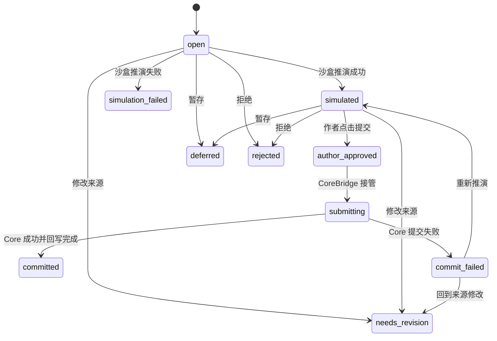
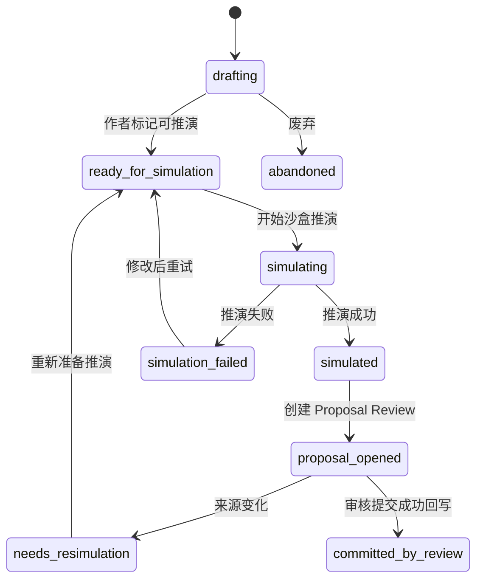
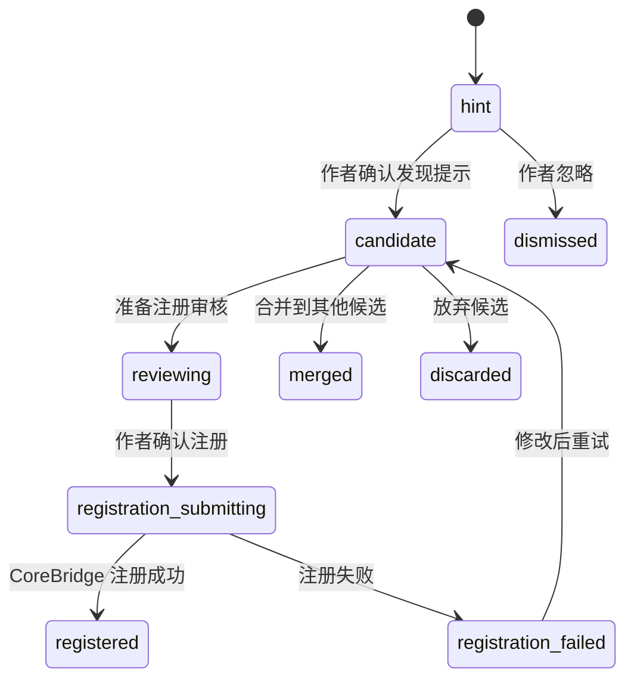
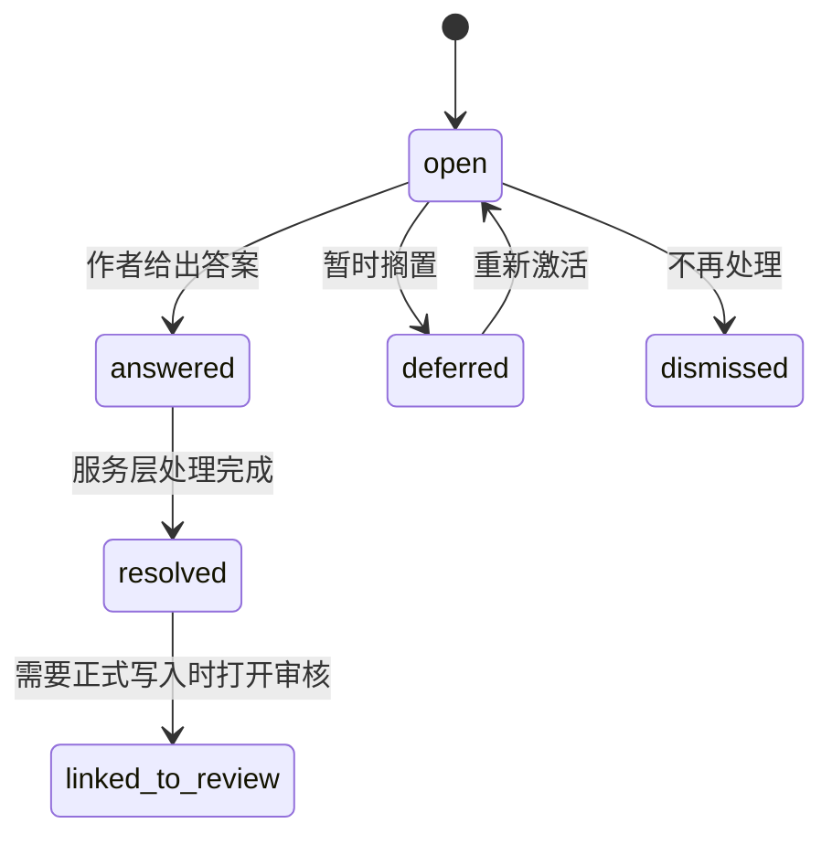

# Writing Layer 功能细化规格

**项目代号**：Narrative-OS Writing Layer  
**最后更新**：2026-06-13  
**状态**：完整功能设计草案，供后续开发计划拆解使用  

---

## 1. 文档目标

`Writing-Layer-Roadmap.md` 负责定义写作层总体蓝图；本文档负责把蓝图中的模块拆成可实现、可测试、可展示的功能单元。

每个功能单元至少说明：

- 作者要完成什么
- 系统如何协助
- 需要保存哪些写作层状态
- 何时允许进入 Core
- 前端需要展示什么
- 最小验收标准是什么

---

## 2. 功能细化格式

后续所有功能按统一格式描述：

```text
功能名
定位：
用户动作：
系统行为：
写作层状态：
Core 交互：
前端展示：
验收标准：
后续扩展：
```

这个格式用于避免只写功能名词。

---

## 3. 作品项目

作品项目是写作层的根容器，负责承载作者目标、项目阶段、当前工作位置、默认视图、导入导出记录和写作层对象。作品项目不是 Core 世界状态；它可以引用 Core 状态，但不能替代 Core 的正式提交流程。

核心边界：

```text
WritingProject 不写 Core。
作品名、题材、目标、偏好不是 Fact。
项目阶段不是世界时间线。
项目设置不能修改 Core World Package。
删除或归档项目不能绕过 Retcon 修改已提交世界状态。
```

### 3.1 创建作品

定位：

创建一个作者可持续写作的项目容器。项目不是 Core 世界状态，而是所有写作层产物的归属。创建作品必须尽量轻，不要求作者先填写复杂模板。

用户动作：

- 输入作品名。
- 输入一句或多句作品想法。
- 可选输入题材倾向、参考作品、想避免的方向。
- 选择从空白开始、从一句话开始、从已有正文导入、从设定片段开始。
- 跳过所有可选项直接进入写作。
- 稍后再补作品目标或项目蓝图。

系统行为：

- 创建 `WritingProject`。
- 创建初始 `ProjectBlueprint`，状态为 `implicit`。
- 创建第一条 `IdeaCard`，保存原始创意。
- 创建默认工作台布局。
- 创建项目级作者偏好容器。
- 如果用户选择导入，创建导入批次，但不分析、不写 Core。
- 不注册任何 Core Entity。
- 不写入任何 Core Fact。

写作层状态：

```ts
interface WritingProject {
  id: string;
  title: string;
  status: 'planning' | 'drafting' | 'reviewing' | 'paused' | 'archived';
  premise?: string;
  authorGoalIds: string[];
  activeBlueprintId?: string;
  currentWorkspaceMode: 'planning' | 'writing' | 'reviewing' | 'analysis' | 'importing';
  createdAt: string;
  updatedAt: string;
}
```

- `WritingProject.status = planning`
- `ProjectBlueprint.maturity = implicit`
- `IdeaCard.kind = premise`
- `IdeaCard.maturity = raw`
- `WorkspaceLayout`
- `ProjectPreferenceProfile`

Core 交互：

- 无。

前端展示：

- 项目标题。
- 原始想法。
- 当前阶段：构思中。
- 提醒：尚未写入世界状态。
- 下一步入口：继续描述、整理蓝图、创建草案、导入正文。
- 可跳过设置的轻量入口。

验收标准：

- 创建作品后 Core 中 Fact 数量不变。
- 用户原始输入可完整查看。
- 项目可恢复。
- 创建作品不要求选择技术模板。
- 从导入开始也不能自动分析或提交 Core。

后续扩展：

- 多作品管理。
- 项目模板推荐。
- 导入已有设定集。
- 项目封面和展示信息。

### 3.2 编辑作品目标

定位：

保存作者对作品方向的高层要求，例如“不要太套路”“氛围阴冷”“兄妹关系是核心”。作品目标用于辅助 Agent、风格系统、章节规划和反馈降噪，但不构成世界事实。

用户动作：

- 添加目标。
- 修改目标。
- 标记某个方向为禁用。
- 要求系统记住某种审美偏好。
- 设置目标优先级。
- 标记目标适用范围：全书、某卷、某角色、某条线。
- 将某次对话中的偏好保存为目标。
- 暂停或归档某个目标。

系统行为：

- 将目标保存为项目级写作约束。
- 区分正向目标和禁止方向。
- 在后续草案生成时注入给 NarrativeAgent。
- 检测目标之间的明显冲突。
- 在智能体反馈和改写时引用相关目标。
- 在章节完成或巡检时检查目标是否被长期忽略。
- 不把目标变成 Core Fact、规则或 World Package 扩展。

写作层状态：

```ts
interface AuthorGoal {
  id: string;
  projectId: string;
  text: string;
  kind: 'positive' | 'avoid' | 'style' | 'theme' | 'workflow' | 'reader_experience';
  priority: 'low' | 'normal' | 'high';
  scope: 'project' | 'volume' | 'chapter' | 'character' | 'thread';
  status: 'active' | 'paused' | 'archived';
  sourceRef?: string;
}
```

- `AuthorGoal`
- `AvoidDirection`
- `StyleIntent`
- `GoalConflictHint`
- `GoalUsageTrace`

Core 交互：

- 无。

前端展示：

- 作品目标列表。
- 禁用方向列表。
- 每条目标的来源对话。
- 优先级和适用范围。
- 目标冲突提示。
- “本章相关目标”。

验收标准：

- 作品目标不会变成 Core Fact。
- 后续草案可引用这些目标。
- 目标可暂停、归档、恢复。
- 目标冲突只是提示，不阻止写作。
- 作者能看到某条目标影响了哪些建议。

后续扩展：

- 目标冲突检测。
- 目标优先级。
- 目标达成度报告。

### 3.3 项目首页与当前工作状态

定位：

项目首页不是营销页，而是作者回到作品时的工作入口。它应该回答“我现在写到哪了、有什么待处理、下一步可以做什么”。

用户动作：

- 打开项目。
- 查看当前章节、场景和草案。
- 查看待审核提案、待处理候选、未回收伏笔和修订任务。
- 继续上次写作。
- 切换到规划、写作、审核、分析或导入模式。

系统行为：

- 汇总项目状态。
- 生成 `ProjectDashboardSnapshot`。
- 展示最近编辑位置和待处理队列。
- 区分正式世界状态、写作层草案和系统建议。
- 根据当前项目阶段给出下一步动作，但不强迫用户遵循。

写作层状态：

- `ProjectDashboardSnapshot`
- `RecentWorkPosition`
- `ProjectTodoSummary`
- `WorkspaceMode`

Core 交互：

- 只读查询已提交状态摘要。
- 不写 Core。

前端展示：

- 继续写作入口。
- 当前章节/场景。
- 待审核提案。
- 待处理候选。
- 未回收伏笔和修订任务摘要。
- 最近打开内容。

验收标准：

- 首页不展示技术字段。
- 点击待处理项能跳到来源。
- 首页刷新不改变项目状态。
- Core 读取失败时仍能展示写作层本地状态，并标记正式状态摘要不可用。

后续扩展：

- 个性化首页。
- 写作进度统计。

### 3.4 项目阶段与工作模式

定位：

项目阶段描述作者创作流程的位置，例如构思、写作、修订、暂停。工作模式描述当前界面重点，例如写作、规划、审核、分析、导入。二者都不是世界内时间或事件。

用户动作：

- 将项目标记为正在写作、修订或暂停。
- 临时切换到审核模式。
- 从导入模式回到写作模式。
- 查看不同模式下的待处理内容。

系统行为：

- 更新 `WritingProject.status` 或 `WorkspaceMode`。
- 根据模式调整默认面板和提醒策略。
- 在审核模式突出 Proposal Review。
- 在写作模式降低结构提示打扰。
- 不把项目阶段写入 Core。

写作层状态：

- `WritingProject.status`
- `WorkspaceMode`
- `ModeTransitionRecord`
- `ModeReminderPolicy`

Core 交互：

- 无写入。

前端展示：

- 当前项目阶段。
- 当前工作模式。
- 模式切换入口。
- 与当前模式相关的主要任务。

验收标准：

- 项目阶段变化不产生 Core Event。
- 工作模式变化不改变草案或正文。
- 模式切换不丢失编辑状态。
- 移动端也能切换核心模式。

后续扩展：

- 自动识别工作模式。
- 按模式保存布局。

### 3.5 项目设置、归档与删除

定位：

管理作品标题、描述、默认语言、默认视图、提醒强度、归档状态和删除流程。项目设置影响写作体验，不影响已提交世界状态。

用户动作：

- 修改作品标题。
- 修改项目简介。
- 设置默认提醒强度。
- 归档项目。
- 删除项目或创建删除预览。
- 恢复归档项目。

系统行为：

- 保存项目设置。
- 归档后默认停止主动分析和提醒。
- 删除前生成影响说明。
- 区分删除写作层项目和处理已提交 Core 状态。
- 不通过项目删除回滚 Core。

写作层状态：

- `ProjectSettings`
- `ProjectArchiveState`
- `ProjectDeletionPreview`
- `ProjectRestoreRecord`

Core 交互：

- 项目设置不写 Core。
- 如需处理已提交 Core 状态，必须走 Retcon 或专门迁移流程。

前端展示：

- 项目设置页。
- 归档提示。
- 删除影响说明。
- 恢复入口。

验收标准：

- 修改标题不改变 Core Entity 名称，除非走正式提案或 Retcon。
- 归档不删除数据。
- 删除预览必须说明是否存在已提交 Core 状态。
- 删除操作不能绕过 Retcon。

后续扩展：

- 项目复制。
- 项目模板化。

---

## 4. ProjectBlueprint

ProjectBlueprint 是写作层理解当前作品的柔性创作蓝图。它不是 Core World Package，也不是用户要填写的技术 schema。

它的职责是把作者不断出现的创作表达，整理成“这个作品当前有哪些重要对象、关系、空间、视图和工作流”的项目级结构。它服务写作层、前端和 Agent，而不是直接裁决世界状态。

核心判断：

```text
ProjectBlueprint 是会生长的创作蓝图。
Core World Package 是经确认后固化的规则包。
ProjectBlueprint 可以快，可以错，可以改。
Core World Package 必须慢、稳、可解释、可验证。
```

### 4.1 蓝图边界

定位：

定义 ProjectBlueprint 与 Core、NarrativeAgent、前端之间的边界，避免把技术配置暴露给作者，也避免把临时理解误写成正式规则。

用户动作：

- 用自然语言描述作品。
- 接受或修改系统整理出的“作品结构理解”。
- 用人话纠正系统理解，例如“灰域不是地点，它更像一种侵蚀层”。
- 在提案审核时确认系统对项目语言的理解是否正确。

系统行为：

- 记录当前作品的项目级类型、关系、空间、视图偏好和工作流偏好。
- 将作者语言转为可供写作层使用的内部结构。
- 只在人话层面向作者展示，不展示技术字段。
- 在进入 Core 前，把项目类型映射为 Core 可接受的 `EntityKind`、predicate、`RelationKind`。
- 将不确定理解保持为候选，不自动升级为正式世界规则。

写作层状态：

- `ProjectBlueprint.entityTypes`
- `ProjectBlueprint.relationTypes`
- `ProjectBlueprint.spatialNodeTypes`
- `ProjectBlueprint.spatialEdgeTypes`
- `ProjectBlueprint.timelineTypes`
- `ProjectBlueprint.workflowPresets`
- `ProjectBlueprint.graphViewPresets`
- `ProjectBlueprint.frontendViewHints`
- `ProjectBlueprint.maturity`
- `ProjectBlueprint.sourceRefs`

Core 交互：

- 默认无。
- 只有当蓝图中的某个稳定规律要成为正式世界规则时，才生成 `WorldRuleCandidate`，再进入 World Package 扩展流程。

前端展示：

- “这个作品当前有这些对象”。
- “这些关系目前很重要”。
- “这些空间/地图视图可能有用”。
- “这些只是创作蓝图，不是正式世界状态”。
- “这些理解来自哪些文本或对话”。

验收标准：

- 作者永远不看到 schema、JSON、`EntityKind`、`RelationKind`、predicate 等技术字段。
- ProjectBlueprint 变化不直接修改 Core。
- 用户可以用自然语言修正蓝图。
- 蓝图中的每个重要判断都能追溯来源。

后续扩展：

- 蓝图差异对比。
- 蓝图健康度。
- 蓝图到 World Package 的自动候选建议。

### 4.2 蓝图生命周期

定位：

ProjectBlueprint 不要求开书前一次性完成，它会随写作逐步成熟。生命周期描述的是系统对作品结构理解的成熟度，而不是开发阶段。

生命周期：

```text
implicit
  ↓
drafted
  ↓
reviewed
  ↓
active
  ↓
evolving
  ↓
archived / superseded
```

状态含义：

- `implicit`：系统根据上下文临时推断，尚未向作者展示确认。
- `drafted`：系统生成候选蓝图，等待作者确认或修正。
- `reviewed`：作者看过并接受大方向，但细节仍可变。
- `active`：当前项目默认使用的蓝图。
- `evolving`：写作中发现新结构，正在生成变更建议。
- `archived / superseded`：旧蓝图被新理解替代，仅保留历史。

用户动作：

- 开书时描述创作意图。
- 写作中引入新概念、新关系、新空间。
- 接受、修改或拒绝蓝图变化。
- 回看旧蓝图理解，确认某次结构变化是否合理。

系统行为：

- 在 `implicit` 阶段尽量少打扰用户。
- 在 `drafted` 阶段用人话展示候选结构。
- 在 `active` 阶段用蓝图辅助实体识别、关系识别、地图视图、正文反馈和 Proposal Review。
- 在 `evolving` 阶段生成小的、可拒绝的变更建议。
- 旧蓝图被替换时保留历史，避免长篇写作中丢失早期理解。

写作层状态：

- `blueprintVersion`
- `maturity`
- `acceptedAt`
- `supersededBy`
- `sourceIdeaIds`
- `sourceDraftIds`
- `sourceProseIds`
- `changeSuggestions`

Core 交互：

- 无直接交互。

前端展示：

- 蓝图状态标签，例如“系统理解中”“已用于当前项目”“有新建议”。
- 只展示人话结构，不展示内部字段。
- 变更建议以轻量卡片呈现。
- 历史版本只在“查看演化”里出现，不干扰正文写作。

验收标准：

- 蓝图状态变化可追踪。
- 旧蓝图不会丢失。
- 被用户拒绝的建议不会反复打扰。
- 蓝图变化不会悄悄改变已提交 Core 状态。

后续扩展：

- 蓝图版本回退。
- 蓝图合并。
- 针对长篇作品的分卷蓝图。

### 4.3 蓝图数据结构

定位：

定义 ProjectBlueprint 应保存哪些项目级结构。这里的数据结构是写作层内部结构，不直接暴露给普通作者。

候选数据对象：

```ts
interface ProjectBlueprint {
  id: string;
  projectId: string;
  version: number;
  maturity: 'implicit' | 'drafted' | 'reviewed' | 'active' | 'evolving' | 'archived' | 'superseded';
  entityTypes: BlueprintTypeDef[];
  relationTypes: BlueprintTypeDef[];
  spatialNodeTypes: BlueprintTypeDef[];
  spatialEdgeTypes: BlueprintTypeDef[];
  timelineTypes: BlueprintTypeDef[];
  workflowPresets: BlueprintWorkflowPreset[];
  graphViewPresets: BlueprintViewPreset[];
  frontendViewHints: FrontendViewHint[];
  sourceRefs: BlueprintSourceRef[];
  changeSuggestions: BlueprintChangeSuggestion[];
  createdAt: string;
  updatedAt: string;
}

interface BlueprintTypeDef {
  id: string;
  label: string;
  description?: string;
  parentTypeId?: string;
  aliases: string[];
  examples: string[];
  properties?: Record<string, unknown>;
  status: 'candidate' | 'accepted' | 'deprecated' | 'merged';
  sourceRefs: BlueprintSourceRef[];
  coreMapping?: BlueprintCoreMapping;
}

interface BlueprintCoreMapping {
  entityKind?: string;
  predicate?: string;
  relationKind?: string;
  confidence: number;
  explanation: string;
  requiresWorldPackageExtension?: boolean;
}

interface BlueprintSourceRef {
  kind: 'idea' | 'draft' | 'prose' | 'proposal' | 'user_decision' | 'agent_observation';
  id: string;
  excerpt?: string;
}
```

用户动作：

- 用户不直接编辑这些字段。
- 用户通过自然语言、卡片修改、合并、删除来影响这些字段。

系统行为：

- 自动维护别名、来源和状态。
- 对低置信度映射进行提示。
- 记录每个类型为什么存在。

Core 交互：

- 无直接交互。

前端展示：

- 展示为“项目对象”“项目关系”“空间结构”“建议视图”。
- 不展示字段名、JSON 或技术映射。

验收标准：

- 每个蓝图类型都能解释来源。
- 每个蓝图类型都能被合并或废弃。
- Core 映射可以为空，空映射不阻塞草案写作，只阻塞正式提交。

后续扩展：

- 蓝图质量检查。
- 自动发现别名。
- 跨项目蓝图迁移。

### 4.4 从自然语言生成候选蓝图

定位：

把作者的自然语言想法整理成当前作品可能需要的类型、关系和视图，但不要求作者手写技术 schema。

用户动作：

- 描述作品设定。
- 回答系统提出的少量澄清问题。
- 接受、修改或拒绝系统整理出的蓝图。

系统行为：

- 提取候选实体类型，例如“灰域区域”“异常能力者”“调查机构”。
- 提取候选关系类型，例如“侵蚀”“追捕”“庇护”“映射”。
- 提取候选空间类型，例如“现实层”“梦境层”“废弃地铁站”。
- 提取候选视图，例如关系图、地图、时间线、读者信息视图。
- 生成 `ProjectBlueprint` 草案。
- 用自然语言解释蓝图，不展示技术字段。

写作层状态：

- `ProjectBlueprint.entityTypes`
- `ProjectBlueprint.relationTypes`
- `ProjectBlueprint.spatialNodeTypes`
- `ProjectBlueprint.spatialEdgeTypes`
- `ProjectBlueprint.graphViewPresets`
- `ProjectBlueprint.maturity = drafted`

Core 交互：

- 无。

前端展示：

- “我暂时这样理解这本书”。
- “主要对象”。
- “重要关系”。
- “空间结构”。
- “建议开启的视图”。
- 每项都允许改名、删除、合并。

验收标准：

- 不要求用户理解 `EntityKind`、`RelationKind`。
- 蓝图可被用户用自然语言修改。
- 蓝图不直接改变 Core World Package。

后续扩展：

- 蓝图版本对比。
- 蓝图变更影响分析。

### 4.5 蓝图随写作演化

定位：

蓝图不是开书前一次性定完，而是在写作过程中逐渐长出来。

用户动作：

- 在写作中引入新概念。
- 使用新的关系说法。
- 改变原有设定理解。

系统行为：

- 检测未登记的项目类型。
- 判断是否只是一次性描述，还是值得沉淀为蓝图类型。
- 生成蓝图变更建议。
- 询问用户是否采纳。

写作层状态：

- `BlueprintChangeSuggestion`
- `ProjectBlueprint.maturity`
- `sourceDraftIds`
- `dismissedSuggestionKeys`

Core 交互：

- 默认无。
- 只有用户确认需要固化世界规则时，才进入 World Package 扩展流程。

前端展示：

- “我发现你反复使用了‘灰域锚点’这个概念，要把它加入项目类型吗？”
- 显示出现次数和引用场景。
- 提供“加入”“以后再说”“不要再提示”三个动作。

验收标准：

- 蓝图可增量更新。
- 拒绝建议后，不再频繁重复提示同一建议。
- 蓝图演化不触发 Core 写入。

后续扩展：

- 自动聚类相似概念。
- 蓝图健康度提示。

### 4.6 蓝图变更建议

定位：

让系统能主动提出结构化建议，但不替作者做最终决定。

用户动作：

- 正常写作。
- 在系统提示时选择接受、修改、忽略或永久忽略。

系统行为：

- 根据出现次数、上下文重要性、关联实体数量判断是否生成建议。
- 给出建议原因，不只给结论。
- 把建议限制在小颗粒度，避免一次要求作者确认大量结构。
- 控制提示频率。

写作层状态：

```ts
interface BlueprintChangeSuggestion {
  id: string;
  projectId: string;
  kind: 'entity_type' | 'relation_type' | 'spatial_type' | 'view' | 'workflow';
  naturalLanguageSummary: string;
  reason: string;
  examples: string[];
  confidence: number;
  status: 'suggested' | 'accepted' | 'modified' | 'dismissed' | 'muted';
  sourceRefs: string[];
}
```

Core 交互：

- 无。

前端展示：

- 行内轻提示。
- 项目蓝图面板中的“待确认建议”。
- 不阻塞作者继续写作。

验收标准：

- 建议有来源例子。
- 建议可忽略。
- 建议不会自动进入 Core。

后续扩展：

- 建议优先级。
- 建议批量处理。

### 4.7 蓝图到 Core 的映射

定位：

ProjectBlueprint 使用作者语言，Core 使用通用类型和谓词。写作层必须在两者之间做可解释映射。

用户动作：

- 确认某个实体、关系或事件进入正式世界状态。
- 在 Proposal Review 中查看“系统将如何写入世界状态”的人话说明。

系统行为：

- 将 Project Entity Type 映射到 Core `EntityKind`。
- 将 Project Relation Type 映射到 Core predicate 和 `RelationKind`。
- 如果没有合适 predicate，先生成 WorldRuleCandidate 或 schema extension 建议，而不是偷偷发明永久规则。
- 在 Proposal Review 中展示映射的人话解释。

写作层状态：

- `BlueprintTypeDef.coreMapping`
- `MappingConfidence`
- `MappingExplanation`

Core 交互：

- `register_entity`
- `propose_event`
- 必要时进入 `propose_schema_extension`

前端展示：

- 默认展示作者语言。
- 提交审核时展示人话映射，例如“‘灰域区域’会作为一个空间域登记”。
- 不显示 `EntityKind`、`RelationKind`、predicate 字段名。

验收标准：

- 普通作者视图永远不暴露技术字段。
- Proposal Review 必须能说明映射结果。
- 映射置信度低时必须停下来询问或保持为草案。

后续扩展：

- 映射学习。
- 项目内术语词典。
- 映射冲突检测。

### 4.8 蓝图前端体验

定位：

ProjectBlueprint 不能做成配置页。它应该像“系统对作品结构的理解面板”，供作者轻量确认和修正。

用户动作：

- 打开“作品结构理解”。
- 修改标签名。
- 合并重复类型。
- 拒绝错误理解。
- 查看某个类型来自哪些文本。

系统行为：

- 把蓝图渲染成人话卡片。
- 展示来源证据。
- 提供自然语言修改入口。
- 允许作者不处理蓝图，继续写作。

写作层状态：

- `BlueprintViewState`
- `expandedTypeIds`
- `mutedSuggestionIds`

Core 交互：

- 无。

前端展示：

- PC：可作为右侧面板或独立项目结构页。
- 平板：折叠为分组卡片。
- 移动端：底部抽屉，仅展示当前相关建议。
- 所有端都不显示技术 schema。

验收标准：

- 用户可以完全不打开蓝图面板，也能继续写作。
- 蓝图建议不遮挡正文编辑。
- 移动端不要求处理复杂结构。

后续扩展：

- 蓝图可视化图。
- 蓝图变化时间线。

### 4.9 蓝图噪音控制

定位：

ProjectBlueprint 会随着写作生长，但不能变成一直打断作者的提示系统。

用户动作：

- 继续写作。
- 临时忽略建议。
- 关闭某类建议。
- 稍后集中处理建议。

系统行为：

- 将建议分为即时提示、稍后提示、仅后台记录。
- 对低置信度建议不打断用户。
- 对用户反复拒绝的模式降噪。
- 在 Proposal Review、章节结束、导入完成等自然节点集中提示。

写作层状态：

- `SuggestionPolicy`
- `MutedSuggestionPattern`
- `PendingSuggestionQueue`

Core 交互：

- 无。

前端展示：

- 光标处只展示高相关提示。
- 右侧面板展示待处理建议数量。
- 移动端默认不弹出复杂蓝图建议。

验收标准：

- 蓝图建议不能阻塞正文输入。
- 用户可以关闭某类建议。
- 被静音建议仍可在设置或历史中找回。

后续扩展：

- 个性化建议强度。
- 按写作阶段切换建议策略。
## 5. 创意与设定池

创意与设定池保存作者尚未定稿、尚未结构化、可能互相矛盾的想法。它允许作者把材料先放进系统，而不被迫立即决定哪些是真设定、哪些要进入 Core。

核心边界：

```text
IdeaCard 不写 Core。
参考资料不是作品事实。
互斥方案可以并存。
成熟度提升不等于正式提交。
设定池内容转候选或草案必须由作者确认。
```

### 5.1 捕捉灵感

定位：

保存作者随口提出的想法、片段、设定、对白、参考、禁用方向或情绪目标，不强行结构化，不写入 Core。

用户动作：

- 输入一段想法。
- 标记“先记下来”。
- 添加标签。
- 粘贴参考资料或摘录。
- 录入零散对白、场景画面、设定碎片。
- 标记灵感属于角色、地点、关系、规则、伏笔、风格或主题。
- 标记“不要自动整理”。
- 把聊天中的一句话保存为灵感。

系统行为：

- 创建 `IdeaCard`。
- 保留原文。
- 自动生成简短摘要。
- 猜测可能的类型，但保持为候选。
- 记录来源：手动输入、聊天、导入、正文选区、系统建议。
- 对参考资料标记版权/外部来源，不当作可直接复刻正文。
- 不自动创建实体、关系、规则或草案。
- 对用户标记“不要自动整理”的内容只保存，不分析。

写作层状态：

```ts
interface IdeaCard {
  id: string;
  projectId: string;
  content: string;
  summary?: string;
  kind: 'premise' | 'character' | 'location' | 'faction' | 'item' | 'mechanism' | 'theme' | 'style' | 'reference' | 'dialogue' | 'scene_image' | 'other';
  tags: string[];
  maturity: 'raw' | 'candidate' | 'structured' | 'ready_for_draft' | 'archived';
  source: 'manual' | 'chat' | 'import' | 'prose_selection' | 'agent_suggestion';
  analysisPolicy: 'normal' | 'quiet' | 'do_not_analyze';
}
```

- `IdeaCard.content`
- `IdeaCard.summary`
- `IdeaCard.tags`
- `IdeaCard.maturity = raw`
- `IdeaSourceRef`
- `IdeaAnalysisPolicy`

Core 交互：

- 无。

前端展示：

- 灵感卡片列表。
- 原始文本。
- 自动摘要。
- 标签。
- 来源标记。
- 分析策略。
- 转草案、转候选、归档入口。

验收标准：

- 灵感卡不会产生 Core Entity 或 Fact。
- 灵感卡可以被后续草案引用。
- 原文必须完整保留。
- 参考资料不能被当成原创正文直接输出。
- 标记为不分析的灵感不会进入自动提取。

后续扩展：

- 灵感卡合并。
- 灵感卡转角色/地点/场景草案。
- 灵感搜索和聚类。

### 5.2 设定成熟度推进

定位：

帮助作者把模糊想法逐步变成可用设定、草案或候选对象。成熟度只是写作层状态，不代表设定已经进入正式世界。

用户动作：

- 要求系统整理某组灵感。
- 选择哪个版本更好。
- 标记某个设定可进入草案。
- 标记某个灵感只是备选。
- 要求系统列出还缺哪些信息。
- 将多个灵感合并成设定卡。
- 将一个设定拆成多个候选方向。

系统行为：

- 将 `raw` 灵感整理为 `candidate`。
- 将稳定设定整理为 `structured`。
- 判断是否可转为 `WritingDraft`。
- 生成缺失信息提示。
- 对互相冲突的设定保持并存，不自动裁决。
- 记录每次成熟度变化原因。
- 成熟度达到 `ready_for_draft` 时只显示可转草案，不自动创建草案。

写作层状态：

- `IdeaCard.maturity`
- `linkedDraftIds`
- `decisionHistory`
- `IdeaMaturityChange`
- `MissingIdeaInfoHint`
- `IdeaConflictHint`

Core 交互：

- 无。

前端展示：

- 成熟度状态。
- “还缺什么信息”的提示。
- 可转草案按钮。
- 变化历史。
- 冲突或互斥提示。
- 来源灵感列表。

验收标准：

- 成熟度变化可追踪。
- 不会绕过草案和确认流程直接提交。
- `ready_for_draft` 不等于已提交 Core。
- 冲突设定可以并存。
- 作者能回退成熟度或归档设定。

后续扩展：

- 自动发现互斥设定。
- 设定优先级。
- 设定成熟度看板。

### 5.3 参考资料与外部素材

定位：

保存作者提供的外部资料、研究笔记、参考作品、网页摘录、图片说明或历史资料。参考资料用于启发和校验，不是作品内部事实。

用户动作：

- 添加参考资料。
- 标记资料来源。
- 摘录关键点。
- 将资料关联到角色、地点、设定或章节。
- 标记不可直接使用的内容。

系统行为：

- 创建 `ReferenceCard`。
- 保存来源、摘要和使用限制。
- 可从参考资料提取灵感提示，但不直接生成正文或 Core 状态。
- 在生成或改写时避免直接复刻外部文本。
- 当参考资料和作品设定冲突时，只提示作者。

写作层状态：

- `ReferenceCard`
- `ReferenceSource`
- `ReferenceUsageNote`
- `ReferenceLinkedIdea`

Core 交互：

- 无。

前端展示：

- 参考资料库。
- 来源和摘录。
- 使用限制。
- 关联的灵感、章节或设定。

验收标准：

- 参考资料不写 Core。
- 参考资料不能直接变成正文。
- 来源信息可查看。
- 删除参考资料不删除已写正文，但会提示关联失效。

后续扩展：

- 资料来源可信度。
- 研究笔记导出。

### 5.4 互斥方案与废案管理

定位：

长篇创作会有多个互斥设定，例如角色身份、结局方向、世界规则解释。系统需要允许它们并存，直到作者明确选择。

用户动作：

- 创建多个方案。
- 标记方案互斥。
- 选择当前采用方案。
- 归档废案。
- 从废案恢复。

系统行为：

- 创建 `IdeaAlternativeGroup`。
- 记录方案之间的互斥关系。
- 当前采用方案只影响写作层默认建议。
- 未采用方案不进入 Core。
- 若某个互斥方案已提交 Core，切换方案必须提示 Retcon。

写作层状态：

- `IdeaAlternativeGroup`
- `AlternativeIdeaOption`
- `SelectedIdeaOption`
- `ArchivedIdeaOption`

Core 交互：

- 未提交方案无交互。
- 已提交方案变更必须走 Retcon。

前端展示：

- 方案组。
- 当前采用标记。
- 废案区。
- 方案影响提示。

验收标准：

- 互斥方案可以同时存在。
- 选择方案不自动提交 Core。
- 已提交方案切换必须提示 Retcon。
- 废案可恢复。

后续扩展：

- 方案对比。
- 分支故事线。

### 5.5 从设定池转出

定位：

设定池中的内容可以转为草案、候选实体、候选关系、伏笔计划、ProjectBlueprint 建议或写作任务，但必须有明确动作和来源记录。

用户动作：

- 将灵感转为草案。
- 将灵感转为候选角色、地点、组织或物品。
- 将灵感转为伏笔计划。
- 将反复出现的机制转为 WorldRuleCandidate。
- 将灵感加入章节或场景计划。

系统行为：

- 根据转出目标创建对应写作层对象。
- 保留 `IdeaCard` 原文和来源。
- 建立双向引用。
- 转出后不自动删除原灵感。
- 转为 Core 相关候选后仍必须进入 Proposal Review 或对应审核流程。

写作层状态：

- `IdeaConversionAction`
- `IdeaLinkedObjectRef`
- `IdeaConversionHistory`

Core 交互：

- 默认无。
- 转出对象进入 Core 前必须经过后续审核。

前端展示：

- 转出菜单。
- 目标类型说明。
- 转出后的引用关系。
- “仍未提交世界状态”的提示。

验收标准：

- 转出必须是作者显式动作。
- 转出后来源可追溯。
- 转出不等于 Core 写入。
- 同一灵感可以派生多个对象。

后续扩展：

- 批量转出。
- 转出建议质量学习。

---

## 6. 草案系统

草案系统保存作者正在推敲的设定、事件、场景、章节、正文片段和多方案设计。草案可以很粗糙，可以互相矛盾，可以被废弃；它不等于 Core 状态，也不等于正式正文。

核心边界：

```text
WritingDraft 不写 Core。
草案可以矛盾。
草案推演只调用 sandbox。
草案提交必须进入 Proposal Review。
草案废弃不回滚 Core。
```

### 6.1 创建草案

定位：

草案是可编辑、可废弃、可多版本的创作产物，不等于 Core 状态。草案可以来自灵感、导入、正文选区、智能体整理或作者手写。

用户动作：

- 从灵感创建草案。
- 让 Agent 整理第一幕。
- 手动编辑草案内容。
- 创建设定草案、场景草案、章节草案、事件草案或正文草稿。
- 选择草案来源。
- 给草案添加目标、状态和标签。
- 创建同一想法的多个版本。

系统行为：

- 创建 `WritingDraft`。
- 记录来源灵感。
- 生成摘要。
- 进入 `drafting` 状态。
- 建立与灵感、章节、场景、实体候选、伏笔计划的引用。
- 对草案中的潜在世界变化只生成发现提示。
- 不自动推演，不自动提交。

写作层状态：

```ts
interface WritingDraft {
  id: string;
  projectId: string;
  kind: 'concept' | 'setting' | 'scene' | 'chapter' | 'act' | 'event' | 'prose' | 'rule' | 'thread';
  title?: string;
  summary?: string;
  content: string;
  status: 'collecting' | 'structured' | 'drafting' | 'ready_to_simulate' | 'simulated' | 'awaiting_confirmation' | 'committed' | 'revising' | 'abandoned';
  sourceIdeaIds: string[];
  linkedProposalId?: string;
  versionGroupId?: string;
}
```

- `WritingDraft.kind`
- `WritingDraft.content`
- `WritingDraft.status`
- `sourceIdeaIds`
- `DraftSourceRef`
- `DraftVersionGroup`

Core 交互：

- 无。

前端展示：

- 草案正文或结构化卡片。
- 草案状态。
- 来源灵感。
- 是否可推演。
- 版本和来源。
- 潜在世界变化提示。
- 转场景、转章节、转 Proposal Review 的入口。

验收标准：

- 创建草案不写 Core。
- 草案可恢复、可编辑。
- 草案来源可追溯。
- 同一设定可以有多个草案版本。
- 草案中的实体和事件不会自动注册。

后续扩展：

- 多版本草案。
- 草案比较。
- 草案模板。

### 6.2 草案转沙盒提案

定位：

将已经足够明确的草案转为 Core 可理解的事件提案或状态变化提案。此步骤只是沙盒推演，不是正式提交。

用户动作：

- 点击或输入“推演这个事件”。
- 确认草案已经可以检查。
- 选择推演范围：整段草案、选中段落、单个事件、多个候选变化。
- 查看系统提取出的主体、时间、地点、参与者和变化。
- 修改提取结果后重新推演。

系统行为：

- 提取事件主体。
- 提取章节。
- 提取涉及实体。
- 提取 `fact_changes`。
- 调用 CoreBridge 的 `propose_event`。
- 保存返回的 proposal。
- 若实体未注册，生成实体注册候选或提示。
- 若关系、规则或 predicate 映射不确定，停止在审核前并说明缺口。
- 将沙盒结果保存为 `WritingProposalView`。
- 不调用 `commit_event`。

写作层状态：

- `WritingDraft.status = simulated`
- `linkedProposalId`
- `WritingProposalView`
- `DraftSimulationRequest`
- `DraftExtractionResult`
- `SimulationRiskHint`

Core 交互：

- `propose_event`
- 不调用 `commit_event`。

前端展示：

- 事件摘要。
- 待写入 Fact。
- 是否安全。
- 规则警告。
- 需要用户确认。
- 提取来源高亮。
- 缺失实体或映射提示。
- 重新推演入口。

验收标准：

- 只调用 `propose_event`，不自动 `commit_event`。
- proposal 可被用户拒绝或修改。
- 推演结果必须能追溯到草案来源。
- 提取不确定时不能伪装成确定提交。
- 沙盒失败不影响草案内容。

后续扩展：

- 多方案并行推演。
- 自动修复不安全提案。
- 草案到多个 Proposal 的拆分。

### 6.3 草案版本与分支

定位：

支持同一设定、场景或事件的多个版本，让作者比较、回退和分支探索。草案分支是写作层能力，不等于多世界线正式化。

用户动作：

- 创建草案副本。
- 比较两个版本。
- 选择当前采用版本。
- 合并两个草案。
- 废弃或恢复某个版本。

系统行为：

- 创建 `DraftVersionGroup`。
- 记录版本来源和差异。
- 当前采用版本只影响写作层默认引用。
- 如果已提交 Core 的版本被废弃，提示需要 Retcon 才能改变正式状态。
- 合并草案时保留来源引用。

写作层状态：

- `DraftVersionGroup`
- `DraftVersionRecord`
- `DraftBranch`
- `DraftMergeRecord`

Core 交互：

- 未提交草案无交互。
- 已提交结果变更必须走 Retcon。

前端展示：

- 版本列表。
- 差异对比。
- 当前采用标记。
- 废弃草案区。

验收标准：

- 多版本草案可以并存。
- 切换当前版本不自动改 Core。
- 合并草案不丢来源。
- 已提交版本废弃必须提示 Retcon。

后续扩展：

- 草案分支图。
- AI 辅助合并。

### 6.4 草案结构化与拆分

定位：

作者常常给出一大段混合内容，里面同时包含角色、地点、事件、伏笔和风格要求。系统需要帮助拆分，但拆分结果仍是写作层对象。

用户动作：

- 要求系统整理草案。
- 将一段草案拆成多个场景或事件。
- 将草案中的角色、地点、物品转为候选。
- 拒绝系统拆分。

系统行为：

- 创建 `DraftStructureSuggestion`。
- 识别草案中的实体、关系、事件、伏笔、规则和风格内容。
- 先生成发现提示，作者确认后才创建候选。
- 支持拆分为多个草案。
- 记录拆分来源。

写作层状态：

- `DraftStructureSuggestion`
- `DraftSplitPlan`
- `DraftExtractionHint`
- `DraftLinkedCandidate`

Core 交互：

- 无写入。

前端展示：

- 草案结构建议。
- 可拆分片段。
- 转候选入口。
- 拒绝或重新整理。

验收标准：

- 结构化建议不是候选。
- 拆分草案不写 Core。
- 转候选必须作者确认。
- 拆分后原草案仍可查看。

后续扩展：

- 大纲自动生成。
- 长草案分段分析。

### 6.5 草案状态机与待确认事项

定位：

草案需要明确状态，避免用户不知道某个草案是否只是收集中、已经推演、等待确认、已提交或已废弃。

用户动作：

- 标记草案准备推演。
- 将草案退回修改。
- 放弃草案。
- 查看待确认事项。
- 从待确认事项进入 Proposal Review。

系统行为：

- 维护草案状态机。
- 阻止不合理状态跳转，例如从 `drafting` 直接标记为 `committed`。
- 在 `awaiting_confirmation` 阶段关联 Proposal Review。
- 草案废弃时保留历史。
- 提交成功后回写草案状态。

写作层状态：

- `DraftStatusTransition`
- `DraftPendingDecision`
- `DraftAbandonRecord`
- `DraftCommitLink`

Core 交互：

- `ready_to_simulate` 后可调用 `propose_event`。
- `committed` 只由 Proposal Review 成功提交后回写。

前端展示：

- 草案状态标签。
- 待确认队列。
- 状态流转历史。
- 下一步动作。

验收标准：

- 草案不能直接标记为已提交。
- 待确认事项可追溯到来源草案。
- 废弃草案不删除已提交 Core 状态。
- 状态机异常必须可恢复。

后续扩展：

- 草案看板。
- 批量状态管理。

### 6.6 草案与正文、章节、场景的关系

定位：

草案可以变成章节计划、场景计划或正文，也可以只是设定草稿。系统需要清楚区分草案、计划和正式正文。

用户动作：

- 将草案转为场景计划。
- 将草案插入正文。
- 将正文片段另存为草案。
- 将草案关联到章节或场景。

系统行为：

- 创建 `DraftUsageLink`。
- 插入正文时保留草案来源。
- 草案转场景计划时创建写作层场景对象。
- 正文修改不会自动更新原草案，除非作者选择同步。
- 草案关联章节不创建 Core Event。

写作层状态：

- `DraftUsageLink`
- `DraftToScenePlanAction`
- `DraftToProseAction`
- `ProseToDraftAction`

Core 交互：

- 无写入。

前端展示：

- 草案被哪些章节/场景/正文使用。
- 插入正文选项。
- 来源提示。

验收标准：

- 草案转正文不写 Core。
- 草案转场景计划不创建 Core Event。
- 来源链接可查看。
- 同步草案和正文必须由作者确认。

后续扩展：

- 草案复用报告。
- 草案到正文的一键展开。

---

## 7. 实体系统

实体系统管理作者视角下的角色、地点、组织、物品、概念、机制、规则载体等对象。写作层实体首先是作者可理解的项目对象；只有作者确认后，才映射并注册为 Core EntityRecord。

核心边界：

```text
WritingEntitySketch 不等于 EntityRecord。
候选实体不写 Core。
实体档案备注不等于 Fact。
Project Entity Type 不等于 EntityKind。
注册实体必须经过确认流程。
```

### 7.1 候选实体识别

定位：

从创意、草案、正文、导入文本、章节计划和用户对话中识别可能成为实体的对象。识别结果先是发现提示或候选实体，不是 Core EntityRecord。

用户动作：

- 描述角色、地点、组织、物品或抽象概念。
- 要求系统整理实体。
- 从正文选区创建候选实体。
- 从导入发现转候选实体。
- 合并、改名或删除候选实体。
- 标记某个对象“不需要建档”。
- 指出系统识别错了类型。

系统行为：

- 抽取候选实体。
- 合并同名或近似实体。
- 标记实体类型来自 ProjectBlueprint。
- 不立即注册 Core。
- 记录来源证据。
- 识别别名、称号、简称和误称。
- 对低置信度实体只生成发现提示。
- 与已注册 Core EntityRecord 做相似匹配，避免重复。
- 被作者拒绝的实体识别模式降噪。

写作层状态：

```ts
interface WritingEntitySketch {
  id: string;
  projectId: string;
  displayName: string;
  typeId: string;
  summary?: string;
  aliases: string[];
  tags: string[];
  status: 'hint' | 'candidate' | 'approved' | 'registered' | 'deprecated' | 'merged';
  sourceRefs: string[];
  coreEntityId?: string;
  coreKind?: string;
}
```

- `WritingEntitySketch`
- `EntityDetectionHint`
- `EntitySourceRef`
- `EntityAlias`
- `EntityDuplicateCandidate`

Core 交互：

- 默认无写入。
- 可只读查询相似已注册实体。

前端展示：

- 候选实体列表。
- 类型。
- 摘要。
- 是否已注册到 Core。
- 来源证据。
- 相似实体提醒。
- 操作：忽略、合并、改名、批准、注册。

验收标准：

- 候选实体不产生 Core EntityRecord。
- 用户可批准、合并、删除候选实体。
- 发现提示和候选实体视觉区分。
- 候选实体必须能追溯来源。
- 删除候选实体不影响 Core。

后续扩展：

- 实体去重。
- 实体别名。
- 跨章节实体证据汇总。

### 7.2 实体注册到 Core

定位：

将用户确认的实体注册为 Core EntityRecord。注册意味着该对象成为正式世界状态可引用对象，但不自动写入该对象的所有设定属性。

用户动作：

- 选择候选实体。
- 确认注册。
- 查看注册说明。
- 处理重复实体警告。
- 选择是否只保留为写作层档案。
- 注册失败后修改映射并重试。

系统行为：

- 将项目实体类型映射到 Core `EntityKind`。
- 调用 `register_entity`。
- 保存 `coreEntityId`。
- 更新实体状态为 `registered`。
- 注册前检查重名、别名、相似对象。
- 注册前说明哪些内容会进入 Core，哪些仍留在写作层。
- 注册成功后只保存正式实体身份，不自动提交属性 Fact。
- 注册失败时保留候选状态和错误原因。

写作层状态：

- `WritingEntitySketch.status = registered`
- `coreEntityId`
- `coreKind`
- `EntityRegistrationReview`
- `EntityRegistrationResult`
- `EntityCoreLink`

Core 交互：

- `register_entity`
- 不自动 `commit_event`。

前端展示：

- 作者可见实体名。
- Project Entity Type。
- 人话注册说明，例如“这个对象会成为正式角色”。
- 是否已进入正式世界状态。
- 技术 ID 和 Core 类型只允许在开发者调试视图中出现。
- 重复检测结果。
- 注册失败修复建议。

验收标准：

- 注册前必须有用户确认或明确流程授权。
- 注册失败时展示错误码和修复建议。
- 普通作者界面不显示 `EntityKind` 或 Core entity id。
- 注册实体不自动提交实体属性。
- 已注册实体和候选实体视觉区分。
- 重复风险必须提示。

后续扩展：

- 批量注册。
- 注册前重复检测。
- 注册撤销引导 Retcon 或废弃流程。

### 7.3 实体档案

定位：

实体档案是作者查看和整理某个对象的页面。它可以同时展示写作层备注、草案、候选属性、已提交 Core 状态、出场记录和相关关系，但必须区分来源层级。

用户动作：

- 打开角色、地点、组织或物品档案。
- 编辑作者备注。
- 添加未提交设定。
- 查看正式状态摘要。
- 查看相关章节、场景、伏笔和关系。
- 将档案中的某条设定转为候选变化。

系统行为：

- 汇总写作层和 Core 来源。
- 将 Core Fact 转成人话状态摘要。
- 将草案、候选、提示和正式状态分层展示。
- 档案备注只保存到写作层。
- 发现档案备注与正式状态冲突时提示。

写作层状态：

- `EntityProfileView`
- `EntityAuthorNote`
- `EntityProfileSection`
- `EntityProfileSourceLayer`

Core 交互：

- 只读查询 EntityRecord、Fact、Knowledge、Thread 和 Event。
- 需要修改正式状态时进入 Proposal Review 或 Retcon Review。

前端展示：

- 实体名称和项目类型。
- 正式状态摘要。
- 写作层备注。
- 候选设定。
- 出场和来源。
- 相关关系、地图、时间线、伏笔。

验收标准：

- 档案页不混淆正式状态和作者备注。
- 编辑备注不写 Core。
- 正式状态修改必须进入审核。
- 来源层级清晰可见。

后续扩展：

- 档案模板。
- 实体成长曲线。

### 7.4 实体属性与状态摘要

定位：

作者常会为实体记录年龄、身份、能力、阵营、位置、状态、装备等信息。写作层需要区分“档案备注”“候选属性”“已提交 Fact”。

用户动作：

- 添加实体属性。
- 修改实体状态摘要。
- 将备注转为正式状态候选。
- 查看某个属性的历史变化。
- 标记某属性只是作者备注。

系统行为：

- 创建 `EntityAttributeDraft`。
- 判断属性是否可能进入 Core。
- 对正式属性变化生成候选或 Proposal Review 入口。
- 从 Core Fact 读取正式状态历史。
- 对位置、归属、Knowledge 等敏感状态突出来源和时间。

写作层状态：

- `EntityAttributeDraft`
- `EntityStateSummary`
- `EntityAttributeCandidate`
- `EntityAttributeSourceTrace`

Core 交互：

- 只读查询正式 Fact。
- 属性写入必须通过 Proposal Review。

前端展示：

- 属性表。
- 正式/候选/备注标识。
- 状态历史。
- 转候选或审核入口。

验收标准：

- 属性备注不自动写 Core。
- 正式属性以 Core 为准。
- 属性冲突必须展示来源。
- 作者能把某条属性保留为纯备注。

后续扩展：

- 属性模板。
- 属性时间线。

### 7.5 别名、称号与同名实体

定位：

长篇作品中实体可能有本名、代号、称号、伪名、误称和同名对象。系统需要支持别名管理和同名区分。

用户动作：

- 添加别名或称号。
- 标记某个名字只是误称。
- 合并同一实体的两个候选。
- 拆分被误合并的实体。
- 设置正文显示名。

系统行为：

- 创建 `EntityAliasRecord`。
- 区分别名、称号、伪名、误称、旧名。
- 在正文识别时使用别名辅助匹配。
- 合并实体时保留所有来源。
- 拆分实体时重新分配来源证据。

写作层状态：

- `EntityAliasRecord`
- `EntityMergeRecord`
- `EntitySplitRecord`
- `AmbiguousNameWarning`

Core 交互：

- 可只读查询已注册实体。
- 正式名称变更或合并已注册实体必须走审核或 Retcon。

前端展示：

- 别名列表。
- 名称歧义提示。
- 合并/拆分操作。
- 正文引用位置。

验收标准：

- 别名不自动创建新实体。
- 合并候选不合并 Core，除非走正式流程。
- 同名实体必须可区分。
- 拆分后来源证据不能丢失。

后续扩展：

- 别名时间范围。
- 角色伪装身份管理。

### 7.6 实体去重与合并

定位：

从导入、正文和对话中抽取实体时，系统容易生成重复候选。去重需要帮助作者减少混乱，但不能擅自合并正式实体。

用户动作：

- 查看疑似重复实体。
- 合并候选实体。
- 拒绝合并建议。
- 将两个已注册实体标记为不同对象。
- 查看合并影响。

系统行为：

- 根据名称、别名、来源、上下文和关系生成 `EntityDuplicateCandidate`。
- 对候选实体允许写作层合并。
- 对已注册实体只生成合并建议，不直接修改 Core。
- 合并时保留别名、来源、备注、候选关系和草案引用。
- 拒绝合并后降低重复提示。

写作层状态：

- `EntityDuplicateCandidate`
- `EntityMergePreview`
- `EntityMergeDecision`
- `RejectedDuplicatePair`

Core 交互：

- 只读查询正式实体。
- 已注册实体合并必须进入 Retcon 或专门审核流程。

前端展示：

- 疑似重复列表。
- 合并前后预览。
- 来源证据。
- 拒绝合并入口。

验收标准：

- 系统不能自动合并已注册 Core 实体。
- 候选合并可撤销。
- 合并保留来源。
- 拒绝合并后不反复打扰。

后续扩展：

- 批量去重。
- 实体相似度报告。

### 7.7 实体出场与引用追踪

定位：

追踪实体在哪些灵感、草案、正文、章节、场景、事件、伏笔、地图和图谱中出现，帮助作者理解对象的使用情况。

用户动作：

- 查看某实体首次出现。
- 查看所有出场章节。
- 查看实体相关草案和伏笔。
- 从出场记录跳转到正文。
- 标记某次识别为误识别。

系统行为：

- 创建 `EntityMention`。
- 区分明确出场、提及、暗示、误称、作者备注引用。
- 统计出场频率和间隔。
- 与 ReaderModel 联动判断读者是否见过该实体。
- 误识别被纠正后更新后续识别策略。

写作层状态：

- `EntityMention`
- `EntityAppearanceReport`
- `EntityMentionCorrection`
- `EntityUsageTimeline`

Core 交互：

- 只读查询正式事件和 Fact。
- 出场统计不写 Core。

前端展示：

- 首次出现。
- 出场列表。
- 提及热力图。
- 相关正文锚点。

验收标准：

- 出场追踪不创建 Core Event。
- 误识别可纠正。
- 正文锚点失效时提示重检。
- 出场统计可按正式/草案/正文过滤。

后续扩展：

- 角色戏份报告。
- 出场节奏分析。

### 7.8 EntityKind 与 EntityRecord 前端适配

定位：

前端必须深度适配 Core 的 `EntityKind` 和 `EntityRecord`，但普通作者默认看到项目语言。Core 类型用于注册、检索和正式状态引用，不是作者世界观分类的全部。

用户动作：

- 查看实体档案。
- 在 Proposal Review 中确认某对象将如何登记。
- 在高级调试视图查看 Core 类型。

系统行为：

- 优先展示 ProjectBlueprint 的项目实体类型。
- 在审核页用人话说明 Core 映射。
- 开发者调试视图可显示 `EntityKind`、`EntityRecord.id` 和映射置信度。
- 当 Core 类型不足以表达项目类型时，保留在 ProjectBlueprint，不强行扩展 Core。

写作层状态：

- `EntityCoreMappingView`
- `EntityRecordProjection`
- `EntityKindMappingHint`

Core 交互：

- 读取 `EntityRecord`。
- 注册时使用合法 `EntityKind`。

前端展示：

- 作者层：沈笙，灰域退缩者。
- 写作层：项目实体类型、别名、候选状态。
- Core 层：仅审核说明或调试视图。

验收标准：

- 普通作者不看到 Core ID。
- Core EntityKind 不替代项目实体类型。
- Proposal Review 必须解释注册含义。
- 映射不足时不能偷偷发明永久 Core 类型。

后续扩展：

- 映射质量报告。
- 多项目类型映射学习。

---

## 8. 实体关系与关联关系

实体关系与关联关系是写作层的核心组织能力之一。它不等于 Core 的 `RelationKind`，也不等于图谱上画出来的边。

写作层需要同时管理多种“关系”：

```text
正式世界关系：已经进入 Core 的关系事实。
候选世界关系：作者可能要确认进 Core 的关系。
创作关联关系：只服务写作过程，例如同场景、同主题、互为镜像、作者备注关联。
分析推测关系：系统从正文、导入、草案中发现的可能关系提示。
视图关系：图谱、地图、时间线为了展示而生成的边。
读者理解关系：读者应该感知、误解或暂时不知道的关系。
```

核心边界：

```text
关系提示不是候选。
候选关系不是 Core Fact。
图谱边不是关系事实。
创作关联不一定应该进入 Core。
Core 关系必须经过 Proposal Review。
普通作者永远不需要看到 predicate、RelationKind 或 schema。
```

### 8.1 候选关系识别

定位：

从创意、草案、正文、导入内容和用户对话中识别实体之间可能存在的关系。识别结果先是关系发现提示；作者确认后才成为候选关系。

用户动作：

- 描述实体关系。
- 让系统整理人物关系或地点关系。
- 在正文或导入发现中查看关系提示。
- 将某条关系提示转为候选关系。
- 忽略、合并或修改关系提示。

系统行为：

- 识别关系两端实体，允许一端暂时是候选实体。
- 使用 ProjectBlueprint 识别关系类型。
- 生成 `RelationDetectionHint`，不直接生成候选关系。
- 判断关系层级：正式世界关系、创作关联关系、分析推测关系、视图关系、读者理解关系。
- 标记是否可能进入 Core，但不自动进入 Core。
- 识别关系方向、强度、时间范围、来源文本和置信度。
- 对重复关系、同义关系、反向关系做合并建议。

写作层状态：

```ts
interface RelationDetectionHint {
  id: string;
  sourceEntityRef: string;
  targetEntityRef: string;
  relationTypeId?: string;
  summary: string;
  sourceRefs: string[];
  confidence: number;
  possibleLayer: 'world' | 'authoring' | 'analysis' | 'view' | 'reader_model';
  status: 'new' | 'ignored' | 'merged' | 'converted_to_candidate';
}
```

Core 交互：

- 无自动写入。
- 可只读查询已有正式实体和正式关系，用于去重和冲突提示。

前端展示：

- 关系发现提示。
- 来源正文或导入片段高亮。
- 可能的关系类型和人话解释。
- 操作：忽略、转为候选、合并、改类型。

验收标准：

- 关系提示不自动成为候选关系。
- 候选关系不自动成为 Core Fact。
- 关系提示必须能追溯来源。
- 用户可以确认、否定、改名、合并关系提示。
- 前端不显示 `RelationKind`、predicate、schema。

后续扩展：

- 关系强度。
- 关系历史。

### 8.2 关系类型与层级

定位：

同一句“沈墨保护沈笙”可能是正式世界关系，也可能只是场景动作、作者主题备注、读者感知关系或图谱展示边。系统必须先判断关系层级，再决定它是否可能进入 Core。

关系层级：

- `world`：正式世界关系，可能进入 Core，例如亲属、隶属、拥有、敌对、位于、知道。
- `authoring`：创作关联，只服务写作过程，例如镜像关系、主题呼应、同一伏笔组。
- `analysis`：系统推测关系，例如相似、同现、可能相关。
- `view`：视图展示边，例如图谱布局、地图连线、时间线引用。
- `reader_model`：读者理解关系，例如读者误以为 A 背叛 B。

用户动作：

- 查看某条关系属于哪一层。
- 把系统误判的层级改掉。
- 指定“这只是创作关联，不要写入世界状态”。
- 指定“这应该成为正式设定”。

系统行为：

- 根据来源、语言表达、ProjectBlueprint 和上下文判断层级。
- 对不确定层级标记为 `needs_review`。
- 为每一层提供不同操作。
- 只有 `world` 层候选关系可以进入 Proposal Review。
- 其他层级默认留在写作层。

写作层状态：

- `RelationLayer`
- `RelationLayerDecision`
- `RelationLayerOverride`
- `RelationLayerSourceRef`

Core 交互：

- 仅 `world` 层关系可能进入 Core。
- 其他层级不写 Core。

前端展示：

- 用人话标签显示：正式设定、创作关联、系统推测、视图连线、读者理解。
- 关系卡片显示“是否会影响正式世界状态”。
- 提供“改为正式设定”或“仅保留为创作关联”的操作。

验收标准：

- 非 `world` 层关系不能进入 Proposal Review。
- 作者可以修改关系层级。
- 图谱边不默认等于正式关系。
- 读者理解关系不能写成角色 Knowledge。

后续扩展：

- 自定义关系层级。
- 层级批量修正。
- 关系层级学习。

### 8.3 关联关系

定位：

关联关系是写作层内部的连接，用于把实体、草案、章节、场景、伏笔、地图节点、时间线节点、读者模型和作者备注组织起来。关联关系不一定描述世界事实。

用户动作：

- 把一个角色关联到某条伏笔。
- 把两个场景标记为呼应。
- 把某个地点关联到某个主题。
- 把某条作者备注关联到多个实体。
- 查看某个对象“相关内容”。

系统行为：

- 创建 `AuthoringAssociation`。
- 记录关联两端对象类型和来源。
- 允许跨类型关联，例如实体到章节、伏笔到地图节点、草案到关系候选。
- 不把关联关系映射为 Core Fact。
- 在图谱和详情页中展示关联。

写作层状态：

```ts
interface AuthoringAssociation {
  id: string;
  sourceRef: WritingObjectRef;
  targetRef: WritingObjectRef;
  label: string;
  kind: 'reference' | 'echo' | 'theme' | 'draft_link' | 'evidence' | 'note' | 'manual';
  sourceRefs: string[];
  status: 'active' | 'archived';
}
```

Core 交互：

- 无。
- 关联关系不能直接提交 Core。
- 如果作者希望把关联变成正式世界关系，必须另行创建 `world` 层候选关系。

前端展示：

- 对象详情页显示相关内容。
- 图谱中可选择显示或隐藏关联边。
- 关联边与正式关系边视觉区分。

验收标准：

- 关联关系不写 Core。
- 关联关系可以连接非实体对象。
- 关联边不会被误认为正式世界状态。
- 作者能删除或归档关联关系。

后续扩展：

- 自动关联建议。
- 关联强度。
- 关联网络过滤。

### 8.4 关系候选对象

定位：

候选关系是作者已经确认“值得保留和进一步处理”的关系对象，但仍未进入 Core。它可能来自关系提示、正文选区、导入分析、图谱操作、实体详情页或用户直接创建。

用户动作：

- 创建候选关系。
- 编辑关系类型、人话描述、方向、时间范围、强度、来源证据。
- 合并重复候选。
- 标记关系为互斥方案。
- 将候选关系加入草案。
- 将 `world` 层候选关系推演为 Proposal Review。

系统行为：

- 创建 `WritingRelationCandidate`。
- 绑定两端实体或候选实体。
- 记录关系方向：单向、双向、无方向、层级包含。
- 记录时间范围和状态：计划中、待确认、已否定、已提交。
- 记录来源证据。
- 检查是否和已有正式关系、候选关系冲突或重复。

写作层状态：

```ts
interface WritingRelationCandidate {
  id: string;
  sourceEntityRef: string;
  targetEntityRef: string;
  projectRelationTypeId: string;
  layer: 'world' | 'authoring' | 'analysis' | 'view' | 'reader_model';
  direction: 'directed' | 'bidirectional' | 'undirected' | 'hierarchical';
  strength?: number;
  temporalScope?: RelationTemporalScope;
  sourceRefs: string[];
  status: 'candidate' | 'drafted' | 'submitted' | 'committed' | 'rejected' | 'archived';
  coreRefs?: string[];
}
```

Core 交互：

- 创建和编辑候选关系不写 Core。
- `world` 层候选关系可进入 Proposal Review。
- 已提交关系需要修改时走 Retcon 或新事件，不直接改 Core Fact。

前端展示：

- 关系卡片。
- 两端对象。
- 关系类型、人话描述、方向、强度、时间范围。
- 来源证据。
- 状态：候选、草案、审核中、已提交、已拒绝。

验收标准：

- 候选关系状态清晰。
- 两端实体未注册 Core 时也可以保留为写作层候选。
- 推演前必须能解释关系含义。
- 已提交关系不能直接编辑成新正式状态。

后续扩展：

- 互斥关系方案。
- 关系依赖。
- 关系置信度演化。

### 8.5 关系提交映射

定位：

将作者确认的 `world` 层候选关系转换为 Core 可推演的事件或 Fact 变化。这个过程必须通过 Proposal Review，并且只用人话向作者解释写入结果。

用户动作：

- 确认某条关系是正式设定。
- 查看关系会如何影响世界状态。
- 修改关系发生时间、持续时间、可见性或证据来源。
- 返回修改或拒绝提交。

系统行为：

- 将项目关系类型映射到 Core 可接受的写入语义。
- 如果没有合适映射，生成蓝图变更建议、WorldRuleCandidate 或 schema extension 提案，而不是偷偷发明永久规则。
- 生成 `WritingProposalDraft`。
- 调用 `propose_event` 做沙盒推演。
- 在 Proposal Review 中展示人话 diff。
- 作者确认后才 `commit_event`。
- 提交成功后把候选关系状态更新为 `committed`，并保存 Core 引用。

写作层状态：

- `RelationCoreMappingDraft`
- `WritingProposalDraft`
- `CommittedRelationLink`
- `coreRefs`

Core 交互：

- `propose_event`
- `commit_event` 需确认后执行。
- 不从关系页直接调用 `commit_event`。

前端展示：

- 项目关系。
- 人话写入说明，例如“这会把沈墨与沈笙记录为已确认兄妹关系”。
- 影响范围：相关实体、时间线、Knowledge、Thread、图谱、地图。
- 风险和冲突。
- 确认、返回修改、拒绝。

验收标准：

- 用户提交前能看到关系如何写入 Core。
- 前端不显示 predicate、`RelationKind` 或技术 schema。
- 没有映射时不能静默提交。
- 提交失败不改变候选关系的正式状态。

后续扩展：

- 关系变更时间线。
- 关系冲突检查。

### 8.6 关系时间性与变化

定位：

关系经常会变化：从陌生到信任，从盟友到敌人，从拥有到失去，从知道到误解。写作层需要保存关系计划和候选变化；Core 保存已提交的正式变化。

用户动作：

- 查看某对实体的关系历史。
- 添加计划中的关系变化。
- 把某次关系变化推演为事件。
- 标记关系结束、反转、升级或降级。

系统行为：

- 为候选关系维护时间范围。
- 区分关系状态和关系事件。
- 从已提交 Core 状态读取正式关系历史。
- 从写作层读取计划关系变化。
- 检测关系变化是否缺少事件支撑。
- 提醒作者关系变化是否会影响读者理解或伏笔。

写作层状态：

- `RelationTemporalScope`
- `RelationChangeCandidate`
- `RelationArcPlan`
- `RelationStateSnapshot`

Core 交互：

- 读取已提交关系 Fact。
- 关系变化进入 Core 前必须 Proposal Review。

前端展示：

- 关系时间线。
- 当前正式关系与计划关系分开展示。
- 关系变化节点。
- 相关章节和场景。

验收标准：

- 已提交关系历史以 Core 为准。
- 计划关系变化不覆盖正式关系。
- 关系变化进入 Core 前必须有事件或提案说明。

后续扩展：

- 关系弧线图。
- 多角色关系网演化。
- 关系变化与读者情绪曲线联动。

### 8.7 关系冲突、重复与合并

定位：

长篇写作中会出现同名实体、重复关系、互斥关系和关系冲突。系统需要帮助作者发现问题，但不能擅自合并正式状态。

用户动作：

- 查看重复关系建议。
- 合并候选关系。
- 忽略冲突提示。
- 把冲突关系标记为“刻意矛盾”或“角色误解”。
- 对已提交冲突发起 Retcon。

系统行为：

- 检测同一实体对之间的重复关系。
- 检测方向相反、含义冲突或时间重叠的关系。
- 区分作者刻意设计的矛盾、角色误解、读者误导和真正设定冲突。
- 候选关系可以直接合并。
- 已提交关系不能直接合并或删除，只能走 Retcon 或新事件。

写作层状态：

- `RelationConflictHint`
- `RelationDuplicateGroup`
- `RelationMergeDecision`
- `IntentionalContradictionMark`

Core 交互：

- 只读查询正式关系。
- 已提交关系冲突修正走 Retcon。

前端展示：

- 冲突提示。
- 重复关系分组。
- 合并预览。
- “刻意矛盾 / 角色误解 / 需要修正”选择。

验收标准：

- 候选关系合并不影响 Core。
- 已提交关系不能被普通合并操作修改。
- 冲突提示能说明来源和原因。
- 作者可以标记刻意矛盾，避免重复打扰。

后续扩展：

- 冲突严重度评分。
- 跨章节关系一致性报告。
- Retcon 影响预览。

### 8.8 关系图谱适配

定位：

关系图谱是关系的可视化视图，不是关系本身。图谱边可能来自正式关系、候选关系、创作关联、分析推测或视图布局。前端必须让作者看懂来源层级。

用户动作：

- 打开实体关系图。
- 切换只看正式关系、候选关系、创作关联或全部。
- 点击图谱边查看详情。
- 从图谱边创建候选关系。
- 从正式关系边打开 Proposal 或历史。

系统行为：

- 为每条图谱边标记来源层级。
- 将 Core 正式关系、写作层候选关系、关联关系和分析提示转换成不同视图边。
- 图谱布局保存到写作层，不写 Core。
- 从图谱操作创建候选关系时，仍走候选和 Proposal Review 流程。

写作层状态：

- `RelationGraphView`
- `RelationGraphEdge`
- `GraphEdgeSourceLayer`
- `GraphFilterPreset`

Core 交互：

- 只读读取正式关系。
- 图谱布局不写 Core。

前端展示：

- 不同线型区分正式、候选、创作关联、推测、视图边。
- 边详情显示来源、状态、证据和可用操作。
- 过滤器默认不把推测边混入正式关系。

验收标准：

- 图谱边来源清晰。
- 用户不会把推测边误认为正式设定。
- 从图谱创建关系不能直接写 Core。
- 图谱布局变化不影响世界状态。

后续扩展：

- 多图谱视图。
- 关系热度。
- 时间滑块查看关系演化。

---

## 9. 地理、空间与多层宇宙

地理、空间与多层宇宙系统不能硬编码“宇宙 / 星球 / 大陆 / 城市 / 房间”这种固定层级。不同作品可能是现实城市、梦境层、舰船舱段、平行宇宙、神域、意识空间、网络拓扑、迷宫、时间泡、叙事层或完全抽象的势力空间。

因此，写作层采用通用空间图：

```text
SpatialNode：空间节点，可以是地点、空间层、区域、房间、宇宙分支、意识域、舰船舱段、梦境层等。
SpatialEdge：空间关系，可以是包含、连接、映射、投影、侵蚀、通道、邻接、传送、镜像等。
SpatialView：空间展示视图，可以是树、图、平面图、时间变化图、多层视图、抽象拓扑图。
SpatialState：实体在空间中的正式或计划状态。
```

核心边界：

```text
空间蓝图不是 Core World Package。
空间节点不一定是 Core Entity。
地图边不一定是正式空间关系。
视图坐标不等于世界坐标。
角色计划位置不等于 Core location Fact。
正式位置变化必须经过 Proposal Review。
```

### 9.1 生成项目空间蓝图

定位：

根据作品设定生成当前作品自己的空间类型、空间关系类型和默认视图，而不是使用硬编码空间层级。空间蓝图属于 ProjectBlueprint 的一部分，可以随写作演化。

用户动作：

- 描述世界结构。
- 描述地点关系。
- 描述平行世界、梦境层、城市、舰船等空间。
- 纠正系统理解，例如“灰域不是地点，是侵蚀层”。
- 接受、修改或拒绝空间蓝图建议。

系统行为：

- 从自然语言、正文、草案和导入内容中提取空间类型。
- 提取空间关系类型。
- 推断合适的默认视图：空间图、树状层级、平面图、多层图、时间变化图。
- 生成 `SpatialBlueprintSuggestion`，不直接修改 ProjectBlueprint。
- 作者确认后才创建 ProjectBlueprint 变更。
- 对稳定空间规则生成 WorldRuleCandidate，而不是直接改 World Package。

写作层状态：

- `spatialNodeTypes`
- `spatialEdgeTypes`
- `SpatialBlueprintSuggestion`
- `SpatialViewPreset`
- `SpatialRuleCandidate`

Core 交互：

- 无。
- 空间规则固化时走 WorldRuleCandidate / World Package 扩展流程。

前端展示：

- 空间类型建议。
- 空间关系建议。
- 示例地图视图。
- 来源文本或对话。
- 接受、修改、拒绝。

验收标准：

- 系统不假设固定空间层级。
- 用户可以用自然语言修改空间类型。
- 空间蓝图建议不直接修改 ProjectBlueprint。
- 空间蓝图不写 Core。
- 普通作者不看到 schema。

后续扩展：

- 空间蓝图版本。
- 地图导入。
- 多空间蓝图对比。

### 9.2 创建空间节点

定位：

保存作品里的地点、空间层、区域、房间、宇宙分支、舰船舱段、梦境层、意识域或其他项目自定义空间。空间节点可以只是写作层对象，也可以在作者确认后注册为 Core Entity。

用户动作：

- 添加地点。
- 从草案中确认地点。
- 调整空间归属。
- 指定空间类型。
- 添加别名、描述、可见性、备注。
- 标记空间节点是否需要进入正式世界状态。

系统行为：

- 创建 `SpatialNode`。
- 绑定 ProjectBlueprint 中的空间类型。
- 记录来源和成熟度。
- 关联或等待关联 Core Entity。
- 记录节点属性，但不把属性自动写成 Core Fact。
- 支持同一空间节点在多个视图中出现。
- 检查同名或近似空间节点。

写作层状态：

```ts
interface SpatialNode {
  id: string;
  projectId: string;
  label: string;
  typeId: string;
  aliases: string[];
  description?: string;
  sourceRefs: string[];
  maturity: 'hint' | 'candidate' | 'confirmed' | 'registered';
  coreEntityId?: string;
  properties: Record<string, unknown>;
}
```

Core 交互：

- 默认无。
- 用户确认地点正式存在时，可注册 Core Entity。
- 空间节点属性进入 Core 前必须 Proposal Review。

前端展示：

- 空间树。
- 地图节点。
- 空间图节点。
- 所属空间类型。
- 是否已注册 Core。
- 来源证据。
- “仅写作层 / 正式世界状态”标记。

验收标准：

- 空间节点可不进入 Core。
- 同一空间节点可有多个视图位置。
- 空间节点注册 Core 前必须确认。
- 视图坐标不写 Core。
- 删除未提交空间节点不影响 Core。

后续扩展：

- 3D 地图。
- 时间变化地图。
- 空间节点模板。
- 空间节点导入。

### 9.3 空间关系与空间边

定位：

空间关系描述空间节点之间的结构，例如包含、连接、邻接、映射、投影、穿越、侵蚀、封锁、通道、镜像、漂移。空间边可以是正式世界设定、写作层候选、图谱视图边或系统推测。

用户动作：

- 添加两个空间之间的关系。
- 指定关系类型，例如“属于”“通向”“映射到”“侵蚀”。
- 标记某条空间边只是视图布局。
- 将某条空间关系确认为正式设定。
- 查看空间关系来源。

系统行为：

- 创建 `SpatialEdge` 或 `SpatialEdgeHint`。
- 区分世界关系、创作关联、分析推测和视图边。
- 记录方向、可通行性、条件、时间范围和来源。
- 检查空间关系是否与 ProjectBlueprint 匹配。
- 如果空间关系可能进入 Core，转为 Proposal Review。
- 不把地图连线自动当成正式空间关系。

写作层状态：

```ts
interface SpatialEdge {
  id: string;
  sourceNodeId: string;
  targetNodeId: string;
  typeId: string;
  layer: 'world' | 'authoring' | 'analysis' | 'view';
  direction: 'directed' | 'bidirectional' | 'undirected' | 'hierarchical';
  traversal?: SpatialTraversalRule;
  temporalScope?: SpatialTemporalScope;
  sourceRefs: string[];
  status: 'candidate' | 'confirmed' | 'submitted' | 'committed' | 'archived';
}
```

Core 交互：

- 默认无写入。
- `world` 层空间关系可进入 Proposal Review。
- 已提交空间关系修改走 Retcon 或新事件。

前端展示：

- 空间边类型和方向。
- 是否可通行。
- 是否正式设定。
- 来源证据。
- 视图边与世界关系边视觉区分。

验收标准：

- 地图连线不会自动成为正式空间关系。
- 空间关系进入 Core 前必须审核。
- 空间边层级清晰。
- 用户可以把误判的世界关系改成视图边或创作关联。

后续扩展：

- 条件通行规则。
- 空间关系权重。
- 多视图空间边映射。

### 9.4 空间视图与地图展示

定位：

地图是空间数据的视图，不是空间数据本身。第一种默认渲染形态应是通用空间图视图，因为它最适合未知题材；平面地图、树状地图、多层宇宙图和 3D 视图都作为同一空间图的不同展示。

默认选择：

```text
首选：通用空间图视图。
可切换：树状层级、平面地图、多层视图、时间变化图、3D 视图。
不采用：固定宇宙层级作为默认模型。
```

用户动作：

- 打开地图或空间图。
- 切换视图模式。
- 拖动节点调整布局。
- 过滤空间类型、关系类型、正式/候选/推测状态。
- 点击节点或边查看详情。
- 保存视图布局。

系统行为：

- 根据 SpatialNode 和 SpatialEdge 生成 `SpatialView`。
- 将布局坐标保存为写作层视图状态。
- 支持多个视图共享同一空间数据。
- 区分正式状态、候选状态、推测提示和视图边。
- 不把拖动布局写成世界状态。

写作层状态：

- `SpatialView`
- `SpatialViewMode = graph | tree | plane | layered | temporal | three_d`
- `SpatialLayoutState`
- `SpatialFilterPreset`
- `MapAnnotation`

Core 交互：

- 只读读取正式空间实体和位置 Fact。
- 视图布局不写 Core。

前端展示：

- 默认空间图视图。
- 视图切换器。
- 过滤器。
- 节点详情抽屉。
- 边详情抽屉。
- 正式、候选、推测、视图边视觉区分。

验收标准：

- 地图布局变化不影响 Core。
- 多视图显示同一空间数据时状态来源一致。
- 用户能看出哪些空间节点/边是正式设定。
- 移动端能查看简化空间图。

后续扩展：

- 手绘地图底图。
- 真实地图瓦片。
- 3D 舰船/城市/宇宙结构。
- 时间滑块地图。

### 9.5 角色位置与移动

定位：

跟踪角色、物品、组织或其他实体在空间中的位置和移动。写作层可以保存计划位置；Core 只保存已提交的正式位置事实。

用户动作：

- 描述角色去某地。
- 查询角色当前在哪里。
- 查看路线。
- 在草案中计划移动。
- 将移动确认为正式事件。
- 查看某一章开始时角色分布。

系统行为：

- 在写作层记录计划移动。
- 对已提交事件读取 Core location Fact。
- 对未提交草案显示为候选移动。
- 生成 `SpatialMovementCandidate`。
- 可给出软性可达性警告。
- 提醒同一角色是否在同一时间出现在多个地点。
- 提醒移动是否缺少路径、时间或事件支撑。

写作层状态：

- `plannedLocation`
- `routeDraft`
- `spatialWarnings`
- `SpatialMovementCandidate`
- `EntityLocationPlan`
- `LocationStateView`

Core 交互：

- 查询 Core Fact。
- 正式移动需 `propose_event`。

前端展示：

- 当前已提交位置。
- 草案计划位置。
- 路线图。
- 警告。
- 按章节或时间点查看实体分布。

验收标准：

- 已提交位置和草案位置视觉区分。
- 角色不能被前端误显示为已正式移动。
- 计划移动不改变 Core location Fact。
- 正式移动必须经过 Proposal Review。

后续扩展：

- 行程时间计算。
- 同时空冲突检测。

### 9.6 可达性与空间规则检查

定位：

空间系统应能提醒作者某个移动、相遇或事件是否在当前空间设定下合理。但这类检查是辅助反馈，不是自动裁决；正式规则仍由 Core Rule / World Package 承担。

用户动作：

- 检查角色能否到达某地。
- 检查两个角色是否可能相遇。
- 查看路径缺口。
- 标记“这里是刻意破例”。

系统行为：

- 根据 SpatialEdge、移动计划、时间线和已提交位置做软性检查。
- 识别缺少路径、时间不足、空间层不连通、通行条件不满足。
- 区分写作层提示和 Core 规则违规。
- 对未固化规则只给出建议，不阻止写作。
- 稳定空间规律可以生成 WorldRuleCandidate。

写作层状态：

- `SpatialReachabilityCheck`
- `SpatialWarning`
- `SpatialExceptionNote`
- `SpatialRuleCandidate`

Core 交互：

- 只读查询正式位置和正式空间关系。
- 正式规则校验由 Core Rule Engine 处理。
- WorldRuleCandidate 固化前不改 World Package。

前端展示：

- 路径检查结果。
- 缺失路径提示。
- 可达性警告。
- “忽略 / 记录为破例 / 转规则候选”操作。

验收标准：

- 可达性提示不自动改正文或 Core。
- 未固化空间规则不能作为硬阻断。
- Core 规则违规和写作层建议视觉区分。
- 作者可以标记刻意破例。

后续扩展：

- 路径算法。
- 距离/耗时估算。
- 空间规则模拟器。

### 9.7 多层宇宙与嵌套空间

定位：

多层宇宙、平行世界、梦境层、镜像层、意识空间、叙事层、游戏副本等，都用同一套 SpatialNode / SpatialEdge 表达，不单独硬编码宇宙模型。

用户动作：

- 描述多层空间结构。
- 创建空间层。
- 描述层之间的映射、进入、污染、投影、镜像或断裂。
- 查看某个实体在不同层中的对应状态。
- 指定某个场景发生在哪一层。

系统行为：

- 将空间层表示为项目自定义 SpatialNode 类型。
- 将层间关系表示为项目自定义 SpatialEdge 类型。
- 支持一个实体在多个层拥有不同状态或映射对象。
- 标记层间关系是否是正式世界关系、创作关联或视图边。
- 对跨层移动和跨层知识可见性给出提示。

写作层状态：

- `SpatialLayerNode`
- `LayerMappingEdge`
- `CrossLayerEntityLink`
- `LayeredSceneContext`
- `LayerVisibilityHint`

Core 交互：

- 层本身可作为实体注册，但必须确认。
- 跨层状态变化进入 Core 前必须 Proposal Review。
- 跨层规则固化走 WorldRuleCandidate。

前端展示：

- 多层空间图。
- 层切换器。
- 跨层映射边。
- 当前场景所属层。
- 实体跨层状态对照。

验收标准：

- 多层空间不依赖固定宇宙层级。
- 层间映射不是默认正式 Fact。
- 跨层移动和普通移动视觉区分。
- 作者能用自然语言修正层含义。

后续扩展：

- 多层叠加视图。
- 层间投影动画。
- 跨层因果检查。

### 9.8 空间与场景、时间线、图谱联动

定位：

空间不是孤立模块。场景需要地点，时间线需要位置变化，图谱需要空间节点和空间关系，正文编辑器需要光标处空间反馈。

用户动作：

- 在场景规划中选择地点或空间层。
- 在时间线查看角色位置变化。
- 从地图打开相关场景、章节或提案。
- 在正文中点击地点查看地图详情。

系统行为：

- 将场景与 SpatialNode 关联。
- 将移动候选与时间线候选关联。
- 将空间节点和空间边提供给图谱视图。
- 将空间状态提供给正文光标反馈。
- Proposal Review 提交后同步更新地图、图谱和时间线显示。

写作层状态：

- `SceneSpatialRef`
- `TimelineSpatialRef`
- `GraphSpatialRef`
- `EditorSpatialContext`

Core 交互：

- 读取正式位置和正式空间关系。
- 提交后的正式状态来自 Core。

前端展示：

- 场景卡片显示地点。
- 时间线节点显示位置。
- 地图节点显示相关章节和场景。
- 正文地点悬停显示空间摘要。

验收标准：

- 同一空间状态在地图、图谱、时间线、正文反馈中来源一致。
- 草案位置和正式位置始终区分。
- 从空间视图跳转到来源文本。

后续扩展：

- 场景路线规划。
- 地图驱动章节规划。
- 空间热力图。

### 9.9 空间导入与发现

定位：

系统可以从导入正文、设定集或草案中发现空间节点和空间关系，但发现结果先是提示，不是候选，更不是 Core 状态。

用户动作：

- 分析导入正文中的地点和空间结构。
- 查看空间发现提示。
- 将提示转为空间节点候选或空间边候选。
- 合并重复地点。
- 拒绝错误空间理解。

系统行为：

- 从文本中识别空间名称、空间类型、包含关系、路径关系、跨层关系。
- 创建 `SpatialDetectionHint`。
- 与已有 SpatialNode / SpatialEdge 去重。
- 对空间蓝图不足的地方生成蓝图建议。
- 作者确认后才创建空间候选。

写作层状态：

- `SpatialDetectionHint`
- `SpatialNodeCandidate`
- `SpatialEdgeCandidate`
- `SpatialImportReviewQueue`

Core 交互：

- 导入发现不写 Core。
- 空间候选进入 Core 前必须 Proposal Review。

前端展示：

- 空间发现列表。
- 来源原文高亮。
- 地点合并建议。
- 空间结构预览。

验收标准：

- 空间发现提示不是空间候选。
- 导入分析不能自动注册地点。
- 合并空间候选保留来源证据。
- 错误空间理解可被拒绝并降低重复提示。

后续扩展：

- 地图自动初始化。
- 设定集空间表导入。
- 空间名称消歧。

---

## 10. 图谱与可视化

图谱与可视化是写作层的观察工具，不是 Core 的替代数据库。它把 Core 已提交状态、写作层候选、草案、伏笔、空间、时间线、读者模型和智能体发现提示组织成可理解的视图。

核心边界：

```text
图谱节点不一定等于 Core Entity。
图谱边不一定等于 Core Fact。
图谱布局不是世界状态。
图谱过滤不改变数据。
从图谱发起写入必须进入候选和 Proposal Review。
普通作者不看到 Core ID、predicate、RelationKind、schema。
```

图谱来源层级：

```text
committed：来自 Core 的正式状态。
candidate：来自写作层候选。
draft：来自草案、章节计划、场景计划。
hint：来自智能体或导入分析的发现提示。
association：来自创作关联关系。
view：仅用于布局、分组、临时展示。
```

### 10.1 统一图谱视图

定位：

把实体、关系、空间、时间线、伏笔、知识、草案、候选、发现提示和 Proposal 连接成统一可视化图谱。图谱用于理解和导航，不直接裁决世界状态。

用户动作：

- 打开关系图、世界状态图、人物关系图、空间图、伏笔图或提案影响图。
- 选择视角或过滤器。
- 点击节点查看详情。
- 点击边查看来源。
- 从图谱跳转到正文、草案、地图、时间线或 Proposal Review。
- 保存当前视图。

系统行为：

- 从 Core 读取已提交状态。
- 从写作层读取候选实体、候选关系、草案、关联关系、空间节点、时间线节点、Thread 计划和 ReaderModel。
- 生成 `GraphView`。
- 为节点和边标记来源层级。
- 区分已提交、候选、草案、提示、关联和视图层。
- 根据 ProjectBlueprint 使用当前作品的人话类型。
- 只保存视图配置和布局，不写 Core。

写作层状态：

```ts
interface GraphView {
  id: string;
  projectId: string;
  label: string;
  mode: 'world' | 'relationship' | 'spatial' | 'timeline' | 'thread' | 'proposal' | 'custom';
  nodes: GraphNodeView[];
  edges: GraphEdgeView[];
  filters: GraphFilterState;
  layout: GraphLayoutState;
}

interface GraphNodeView {
  id: string;
  label: string;
  objectRef: WritingObjectRef;
  sourceLayer: 'committed' | 'candidate' | 'draft' | 'hint' | 'association' | 'view';
  projectTypeLabel: string;
  statusLabel: string;
}

interface GraphEdgeView {
  id: string;
  label: string;
  sourceNodeId: string;
  targetNodeId: string;
  objectRef?: WritingObjectRef;
  sourceLayer: 'committed' | 'candidate' | 'draft' | 'hint' | 'association' | 'view';
  direction: 'directed' | 'bidirectional' | 'undirected' | 'hierarchical';
}
```

Core 交互：

- 查询 EntityRecord / Fact / Thread / Knowledge。
- 不写入 Core。
- 不把图谱布局写回 Core。

前端展示：

- 图谱画布。
- 节点类型、人话标签和状态。
- 边类型、人话标签和来源。
- 来源层级图例。
- 过滤器和视图切换。
- 节点/边详情抽屉。

验收标准：

- 正式节点、候选节点、草案节点、提示节点视觉区分。
- 正式边、候选边、关联边、推测边、视图边视觉区分。
- 图谱布局不写入 Core。
- 点击图谱对象能追溯来源。
- 图谱不能直接提交 Core。

后续扩展：

- 手动布局保存。
- 多图谱视图。
- 图谱分享快照。

### 10.2 图谱过滤与视角

定位：

长篇作品图谱会很复杂。系统需要支持按状态、类型、来源、章节、时间、角色、空间层和风险过滤，并提供不同创作视角。

用户动作：

- 只看正式状态。
- 同时显示候选和草案。
- 隐藏系统推测提示。
- 按章节、场景、时间段过滤。
- 按角色、地点、组织、伏笔、空间层过滤。
- 切换作者视角、读者视角、角色视角。
- 保存过滤预设。

系统行为：

- 创建 `GraphFilterState`。
- 根据来源层级和对象类型过滤节点与边。
- 根据 ReaderModel 生成读者视角图谱。
- 根据 Core Knowledge 生成角色视角图谱。
- 根据章节计划生成当前章节相关图谱。
- 过滤只影响展示，不修改任何状态。

写作层状态：

- `GraphFilterState`
- `GraphViewPreset`
- `GraphPerspective = author | reader | character | chapter | proposal`
- `GraphFocusScope`

Core 交互：

- 只读查询 Knowledge、Fact、Thread。
- 不写 Core。

前端展示：

- 过滤侧栏。
- 视角切换器。
- 当前过滤条件摘要。
- 保存/恢复视图预设。

验收标准：

- 过滤不会改变图谱底层数据。
- 读者视角和角色视角有明确标识。
- 隐藏候选不等于删除候选。
- 移动端能使用简化过滤。

后续扩展：

- 自然语言过滤，例如“只看沈墨相关伏笔”。
- 智能推荐视图。
- 多视图并排。

### 10.3 节点与边详情

定位：

图谱点击后的详情面板要让作者理解对象是什么、从哪里来、是否正式、能做什么，而不是展示底层 ID。

用户动作：

- 点击节点。
- 点击边。
- 查看来源正文、草案、导入片段或 Core 状态摘要。
- 打开相关对象详情页。
- 对候选执行编辑、合并、忽略、推演。
- 对正式状态查看历史或发起 Retcon。

系统行为：

- 根据 `objectRef` 解析对象详情。
- 汇总来源、状态、相关章节、相关提案和影响范围。
- 对正式状态显示人话 Core 摘要。
- 对候选显示候选操作。
- 对提示显示“转为候选”操作。
- 对视图边只显示布局或分组信息，不提供提交操作。

写作层状态：

- `GraphSelectionState`
- `GraphObjectDetailView`
- `GraphActionContext`

Core 交互：

- 只读查询正式对象详情。
- Retcon 或正式提交必须跳转到对应审核流程。

前端展示：

- 右侧详情面板。
- 来源证据。
- 状态标签。
- 可用操作。
- 跳转入口。

验收标准：

- 普通作者不看到技术 ID。
- 每个可操作项都说明会影响正文、写作层还是正式世界状态。
- 视图边不能出现“写入正式世界状态”按钮。
- 正式状态修改必须走 Retcon。

后续扩展：

- 详情面板评论。
- 多选批量操作。
- 图谱对象历史。

### 10.4 提案差异图

定位：

在提交前展示草案、候选或导入结果将如何改变正式世界状态。提案差异图是 Proposal Review 的辅助视图，不是正式状态本身。

用户动作：

- 查看 proposal。
- 展开差异图。
- 点击差异节点查看解释。
- 对风险变化返回修改。
- 对多个 proposal 做对比。

系统行为：

- 将 ProposalResult 转为图谱 diff。
- 标记新增、更新、失效、推导、冲突和风险。
- 标记受影响实体、关系、空间、时间线、Thread、Knowledge 和 ReaderModel。
- 用人话解释变化。
- 提交前显示为预览状态。
- 提交成功后刷新正式图谱状态。

写作层状态：

- `ProposalGraphDiff`
- `GraphDiffNode`
- `GraphDiffEdge`
- `GraphImpactGroup`

Core 交互：

- 使用 `propose_event` 返回结果。
- `commit_event` 只在 Proposal Review 确认后执行。

前端展示：

- 新增节点/边。
- 更新节点/边。
- 撤销节点/边。
- 影响范围。
- 风险标记。
- 提交前预览标记。

验收标准：

- 用户能在提交前看懂变化。
- diff 不等于正式状态。
- diff 不能被普通图谱误显示为已提交。
- 每个高风险影响能展开解释。
- 提交失败后 diff 不改变正式图谱。

后续扩展：

- 多 proposal 对比。
- 提案影响热区。

### 10.5 Retcon 影响图

定位：

Retcon 会影响已提交事实、Thread、Knowledge、时间线和正文提示。Retcon 影响图用于帮助作者在确认前理解改动范围。

用户动作：

- 打开 Retcon Review。
- 查看被影响的节点和边。
- 展开影响路径。
- 查看哪些章节、草案或候选需要重新检查。
- 确认或取消 Retcon。

系统行为：

- 将 `propose_retcon` 结果转为图谱影响图。
- 标记将失效、争议化、替换或重新推导的状态。
- 标记受影响 Thread、Knowledge、ReaderModel、时间线、空间状态。
- 标记需要重新检查的写作层对象。
- 不在确认前修改正式图谱。

写作层状态：

- `RetconImpactGraph`
- `RetconAffectedNode`
- `RetconAffectedEdge`
- `WritingArtifactRecheckList`

Core 交互：

- 使用 `propose_retcon` 读取影响。
- `commit_retcon` 只在确认后执行。

前端展示：

- 影响范围图。
- 失效、替换、争议化、需重检标记。
- 影响路径。
- 返回修改和确认入口。

验收标准：

- Retcon 影响图不等于已修改状态。
- 作者能看见 Thread / Knowledge 影响。
- 提交前不改变正式图谱。
- 写作层重检项可追踪。

后续扩展：

- Retcon 前后对比播放。
- 影响范围压缩摘要。
- 多 Retcon 方案对比。

### 10.6 伏笔、Knowledge 与 ReaderModel 可视化

定位：

长篇写作不仅需要实体关系图，还需要看到伏笔生命周期、角色知道什么、读者知道什么。图谱需要支持这些非普通关系的可视化，但不能混淆 Core Knowledge 和 ReaderModel。

用户动作：

- 打开伏笔图。
- 查看某条伏笔的铺设、推进、回收节点。
- 查看某个角色知道什么。
- 查看读者在某章应该知道、误解或怀疑什么。
- 检查信息泄漏风险。

系统行为：

- 从 Core Thread 读取正式线索生命周期。
- 从写作层读取伏笔计划。
- 从 Core Knowledge 读取角色知识。
- 从 ReaderModel 读取读者理解状态。
- 在图谱中用不同图层显示 Thread、Knowledge、ReaderModel。
- 对信息泄漏、过早揭示、回收缺口生成提示。

写作层状态：

- `ThreadGraphView`
- `KnowledgeGraphView`
- `ReaderModelGraphView`
- `InformationRevealEdge`

Core 交互：

- 只读查询 Thread 和 Knowledge。
- ReaderModel 不写 Core。

前端展示：

- 伏笔生命周期图。
- 角色知识图。
- 读者理解图。
- 信息释放路径。
- 风险提示。

验收标准：

- Thread、Knowledge、ReaderModel 视觉区分。
- 读者模型不能显示成角色已知。
- 伏笔计划和 Core Thread 正式状态区分。
- 信息泄漏提示不自动改正文或 Core。

后续扩展：

- 信息释放热力图。
- 二刷读者视角。
- 伏笔密度图。

### 10.7 图谱布局与持久化

定位：

作者需要整理图谱布局，但布局属于前端/写作层视图状态，不是世界状态。布局保存不能影响 Core，也不能改变关系事实。

用户动作：

- 拖动节点。
- 固定节点位置。
- 创建分组。
- 折叠子图。
- 保存布局预设。
- 重置布局。

系统行为：

- 保存 `GraphLayoutState`。
- 保存节点坐标、分组、折叠状态、视图缩放。
- 支持自动布局和手动布局。
- 允许同一数据有多个布局。
- 不把布局变化写入 Core。

写作层状态：

- `GraphLayoutState`
- `GraphNodePosition`
- `GraphGroup`
- `GraphCollapsedSubgraph`
- `GraphViewportState`

Core 交互：

- 无写入。

前端展示：

- 布局保存状态。
- 自动布局按钮。
- 分组和折叠控件。
- 重置视图。

验收标准：

- 拖动节点不改变世界状态。
- 同一个图谱可以有多个布局。
- 布局重置不删除节点或关系。
- 布局数据可清理而不影响 Core。

后续扩展：

- 布局版本。
- 分享视图。
- 图谱注释层。

### 10.8 大图谱降噪与移动端适配

定位：

长篇作品图谱会迅速变大，移动端更无法承载全量图。系统需要提供降噪、聚合、焦点模式和移动端简化视图。

用户动作：

- 聚焦某个角色、地点、伏笔或章节。
- 展开/折叠邻居节点。
- 切换摘要视图。
- 在移动端查看简化图谱。
- 从图谱跳转到详情页。

系统行为：

- 根据焦点对象生成局部子图。
- 聚合低优先级节点。
- 默认隐藏推测边和低置信度提示。
- 移动端限制一次展示节点数量。
- 提供列表化替代视图。
- 保持状态来源标识。

写作层状态：

- `GraphFocusMode`
- `GraphAggregationState`
- `GraphMobileViewState`
- `GraphSummaryList`

Core 交互：

- 只读查询。
- 降噪和聚合不写 Core。

前端展示：

- 焦点子图。
- 聚合节点。
- 摘要列表。
- 移动端底部详情抽屉。
- 展开更多按钮。

验收标准：

- 大图谱不会阻塞基本使用。
- 移动端能查看和跳转关键关系。
- 聚合不改变真实数据。
- 隐藏推测边不等于删除提示。

后续扩展：

- 图谱搜索。
- 智能聚类。
- 可视化性能预算。

### 10.9 从图谱发起动作

定位：

图谱应支持作者从视觉对象发起操作，但所有可能改变正文、写作层候选或 Core 的动作都必须走对应流程。

用户动作：

- 从提示边转为候选关系。
- 从候选边进入 Proposal Review。
- 从正式节点发起 Retcon。
- 从图谱创建创作关联。
- 从节点打开正文来源。
- 从空间节点打开地图视图。

系统行为：

- 根据对象来源层级提供动作。
- `hint` 层只能忽略、解释、转候选。
- `candidate` 层可以编辑、合并、推演。
- `committed` 层可以查看历史或发起 Retcon。
- `view` 层只能调整布局或隐藏。
- 阻止从图谱直接调用 `commit_event`。

写作层状态：

- `GraphAction`
- `GraphActionGuard`
- `GraphActionResult`

Core 交互：

- 从图谱不能直接写 Core。
- 正式写入必须跳转 Proposal Review 或 Retcon Review。

前端展示：

- 上下文菜单。
- 动作说明。
- 危险动作二次确认。
- 跳转审核页。

验收标准：

- 图谱动作不会绕过候选和审核流程。
- 不同来源层级动作不同。
- 正式状态不能通过图谱直接编辑。
- 每个图谱动作可追踪来源。

后续扩展：

- 批量图谱动作。
- 图谱命令面板。
- 图谱操作历史。

---

## 11. WorldRuleCandidate 与 World Package 渐进固化

WorldRuleCandidate 是写作层发现“这个作品可能有稳定世界规则”的缓冲层。它不是 Core Rule，不是 World Package，也不是 schema extension。它必须先用人话表达、给出证据、允许作者拒绝或修正；只有作者明确确认后，才进入 World Package 扩展审核。

核心边界：

```text
规则发现提示不是规则候选。
规则候选不是 Core 规则。
自然语言规则不是技术 schema。
WorldRuleCandidate 不直接修改 World Package。
World Package 扩展必须单独审核。
规则撤回不是普通删除，可能需要版本迁移和 Retcon。
```

规则生命周期：

```text
RuleDetectionHint
  ↓ 作者确认有价值
WorldRuleCandidate
  ↓ 作者审核含义、范围、例外
WorldRuleReview
  ↓ 作者确认固化
WorldPackageExtensionProposal
  ↓ Core 验证
WorldPackageExtensionReview
  ↓ 作者最终确认
CommittedWorldPackageVersion
```

### 11.1 规则发现提示

定位：

当系统在正文、草案、导入、关系、空间、时间线或 Proposal Review 中发现重复规律时，先生成规则发现提示。发现提示只是提醒，不是规则候选，更不会进入 World Package。

用户动作：

- 正常写作。
- 反复描述同类机制。
- 查看系统提示的“可能存在稳定规则”。
- 忽略提示。
- 要求系统解释证据。
- 将提示转为规则候选。

系统行为：

- 检测重复设定模式、空间规律、能力限制、组织制度、知识传播规律、关系约束和时间规则。
- 生成 `RuleDetectionHint`。
- 给出来源示例和置信度。
- 标记规律类型和可能影响范围。
- 不创建 WorldRuleCandidate，除非作者确认。
- 不修改 ProjectBlueprint 或 World Package。

写作层状态：

```ts
interface RuleDetectionHint {
  id: string;
  projectId: string;
  summary: string;
  evidenceRefs: string[];
  patternKind: 'constraint' | 'inference' | 'transition' | 'propagation' | 'workflow' | 'spatial' | 'knowledge' | 'other';
  confidence: number;
  status: 'new' | 'ignored' | 'explained' | 'converted_to_candidate';
}
```

Core 交互：

- 无写入。
- 可只读查询已提交 Fact、Thread、Knowledge 和 Rule 结果，用于判断是否已有类似规则。

前端展示：

- 规则发现提示。
- 人话摘要。
- 来源例子。
- 置信度和影响范围。
- 操作：忽略、解释、转为规则候选。

验收标准：

- 规则发现提示不自动成为 WorldRuleCandidate。
- 发现提示不能进入 World Package 扩展审核。
- 作者能查看证据来源。
- 普通作者不需要理解 predicate、rule schema 或 constraint。

后续扩展：

- 规则发现聚类。
- 误报学习。
- 低打扰提示策略。

### 11.2 规则候选对象

定位：

作者确认某条发现提示值得保留后，系统才创建 WorldRuleCandidate。规则候选仍然是写作层对象，只用于讨论、修正和准备固化。

用户动作：

- 将发现提示转为规则候选。
- 修改规则的人话表述。
- 添加例子和反例。
- 指定适用范围。
- 指定例外条件。
- 标记“只是写作提醒，不要固化”。
- 拒绝或归档候选。

系统行为：

- 创建 `WorldRuleCandidate`。
- 记录自然语言规则、证据、例外、适用范围和风险。
- 区分规则类型：约束、推导、状态转移、传播、空间、知识、流程。
- 检测与已有规则候选或 World Package 规则是否重复。
- 评估是否需要新 predicate、规则、约束或只是写作层提醒。
- 不生成技术提案，直到作者选择固化。

写作层状态：

```ts
interface WorldRuleCandidate {
  id: string;
  projectId: string;
  naturalLanguageRule: string;
  ruleKind: 'constraint' | 'inference' | 'transition' | 'propagation' | 'spatial' | 'knowledge' | 'workflow' | 'authoring_reminder';
  evidenceRefs: string[];
  counterExamples: string[];
  scope: RuleScope;
  exceptions: RuleException[];
  confidence: number;
  status: 'candidate' | 'reviewing' | 'accepted_by_author' | 'rejected' | 'archived' | 'committed';
}
```

Core 交互：

- 无写入。
- 可只读查询已有 World Package 摘要，判断是否已有类似规则。

前端展示：

- 规则候选卡片。
- 人话规则。
- 适用范围。
- 例子和反例。
- 例外条件。
- 操作：修改、合并、归档、准备固化。

验收标准：

- WorldRuleCandidate 不修改 Core。
- 作者可以把候选保留为写作提醒。
- 候选必须能追溯证据。
- 候选规则不能显示技术 schema。

后续扩展：

- 规则候选评分。
- 规则候选标签。
- 候选规则互斥关系。

### 11.3 规则聚合、去重与冲突

定位：

同一规则可能从多个章节、导入批次或草案中被反复发现，也可能与已有候选冲突。系统需要聚合证据，减少噪音，并把冲突交给作者判断。

用户动作：

- 查看相似规则候选。
- 合并候选。
- 标记两条规则互斥。
- 把冲突标记为刻意例外。
- 拒绝重复候选。

系统行为：

- 按规则含义、适用对象、来源和效果聚合候选。
- 检测重复规则、包含关系、互斥规则、例外关系。
- 合并候选时保留所有证据。
- 区分真正冲突、例外条件和作者刻意破例。
- 不自动删除已提交规则。

写作层状态：

- `RuleCandidateCluster`
- `RuleConflictHint`
- `RuleMergeDecision`
- `RuleExceptionLink`

Core 交互：

- 只读查询已提交规则摘要。
- 已提交规则冲突需要走规则版本迁移或 Retcon 影响审核。

前端展示：

- 相似规则分组。
- 冲突提示。
- 合并预览。
- 例外条件建议。

验收标准：

- 合并候选不影响 Core。
- 合并后保留来源证据。
- 已提交规则不能通过候选合并被修改。
- 冲突提示必须有人话解释。

后续扩展：

- 规则知识图谱。
- 规则依赖检查。
- 规则稳定性评分。

### 11.4 作者规则审核

定位：

规则固化前，作者需要审核规则的含义、范围、例外、风险和是否真的需要成为正式世界规则。系统不能把“经常出现”自动等同于“应该固化”。

用户动作：

- 阅读规则解释。
- 修改规则措辞。
- 添加适用范围。
- 添加例外条件。
- 选择保留为写作提醒。
- 选择准备固化为世界规则。
- 拒绝规则。

系统行为：

- 创建 `WorldRuleReview`。
- 展示规则将来会检查什么。
- 展示可能影响哪些实体、关系、空间、时间线、Knowledge、Thread 和 Proposal。
- 展示固化后可能带来的写作限制。
- 要求作者确认“这是世界规则”而不是“创作偏好”。
- 记录作者决策。

写作层状态：

- `WorldRuleReview`
- `RuleScopeDecision`
- `RuleExceptionDecision`
- `RuleAuthorDecision`

Core 交互：

- 无写入。
- 规则审核完成后，才允许生成 World Package 扩展提案。

前端展示：

- 人话规则说明。
- 适用范围。
- 例外条件。
- 影响预览。
- 操作：保留提醒、准备固化、拒绝、返回修改。

验收标准：

- 作者必须明确确认规则性质。
- 审核页不能显示 predicate、schema、Rule Engine 技术字段。
- 保留为写作提醒不会进入 Core。
- 拒绝后不反复提示同一规则。

后续扩展：

- 规则模拟示例。
- 规则影响评分。
- 作者偏好学习。

### 11.5 固化为 Core World Package 扩展

定位：

作者确认某条规则应该成为世界规则后，系统生成 World Package 扩展提案并交给 Core 验证。这个过程是独立审核流程，不能混在普通事件提交里。

用户动作：

- 确认规则准备固化。
- 查看人话技术映射说明。
- 查看影响范围和风险。
- 修改规则范围或例外。
- 确认提交扩展、返回修改或放弃固化。

系统行为：

- 将自然语言规则翻译为 World Package Extension Proposal。
- 判断是否需要新增谓词、规则、约束、传播逻辑或只需现有能力配置。
- 调用 `propose_schema_extension` 或对应 Core 扩展验证能力。
- 将验证结果转为人话解释。
- 展示可能影响的已有候选、Proposal、正文提示和未来校验。
- 用户最终确认后才调用 `commit_schema_extension`。
- 提交成功后创建新的 World Package 版本记录。

写作层状态：

- `WorldRuleCandidate.status = accepted_by_author`
- `WorldPackageExtensionProposal`
- `WorldPackageExtensionReview`
- `WorldPackageVersionLink`

Core 交互：

- `propose_schema_extension`
- `commit_schema_extension`
- 不调用普通 `commit_event`。

前端展示：

- 人话规则。
- 人话映射说明，例如“以后系统会检查：没有通行条件时，角色不能直接进入灰域深层”。
- 影响范围。
- 风险和例外。
- 新规则版本摘要。
- 确认、返回修改、放弃。

验收标准：

- schema extension 必须单独确认。
- 不能混在普通事件提交里。
- 普通作者界面不显示 predicate、schema、rule DSL 或技术字段。
- Core 验证失败时不能提交扩展。
- 提交成功后必须记录 World Package 版本。

后续扩展：

- World Package 版本管理。
- 规则回滚。

### 11.6 规则版本迁移与后悔处理

定位：

作者可能在后续写作中发现已固化规则不合适。因为 World Package 会影响未来校验和可能的推导，后悔处理不能等同于普通删除，需要规则版本迁移；如果已经产生了正式世界状态影响，还可能需要 Retcon。

用户动作：

- 表示某条世界规则要改。
- 查看规则曾经影响过哪些提案、Fact、Thread、Knowledge 或提示。
- 选择停用规则、修改规则、添加例外或回滚版本。
- 对已受影响的正式状态发起 Retcon。

系统行为：

- 创建 `WorldRuleChangeRequest`。
- 读取规则版本历史和影响范围。
- 判断变更类型：停用、缩小范围、扩大范围、添加例外、替换规则。
- 生成 World Package 版本迁移提案。
- 对已提交世界状态影响生成 Retcon 建议。
- 区分“以后不再按此检查”和“过去事实也要改”。
- 作者确认后提交规则版本迁移。

写作层状态：

- `WorldRuleChangeRequest`
- `WorldPackageMigrationProposal`
- `RuleImpactAudit`
- `RuleRetconSuggestion`

Core 交互：

- 规则变更走 World Package 版本迁移。
- 已提交事实修改走 Retcon。
- 两者不能混为一个普通事件。

前端展示：

- 当前规则和目标规则。
- 影响过的提案和正式状态。
- 未来校验影响。
- 是否需要 Retcon。
- 确认迁移、只停用、返回修改。

验收标准：

- 已固化规则不能直接删除。
- 规则后悔处理必须区分未来规则和过去事实。
- 影响已提交状态时必须提示 Retcon。
- 规则迁移有版本记录。

后续扩展：

- 规则版本对比。
- 规则迁移模拟。
- 自动生成受影响章节清单。

### 11.7 规则反馈与编辑器联动

定位：

固化后的规则会影响 Proposal Review、正文光标反馈、导入分析、地图可达性检查和图谱风险提示。未固化规则只能作为写作层建议，不能当成硬阻断。

用户动作：

- 在正文中查看规则提醒。
- 在 Proposal Review 中查看规则警告。
- 忽略未固化规则建议。
- 对固化规则违规返回修改或发起规则变更。

系统行为：

- 对已固化规则，使用 Core Rule Engine 或 Core 验证结果展示正式警告。
- 对未固化规则，只显示写作层建议。
- 在光标反馈中说明提示来源：正式规则、候选规则、写作提醒。
- 在导入分析中发现符合规则的证据或反例。
- 在图谱中显示规则影响范围。

写作层状态：

- `RuleFeedbackRef`
- `RuleViolationHint`
- `AuthoringRuleReminder`
- `RuleEvidenceUpdate`

Core 交互：

- 已固化规则通过 Core 验证参与 Proposal Review。
- 未固化规则不写 Core，不作为硬阻断。

前端展示：

- 规则提示来源标签。
- 正式规则违规与写作建议视觉区分。
- 跳转规则详情。
- 添加反例或例外入口。

验收标准：

- 未固化规则不能阻止作者写作或提交。
- 固化规则警告必须能解释来源。
- 规则反馈不能自动改正文、候选或 Core。
- 作者能从反馈跳转到规则审核或规则变更。

后续扩展：

- 规则提醒频率设置。
- 规则效果统计。
- 规则覆盖率报告。

---

## 12. Proposal Review

### 12.1 提案审核

定位：

Proposal Review 是写作层进入 Core 的唯一正式闸门。它负责把草案、正文提取结果、实体关系、伏笔变化和规则候选，转换成作者能理解的待提交说明，并在用户确认后才调用 Core 写入。

它不是技术调试页，也不是把 Core 的 proposal 原样展示给作者。它要回答作者真正关心的问题：这次确认以后，世界状态会多出什么、改变什么、影响谁、会不会和已有设定冲突、以后还能不能改。

用户动作：

- 从草案、正文、导入结果、实体页、关系页、图谱、地图或时间线打开审核。
- 查看待提交内容的人话摘要。
- 查看这次提交影响的角色、地点、物品、组织、关系、知识和伏笔。
- 查看系统为什么认为这些内容可以进入正式世界状态。
- 修改提案中的自然语言描述、时间点、参与对象、关系含义或可见性。
- 要求智能体重新推演。
- 确认提交、暂存为草案、拒绝提案或返回正文继续写。

系统行为：

- 将写作层候选转换成 `WritingProposalDraft`。
- 调用 CoreBridge 的 `propose_event` 做沙盒推演，不提交。
- 将 `ProposalResult` 转为 `WritingProposalView`。
- 用自然语言展示待写入世界状态，不暴露 `EntityKind`、`RelationKind`、predicate、schema、JSON。
- 展示 ProjectBlueprint 到 Core 写入语义的映射，但只使用作者语言，例如“沈墨会被记录为正式角色”“长庚站会成为已确认地点”。
- 展示新增、更新、失效、推导出的状态变化。
- 展示 Thread、Knowledge、Rule、Timeline、Spatial Graph 和 ReaderModel 的相关影响。
- 标记不确定项、冲突项、缺失项和需要作者确认的项。
- 根据作者修改重新生成提案并重新推演。
- 只有作者点击确认提交后，才调用 `commit_event`。
- 提交完成后，把审核结果回写到写作层来源对象，例如草案、正文锚点、导入队列、实体页或关系页。

写作层状态：

- `WritingProposalDraft`
- `WritingProposalView`
- `ProposalSourceRef`
- `HumanReadableWorldDiff`
- `ProposalImpactSummary`
- `ProposalReviewDecision`
- `pendingDecision`

候选数据对象：

```ts
interface WritingProposalView {
  id: string;
  sourceRefs: ProposalSourceRef[];
  summary: string;
  status: 'draft' | 'ready' | 'needs_revision' | 'committed' | 'rejected';
  worldDiff: HumanReadableWorldDiff;
  mappingNotes: HumanReadableMappingNote[];
  impact: ProposalImpactSummary;
  warnings: ProposalWarning[];
  availableActions: ProposalReviewAction[];
}
```

Core 交互：

- `propose_event`：用于沙盒推演。
- `commit_event`：只在作者确认后执行。
- 读取 Entity、Fact、Thread、Knowledge、Rule 检查影响范围。
- 不允许从智能体反馈、Ghost Text 或普通正文输入直接调用 `commit_event`。

前端展示：

- 顶部显示自然语言摘要：这次确认会让世界状态发生什么。
- 中部显示人话 diff：新增了什么、改变了什么、作废了什么、推导出了什么。
- 侧栏显示影响范围：相关角色、地点、关系、伏笔、知识可见性、时间线、地图节点。
- 底部显示操作：确认提交、返回修改、暂存、拒绝。
- PC 端允许左右分栏：左侧来源文本或草案，右侧提案审核。
- 平板端允许上下分屏或抽屉审核。
- 移动端使用分步骤审核：摘要、影响、风险、确认。
- 技术细节可以被系统用于调试，但普通作者界面永远不可见。

验收标准：

- 用户确认前不提交。
- 审核页不能只显示 proposal id。
- 审核页必须能用自然语言解释每一项重要世界状态变化。
- 审核页必须显示来源，用户能知道这条提案来自哪段正文、哪个草案或哪个导入片段。
- ProjectBlueprint 到 Core 的映射只能以人话展示，不能暴露技术字段。
- 作者修改提案后必须重新推演，不能沿用旧推演结果提交。
- 移动端也能完成一次完整审核。
- 智能体在审核页的反馈仍然只是反馈，不会自动改提案或自动提交。

后续扩展：

- 智能体在提案页主动指出风险。
- 智能体在作者鼠标悬停或光标停留处解释某条变化。
- 多提案合并审核。
- 提案影响图谱。
- 提交前模拟读者视角。
- 提案审核历史回放。

### 12.2 审核来源

定位：

Proposal Review 可以从多个写作入口打开，但所有入口都必须归一到同一个审核协议，避免不同功能绕过 Core 边界。

用户动作：

- 从正文选区点击“提取为事件”。
- 从候选实体点击“注册为正式对象”。
- 从关系页点击“确认这段关系”。
- 从图谱边点击“写入正式关系”。
- 从地图节点点击“确认地点存在”。
- 从导入队列批量选择候选。
- 从伏笔计划点击“开启正式线索”。

系统行为：

- 给每个来源创建 `ProposalSourceRef`。
- 保存来源文本、锚点、上下文、创建原因和用户触发动作。
- 将不同来源统一转换为 `WritingProposalDraft`。
- 保留来源对象与提案之间的双向引用。
- 提交后更新来源状态，例如“已提交”“已忽略”“需修订”。

写作层状态：

- `ProposalSourceRef`
- `SourceAnchor`
- `SourceContextSnapshot`
- `ProposalOriginKind`

Core 交互：

- 来源归一阶段不写 Core。
- 只有形成提案并通过审核后，才进入 Core 写入。

前端展示：

- 审核页显示“来自哪里”。
- 点击来源可跳回原正文、草案、地图、图谱或导入片段。
- 批量来源用分组列表展示。

验收标准：

- 每条提案必须有来源。
- 用户能从提案回到来源。
- 来源消失或正文被修改后，提案必须标记为需要重新检查。

后续扩展：

- 多来源合并成一个事件。
- 一个来源拆成多个提案。
- 来源可信度评分。

### 12.3 人话 Diff 与影响解释

定位：

作者不应阅读 Fact 列表来理解世界变化。系统需要把 Core 推演结果翻译成作品语言和作者关心的影响。

用户动作：

- 查看“这次提交会发生什么”。
- 展开某条变化的解释。
- 查看变化影响了哪些后续草案、章节计划和伏笔。
- 要求系统解释为什么这条变化有风险。

系统行为：

- 将新增 Fact 翻译为“新增设定/新增状态”。
- 将旧 Fact 失效翻译为“状态从 A 变为 B”。
- 将推导结果翻译为“系统根据规则额外确认了什么”。
- 将约束失败翻译为“哪里不一致，为什么不一致”。
- 将 Knowledge 变化翻译为“谁知道了什么，谁仍然不知道”。
- 将 Thread 变化翻译为“哪个伏笔被打开、推进或回收”。
- 将地图/时间线影响翻译为“位置、时间或可达性是否变化”。

写作层状态：

- `HumanReadableWorldDiff`
- `ImpactExplanation`
- `AffectedWritingArtifact`
- `RiskExplanation`

Core 交互：

- 读取 ProposalResult、SnapshotDiff、RuleViolation、ThreadDiff、KnowledgeDiff。
- 不把解释文本写回 Core。

前端展示：

- 按对象分组：角色、地点、组织、物品、关系、知识、伏笔、规则。
- 每组显示一句摘要和可展开详情。
- 风险项固定在确认按钮上方，避免作者误提交。

验收标准：

- 作者不需要理解 Core 数据结构也能判断是否提交。
- 每条高风险项都有原因和建议动作。
- 正式状态变化与写作层影响分开展示。

后续扩展：

- 影响范围可视化。
- 提交前自动生成“本次世界状态更新摘要”。
- 对比多个提案的影响差异。

### 12.4 审核决策与提交后处理

定位：

Proposal Review 不只是确认按钮，还要支持作者犹豫、修改、拒绝、暂存和提交后的状态回写。

用户动作：

- 确认提交。
- 返回修改。
- 暂存稍后处理。
- 拒绝并说明原因。
- 提交后查看结果。

系统行为：

- 确认提交时调用 `commit_event`。
- 返回修改时保留来源和修改历史。
- 暂存时进入待审核队列。
- 拒绝时记录原因，降低同类误提取概率。
- 提交成功后更新来源对象、图谱、地图、时间线、正文标记和候选队列。
- 提交失败时展示失败原因和可修复路径，不吞掉错误。

写作层状态：

- `ProposalReviewDecision`
- `ProposalReviewHistory`
- `PendingProposalQueue`
- `CommittedProposalLink`

Core 交互：

- 只在确认提交时写 Core。
- 提交失败不改变写作层来源对象的正式状态，只记录失败信息。

前端展示：

- 确认按钮需要明确说明“写入正式世界状态”。
- 拒绝和暂存按钮不能和确认按钮混淆。
- 提交成功后显示摘要和返回入口。

验收标准：

- 提交、暂存、拒绝、返回修改四种决策可区分。
- 提交失败可恢复，不丢失用户修改。
- 已提交来源不会继续作为未处理候选反复出现。

后续扩展：

- 审核队列排序。
- 提交批次。
- 审核决策学习。

---

## 13. 正文编辑与共写

正文编辑与共写需要严格区分三类东西：智能体反馈、正文内容、世界状态候选。智能体反馈只是临时辅助输出；正文内容是作者采纳后的文本；世界状态候选必须由作者明确提取或确认后才产生。

正文编辑与共写是 Writing Layer 的核心体验。它不是普通文本框，而是面向小说创作的智能编辑器：像代码编辑器一样可编辑、可预览、可定位、可接受预测，同时又能读取 Core、ProjectBlueprint、ReaderModel、Thread、地图、时间线和草案状态，为作者提供局部反馈。

核心原则：

```text
正文是作者作品，不是 Core 状态。
智能体是共写助手，不是自动改稿器。
预测和反馈只是智能体基于项目数据、实时上下文和工具查询给出的辅助输出。只有作者显式执行“采纳为正文”“加入草案”“提取为事件/设定”等动作时，才改变正文或产生候选。
```

状态边界：

```text
EphemeralAgentSuggestion：临时反馈，只存在于 UI / 会话层。
GhostTextSuggestion：临时预测，接受后只进入正文。
InlineAgentFeedback：光标处反馈，默认不进入候选池。
ProseDocument：作者正文，仍然不是 Core 状态。
WorldChangeCandidate：作者明确提取或确认后，才进入候选池。
WritingProposalView：候选经过推演后，才进入正式审核。
Core Fact / Event：审核确认后，才成为正式世界状态。
```

允许的数据流：

```text
反馈 -> 关闭 / 忽略
反馈 -> 采纳为正文
反馈 -> 加入草案
反馈 -> 提取为候选 -> Proposal Review -> Core

正文 -> 保存正文版本
正文 -> 提取为候选 -> Proposal Review -> Core

Ghost Text -> 取消
Ghost Text -> 接受为正文
Ghost Text -> 接受为正文后，另行提取候选
```

禁止的数据流：

```text
反馈 -> 自动候选
反馈 -> 自动正文
反馈 -> 自动 Core
Ghost Text -> 自动候选
Ghost Text -> 自动 Core
正文输入 -> 自动 Core
工具查询 -> 自动写入
```

### 13.1 智能体反馈边界

定位：

明确 Ghost Text、光标反馈、工具查询结果和智能体建议的状态边界。它们是辅助输出，不是正文，不是草案，也不是世界状态候选。智能体可以主动读取项目数据和 Core 状态来提高反馈质量，但这个过程只能产生解释、提醒和建议，不能产生写入动作。

用户动作：

- 查看预测或反馈。
- 接受预测为正文。
- 忽略反馈。
- 将某条反馈明确转为“加入草案”“提取为事件”“记录为设定”。

系统行为：

- 根据当前正文、光标位置、ProjectBlueprint、Core 状态、ReaderModel、Thread、地图、时间线和工具查询结果生成反馈。
- 反馈生成前可自主调用只读工具，例如查询实体状态、关系、知识可见性、伏笔状态、地图节点、时间线和相关草案。
- 将反馈保存为短期 UI/会话状态，默认不进入项目设定池。
- 不因为反馈内容里提到新设定就自动创建候选实体、候选关系或候选事件。
- 不因为反馈内容里包含可执行建议就自动修改正文。
- 只有作者触发明确动作时，才把反馈内容转为写作层对象。

写作层状态：

- `EphemeralAgentSuggestion`
- `GhostTextSuggestion`
- `InlineAgentFeedback`
- `AcceptedSuggestionLog`

Core 交互：

- 可自主调用只读工具获取上下文。
- 不调用写入工具。
- 任何写入 Core 的动作都必须经过草案和 Proposal Review。
- 工具调用结果只作为反馈依据，不作为候选创建依据。

前端展示：

- 预测和反馈使用临时视觉样式。
- 接受为正文、加入草案、提取事件是不同按钮/快捷操作。
- 临时反馈关闭后不应留在正文或世界状态候选列表中。

验收标准：

- 智能体反馈不会自动变成候选。
- 接受 Ghost Text 只写正文。
- 提取为事件/设定必须是单独显式动作。
- 反馈可以基于工具查询，但工具查询必须只读。

### 13.2 编辑器模式与预览模式

定位：

正文编辑器需要同时支持沉浸写作和结构审阅。编辑模式类似 VSCode：光标、选区、快捷键、命令、行内提示都围绕当前文本位置工作。预览模式用于阅读、检查节奏和查看注释，不强调编辑操作。

用户动作：

- 新建章节正文。
- 在编辑模式中输入、修改、删除正文。
- 切换到预览模式阅读章节。
- 在预览模式中点击实体、地点、伏笔或提示，查看关联状态。
- 在编辑模式和预览模式之间切换。

系统行为：

- 保存正文内容、章节、场景和段落结构。
- 维护当前光标、选区、滚动位置和编辑上下文。
- 在编辑模式中启用行内预测、光标反馈、命令面板和快速操作。
- 在预览模式中启用阅读视图、注释、实体链接、伏笔标记和世界状态引用。
- 不因文本输入自动写入 Core。

写作层状态：

- `ProseDocument`
- `ChapterDraft`
- `SceneBoundary`
- `ParagraphBlock`
- `EditorMode = edit | preview | split`
- `CursorContext`
- `SelectionContext`
- `ScrollPosition`
- `ProseVersion`

Core 交互：

- 默认无写入。
- 可只读查询相关 Entity、Fact、Thread、Knowledge。
- 只有用户从正文中提取并确认世界事件时，才进入 `propose_event`。

前端展示：

- PC：主编辑区居中，侧边栏显示项目状态、提案、图谱或智能体反馈。
- 平板：编辑区与侧栏可切换或双栏显示。
- 移动端：优先正文编辑，侧边信息通过底部抽屉打开。
- 预览模式隐藏复杂编辑控件，只显示注释、链接和状态标记。
- 分屏模式左侧编辑、右侧预览或反馈。

验收标准：

- 正文输入、删除、粘贴不会自动写 Core。
- 编辑位置、选区和滚动位置可恢复。
- 编辑/预览切换不丢失文本。
- 预览中显示的世界状态引用必须区分“已提交”和“候选”。

后续扩展：

- 富文本标注。
- Markdown / 类 Markdown 输入。
- 多章节分屏。
- 离线编辑缓存。

### 13.3 行内预测与 Ghost Text

定位：

系统应像代码编辑器的智能补全一样，在作者当前光标后方用淡色文字预测可能的下一句、下一段、动作描写、对话承接或设定补足。预测内容不是正文，也不是候选；只有作者显式接受后才进入正文，且进入正文后仍然不自动进入 Core。

用户动作：

- 停顿片刻等待预测。
- 按 `Tab` 接受当前预测。
- 按 `Esc` 取消当前预测。
- 继续输入覆盖预测。
- 通过快捷键要求“换一个建议”。

系统行为：

- 基于当前光标前后文本、章节目标、场景目标、ProjectBlueprint、Core 当前状态、ReaderModel、Thread 和风格指南生成预测。
- 将预测作为 `GhostTextSuggestion` 展示，不写入正文。
- 预测内容必须避免引入未经确认的正式世界状态。
- 如果预测文本看起来包含新设定，只在提示中说明“可能涉及新设定”，不自动创建候选世界变化。
- 作者接受后，才将文本插入正文，并记录来源。
- 接受后只产生正文版本变化和接受日志，不产生候选实体、候选关系、候选事件或 Core 提案。
- 作者取消后，删除预测并记录为拒绝信号，降低同类建议频率。

写作层状态：

```ts
interface GhostTextSuggestion {
  id: string;
  documentId: string;
  anchor: TextAnchor;
  text: string;
  sourceContext: Array<'prose' | 'core' | 'blueprint' | 'reader_model' | 'thread' | 'style' | 'map' | 'timeline'>;
  possibleImplications: string[];
  canCreateCandidateDirectly: false;
  status: 'shown' | 'accepted' | 'dismissed' | 'superseded';
  createdAt: string;
}
```

Core 交互：

- 只读查询。
- 接受 Ghost Text 只修改正文，不修改 Core。
- 如果 Ghost Text 包含潜在世界变化，只作为可能影响提示保留；只有作者执行“提取为设定/事件”时，才进入候选区。

前端展示：

- 光标后方淡色文字。
- `Tab 接受`、`Esc 取消` 的轻提示。
- 可选显示“基于当前世界状态生成”。
- 当建议可能触及未提交设定时，用细微标记提示“可能涉及新设定”。
- 移动端不依赖 Tab，使用候选条按钮“采用 / 换一个 / 关闭”。

验收标准：

- Ghost Text 默认不进入正文。
- `Tab` 接受后才写入正文。
- `Esc` 取消后不得残留文本。
- 接受 Ghost Text 只改变正文，不触发 Core 写入，也不自动创建世界状态候选。
- Ghost Text 接受日志不能被当作 Proposal 来源；只有后续“提取为设定/事件”等动作才能成为 Proposal 来源。
- 建议不能覆盖用户正在输入的内容。

后续扩展：

- 多候选循环。
- 只补一句 / 补一段 / 补对话模式。
- 按作者风格学习预测长度。

### 13.4 光标跟随反馈

定位：

智能体需要跟随作者的光标、选区和鼠标悬停位置，提供多维度反馈。反馈不仅限于语言写作，还应结合 Core 世界状态、ProjectBlueprint、ReaderModel、Thread、地图、时间线、伏笔、导入正文和当前草案。反馈的产品形态是“上下文解释和提醒”，不是“待提交候选”。

用户动作：

- 光标停留在一句或一段。
- 选中一段文字。
- 鼠标悬停在实体名、地点名、关系词、伏笔提示、地图节点或图谱边上。
- 手动呼出“检查这里”。
- 接受、忽略或关闭某类反馈。

系统行为：

- 构建 `CursorContext`：当前句、段落、章节、场景、POV、光标附近实体和最近编辑历史。
- 查询相关 Core 状态：实体当前状态、位置、知识、开放 Thread、相关 Fact。
- 查询写作层状态：草案、蓝图、ReaderModel、地图、时间线、伏笔计划、风格指南。
- 输出局部反馈：一致性风险、伏笔提醒、读者信息泄漏、角色动机提醒、地理可达性提醒、风格建议、上下文缺口。
- 反馈默认是建议，不自动改正文。
- 反馈默认不进入候选池，不在右侧候选列表中占位。
- 若反馈发现“这里可能应该提交世界变化”，只能给出解释和操作入口，例如“提取为事件”，不能自行创建候选。
- 高风险矛盾可以强提示，但仍由作者决定如何处理。

写作层状态：

```ts
interface InlineAgentFeedback {
  id: string;
  anchor: TextAnchor;
  kind: 'continuity' | 'foreshadowing' | 'reader_knowledge' | 'pov' | 'spatial' | 'timeline' | 'style' | 'core_candidate' | 'question';
  severity: 'info' | 'suggestion' | 'warning' | 'blocking_candidate';
  summary: string;
  detail?: string;
  sourceRefs: string[];
  actions: InlineFeedbackAction[];
  createsCandidateByDefault: false;
  status: 'shown' | 'accepted' | 'dismissed' | 'muted' | 'converted_to_draft' | 'converted_to_proposal_candidate';
}
```

Core 交互：

- 只读查询 Core 状态。
- 反馈涉及正式状态变化时，只能提示风险或建议下一步；只有作者显式选择“加入草案”或“提取为提案候选”时，才创建候选。
- 不直接调用 `commit_event`。
- 不把只读查询结果缓存成新的正式状态。

前端展示：

- 光标旁短浮层，显示一句话反馈。
- 行内弱下划线或边栏标记。
- 右侧反馈面板显示详细解释和来源。
- 高风险反馈使用更明确颜色和图标，但不遮挡输入。
- 移动端以底部抽屉展示反馈。

验收标准：

- 反馈不遮挡正文输入。
- 用户可关闭某类反馈。
- 接受反馈必须是显式动作。
- 反馈来源可查看。
- 反馈不能自动修改正文、写作层候选或 Core。

后续扩展：

- 个性化提示频率。
- “只在我停顿时提示”模式。
- 反馈聚合摘要。

### 13.5 场景扩写

定位：

将结构化场景草案扩写成正文段落，但仍保留作者控制权。场景扩写不是自动写小说，而是生成可插入、可编辑、可拒绝的候选正文。

用户动作：

- 选择一个场景草案。
- 指定扩写风格、长度、视角。
- 选择从光标处插入、替换选区或生成到候选面板。
- 接受、局部接受或拒绝生成内容。

系统行为：

- 读取当前场景目标、参与实体、地点、时间、POV、ReaderModel、StyleGuide 和已提交世界状态。
- 生成正文候选。
- 标记生成内容中引用了哪些 Core 状态。
- 标记生成内容可能暗示的新状态，但不自动创建候选世界变化。
- 将候选正文放入面板或 Ghost Text，不自动覆盖作者正文。

写作层状态：

- `SceneDraft`
- `ProseGenerationCandidate`
- `ReferencedFactIds`
- `PossibleWorldImplications`
- `InsertionMode = insert_at_cursor | replace_selection | candidate_panel`

Core 交互：

- 查询当前世界状态。
- 不自动提交新 Fact。

前端展示：

- 生成候选与原草案并排。
- 高亮引用的世界状态。
- 高亮可能新增的世界变化。
- 接受 / 重写 / 局部插入操作。
- 移动端以候选卡片形式展示。

验收标准：

- 扩写内容必须基于 Core 当前状态。
- 生成内容中可能新增的设定只能作为提示显示；只有作者明确提取后才进入候选区。
- 插入正文必须由作者确认。

后续扩展：

- 多候选生成。
- 风格对照。
- 基于读者模型调节信息释放。

### 13.6 命令与快捷键

定位：

正文编辑器应具备类似 VSCode 的快速操作体验，让作者不离开键盘也能完成续写、改写、检查、提案、查询和视图切换。

用户动作：

- 使用 `Tab` 接受 Ghost Text。
- 使用 `Esc` 取消 Ghost Text 或关闭浮层。
- 使用快捷键呼出命令面板。
- 对选中文本执行“改写”“检查矛盾”“提取为事件”“加入灵感池”。

系统行为：

- 维护命令上下文。
- 根据光标和选区提供相关命令。
- 将可能写入 Core 的命令转入 Proposal Review。
- 普通文本编辑命令只影响正文。

写作层状态：

- `EditorCommand`
- `CommandContext`
- `CommandHistory`

Core 交互：

- 查询类命令可只读 Core。
- 提取类命令进入 `propose_event` 或候选草案，不直接提交。

前端展示：

- 命令面板。
- 选区悬浮工具条。
- 快捷键提示。
- 移动端使用长按菜单或底部操作条。

验收标准：

- `Tab` / `Esc` 行为稳定可预测。
- 快捷键不会误触发 Core 提交。
- 命令结果可撤销或拒绝。

后续扩展：

- 自定义快捷键。
- 命令搜索。
- 常用命令记忆。

### 13.7 正文中的候选世界变化

定位：

正文会自然产生新的实体、事件、关系、知识变化和伏笔。系统可以识别这些变化并提醒作者，但识别结果分两层：低打扰的“发现提示”和作者确认后的“候选对象”。发现提示不是候选对象，不能直接进入 Proposal Review。

用户动作：

- 正常写正文。
- 查看系统识别出的发现提示。
- 将某条发现提示明确转为候选变化。
- 对候选变化选择“加入草案”“推演为事件”“忽略”。

系统行为：

- 从正文中识别潜在实体、潜在关系、潜在事件、潜在状态变化、潜在知识变化。
- 先生成 `WorldChangeDetectionHint`，绑定到文本位置。
- 低置信度发现只后台记录，不打扰作者。
- 高相关发现可以在侧栏提示，但仍不是候选对象。
- 作者明确选择“转为候选”后，才创建 `WorldChangeCandidate`。
- 对候选对象去重并合并相似项。

写作层状态：

- `WorldChangeDetectionHint`
- `DetectedWorldChange`
- `DetectedEntityCandidate`
- `DetectedRelationCandidate`
- `DetectedEventCandidate`
- `TextAnchor`
- `DetectionConfidence`

Core 交互：

- 无自动写入。
- 发现提示不调用 `propose_event`。
- 用户将发现提示转为候选后，可以进入草案。
- 候选进一步确认后，才进入 `propose_event`。

前端展示：

- 右侧“从正文发现的提示”。
- 已转为候选的项目进入“待处理候选”。
- 正文局部弱标记。
- 发现提示提供“忽略”“转为候选”。
- 候选对象提供“加入草案”“推演”“合并”“删除”。

验收标准：

- 候选变化与正式 Core 状态视觉区分。
- 发现提示与候选对象视觉区分。
- 忽略候选后不反复提示同一处。
- 系统识别正文变化不能自动创建 Proposal 来源。
- 提取为 proposal 前必须经过审核。

后续扩展：

- 批量处理候选变化。
- 导入正文复用同一候选识别机制。

### 13.8 正文文档模型

定位：

正文编辑器采用块级正文模型。作者看到的是自然的小说编辑体验，系统内部把正文拆成章节、场景、段落、对白、注释和锚点，方便光标反馈、局部改写、候选提取、版本对比和导出。

设计选择：

```text
采用：块级正文模型 + 类 Markdown 输入 + 装饰层。
避免：完全自由富文本模型作为第一原则。
原因：小说正文需要稳定锚点、版本对比、局部分析和跨端一致性，块级模型更可控。
```

用户动作：

- 像普通编辑器一样输入正文。
- 使用空行分段。
- 使用简单标记表达章节标题、场景分隔、作者注释。
- 拖动或移动段落。
- 折叠章节、场景或长注释。
- 从正文段落跳转到相关实体、关系、地图、时间线或提案。

系统行为：

- 将正文保存为 `ProseDocument`。
- 将章节保存为 `ChapterDraft`。
- 将段落、对白、标题、注释保存为 `ProseBlock`。
- 为每个块生成稳定 `blockId`。
- 为选区、提示、反馈、候选和提案生成 `TextAnchor`。
- 当正文编辑导致锚点偏移时，尽量自动迁移锚点。
- 无法可靠迁移时，标记相关提示或提案需要重新检查。
- 用装饰层显示实体链接、伏笔标记、风险提示、Ghost Text 和评论，不把这些装饰混进正文文本。

写作层状态：

```ts
interface ProseDocument {
  id: string;
  projectId: string;
  title: string;
  blocks: ProseBlock[];
  versionId: string;
  mode: 'edit' | 'preview' | 'split';
}

interface ProseBlock {
  id: string;
  kind: 'chapter_title' | 'scene_heading' | 'paragraph' | 'dialogue' | 'note' | 'separator';
  text: string;
  sceneId?: string;
  sourceRefs: string[];
  createdAt: string;
  updatedAt: string;
}

interface TextAnchor {
  documentId: string;
  blockId: string;
  startOffset: number;
  endOffset: number;
  quote?: string;
  anchorStatus: 'valid' | 'shifted' | 'needs_review' | 'broken';
}
```

Core 交互：

- 文档模型不写 Core。
- `TextAnchor` 可以作为 Proposal 来源，但只有作者显式提取后才进入审核。
- Core 不保存正文块结构。

前端展示：

- 编辑区像专注写作工具，不显示块级技术结构。
- 段落边缘可以在悬停时显示轻量操作按钮。
- 装饰层可开关：实体标记、伏笔标记、风险提示、读者信息提示、候选提示。
- 移动端默认隐藏块操作，只在长按或选区时显示。

验收标准：

- 每个段落都有稳定锚点。
- 装饰层关闭后正文仍可正常编辑。
- 正文导出不包含内部锚点和技术字段。
- 删除或移动段落不会悄悄提交 Core。
- 来源锚点失效时，相关候选或提案必须提示重新检查。

后续扩展：

- 块级历史对比。
- 段落级评论。
- 多文档合并。
- 平台发布格式适配。

### 13.9 触发策略与打扰控制

定位：

智能体共写必须主动，但不能吵。系统需要根据作者状态、停顿时间、风险级别、写作阶段和用户偏好控制反馈频率。

用户动作：

- 设置提示强度：安静、标准、积极。
- 临时静音当前章节、当前提示类型或全部提示。
- 手动呼出“检查这里”。
- 对某类提示选择“不再提醒”。
- 在专注模式中只保留严重一致性风险。

系统行为：

- 根据光标停顿、选区、段落完成、章节切换、场景切换、提案返回等时机触发反馈。
- 根据提示类型和严重度决定展示位置。
- 对同一位置、同一原因的提示做去重。
- 用户连续忽略某类提示时降低触发频率。
- 用户主动呼出时提高上下文深度。
- 高风险矛盾可以突破安静模式，但不能遮挡输入，也不能自动处理。

写作层状态：

- `AgentFeedbackPreference`
- `FeedbackTriggerPolicy`
- `MutedFeedbackScope`
- `FeedbackDedupeKey`
- `FeedbackInteractionLog`

Core 交互：

- 触发策略可以只读查询 Core。
- 触发策略不写 Core。

前端展示：

- 顶部或状态栏显示当前提示强度。
- 光标旁只显示一句话轻提示。
- 详细内容进入右侧面板或底部抽屉。
- 静音状态要可见，避免作者误以为系统失效。

验收标准：

- 快速连续输入时不频繁打断。
- 同一提示被忽略后不会立刻反复出现。
- 作者能一键关闭当前提示类型。
- 专注模式下只出现作者允许的提示。

后续扩展：

- 按写作时段学习提示频率。
- 按章节类型调整反馈强度。
- 读者模型风险优先级自定义。

### 13.10 上下文组装与只读工具调用

定位：

Ghost Text 和光标反馈的质量取决于上下文。系统需要为每次反馈组装一个临时上下文包，包含正文局部、项目蓝图、已提交世界状态、写作层草案和用户偏好。这个上下文包只服务本次生成，不等于世界状态。

用户动作：

- 在光标处等待系统反馈。
- 手动要求“基于当前世界状态检查”。
- 要求“只看本章”或“连同前文一起看”。
- 查看反馈引用了哪些来源。

系统行为：

- 生成 `EditorContextPacket`。
- 收集光标前后文本、当前段落、当前场景、章节目标、最近改动。
- 查询 ProjectBlueprint，理解当前作品的项目语言。
- 只读查询 Core，获取相关实体、Fact、Knowledge、Thread、规则风险。
- 查询写作层状态，获取草案、候选、ReaderModel、地图、时间线、风格指南。
- 对上下文做压缩和排序，优先保留与光标位置相关的内容。
- 在反馈中保留 `sourceRefs`，让作者能追溯来源。
- 不把上下文包直接保存为设定，不把查询结果写成候选。

写作层状态：

```ts
interface EditorContextPacket {
  id: string;
  documentId: string;
  cursor: TextAnchor;
  proseWindow: string;
  projectContextRefs: string[];
  coreReadRefs: string[];
  writingLayerRefs: string[];
  purpose: 'ghost_text' | 'inline_feedback' | 'rewrite' | 'extract_hint' | 'manual_check';
  createdAt: string;
  ttlSeconds: number;
}
```

Core 交互：

- 允许调用只读查询工具。
- 禁止调用提交、注册、Retcon、World Package 扩展等写入工具。
- Core 查询失败时，反馈必须降级并说明“未能读取正式世界状态”，不能假装已校验。

前端展示：

- 反馈详情里显示“基于哪些来源”。
- 来源分为正文、草案、正式世界状态、蓝图、读者模型、地图、时间线。
- 作者可以点击来源跳转。

验收标准：

- 每条重要反馈都能追溯来源。
- 只读工具失败不会导致自动写入或错误提交。
- 上下文包过期后不能作为新提案依据。
- 上下文组装不暴露 Core 技术字段给普通作者。

后续扩展：

- 上下文预算策略。
- 章节级上下文缓存。
- 多模型上下文分发。

### 13.11 反馈类型与严重度

定位：

智能体反馈需要被分类，否则前端无法决定显示方式，作者也无法设置静音和优先级。反馈类型描述“这是什么问题”，严重度描述“现在要不要打断作者”。

反馈类型：

- `continuity`：与已提交世界状态可能矛盾。
- `foreshadowing`：与伏笔铺设、回收或遗漏有关。
- `reader_knowledge`：读者是否知道、误解或过早知道某信息。
- `character_knowledge`：POV 角色是否知道某信息。
- `pov`：视角越界、叙述距离不稳定。
- `spatial`：地点、距离、路径、层级空间或可达性风险。
- `timeline`：事件顺序、时长、因果前后风险。
- `relationship`：实体关系、关联关系、关系变化提示。
- `style`：文风、节奏、重复、语气建议。
- `structure`：场景目标、章节功能、冲突推进提示。
- `world_change_hint`：可能存在可提取世界变化。
- `question`：系统不确定，需要作者补充。

严重度：

- `info`：可忽略的信息提示。
- `suggestion`：可能有帮助的建议。
- `warning`：可能影响一致性或读者理解。
- `blocking_candidate`：建议在继续提交前处理，但仍不能自动阻止正文写作。

用户动作：

- 查看提示详情。
- 按类型静音。
- 将提示转为草案、候选或问题。
- 标记提示有用或无用。

系统行为：

- 按类型选择默认展示位置。
- 按严重度选择视觉强度。
- 对 `style` 类提示保持低打扰。
- 对 `continuity`、`timeline`、`character_knowledge` 高风险提示提高优先级。
- 对 `world_change_hint` 只显示提取入口，不自动生成候选。

写作层状态：

- `FeedbackKind`
- `FeedbackSeverity`
- `FeedbackDisplayPolicy`
- `FeedbackUserRating`

Core 交互：

- 与正式状态有关的反馈只读 Core。
- 反馈分类不写 Core。

前端展示：

- 不同类型使用图标和颜色区分，但保持克制。
- 右侧面板允许按类型过滤。
- 移动端默认只展示 warning 以上提示，其他提示进入抽屉。

验收标准：

- 作者能看懂提示类型，不需要理解内部枚举。
- 每类提示都能单独关闭。
- 严重提示不能遮挡正文输入。
- `world_change_hint` 不会自动进入候选池。

后续扩展：

- 项目级提示权重。
- 按作者习惯自动调整严重度。
- 提示质量统计。

### 13.12 编辑器动作状态机

定位：

正文编辑器中的动作必须有清晰状态，尤其是“接受预测”“加入草案”“转为候选”“进入审核”这些看起来相似但边界不同的动作。

动作状态：

```text
shown
  ↓
accepted_as_text / dismissed / muted
  ↓
converted_to_draft / converted_to_candidate
  ↓
proposal_drafted
  ↓
proposal_reviewed
  ↓
committed / rejected / returned_to_draft
```

用户动作：

- 接受为正文。
- 加入草案。
- 转为候选。
- 推演为提案。
- 返回修改。
- 提交或拒绝。

系统行为：

- 为每个动作记录来源和结果。
- 阻止跨级跳转，例如从反馈直接提交 Core。
- 允许撤销正文插入。
- 允许从草案返回正文继续编辑。
- 提交后把来源标记为已处理。

写作层状态：

- `EditorActionRecord`
- `SuggestionDecision`
- `CandidateConversionRecord`
- `ProposalLifecycleLink`

Core 交互：

- 只有进入 Proposal Review 并确认后才写 Core。

前端展示：

- 不同动作按钮文案必须清楚区分。
- “采用”表示写入正文。
- “加入草案”表示保存到写作层。
- “转为候选”表示进入候选池。
- “写入正式世界状态”只能出现在 Proposal Review 确认处。

验收标准：

- 用户不会把“采用正文”和“提交世界状态”混淆。
- 每个候选都能追溯到来源动作。
- 从反馈到 Core 至少经过候选和 Proposal Review 两层。

后续扩展：

- 动作回放。
- 错误操作恢复。
- 常用动作快捷入口。

### 13.13 跨端编辑器布局

定位：

正文编辑器需要在 PC、平板和移动端都可用，但不同设备的信息密度不同。核心目标是保证正文输入永远优先，智能体反馈和状态面板不能抢走写作空间。

PC 布局：

- 中央为正文编辑器。
- 左侧可显示章节、场景、文档树。
- 右侧可切换智能体反馈、候选池、实体详情、图谱、地图、时间线、Proposal Review。
- 底部状态栏显示当前模式、提示强度、保存状态、Core 连接状态。
- 命令面板居中浮层显示。

平板布局：

- 默认双栏：正文 + 一个辅助面板。
- 竖屏时辅助面板变为底部抽屉。
- 支持编辑/预览分屏。
- 长按选区显示局部操作。

移动端布局：

- 默认只显示正文。
- 智能体反馈、候选、提案摘要进入底部抽屉。
- Ghost Text 使用候选条按钮，不依赖键盘 `Tab`。
- Proposal Review 使用分步骤页面。
- 图谱、地图、时间线以只读查看和轻量确认为主。

写作层状态：

- `EditorLayoutState`
- `ActiveSidePanel`
- `BottomSheetState`
- `ResponsiveMode`

Core 交互：

- 布局状态不写 Core。
- Core 状态读取结果在各端展示一致。

前端展示：

- 正文输入区域必须有稳定宽度和行高。
- 面板开合不能导致光标跳动。
- 移动端抽屉不能遮挡当前输入行。
- 高风险提示可以固定在底部，但必须可收起。

验收标准：

- PC、平板、移动端都能完成写作、查看反馈、转候选、进入审核。
- 切换布局不丢失光标、选区和未保存正文。
- 辅助面板不会遮挡正文输入。

后续扩展：

- 自定义面板布局。
- 多显示器工作台。
- 阅读器模式与编辑器模式分离。

### 13.14 编辑器可靠性与失败处理

定位：

智能写作体验不能因为 LLM、工具查询或 Core 读取失败而破坏正文编辑。正文保存优先级最高，智能体能力可以降级。

用户动作：

- 继续写作。
- 查看保存状态。
- 重试某条反馈或预测。
- 在离线或模型失败时继续编辑正文。

系统行为：

- 正文编辑和保存不依赖 LLM 成功。
- Ghost Text 生成失败时静默降级或显示轻提示。
- Core 只读查询失败时，不给出确定性一致性结论。
- Proposal Review 推演失败时保留草案和来源。
- 网络或模型失败不会丢失正文。
- 保存冲突时进入版本合并或恢复流程。

写作层状态：

- `EditorSaveState`
- `AgentCapabilityState`
- `ToolReadFailure`
- `DraftRecoverySnapshot`
- `ConflictResolutionSession`

Core 交互：

- Core 不可用时禁止提交正式世界状态。
- Core 只读不可用时，反馈必须标记为未校验。
- Core 恢复后可以重新检查当前章节。

前端展示：

- 保存状态清晰可见。
- 智能体不可用时不阻塞输入。
- 未校验反馈和已校验反馈视觉区分。
- 推演失败显示可修复原因和重试入口。

验收标准：

- LLM 失败不影响正文输入和本地保存。
- Core 不可用时不能误提交。
- 恢复后能重新生成反馈和提案。
- 用户能理解当前哪些内容已保存、哪些内容未校验。

后续扩展：

- 离线写作模式。
- 自动恢复时间线。
- 多版本冲突可视化。

---

## 14. 章节、场景与结构规划

章节、场景与结构规划管理的是叙事组织，不是正式世界状态。它负责让作者知道某一章要完成什么、某个场景承担什么功能、哪些正文块和草案属于同一场景、哪些计划事件可能需要进入 Proposal Review。

核心边界：

```text
章节顺序不是 Core 时间线。
场景计划不是 Core Event。
场景结果不是 Core Fact。
结构目标不是世界状态。
场景扩写不是正式正文，除非作者插入正文。
计划事件不是已发生事件。
进入 Core 必须经过 Proposal Review。
```

### 14.1 作品结构层级

定位：

支持作者按作品需要组织卷、部、幕、章、节、场景、片段等结构。结构层级属于写作层，不要求所有小说都使用同一种层级。

用户动作：

- 创建卷、幕、章、节或自定义结构节点。
- 调整结构顺序。
- 折叠或展开结构树。
- 把正文块、场景、草案拖入某个结构节点。
- 标记某个结构节点为计划中、写作中、已完成、待修订。

系统行为：

- 创建 `NarrativeStructureNode`。
- 根据 ProjectBlueprint 支持项目自己的结构命名。
- 保存父子关系、排序和状态。
- 关联正文文档、场景计划、草案和提案。
- 调整结构顺序只影响写作层顺序，不改 Core 事件时间。

写作层状态：

```ts
interface NarrativeStructureNode {
  id: string;
  projectId: string;
  label: string;
  kind: 'volume' | 'part' | 'act' | 'chapter' | 'section' | 'scene_group' | 'custom';
  parentId?: string;
  order: number;
  status: 'planned' | 'drafting' | 'written' | 'revising' | 'done' | 'archived';
  linkedRefs: WritingObjectRef[];
}
```

Core 交互：

- 默认无。
- 可只读查询与结构节点相关的正式世界状态。

前端展示：

- 左侧结构树。
- 拖拽排序。
- 状态标记。
- 关联正文、场景、草案和提案数量。

验收标准：

- 结构重排不改变 Core 事件顺序。
- 结构节点可自定义命名。
- 删除未提交结构节点不影响 Core。
- 结构节点能追踪关联对象。

后续扩展：

- 多结构视图。
- 三幕式、起承转合等结构模板作为系统内部建议。
- 结构健康度分析。

### 14.2 章节规划

定位：

章节规划管理故事推进和写作目标。它保存作者想让某章完成什么、读者应该获得什么、哪些伏笔要推进、哪些世界状态可能被触发。

用户动作：

- 创建章节。
- 写章节目标。
- 设置章节 POV、主线、节奏、情绪、读者信息目标。
- 调整章节顺序。
- 标记章节是否完成。
- 查看本章相关世界状态和开放线索。

系统行为：

- 创建 `ChapterPlan`。
- 关联场景、草案、正文和 Proposal。
- 章节拖动和排序只改变写作层结构顺序。
- 根据当前世界状态提示本章需要注意的开放线索。
- 根据 ReaderModel 提醒本章读者应知道、怀疑或误解什么。
- 根据 Thread 提醒本章应铺设、推进或回收的伏笔。
- 根据地图和时间线提示位置、时间和可达性风险。
- 不把章节目标写入 Core。

写作层状态：

```ts
interface ChapterPlan {
  id: string;
  projectId: string;
  structureNodeId: string;
  title: string;
  goals: ChapterGoal[];
  povEntityRef?: string;
  linkedSceneIds: string[];
  linkedThreadIds: string[];
  readerGoals: ReaderGoalRef[];
  status: 'planned' | 'drafting' | 'written' | 'revising' | 'done';
}
```

Core 交互：

- 查询开放 Thread。
- 查询当前世界状态。
- 查询 POV 角色 Knowledge。
- 不写 Core。

前端展示：

- 章节列表。
- 每章目标。
- POV、主线、节奏、读者信息目标。
- 关联场景。
- 本章待处理线索。
- 本章风险提示。

验收标准：

- 调整章节计划不改变 Core 事件顺序。
- 章节目标不写 Core。
- 章节可以没有场景也可以有多个场景。
- 章节能跳转到正文和场景卡。

后续扩展：

- 自动章节节奏分析。
- 章节目标完成度。
- 章节读者体验曲线。

### 14.3 场景规划

定位：

场景是正文、计划事件和世界状态之间的桥梁。一个场景可以只是写作计划，也可以扩写成正文，也可以产生一个或多个世界状态候选。

用户动作：

- 创建场景。
- 设置场景地点、时间、参与者、POV、冲突、转折和结果。
- 设置场景功能：铺垫、冲突、揭示、过渡、回收、反转。
- 调整场景顺序。
- 将场景转为正文或 Proposal 候选。

系统行为：

- 创建 `ScenePlan`。
- 保存场景目标和结构。
- 关联章节、正文块、空间节点、时间线节点、ReaderModel 和 Thread。
- 检查参与者当前是否能出现在该地点。
- 检查 POV 角色是否知道正文计划揭示的信息。
- 检查场景结果是否包含潜在世界状态变化。
- 生成发现提示，不自动创建候选。
- 作者确认后才生成场景世界变化候选。

写作层状态：

```ts
interface ScenePlan {
  id: string;
  chapterId: string;
  title: string;
  purpose: Array<'setup' | 'conflict' | 'reveal' | 'transition' | 'payoff' | 'reversal' | 'character' | 'worldbuilding'>;
  povEntityRef?: string;
  spatialRef?: string;
  temporalRef?: string;
  participants: SceneParticipant[];
  goals: SceneGoal[];
  expectedOutcome?: string;
  linkedProseBlockIds: string[];
  status: 'planned' | 'drafting' | 'written' | 'reviewing' | 'done' | 'cut';
}
```

Core 交互：

- 只读查询角色位置、状态、Knowledge、Thread。
- 场景计划不写 Core。
- 场景转正式事件时进入 Proposal Review。

前端展示：

- 场景卡片。
- 参与者列表。
- 地点和时间。
- POV 和读者信息目标。
- 冲突、转折与结果。
- 可提取提示和候选。

验收标准：

- 场景计划可单独存在。
- 场景计划不等于正文。
- 场景结果进入 Core 前必须审核。
- 场景可以关联多个正文块。

后续扩展：

- 场景看板。
- 场景情绪曲线。
- 场景功能分布分析。

### 14.4 场景目标、冲突与结果

定位：

场景需要明确“作者想完成什么”和“故事内部发生什么”。这两者都属于写作层计划，不自动成为世界状态。

用户动作：

- 设置场景目标。
- 设置外部冲突、内部冲突、信息冲突。
- 设置场景结果。
- 标记结果是否可能改变世界状态。
- 查看目标是否完成。

系统行为：

- 记录场景目标和结果。
- 区分创作目标、读者目标、角色目标和世界状态结果。
- 检查结果是否与当前 Core 状态冲突。
- 对潜在世界变化生成 `SceneWorldChangeHint`。
- 不自动把结果写成候选。

写作层状态：

- `SceneGoal`
- `SceneConflict`
- `SceneOutcome`
- `SceneWorldChangeHint`
- `SceneGoalCompletion`

Core 交互：

- 只读查询相关正式状态。
- 世界变化提示转候选后，才可能进入 Proposal Review。

前端展示：

- 场景目标区。
- 冲突和转折区。
- 结果区。
- 潜在世界变化提示。
- 目标完成状态。

验收标准：

- 场景目标不写 Core。
- 场景结果提示不是候选。
- 作者确认后才生成候选。
- 目标完成度不影响正式世界状态。

后续扩展：

- 场景冲突强度。
- 目标完成自动检测。
- 场景节奏建议。

### 14.5 计划事件与世界变化候选

定位：

章节和场景中可能会出现计划事件，例如“沈墨带沈笙进入长庚站”。计划事件是写作层对象，不是已经发生的 Core Event。

用户动作：

- 从场景结果提取计划事件。
- 手动创建计划事件。
- 修改计划事件的参与者、时间、地点和结果。
- 将计划事件推演为 Proposal Review。
- 拒绝或归档计划事件。

系统行为：

- 创建 `PlannedNarrativeEvent`。
- 关联章节、场景、正文锚点和来源提示。
- 标记计划事件是否可能影响 Core。
- 检查参与者状态、位置、Knowledge、Thread 和规则风险。
- 生成 `WritingProposalDraft` 前必须由作者确认。
- 推演后进入 Proposal Review。

写作层状态：

```ts
interface PlannedNarrativeEvent {
  id: string;
  chapterId?: string;
  sceneId?: string;
  summary: string;
  participants: string[];
  spatialRef?: string;
  temporalRef?: string;
  sourceRefs: string[];
  status: 'planned' | 'candidate' | 'proposal_drafted' | 'committed' | 'rejected' | 'archived';
}
```

Core 交互：

- 计划事件不写 Core。
- 推演调用 `propose_event`。
- 确认提交只在 Proposal Review 中执行。

前端展示：

- 计划事件列表。
- 来源场景和正文。
- 状态：计划、候选、审核中、已提交。
- 推演按钮。
- 风险摘要。

验收标准：

- 计划事件不会出现在 Core 已提交事件中。
- 计划事件推演前必须有人话摘要和来源。
- Proposal 失败不改变计划事件正式状态。
- 已提交计划事件不能直接编辑为新事实。

后续扩展：

- 计划事件依赖图。
- 多方案事件。
- 计划事件批量推演。

### 14.6 场景到正文

定位：

场景可以扩写成正文，也可以从已有正文反向绑定。场景和正文互相关联，但不互相等同。

用户动作：

- 从场景卡生成正文草案。
- 将场景插入正文。
- 把已有正文段落绑定到场景。
- 拆分或合并场景正文。
- 查看某个场景对应的正文块。

系统行为：

- 将场景扩写为 `ProseGenerationCandidate`。
- 作者接受后才写入 `ProseDocument`。
- 通过 `TextAnchor` 绑定场景和正文块。
- 正文修改后标记场景计划是否需要重新检查。
- 从正文识别场景边界时先生成提示。

写作层状态：

- `SceneProseLink`
- `ProseGenerationCandidate`
- `SceneBoundaryHint`
- `SceneProseSyncState`

Core 交互：

- 无自动写入。
- 正文产生世界变化时仍走发现提示、候选、Proposal Review。

前端展示：

- 场景卡到正文的跳转。
- 正文块关联场景标记。
- 扩写候选。
- 同步状态。

验收标准：

- 场景扩写不自动覆盖正文。
- 正文绑定场景不写 Core。
- 场景和正文不一致时提示重检。
- 场景边界提示不是候选。

后续扩展：

- 场景正文对照。
- 场景拆分建议。
- 场景复用素材。

### 14.7 场景看板与写作工作流

定位：

作者需要在多个章节和场景之间移动。场景看板用于管理计划、写作、修订、待审核、已完成等工作状态。

用户动作：

- 打开场景看板。
- 按章节、角色、地点、状态、伏笔过滤场景。
- 拖动场景改变写作状态。
- 标记场景需要补写、重写、审核或提交。
- 查看待处理提案和候选。

系统行为：

- 维护场景工作状态。
- 将场景状态与正文、候选、Proposal Review 状态关联。
- 提醒场景是否有未处理发现提示、候选、伏笔或读者信息风险。
- 状态变化只影响写作层工作流。

写作层状态：

- `SceneBoard`
- `SceneWorkflowState`
- `SceneTask`
- `SceneReviewQueue`

Core 交互：

- 无写入。
- 可只读查询正式状态用于风险提示。

前端展示：

- Kanban 看板。
- 按章节/角色/地点过滤。
- 待处理候选和提案徽标。
- 移动端列表视图。

验收标准：

- 看板拖动不改变 Core。
- 场景状态和 Proposal 状态视觉区分。
- 待审核提案可从场景卡跳转。
- 移动端可查看和轻量调整状态。

后续扩展：

- 写作任务清单。
- 自动拆任务。
- 场景完成度统计。

### 14.8 章节与场景的跨模块联动

定位：

章节和场景需要与时间线、地图、图谱、ReaderModel、Knowledge、Thread、StyleGuide 和 Proposal Review 联动，形成写作前、写作中、写作后的闭环。

用户动作：

- 从章节打开写作前提醒。
- 从场景打开地图、时间线或图谱。
- 查看本章读者信息目标。
- 查看本章伏笔任务。
- 从场景进入 Proposal Review。

系统行为：

- 为章节和场景生成 `WritingContextPacket`。
- 汇总相关 Core 状态、写作层候选、ReaderModel、Thread、地图、时间线、风格指南。
- 在写作前提醒本章需要注意的状态。
- 在写作中为光标反馈提供章节/场景上下文。
- 在写作后提示未处理候选、伏笔、读者信息风险和 Proposal。

写作层状态：

- `ChapterContextPacket`
- `SceneContextPacket`
- `SceneCrossModuleLink`
- `ChapterReviewSummary`

Core 交互：

- 只读查询相关正式状态。
- 提交仍走 Proposal Review。

前端展示：

- 章节概览页。
- 场景详情页。
- 写作前提醒区。
- 写作后检查摘要。
- 跨模块跳转入口。

验收标准：

- 章节/场景联动不自动写 Core。
- 跨模块状态来源清晰。
- 写作前提醒可忽略。
- 写作后检查不会自动生成候选。

后续扩展：

- 章节复盘报告。
- 自动场景排序建议。
- 章节风险热力图。

---

## 15. 时间线系统

时间线系统负责展示和检查事件顺序，但不能把写作计划误当成已发生事实。它需要同时管理世界时间、叙述顺序、章节顺序、计划事件、草案事件、角色个人时间线和 Retcon 影响。

核心边界：

```text
世界时间不等于章节顺序。
叙述顺序不等于事件发生顺序。
计划时间线不等于 Core EventLog。
拖动计划事件不改变 Core。
时间线视图不改变世界状态。
已提交事件时间来自 Core。
正式时间修改必须经过 Retcon 或新事件。
```

### 15.1 世界时间线

定位：

世界时间线展示故事世界中事件发生的先后关系。它合并 Core 已提交事件、写作层计划事件、草案事件和候选事件，但必须清晰区分来源和状态。

用户动作：

- 查看时间线。
- 拖动计划事件。
- 查询某章之前发生了什么。
- 过滤正式事件、计划事件、草案事件、候选事件。
- 点击事件查看来源章节、场景、正文或 Proposal。
- 将计划事件推演为 Proposal Review。

系统行为：

- 从 Core 读取已提交 Event。
- 从写作层读取计划场景和草案事件。
- 从 Proposal Review 读取待审核事件。
- 区分 committed / planned / draft / candidate / proposal_preview。
- 检测明显顺序冲突。
- 检测事件缺少时间点、时间范围过宽、因果顺序不明。
- 计划事件拖动只修改写作层计划时间。
- 已提交事件时间不能在时间线中直接拖动修改。

写作层状态：

```ts
interface TimelineView {
  id: string;
  projectId: string;
  mode: 'world' | 'narrative' | 'character' | 'thread' | 'proposal' | 'retcon';
  items: TimelineItemView[];
  filters: TimelineFilter;
  layout: TimelineLayoutState;
}

interface TimelineItemView {
  id: string;
  label: string;
  sourceRef: WritingObjectRef;
  sourceLayer: 'committed' | 'planned' | 'draft' | 'candidate' | 'proposal_preview' | 'retcon_preview';
  worldTime?: NarrativeTimeRef;
  narrativeOrder?: number;
  statusLabel: string;
}
```

Core 交互：

- 查询 Event。
- 查询 Fact 有效时间。
- 不写 Core。

前端展示：

- 横向或纵向时间线。
- 已提交事件实线。
- 草案事件虚线。
- 计划事件半透明。
- 提案预览特殊标记。
- 冲突提示。
- 来源和状态图例。

验收标准：

- 拖动计划事件不改变 Core。
- 已提交事件顺序来自 Core。
- 已提交事件不能直接拖动改时间。
- 计划事件、草案事件、候选事件视觉区分。
- 时间线视图变化不写 Core。

后续扩展：

- 多世界线。
- 插叙/倒叙视图。

### 15.2 叙述顺序与章节顺序

定位：

叙述顺序是读者看到事件的顺序，世界时间是事件在故事世界中发生的顺序。插叙、倒叙、多 POV、档案体和非线性叙事都需要这两者分离。

用户动作：

- 查看某章在叙述顺序中的位置。
- 标记某个场景是倒叙、插叙、预叙、梦境或档案片段。
- 查看“读者此时知道哪些过去事件”。
- 调整章节顺序。
- 调整某个事件的世界时间候选。

系统行为：

- 维护 `NarrativeOrder`。
- 维护 `WorldTimeCandidate`。
- 将章节结构顺序、正文出现顺序和世界发生顺序分开展示。
- ReaderModel 使用叙述顺序判断读者已知信息。
- Core Event 使用世界时间和提交事件判断正式状态。
- 章节拖动只改变叙述顺序，不改变 Core 世界时间。

写作层状态：

- `NarrativeOrder`
- `ChapterOrderView`
- `WorldTimeCandidate`
- `NarrativeTimeRelation`
- `NonLinearNarrativeMarker`

Core 交互：

- 只读查询已提交事件时间。
- 正式事件世界时间修改走 Retcon 或新事件。

前端展示：

- 双轨时间线：叙述顺序 / 世界时间。
- 非线性标记。
- 章节位置和事件发生时间对照。
- 读者已知信息提示。

验收标准：

- 章节顺序不等于 Core Event 顺序。
- 插叙/倒叙不会自动改 Core 时间。
- ReaderModel 按叙述顺序推断读者信息。
- Core 状态按正式世界时间和事件提交结果解释。

后续扩展：

- 非线性叙事图。
- 多 POV 叙述轨。
- 读者时间感模拟。

### 15.3 计划事件与草案时间线

定位：

计划事件和草案事件帮助作者安排未来写作，但它们不是已发生事件。时间线可以展示它们，不能把它们并入 Core EventLog。

用户动作：

- 创建计划事件。
- 将场景拖到某个时间点。
- 调整草案事件顺序。
- 标记事件时间不确定。
- 将计划事件推演为 Proposal Review。

系统行为：

- 创建 `PlannedTimelineItem`。
- 支持精确时间、模糊时间、相对时间和未知时间。
- 绑定章节、场景、正文锚点和来源。
- 检查计划事件与已提交事件的明显冲突。
- 计划事件进入 Core 前必须生成 Proposal。

写作层状态：

- `PlannedTimelineItem`
- `DraftTimelineItem`
- `TimelineCandidateItem`
- `TimelineUncertainty`
- `TimelineSourceRef`

Core 交互：

- 计划和草案时间线不写 Core。
- 推演计划事件调用 `propose_event`。
- 确认提交只在 Proposal Review 中执行。

前端展示：

- 计划事件半透明。
- 草案事件虚线。
- 时间不确定标记。
- 推演入口。
- 来源章节和场景。

验收标准：

- 计划事件不出现在 Core 已提交事件列表中。
- 拖动计划事件只改写作层时间候选。
- 时间不确定可以保存。
- 计划事件提交前必须审核。

后续扩展：

- 计划事件批量推演。
- 多方案时间线。
- 事件依赖排序。

### 15.4 时间表达与精度

定位：

小说时间经常是模糊的，例如“三天后”“多年以前”“灰域扩张前”“沈笙十岁那年”。系统需要支持自然语言时间、相对时间和不确定时间，而不是强迫作者输入具体日期。

用户动作：

- 输入自然语言时间。
- 标记时间为模糊、相对、未知或待定。
- 选择时间锚点，例如“第一幕之后”“长庚站事件前”。
- 修改时间精度。

系统行为：

- 创建 `NarrativeTimeRef`。
- 保存自然语言原文。
- 尝试解析为相对关系、范围或锚点。
- 保留不确定性，不强行精确化。
- 在 Proposal Review 中说明时间如何写入正式事件。

写作层状态：

```ts
interface NarrativeTimeRef {
  id: string;
  label: string;
  kind: 'exact' | 'relative' | 'range' | 'fuzzy' | 'unknown' | 'anchor_based';
  anchorRefs: string[];
  confidence: number;
  originalText: string;
}
```

Core 交互：

- 写作层可保存模糊时间。
- Core 写入需要满足 Core 当前支持的时间表达；不足时进入 Proposal Review 风险提示或规则/模型扩展讨论。

前端展示：

- 时间标签。
- 精度标记。
- 锚点说明。
- 解析结果和不确定提示。

验收标准：

- 用户可以保存不确定时间。
- 系统不能擅自把模糊时间改成精确时间。
- 正式提交前必须说明时间解释。
- 时间解析失败不阻塞草案写作。

后续扩展：

- 自然语言时间解析器。
- 作品内历法。
- 多历法映射。

### 15.5 角色个人时间线

定位：

查看某个角色从出场到当前章节的状态变化、位置变化、知识变化、关系变化和场景参与轨迹。角色当前正式状态必须以 Core 当前 Fact 为准。

用户动作：

- 打开角色时间线。
- 筛选状态、地点、关系、知识。
- 跳转到对应章节或事件。
- 对比计划变化和正式变化。
- 查看某个时间点角色知道什么。

系统行为：

- 聚合与角色相关的 Fact、Event、Knowledge。
- 合并写作层草案中的计划变化。
- 标记哪些变化已提交。
- 标记哪些变化只是计划或候选。
- 根据叙述顺序和世界时间区分读者看到的角色轨迹与角色真实经历。
- 检查角色同一时间多地出现、知识提前获得、关系变化缺少事件支撑。

写作层状态：

- `CharacterTimelineView`
- `TimelineFilter`
- `CharacterTimelineSlice`
- `CharacterStateTimelineItem`
- `CharacterKnowledgeTimelineItem`

Core 交互：

- 查询 Fact / Event / Knowledge。
- 不写 Core。

前端展示：

- 角色状态曲线。
- 地点轨迹。
- 关系变化。
- 知识获得节点。
- 参与场景列表。
- 正式/计划/候选状态区分。

验收标准：

- 角色当前状态必须以 Core 当前 Fact 为准。
- 草案变化必须单独标记。
- 角色个人时间线不能把计划变化显示为正式状态。
- 角色知识时间线来自 Core Knowledge，读者知道什么来自 ReaderModel。

后续扩展：

- 多角色并行时间线。

### 15.6 多线时间线与分支

定位：

某些作品可能有多世界线、平行宇宙、梦境层、模拟线、分支方案或互斥草案。时间线系统需要支持多线并存，但不能把互斥方案同时提交为正式状态。

用户动作：

- 创建时间线分支。
- 标记某个事件属于哪个世界线或方案。
- 对比多个方案。
- 选择某个方案进入 Proposal Review。
- 归档废弃分支。

系统行为：

- 创建 `TimelineBranch`。
- 支持分支、合流、镜像、平行、模拟等关系。
- 标记分支是正式世界线、草案方案还是假想模拟。
- 防止互斥方案同时进入同一 Core 事实链。
- 分支规则稳定时可生成 WorldRuleCandidate。

写作层状态：

- `TimelineBranch`
- `TimelineBranchRelation`
- `AlternativeTimelinePlan`
- `BranchSelectionDecision`

Core 交互：

- 分支计划不写 Core。
- 分支世界线若要正式化，必须通过 Proposal Review 和 Core 支持能力验证。

前端展示：

- 多线时间线。
- 分支/合流标记。
- 方案状态。
- 互斥警告。

验收标准：

- 草案分支不等于正式世界线。
- 互斥方案不会被静默同时提交。
- 分支视图不改变 Core。
- 选择方案进入 Core 前必须审核。

后续扩展：

- 多世界线对照。
- 分支差异图。
- 分支合并工具。

### 15.7 时间线冲突与因果检查

定位：

时间线系统应帮助作者发现明显冲突，例如角色同时出现在两地、因果倒置、知识提前出现、事件持续时间不合理。但这类检查默认是辅助提示，不能自动改正文或 Core。

用户动作：

- 查看时间线冲突。
- 标记冲突为刻意设计、角色误解、叙述欺骗或需要修正。
- 从冲突提示跳转到相关章节、场景或 Proposal。
- 对正式冲突发起 Retcon。

系统行为：

- 检查时间重叠、顺序冲突、因果缺口、位置冲突、Knowledge 提前、Thread 回收前后矛盾。
- 区分草案冲突和 Core 正式冲突。
- 对草案冲突生成写作层提示。
- 对正式冲突建议 Retcon 或新事件解释。
- 允许作者标记刻意非线性叙事。

写作层状态：

- `TimelineConflictHint`
- `CausalityWarning`
- `TemporalExceptionNote`
- `TimelineConflictDecision`

Core 交互：

- 只读查询正式事件、Fact、Knowledge、Thread。
- 已提交冲突修正走 Retcon 或新事件。

前端展示：

- 冲突列表。
- 时间线高亮。
- 冲突原因解释。
- 操作：忽略、标记刻意、返回修改、发起 Retcon。

验收标准：

- 冲突提示不自动改正文或 Core。
- 正式冲突和草案冲突视觉区分。
- 作者可以标记刻意非线性或叙述欺骗。
- Retcon 前必须展示影响范围。

后续扩展：

- 因果链图。
- 时间线一致性评分。
- 自动生成修复方案。

### 15.8 Retcon 与时间线影响

定位：

Retcon 可能改变事件时间、Fact 有效期、角色状态、Knowledge 和 Thread 生命周期。时间线系统需要在 Retcon 前后展示影响，而不是悄悄改动视图。

用户动作：

- 在 Retcon Review 中查看时间线影响。
- 查看哪些事件、章节、场景和候选需要重新检查。
- 对比 Retcon 前后时间线。
- 确认或取消 Retcon。

系统行为：

- 将 `propose_retcon` 结果转为 `TimelineRetconPreview`。
- 标记失效、替换、争议化和重新推导的时间线项。
- 标记受影响章节、场景、正文锚点和计划事件。
- 提交前只显示预览。
- 提交后刷新正式时间线。

写作层状态：

- `TimelineRetconPreview`
- `TimelineAffectedItem`
- `TimelineRecheckQueue`

Core 交互：

- 使用 `propose_retcon` 获取影响。
- `commit_retcon` 只在确认后执行。

前端展示：

- Retcon 前后对比。
- 受影响时间线项。
- 需要重检的章节和场景。
- 确认、取消、返回修改。

验收标准：

- Retcon 预览不等于已修改状态。
- 提交前正式时间线不变。
- 提交后受影响写作层对象进入重检队列。
- 作者能看懂时间影响。

后续扩展：

- Retcon 时间线播放。
- 多 Retcon 方案对比。
- 自动重检建议。

### 15.9 时间线导入与抽取

定位：

导入已有正文时，系统可以从文本中发现时间表达、事件顺序和角色状态变化，但导入分析先产生时间线发现提示，不直接创建正式事件或 Core Fact。

用户动作：

- 分析导入章节中的时间线。
- 查看时间表达和事件顺序提示。
- 将提示转为计划事件或时间线候选。
- 修改时间解释。
- 忽略错误时间提示。

系统行为：

- 从导入文本中识别时间表达、事件顺序、相对关系和状态变化。
- 创建 `TimelineDetectionHint`。
- 与已有时间线项去重。
- 作者确认后才创建 `TimelineCandidateItem` 或 `PlannedNarrativeEvent`。
- 不自动写 Core。

写作层状态：

- `TimelineDetectionHint`
- `TimelineCandidateItem`
- `ImportedTimeExpression`
- `TimelineImportReviewQueue`

Core 交互：

- 导入发现不写 Core。
- 候选进入 Core 前必须 Proposal Review。

前端展示：

- 时间线发现列表。
- 来源原文高亮。
- 时间解析结果。
- 操作：忽略、转候选、修改解释。

验收标准：

- 时间线发现提示不是候选。
- 导入时间线不会自动创建 Core Event。
- 时间解释可由作者修正。
- 每条时间线候选可追溯原文。

后续扩展：

- 长文时间线自动重建。
- 多章节时间线聚合。
- 作品内历法抽取。

---

## 16. 读者模型与视角

读者模型记录的是“读者在叙述推进到某个位置时知道、怀疑、误解、期待什么”。它不是 Core Knowledge。Core Knowledge 表示角色知道什么；ReaderModel 表示读者理解什么。

核心边界：

```text
ReaderModel 不写 Core Knowledge。
读者知道不等于角色知道。
作者知道不等于读者知道。
POV 角色知道不等于读者知道。
读者误解不是世界事实。
信息泄露提示不是正文修改。
揭示计划不是 Core Thread。
```

读者群体策略：

```text
默认启用：目标普通读者。
可选启用：二刷读者、作者视角、特定读者群体。
作者视角用于创作分析，不作为读者体验目标。
```

### 16.1 读者群体与视角配置

定位：

支持一个作品拥有多个读者模型，但默认只启用目标普通读者，避免过度复杂。二刷读者、作者视角、特定读者群体可以作为高级视图。

用户动作：

- 查看当前启用的读者群体。
- 设置目标读者群体。
- 启用或关闭二刷读者视角。
- 查看作者视角分析。
- 为特定章节选择读者体验目标。

系统行为：

- 创建 `ReaderAudienceProfile`。
- 默认创建 `target_reader`。
- 可选创建 `reread_reader`、`author_view` 或自定义群体。
- 将读者模型状态绑定到叙述顺序，而不是世界时间。
- 不把读者群体写入 Core。

写作层状态：

```ts
interface ReaderAudienceProfile {
  id: string;
  projectId: string;
  label: string;
  kind: 'target_reader' | 'reread_reader' | 'author_view' | 'custom';
  enabled: boolean;
  notes?: string;
}
```

Core 交互：

- 无写入。
- 可只读查询 Core 作为作者真相参照。

前端展示：

- 读者群体切换器。
- 默认读者标记。
- 作者视角分析入口。
- 当前章节读者目标。

验收标准：

- ReaderModel 不写 Core Knowledge。
- 默认存在目标普通读者。
- 多读者群体默认不增加作者负担。
- 作者视角不能被当成读者认知。

后续扩展：

- 读者群体对比。
- 平台读者画像。
- 二刷伏笔体验分析。

### 16.2 读者当前认知

定位：

记录读者在某个章节、场景或正文位置应该知道、怀疑、误解和期待什么。读者认知按叙述顺序推进，而不是按世界时间推进。

用户动作：

- 查看读者当前知道什么。
- 标记某个信息暂时不揭示。
- 标记某个信息已揭示。
- 设计误导。
- 查看某章读者认知回放。

系统行为：

- 记录 `ReaderKnowledgeState`。
- 根据正文、章节计划、场景计划和 RevealPlan 推断读者已见信息。
- 区分已知、怀疑、误解、未知、期待、忘记风险。
- 对可能泄露的信息给出提示。
- 允许作者覆盖系统推断。
- 不把读者认知写入 Core Knowledge。

写作层状态：

```ts
interface ReaderKnowledgeState {
  id: string;
  audienceId: string;
  narrativePositionRef: WritingObjectRef;
  subjectRef: string;
  state: 'unknown' | 'hinted' | 'suspected' | 'known' | 'misled' | 'revealed' | 'forgotten_risk';
  confidence: number;
  sourceRefs: string[];
}
```

Core 交互：

- 查询已提交 Fact 作为作者真相参照。
- 不写 Core Knowledge。

前端展示：

- 作者真相 vs 读者认知。
- 已揭示 / 未揭示 / 怀疑 / 误导中。
- 来源章节和正文。
- 泄露风险提示。

验收标准：

- 读者认知可按章节回看。
- ReaderModel 不写 Core Knowledge。
- 系统推断和作者手动标记可区分。
- 读者认知按叙述顺序推进。

后续扩展：

- 读者记忆衰减。
- 悬念强度评分。
- 读者认知曲线。

### 16.3 揭示计划与信息释放

定位：

揭示计划描述某个真相、关系、身份、规则或伏笔应该何时让读者知道。它服务读者体验，不等于 Core Thread，也不等于角色 Knowledge。

用户动作：

- 创建揭示计划。
- 设置信息第一次暗示、加强暗示、正式揭示和回收位置。
- 标记某个信息暂时不揭示。
- 调整揭示节奏。
- 查看某章要释放的信息。

系统行为：

- 创建 `RevealPlan`。
- 关联 Thread、章节、场景、正文锚点、ReaderKnowledgeState。
- 根据正文检测提前揭示或长期不揭示。
- 区分对读者揭示和对角色揭示。
- 提醒揭示是否与 POV 或 Core Knowledge 冲突。

写作层状态：

- `RevealPlan`
- `RevealMilestone`
- `RevealTarget`
- `InformationReleaseSchedule`

Core 交互：

- 可只读查询 Thread 和 Fact。
- 不写 Core Thread 或 Knowledge。

前端展示：

- 信息释放时间线。
- 暗示、加强、揭示、回收节点。
- 目标读者状态。
- 提前揭示和拖延风险。

验收标准：

- RevealPlan 不写 Core。
- 读者揭示和角色知道必须区分。
- 提前揭示提示不能自动改正文。
- 揭示计划可跳转到正文来源。

后续扩展：

- 信息释放热力图。
- 揭示密度分析。
- 多读者群体揭示差异。

### 16.4 误导、悬念与读者假设

定位：

作者可能希望读者误解某个角色、关系、动机或事件。误导是读者体验设计，不是世界事实，也不是角色 Knowledge。

用户动作：

- 设计读者误导。
- 标记某条误导何时开始、何时解除。
- 查看误导是否有足够证据。
- 标记某个误导为刻意保留。

系统行为：

- 创建 `ReaderFalseBelief`。
- 记录误导目标、证据、持续范围和解除计划。
- 检查误导是否与正文证据匹配。
- 提醒误导是否过早被破坏。
- 不把误导写成 Core Fact。

写作层状态：

- `ReaderFalseBelief`
- `SuspensePlan`
- `MisleadEvidenceRef`
- `MisleadResolutionPlan`

Core 交互：

- 只读查询作者真相。
- 不写 Core。

前端展示：

- 误导卡片。
- 误导证据。
- 解除计划。
- 悬念状态。

验收标准：

- 读者误导不写 Core Fact。
- 误导状态和作者真相视觉区分。
- 误导解除不等于 Core 事件提交。
- 作者可忽略误导风险提示。

后续扩展：

- 悬念强度曲线。
- 误导公平性分析。
- 二刷体验检查。

### 16.5 POV 视角检查

定位：

检查当前正文或场景是否泄露了 POV 角色不应该知道的信息，或出现视角越界、叙述距离不稳定、读者信息过早获得等问题。

用户动作：

- 设置场景 POV。
- 要求检查视角泄露。
- 选择第一人称、第三人称限制视角、全知视角、档案视角等叙述方式。
- 忽略某条提示或标记为刻意叙述策略。

系统行为：

- 查询 POV 角色的 Core Knowledge。
- 查询 ReaderModel 当前状态。
- 对正文中出现的信息做匹配。
- 标记疑似泄露。
- 区分角色不应知道、读者不应知道、叙述者可以知道。
- 只生成提示，不自动改写。

写作层状态：

- `PovCheckResult`
- `LeakWarning`
- `NarrationMode`
- `PovEntityRef`
- `PovExceptionNote`

Core 交互：

- 查询 Knowledge。
- 不写 Core。

前端展示：

- 被标记文本。
- 泄露原因。
- 建议改写。
- 泄露类型：POV 角色、读者、叙述者。
- 忽略或标记刻意策略。

验收标准：

- 检查结果只提示，不自动改写。
- 用户可忽略或接受建议。
- POV 检查同时考虑 Core Knowledge 和 ReaderModel。
- 读者不知道不能被误写成角色不知道。
- 全知视角和限制视角规则不同。

后续扩展：

- 多 POV 对比。

### 16.6 角色 Knowledge 对照

定位：

写作时常需要同时看“角色知道什么”和“读者知道什么”。系统应提供对照，而不是把两者混成一个知识模型。

用户动作：

- 选择角色和章节位置。
- 查看该角色此时知道什么。
- 查看读者此时知道什么。
- 对比角色、读者和作者真相。
- 跳转到信息获得事件。

系统行为：

- 查询 Core Knowledge。
- 查询 ReaderKnowledgeState。
- 查询 Core Fact 作为作者真相。
- 按叙述位置生成对照表。
- 标记差异：角色知道读者不知道、读者知道角色不知道、二者都不知道、二者都误解。

写作层状态：

- `KnowledgeComparisonView`
- `CharacterReaderKnowledgeDiff`
- `KnowledgeSourceRef`

Core 交互：

- 只读查询 Knowledge 和 Fact。
- 不写 Core。

前端展示：

- 三栏对照：作者真相 / 角色知识 / 读者认知。
- 差异标记。
- 来源事件和章节。

验收标准：

- Core Knowledge 和 ReaderModel 分开展示。
- 角色知识来源可追溯到 Core。
- 读者认知来源可追溯到正文或计划。
- 对照视图不写 Core。

后续扩展：

- 多角色知识矩阵。
- 信息不对称图。
- 角色谎言与读者误导联动。

### 16.7 读者模型与编辑器反馈

定位：

ReaderModel 需要进入正文编辑器、场景规划、章节规划和 Proposal Review 的反馈链路，帮助作者控制信息释放，但不能自动改正文或生成候选。

用户动作：

- 在光标处查看读者信息提示。
- 手动检查本段是否泄露。
- 查看本章读者应该知道什么。
- 将提示加入修订任务。

系统行为：

- 在 `EditorContextPacket` 中加入 ReaderModel 摘要。
- 对正文段落生成读者信息提示。
- 对场景计划生成揭示风险。
- 对 Proposal Review 展示读者影响。
- 反馈只作为建议，不自动修改正文、候选或 Core。

写作层状态：

- `ReaderModelFeedback`
- `ReaderLeakHint`
- `ReaderRevealReminder`
- `ReaderImpactSummary`

Core 交互：

- 只读查询作者真相和角色 Knowledge。
- 不写 Core。

前端展示：

- 光标旁读者信息提示。
- 右侧读者面板。
- 章节读者目标摘要。
- Proposal Review 中的读者影响说明。

验收标准：

- ReaderModel 反馈不自动改正文。
- ReaderModel 反馈不自动生成世界状态候选。
- 反馈来源可查看。
- 用户可关闭读者模型提示。

后续扩展：

- 读者体验实时评分。
- 信息释放建议。
- 按读者群体切换反馈。

### 16.8 ReaderModel 导入与回放

定位：

导入已有正文时，系统可以根据文本顺序推断读者已经接触过哪些信息，但推断结果先是提示，作者确认后才进入 ReaderModel。

用户动作：

- 分析导入正文的读者信息流。
- 查看系统推断的已揭示信息。
- 确认、修改或拒绝读者认知提示。
- 回放某章读者认知。

系统行为：

- 从导入正文按叙述顺序提取信息释放点。
- 生成 `ReaderModelDetectionHint`。
- 作者确认后才创建或更新 ReaderKnowledgeState。
- 保留来源文本和章节。
- 不写 Core Knowledge。

写作层状态：

- `ReaderModelDetectionHint`
- `ImportedRevealPoint`
- `ReaderModelImportReviewQueue`
- `ReaderCognitionReplay`

Core 交互：

- 不写 Core。
- 可只读查询 Core Fact 用作作者真相参照。

前端展示：

- 导入读者信息提示列表。
- 来源原文高亮。
- 章节回放。
- 确认、修改、拒绝。

验收标准：

- 导入推断不自动写 ReaderModel。
- ReaderModel 导入不写 Core Knowledge。
- 每条读者认知可追溯来源。
- 作者可以修改系统推断。

后续扩展：

- 读者认知自动重建。
- 多版本正文认知对比。
- 二刷读者回放。

---

## 17. 伏笔与悬念

伏笔与悬念系统管理作者的铺设策略、读者体验和正式线索生命周期之间的关系。写作层的伏笔计划可以长期停留在创作层；只有当作者希望系统正式追踪线索生命周期时，才需要进入 Core Thread。

核心边界：

```text
ForeshadowingPlan 不等于 Core Thread。
HintPlan 不等于正式 Thread 事件。
RevealPlan 不等于 Core Thread 回收。
红鲱鱼不是世界事实。
悬念曲线不是 Core 状态。
伏笔提示不能自动改正文。
正式线索生命周期必须通过 Proposal Review / Thread 流程。
```

### 17.1 伏笔计划

定位：

伏笔计划保存作者如何铺设、提示、强化、误导、回收某个线索。它首先是写作层计划，不必进入 Core。

用户动作：

- 创建伏笔。
- 设置预计回收章节。
- 关联角色、地点、物品。
- 标记本章暗示。
- 设置伏笔类型：线索、悬念、误导、红鲱鱼、主题呼应、世界规则暗示。
- 设置目标读者反应。
- 标记是否需要正式线索生命周期。

系统行为：

- 创建 `ForeshadowingPlan`。
- 关联 ReaderModel、RevealPlan、章节、场景、正文锚点和相关实体。
- 建议是否需要 Core Thread。
- 追踪暗示次数、强度、章节和读者认知状态。
- 检查是否过久未推进、过早揭示或证据不足。
- 不自动创建 Core Thread。

写作层状态：

```ts
interface ForeshadowingPlan {
  id: string;
  projectId: string;
  label: string;
  kind: 'clue' | 'suspense' | 'misdirection' | 'red_herring' | 'theme_echo' | 'world_rule_hint';
  targetReaderEffect: string;
  linkedEntityRefs: string[];
  linkedThreadId?: string;
  revealPlanId?: string;
  status: 'planned' | 'active' | 'payoff_planned' | 'paid_off' | 'abandoned' | 'archived';
}
```

Core 交互：

- 默认无写入。
- 需要正式线索生命周期时，进入 Thread 提案流程。
- 查询已有 Thread 用于避免重复。

前端展示：

- 伏笔卡。
- 暗示时间线。
- 预计回收点。
- 是否已进入 Core Thread。
- 目标读者反应。
- 相关实体、章节、场景和正文来源。

验收标准：

- 伏笔计划可不进入 Core。
- 正式线索必须通过 Core Thread。
- 伏笔计划不自动创建 Thread。
- 作者可以把伏笔保留为纯写作层计划。
- 伏笔计划必须能追溯来源。

后续扩展：

- 超期提醒。
- 红鲱鱼管理。

### 17.2 暗示节点与铺设记录

定位：

暗示节点记录伏笔在正文、场景或章节中的具体铺设位置和强度。暗示节点是写作层证据，不等于 Core Thread 事件。

用户动作：

- 在正文中标记一句话为暗示。
- 从场景卡添加暗示计划。
- 设置暗示强度：轻微、中等、明显。
- 标记暗示是否对读者可见。
- 删除或移动暗示。

系统行为：

- 创建 `HintPlan` 或 `HintOccurrence`。
- 绑定正文 `TextAnchor`、章节、场景和 ReaderModel 状态。
- 记录暗示强度、方式和读者可见性。
- 正文修改导致锚点失效时提示重检。
- 不自动修改 Core Thread。

写作层状态：

```ts
interface HintOccurrence {
  id: string;
  foreshadowingPlanId: string;
  anchor?: TextAnchor;
  chapterId?: string;
  sceneId?: string;
  intensity: 'subtle' | 'moderate' | 'obvious';
  visibility: 'reader_visible' | 'author_only' | 'character_visible';
  status: 'planned' | 'written' | 'needs_review' | 'removed';
}
```

Core 交互：

- 无写入。
- 如果暗示需要成为正式 Thread 进展，必须进入 Proposal Review 或 Thread 专用审核。

前端展示：

- 正文暗示标记。
- 暗示列表。
- 强度和可见性。
- 锚点状态。

验收标准：

- 暗示节点不自动写 Core Thread。
- 暗示锚点失效时可提示重检。
- 暗示强度可被作者修改。
- 暗示标记关闭后正文仍可正常阅读。

后续扩展：

- 暗示密度图。
- 暗示重复检测。
- 暗示公平性分析。

### 17.3 回收计划与揭示目标

定位：

回收计划描述伏笔何时、如何被读者理解或被故事正式解决。它与 ReaderModel 的 RevealPlan 有关，但不等于 Core Thread 的正式关闭。

用户动作：

- 设置预计回收章节或场景。
- 设置回收方式：揭示真相、反转、误导解除、规则确认、情感回响。
- 标记某个伏笔已经回收。
- 将回收结果转为世界状态候选。

系统行为：

- 创建 `PayoffPlan`。
- 关联 RevealPlan 和 ReaderKnowledgeState。
- 检查是否有足够铺垫。
- 检查回收是否过早、过晚或与读者认知冲突。
- 回收可能产生世界状态变化时先生成提示，作者确认后才转候选。

写作层状态：

- `PayoffPlan`
- `RevealTarget`
- `PayoffOccurrence`
- `PayoffWorldChangeHint`

Core 交互：

- 默认无写入。
- 正式关闭 Core Thread 必须通过审核流程。
- 回收导致世界事实变化时进入 Proposal Review。

前端展示：

- 预计回收点。
- 实际回收点。
- 铺垫充分度提示。
- 读者认知变化。

验收标准：

- 回收计划不自动关闭 Core Thread。
- 回收结果提示不是候选。
- 作者确认后才产生候选或 Thread 提案。
- 回收计划能追溯到暗示节点。

后续扩展：

- 回收满意度评分。
- 铺垫/回收距离分析。
- 多伏笔合并回收。

### 17.4 红鲱鱼与误导线索

定位：

红鲱鱼是作者刻意设计的误导线索，用于让读者形成错误假设。它属于读者体验设计，不是世界事实。

用户动作：

- 创建红鲱鱼。
- 关联误导目标。
- 设计误导证据。
- 设置解除误导的位置。
- 标记红鲱鱼是否公平。

系统行为：

- 创建 `RedHerringPlan`。
- 关联 ReaderFalseBelief。
- 记录误导证据和解除计划。
- 检查红鲱鱼是否破坏主线逻辑。
- 不把红鲱鱼写入 Core Fact。

写作层状态：

- `RedHerringPlan`
- `MisleadClue`
- `MisleadResolutionPlan`
- `FairnessCheckResult`

Core 交互：

- 只读查询作者真相。
- 不写 Core。

前端展示：

- 红鲱鱼卡片。
- 误导证据。
- 解除计划。
- 公平性提示。

验收标准：

- 红鲱鱼不写 Core Fact。
- 红鲱鱼和真实线索视觉区分。
- 误导解除不自动创建世界状态。
- 作者可以标记“刻意误导”。

后续扩展：

- 红鲱鱼密度分析。
- 二刷公平性检查。
- 误导路径图。

### 17.5 Core Thread 映射与正式线索生命周期

定位：

当作者希望系统正式追踪某条线索的生命周期时，伏笔计划可以映射到 Core Thread。映射必须经过审核，不能由系统自动创建或关闭 Thread。

用户动作：

- 将伏笔计划标记为需要正式追踪。
- 查看系统建议的 Thread 生命周期。
- 确认开启正式 Thread。
- 推进或关闭正式 Thread。
- 拒绝映射。

系统行为：

- 生成 `ThreadMappingCandidate`。
- 查询相似 Core Thread，避免重复。
- 将伏笔计划的人话目标映射为 Core Thread 生命周期动作。
- 进入 Proposal Review 或 Thread Review。
- 提交成功后保存 `coreThreadId`。
- 后续暗示和回收仍可保留为写作层策略。

写作层状态：

- `ThreadMappingCandidate`
- `ForeshadowingThreadLink`
- `ThreadLifecycleProposal`
- `coreThreadId`

Core 交互：

- 查询 Thread。
- 开启、推进、关闭正式 Thread 必须经过审核。
- 不从伏笔卡直接提交 Core。

前端展示：

- 是否已映射 Core Thread。
- 映射人话说明。
- 相似 Thread 提醒。
- 开启/推进/关闭审核入口。

验收标准：

- 伏笔计划不会自动创建 Core Thread。
- Thread 映射必须可被作者拒绝。
- 正式 Thread 状态以 Core 为准。
- 写作层策略和 Core Thread 生命周期视觉区分。

后续扩展：

- Thread 生命周期图。
- Thread 复用建议。
- 多伏笔映射同一 Thread。

### 17.6 悬念释放检查

定位：

检查某个章节、场景或正文片段是否过早揭示、长期不揭示、铺垫不足、回收过弱，或与读者认知冲突。

用户动作：

- 查看本章悬念状态。
- 询问“这里是不是揭太早了”。
- 检查某条伏笔是否该推进。
- 查看未回收伏笔。
- 标记某条悬念暂时不处理。

系统行为：

- 对比 RevealPlan、ReaderKnowledgeState 和正文内容。
- 对比 HintOccurrence、PayoffPlan、Thread 状态和章节计划。
- 给出节奏建议。
- 识别过早揭示、长期不揭示、重复暗示、暗示不足、回收缺口。
- 只生成建议，不自动修改正文或 Core Thread。

写作层状态：

- `SuspenseCheckResult`
- `ForeshadowingRiskHint`
- `PayoffGapWarning`

Core 交互：

- 查询真实 Fact 作为真相参照。
- 查询 Core Thread 作为正式生命周期参照。
- 不写 Core。

前端展示：

- 悬念列表。
- 当前揭示程度。
- 风险提示。
- 未回收伏笔。
- 建议操作。

验收标准：

- 只作为软建议。
- 不自动修改 Core Thread。
- 不自动修改正文。
- 建议来源可追溯。
- 作者可忽略或静音某类提醒。

后续扩展：

- 悬念曲线。

### 17.7 悬念曲线与读者体验

定位：

悬念曲线用于观察读者疑问、期待、紧张和满足感的变化。它是写作层分析视图，不是 Core 状态。

用户动作：

- 查看某条伏笔的悬念曲线。
- 查看某章的悬念密度。
- 标记某段需要增加暗示或降低信息量。
- 比较多个伏笔的回收节奏。

系统行为：

- 根据 HintOccurrence、RevealPlan、ReaderKnowledgeState、章节位置生成悬念曲线。
- 标记空窗期、过密期、回收高峰。
- 对读者误导和真实线索分开展示。
- 不把曲线写入 Core。

写作层状态：

- `SuspenseCurve`
- `SuspenseIntensityPoint`
- `ForeshadowingDensityReport`
- `ReaderSatisfactionHint`

Core 交互：

- 只读查询正式 Thread 和 Fact 作为参照。
- 不写 Core。

前端展示：

- 曲线图。
- 章节热力图。
- 伏笔密度。
- 回收节奏提示。

验收标准：

- 悬念曲线不写 Core。
- 曲线建议不自动改正文。
- 红鲱鱼和真实线索分开展示。
- 曲线可按读者群体切换。

后续扩展：

- 情绪曲线联动。
- 章节节奏评分。
- 多伏笔叠加图。

### 17.8 正文反馈与伏笔提取

定位：

正文写作时，系统可以提醒某处可能是伏笔、暗示、误导或回收点，但反馈先是提示，不是伏笔计划或 Thread。

用户动作：

- 在正文中查看伏笔提示。
- 将某处提示转为暗示节点。
- 将某处提示转为伏笔计划。
- 忽略提示。
- 从正文打开相关伏笔卡。

系统行为：

- 从正文识别潜在暗示、回收、误导和线索重复。
- 创建 `ForeshadowingDetectionHint`。
- 作者确认后才创建 HintOccurrence 或 ForeshadowingPlan。
- 与现有伏笔计划匹配。
- 不自动创建 Core Thread。

写作层状态：

- `ForeshadowingDetectionHint`
- `ForeshadowingExtractionCandidate`
- `HintAnchorSuggestion`

Core 交互：

- 可只读查询 Thread 和 Fact。
- 不写 Core。

前端展示：

- 正文弱标记。
- 右侧伏笔提示。
- 操作：忽略、转暗示、转伏笔、关联已有伏笔。

验收标准：

- 伏笔提示不是伏笔计划。
- 转为伏笔必须作者确认。
- 提示不会自动创建 Thread。
- 提示关闭后不污染正文。

后续扩展：

- 伏笔自动聚类。
- 同义暗示识别。
- 提示质量学习。

### 17.9 导入伏笔与线索重建

定位：

导入已有正文时，系统可以发现潜在线索、暗示和回收点，但导入结果先是发现提示，作者确认后才进入伏笔计划或暗示节点。

用户动作：

- 分析导入正文中的伏笔和线索。
- 查看潜在暗示列表。
- 合并同一线索的多个暗示。
- 确认创建伏笔计划。
- 拒绝错误线索。

系统行为：

- 创建 `ForeshadowingImportHint`。
- 聚合同一线索的多处证据。
- 推断可能的回收点。
- 与 ReaderModel 导入推断联动。
- 作者确认后才创建 ForeshadowingPlan、HintOccurrence 或 PayoffPlan。

写作层状态：

- `ForeshadowingImportHint`
- `ImportedHintCluster`
- `ImportedPayoffCandidate`
- `ForeshadowingImportReviewQueue`

Core 交互：

- 导入分析不写 Core。
- 需要正式 Thread 时走 Thread 映射审核。

前端展示：

- 导入伏笔发现列表。
- 来源原文高亮。
- 暗示聚类。
- 可能回收点。
- 操作：忽略、合并、创建伏笔、关联已有伏笔。

验收标准：

- 导入伏笔提示不是 ForeshadowingPlan。
- 每条线索可追溯到原文。
- 创建正式 Thread 前必须审核。
- 错误线索可拒绝并降低重复提示。

后续扩展：

- 长篇伏笔重建报告。
- 暗示密度扫描。
- 导入后悬念曲线。

### 17.10 Retcon 对伏笔与悬念的影响

定位：

Retcon 可能让伏笔失效、回收点改变、读者误导失去依据，或 Core Thread 生命周期发生变化。写作层需要在 Retcon Review 中展示这些影响。

用户动作：

- 在 Retcon Review 中查看伏笔影响。
- 查看哪些暗示、回收、红鲱鱼需要重检。
- 选择保留、修改、归档受影响伏笔。
- 对正式 Thread 影响进行确认。

系统行为：

- 根据 Retcon 影响生成 `ForeshadowingRetconImpact`。
- 标记失效暗示、冲突回收、读者认知变化和 Thread 生命周期影响。
- 将受影响伏笔加入重检队列。
- 不在 Retcon 确认前修改伏笔计划或 Thread。

写作层状态：

- `ForeshadowingRetconImpact`
- `ForeshadowingRecheckQueue`
- `ThreadImpactSummary`

Core 交互：

- Retcon 影响读取 Core。
- 正式 Thread 修改由 Retcon / Thread 流程处理。

前端展示：

- 伏笔影响列表。
- 失效暗示和冲突回收。
- Thread 影响摘要。
- 重检任务。

验收标准：

- Retcon 预览不自动修改伏笔计划。
- 正式 Thread 影响必须可读。
- 受影响伏笔可追踪处理状态。
- 读者认知影响与 Core Thread 影响分开展示。

后续扩展：

- Retcon 后自动修复建议。
- 伏笔影响图。
- 受影响章节清单。

---

## 18. 风格与文体

风格与文体系统管理作品的语言倾向、叙述声音、节奏、禁用表达、角色话语差异和局部改写。它服务正文创作和智能体反馈，但不属于 Core 世界状态。

核心边界：

```text
StyleGuide 不写 Core。
风格偏好不是世界规则。
改写候选不是正文。
风格检查不是事实检查。
角色口吻建议不等于角色 Knowledge。
改写导致世界事实变化时，只能生成发现提示或候选，不能自动提交 Core。
```

### 18.1 风格指南

定位：

保存作品整体语言风格、叙述人称、节奏、句式密度、描写偏好和禁用表达。风格指南是写作层资产，用来影响正文生成、改写、反馈和导出，不进入 Core。

用户动作：

- 描述想要的文风。
- 添加示例文本。
- 标记不喜欢的表达。
- 设置叙述人称：第一人称、第三人称、自由间接、混合。
- 设置叙事距离：贴近角色、冷静旁观、全知叙述、报告式。
- 设置节奏偏好：紧凑、舒缓、密集、留白。
- 设置描写偏好：动作优先、心理优先、感官优先、环境优先、对白优先。
- 设置禁用项：套路句、网络腔、过度解释、过度抒情、重复词。
- 为不同章节、POV 或叙事层设置风格变体。

系统行为：

- 创建 `StyleGuide`。
- 将自然语言偏好转为作者可读的风格卡，而不是暴露 prompt 或参数。
- 从示例文本提取句长、词汇密度、对白比例、描写方式和节奏特征。
- 在正文生成、改写、Ghost Text、段落续写、导出清理中引用。
- 对明显偏离风格的文本给出提示。
- 区分“全书默认风格”和“局部风格变体”。
- 当风格指南与正文实际风格长期不一致时，提示作者是否更新风格指南。

写作层状态：

```ts
interface StyleGuide {
  id: string;
  projectId: string;
  name: string;
  narrativePerson: 'first' | 'third' | 'omniscient' | 'mixed' | 'unspecified';
  narrativeDistance: 'close' | 'medium' | 'distant' | 'variable';
  pacingPreference: 'tight' | 'balanced' | 'slow_burn' | 'variable';
  descriptionPreference: Array<'action' | 'psychology' | 'sensory' | 'environment' | 'dialogue'>;
  bannedExpressionIds: string[];
  exampleIds: string[];
  status: 'draft' | 'active' | 'archived';
}
```

- `StyleGuide`
- `StyleProfile`
- `StyleExample`
- `BannedExpression`
- `StyleVariant`
- `StyleGuideChangeSuggestion`

Core 交互：

- 无写入。
- 可只读查询角色、POV、场景和 ReaderModel，用于判断当前片段应该应用哪个风格变体。

前端展示：

- 风格关键词。
- 示例文本。
- 禁用表达。
- 风格检查结果。
- 风格变体列表。
- “当前片段使用的风格”。
- 偏离提示和更新建议。

验收标准：

- 风格指南不进入 Core。
- 用户可随时调整。
- 普通作者看不到 prompt、模型参数或技术标签。
- 风格指南变更不自动改正文。
- 局部风格变体必须有清晰适用范围。

后续扩展：

- 章节级风格变体。
- POV 角色声线自动建议。

### 18.2 风格示例与反例

定位：

作者往往说不清自己想要的文风，但能指出“像这个”“不要像这个”。系统需要支持正向示例、反向示例和局部标注，让风格指南从样本文本中逐渐生长。

用户动作：

- 粘贴喜欢的示例文本。
- 选中自己正文中的优秀段落加入示例。
- 标记某段“不喜欢”。
- 标记具体原因：太啰嗦、太口语、太硬、太文艺、太解释、太像总结。
- 从改写结果中选择一个版本作为风格样本。

系统行为：

- 创建 `StyleExample` 或 `StyleAntiExample`。
- 分析示例的句长、动词密度、形容词密度、对白占比、叙事距离和节奏。
- 将分析结果转成人话，例如“短句多，动作推进快，心理描写少”。
- 不把示例原文作为必须模仿的硬规则。
- 示例冲突时提示作者选择主导倾向。

写作层状态：

- `StyleExample`
- `StyleAntiExample`
- `StyleSampleAnalysis`
- `StylePreferenceEvidence`

Core 交互：

- 无。

前端展示：

- 示例库。
- 反例库。
- 示例分析摘要。
- 示例适用范围：全书、某卷、某角色、某章节、某场景。

验收标准：

- 示例文本不改变正文。
- 反例只影响风格建议，不删除原文。
- 示例分析必须能被作者编辑或忽略。
- 不得把外部示例当成可直接复刻的正文来源。

后续扩展：

- 示例相似度搜索。
- 风格漂移对比。

### 18.3 禁用表达与词汇偏好

定位：

管理作者明确不想看到的词、句式、口癖、套路表达，以及作品内部常用词汇、术语和命名风格。

用户动作：

- 添加禁用词或禁用句式。
- 从正文反馈中一键加入禁用表达。
- 设置允许例外，例如某个角色可以这样说。
- 添加偏好词汇和术语写法。
- 标记同义词统一写法。

系统行为：

- 创建 `BannedExpression`、`PreferredExpression` 和 `TermPreference`。
- 在正文反馈、改写、Ghost Text 和导出检查中引用。
- 对命中禁用表达的位置给出弱提示。
- 支持按角色、叙述层、章节范围设置例外。
- 区分风格禁用和世界设定术语，不把词汇偏好写入 Core。

写作层状态：

- `BannedExpression`
- `PreferredExpression`
- `TermPreference`
- `ExpressionException`
- `TerminologyConsistencyReport`

Core 交互：

- 可只读查询正式实体名称，用于避免把正式名称误判为错误用词。
- 不写 Core。

前端展示：

- 禁用表达列表。
- 偏好词汇列表。
- 命中位置。
- 例外范围。

验收标准：

- 禁用表达提示可忽略。
- 命中禁用词不会自动改正文。
- 正式实体名称和作者术语优先保留。
- 术语统一建议必须展示来源。

后续扩展：

- 发布平台敏感词预检。
- 自定义词库导入。

### 18.4 角色声线与对白风格

定位：

管理不同角色的说话方式、用词习惯、语气、沉默倾向和对白节奏。它用于对白建议和一致性检查，但不表示角色知道什么，也不进入 Core Knowledge。

用户动作：

- 为角色设置说话特点。
- 添加角色典型台词。
- 标记某句台词“不像这个角色”。
- 设置角色在不同关系对象面前的语气差异。
- 设置角色成长导致的声线变化。

系统行为：

- 创建 `CharacterVoiceProfile`。
- 从正文对白中提取角色声线特征。
- 检查台词是否与角色声线明显冲突。
- 区分角色声线变化和写作风格漂移。
- 结合 POV、关系、场景压力和角色状态生成对白建议。

写作层状态：

- `CharacterVoiceProfile`
- `DialogueExample`
- `VoiceDriftHint`
- `DialogueRewriteCandidate`
- `VoiceContextRule`

Core 交互：

- 可只读查询角色状态、关系、Knowledge 和场景参与者。
- 不写 Core Knowledge。
- 声线变化若被作者认为是正式角色变化，只能生成候选或 Proposal Review 入口。

前端展示：

- 角色声线卡。
- 典型台词。
- 当前对白一致性提示。
- 不同对象面前的语气差异。

验收标准：

- 声线建议不自动改对白。
- 角色说话风格不等于角色知道的信息。
- 声线变化可以作为创作提示，但不能自动提交 Core。
- 作者可以为某一场景临时覆盖声线建议。

后续扩展：

- 角色群像对白区分度报告。
- 对话节奏图。

### 18.5 段落改写

定位：

帮助作者局部改写正文，而不是替作者自动重写整章。改写候选必须明确可比较、可拒绝、可撤回，并且不能自动覆盖原文。

用户动作：

- 选中段落。
- 选择更冷峻、更简洁、更口语等方向。
- 接受或拒绝改写。
- 要求保持事实不变。
- 要求强化动作、心理、感官、对白或节奏。
- 查看改写是否改变了人物状态、地点、时间、关系或信息揭示。
- 将喜欢的改写加入风格示例。

系统行为：

- 基于选区、上下文、StyleGuide 生成改写候选。
- 保留原文。
- 标记改写是否改变了世界事实。
- 标记改写是否改变 ReaderModel 的信息释放。
- 标记改写是否改变伏笔、暗示或红鲱鱼效果。
- 支持替换、插入到下方、复制到草案、仅查看差异。
- 对高风险改写生成事实变化提示，而不是自动创建候选。

写作层状态：

- `RewriteCandidate`
- `RewriteDecision`
- `RewriteDiff`
- `RewriteRiskHint`
- `RewriteVersionLink`

Core 交互：

- 默认无。
- 若改写可能改变世界事实，只生成事实变化提示；作者确认后才转为候选变化。
- 可只读查询相关 Fact、Thread、Knowledge 和 ReaderModel 作为风险参照。

前端展示：

- 原文/改写对比。
- 接受、替换、插入、拒绝。
- 事实变化提醒。
- 风格变化摘要。
- 读者信息变化提醒。
- 伏笔影响提醒。

验收标准：

- 改写不自动覆盖原文。
- 改写产生的新设定必须被标记为提示，不能自动进入候选池。
- 接受改写只改变正文，不自动写 Core。
- 作者必须能回到改写前版本。
- 高风险改写必须能解释风险来源。

后续扩展：

- 多风格候选。
- 批量改写但逐段确认。

### 18.6 风格检查与漂移提示

定位：

检查正文是否偏离当前风格指南、角色声线或章节目标。风格检查只提供软建议，不做硬阻断。

用户动作：

- 检查当前段落风格。
- 检查整章风格一致性。
- 忽略某条风格提示。
- 将一次偏离标记为“有意为之”。
- 更新 StyleGuide 以接受新的风格方向。

系统行为：

- 生成 `StyleCheckResult`。
- 标记句式过长、节奏突变、叙述距离突变、口吻不一致、重复表达。
- 区分局部创作选择和可能问题。
- 累积长期风格漂移，提示作者是否调整指南。
- 不把风格检查当成事实校验。

写作层状态：

- `StyleCheckResult`
- `StyleDriftHint`
- `IntentionalStyleOverride`
- `StyleIssueDismissal`

Core 交互：

- 可只读查询当前 POV、角色和场景状态。
- 不写 Core。

前端展示：

- 段落旁弱提示。
- 整章风格报告。
- 漂移趋势。
- 忽略和标记有意为之。

验收标准：

- 风格检查不阻止保存正文。
- 风格提示可关闭、可静音、可解释。
- 有意偏离不会反复提示。
- 风格检查和世界状态检查视觉区分。

后续扩展：

- 全书风格一致性热力图。
- 按章节对比风格变化。

### 18.7 节奏、密度与可读性

定位：

分析正文的叙事节奏、信息密度、对白比例、动作密度和解释密度，帮助作者控制阅读体验。

用户动作：

- 查看当前章节节奏。
- 询问“这里是不是太密了”。
- 标记某段需要加速或放慢。
- 查看对白、动作、心理、环境描写比例。

系统行为：

- 生成 `PacingAnalysis`。
- 标记长段解释、连续对白、动作断档、信息过载、情绪停滞。
- 与章节目标、ReaderModel 和悬念曲线联动。
- 给出局部建议，例如拆段、增加动作、减少解释、提前铺垫。
- 不自动改正文。

写作层状态：

- `PacingAnalysis`
- `DensityReport`
- `ReadabilityHint`
- `SceneRhythmPoint`

Core 交互：

- 可只读查询场景目标、Thread 和 ReaderModel。
- 不写 Core。

前端展示：

- 节奏曲线。
- 信息密度热力图。
- 对白/动作/心理/环境比例。
- 可读性提示。

验收标准：

- 节奏分析是建议，不是评分惩罚。
- 作者可以按项目类型关闭某些检查。
- 节奏建议不能自动生成候选或 Core 写入。
- 分析结果必须可追溯到正文片段。

后续扩展：

- 章节节奏模板。
- 与悬念曲线合并展示。

### 18.8 风格与其他模块联动

定位：

风格系统需要被正文编辑、Ghost Text、场景扩写、ReaderModel、伏笔、导出和查询系统使用，但不能越权改变这些模块的状态。

用户动作：

- 在某个场景临时切换风格。
- 要求智能体按指定风格续写。
- 在导出前检查风格和术语。
- 从查询结果跳转到风格问题位置。

系统行为：

- 为编辑器提供当前片段风格上下文。
- 为 Ghost Text 提供风格约束。
- 为改写提供目标风格。
- 为导出提供术语和禁用表达检查。
- 为 ReaderModel 和伏笔检查提供可读性与信息释放参照。
- 所有联动只读或写入写作层状态，不写 Core。

写作层状态：

- `StyleContextForEditor`
- `StyleLinkedSceneOverride`
- `ExportStyleCheck`
- `StyleModuleUsageLog`

Core 交互：

- 只读查询正式名称、角色、位置、时间和 Knowledge。
- 不写 Core。

前端展示：

- 当前使用风格。
- 场景级覆盖。
- 导出前风格检查。
- 与伏笔、读者信息、角色声线相关的联动提示。

验收标准：

- 风格联动不能绕过正文编辑确认。
- 风格系统不能直接改场景计划、ReaderModel、伏笔计划或 Core。
- 导出检查不改变项目状态。
- 风格覆盖范围必须清楚显示。

后续扩展：

- 多作者声线模拟，但仍无协作用户概念。
- 风格包导入导出。

---

## 19. 修订与 Retcon

修订系统处理作者改稿、撤销、版本回看、候选失效和正式世界状态回溯。它必须把“改正文/改草案”和“改已提交世界状态”分开，避免作者以为删掉正文就等于删掉 Core 状态。

核心边界：

```text
修改正文不等于修改 Core。
修改草案不触发 Retcon。
修改候选不触发 Retcon。
已提交 Core 状态不能直接编辑。
Retcon 预览不改变正式状态。
Retcon 提交必须经过 Retcon Review。
删除导入批次或正文块不能删除已提交 Core Fact。
```

### 19.1 未提交内容修订

定位：

对灵感、草案、章节计划、正文、候选对象、风格指南、ReaderModel、伏笔计划等写作层内容做普通修订，不触碰 Core。

用户动作：

- 修改草案。
- 删除场景。
- 重排章节。
- 改名候选实体。
- 修改正文段落。
- 撤销一次改写。
- 删除未提交候选。
- 合并重复候选。
- 修改伏笔计划、RevealPlan、StyleGuide 或 ReaderModel。
- 恢复到某个正文版本。

系统行为：

- 保存写作层版本历史。
- 更新正文锚点、候选来源、图谱视图和关联关系。
- 标记可能影响的 Proposal Draft。
- 如果候选来源正文被删改，标记候选需要重检。
- 如果章节或场景被移动，更新时间线和结构视图中的草案顺序。
- 如果修改会影响已提交 Core 状态，只提示“可能需要 Retcon”，不自动发起。

写作层状态：

- `RevisionRecord`
- `DraftVersion`
- `ProseVersion`
- `CandidateRevision`
- `StaleProposalWarning`
- `AnchorRebindResult`

Core 交互：

- 默认无写入。
- 可只读查询 Core，用于判断修订是否影响已提交状态。

前端展示：

- 版本历史。
- 变更摘要。
- 可恢复版本。
- 受影响候选。
- 失效锚点。
- 可能需要 Retcon 的提示。

验收标准：

- 未提交内容修订不触发 Retcon。
- 已关联 proposal 需要提示失效风险。
- 删除未提交候选不影响 Core。
- 恢复正文旧版本不回滚 Core。
- 提示“可能需要 Retcon”时必须说明原因。

后续扩展：

- 分支草案。
- 修订对比时间轴。

### 19.2 正文版本与锚点恢复

定位：

正文会频繁修改，而很多写作层对象依赖正文位置，例如伏笔暗示、导入证据、候选来源、风格问题和 ReaderModel 揭示点。系统需要在正文变更后尽量恢复这些锚点。

用户动作：

- 查看某段正文历史。
- 对比两个版本。
- 恢复某个段落。
- 查看哪些提示或候选失去了来源。
- 手动重新绑定锚点。

系统行为：

- 保存块级版本快照。
- 对正文块生成稳定 ID 和文本锚点。
- 修改后尝试重新定位锚点。
- 锚点无法恢复时标记 `needs_rebind`。
- 重绑定锚点只影响写作层来源，不改变 Core。

写作层状态：

- `ProseVersion`
- `BlockVersion`
- `TextAnchorHistory`
- `AnchorRebindSuggestion`
- `LostAnchorWarning`

Core 交互：

- 无写入。

前端展示：

- 段落历史。
- 锚点失效提示。
- 重新绑定界面。
- 与候选、伏笔、导入证据的来源关联。

验收标准：

- 正文版本恢复不回滚 Core。
- 锚点失效必须可见。
- 用户可以忽略或重新绑定锚点。
- 候选和伏笔不能在来源失效后装作仍然可靠。

后续扩展：

- 语义锚点恢复。
- 多版本正文对照。

### 19.3 候选、提案与审核失效

定位：

候选对象和 Proposal Draft 可能依赖某段草案、正文、场景计划或导入来源。当来源被修改后，系统需要标记它们是否仍然有效。

用户动作：

- 查看失效候选。
- 重新生成 Proposal Draft。
- 放弃旧提案。
- 合并或拆分候选。
- 继续提交一个仍然有效的提案。

系统行为：

- 记录候选依赖来源。
- 修订后计算候选是否过期。
- 对已打开但未提交的 Proposal Review 标记“需要重新推演”。
- 阻止提交明显过期的 Proposal Draft。
- 保留旧提案作为历史，不自动删除。

写作层状态：

- `CandidateDependency`
- `ProposalInvalidation`
- `ProposalRebuildRequest`
- `StaleCandidateReview`

Core 交互：

- 未提交提案不写 Core。
- 重新推演时可调用 Core sandbox，但确认前不提交。

前端展示：

- 失效原因。
- 受影响来源。
- 重新推演按钮。
- 保留旧版本或放弃。

验收标准：

- 过期提案不能被静默提交。
- 重新推演前必须展示变化原因。
- 候选失效不影响已提交 Core。
- 失效状态可追溯。

后续扩展：

- 提案差异重建。
- 候选依赖图。

### 19.4 已提交世界状态回溯

定位：

对已经写入 Core 的事件、Fact、Knowledge、Thread 或规则效果做修改，必须走 Retcon 或对应的正式迁移流程。写作层只负责发起、解释和展示审核，不直接改 Core。

用户动作：

- 说“前面那个设定要改”。
- 选择已提交事件或 Fact。
- 查看影响范围。
- 提供新的设定说法。
- 选择保留旧版本为传闻、误解、废案还是完全废弃。
- 查看受影响章节、伏笔、ReaderModel、地图、时间线和图谱。
- 确认或取消 Retcon。

系统行为：

- 识别目标事件或 Fact。
- 调用 `propose_retcon`。
- 展示影响报告。
- 用户确认后调用 `commit_retcon`。
- 将 Core 影响和写作层影响分开展示。
- 对正文内容只生成修订任务，不自动改正文。
- 对伏笔、ReaderModel、StyleGuide、地图视图和时间线草案生成重检任务。
- Retcon 提交失败时保留 Retcon Review，不改变正式状态。

写作层状态：

- `RetconReview`
- `RetconDecision`
- `RetconImpactSummary`
- `WritingLayerRetconTask`
- `RetconSourceSelection`

Core 交互：

- `propose_retcon`
- `commit_retcon`
- 读取 affected Fact / Event / Knowledge / Thread。

前端展示：

- 原设定。
- 新设定。
- 受影响 Fact / Knowledge / Thread。
- 图谱影响视图。
- 受影响正文位置。
- 受影响伏笔和 ReaderModel。
- 时间线前后对比。
- 确认前的最终检查。

验收标准：

- 已提交状态不能直接改。
- Retcon 影响必须可读。
- Retcon 预览不改变 Core。
- Retcon 提交后必须能看到新旧状态关系。
- 正文修订任务不能自动修改正文。

后续扩展：

- Retcon 前后版本对比。
- Retcon 影响图。

### 19.5 Retcon Review 决策类型

定位：

作者对已提交设定后悔时，不一定只有“删掉重写”。系统需要支持更细的语义：废弃、改写、变成误解、变成传闻、限定适用范围、时间后移、分支化。

用户动作：

- 选择 Retcon 类型。
- 说明为什么修改。
- 选择旧设定的处理方式。
- 标记是否影响读者已知信息。
- 标记是否影响角色 Knowledge。

系统行为：

- 创建 `RetconDecisionType`。
- 根据类型生成不同的 Core 推演。
- 对传闻、误解、视角错误等情况优先考虑 Knowledge / Belief 变化，而不是直接删除事实。
- 对规则变更提示是否需要 World Package 版本迁移。
- 对范围变更提示受影响空间、时间或实体。

写作层状态：

- `RetconDecisionType`
- `RetconRationale`
- `OldStateDisposition`
- `RetconMigrationHint`

Core 交互：

- 调用 Retcon 能力。
- 规则层变化可能进入 World Package 迁移流程。

前端展示：

- Retcon 类型选择。
- 旧设定如何处理的人话说明。
- 对读者、角色、世界事实的影响区分。

验收标准：

- 不能把所有 Retcon 都简化成删除 Fact。
- Retcon 类型必须影响审核说明。
- 涉及规则迁移时不能混入普通事件提交。
- 作者可以取消并保留原状态。

后续扩展：

- 常见 Retcon 模板。
- Retcon 决策推荐。

### 19.6 修订任务与正文追改

定位：

Retcon 或大规模草案调整后，正文中可能有很多需要修改的段落。系统可以创建追改任务，但不能自动重写正文。

用户动作：

- 查看需要追改的章节。
- 打开某个追改任务。
- 接受系统给出的修改建议。
- 标记任务已处理。
- 忽略某个不需要改的段落。

系统行为：

- 创建 `RevisionTask`。
- 将任务绑定到正文锚点、候选、伏笔、ReaderModel 或 Core 影响项。
- 生成局部修改建议。
- 记录处理状态。
- 正文修改后自动检查任务是否解决。

写作层状态：

- `RevisionTask`
- `RevisionTaskStatus`
- `RevisionSuggestion`
- `RevisionTaskDependency`

Core 交互：

- 只读查询 Retcon 后正式状态。
- 不写 Core。

前端展示：

- 追改任务列表。
- 章节内任务标记。
- 修改建议。
- 已处理/忽略状态。

验收标准：

- 追改任务不自动改正文。
- 任务来源必须可追溯。
- 忽略任务需要记录原因或状态。
- 已处理任务可重新打开。

后续扩展：

- 全书追改看板。
- 追改进度统计。

### 19.7 删除、撤销与恢复边界

定位：

作者需要安全地删除草案、导入批次、候选、正文块和写作层计划，同时系统必须清楚说明哪些删除不会影响 Core，哪些需要 Retcon。

用户动作：

- 删除草案。
- 删除导入批次。
- 删除候选。
- 删除正文块。
- 撤销误操作。
- 查看删除影响。

系统行为：

- 删除前生成 `DeletionPreview`。
- 区分可直接删除的写作层对象和已提交 Core 来源。
- 对未提交对象执行软删除或可恢复删除。
- 对已提交对象提示 Retcon，而不是直接删除 Core。
- 保留删除审计记录。

写作层状态：

- `DeletionPreview`
- `SoftDeletedObject`
- `RestorePoint`
- `DeletionAuditRecord`

Core 交互：

- 删除写作层对象不写 Core。
- 已提交 Core 状态必须走 Retcon。

前端展示：

- 删除影响说明。
- 可恢复时间点。
- 与 Core 是否有关的明确标识。
- 恢复入口。

验收标准：

- 删除正文不能删除 Core Fact。
- 删除导入批次不能回滚已提交状态。
- 用户必须能看懂删除影响。
- 可恢复对象必须能恢复引用关系。

后续扩展：

- 项目级回收站。
- 批量恢复。

---

## 20. 导入已有正文

导入已有正文用于把作者已经写过的内容纳入写作层。它不是“自动建库”，也不是“自动整理世界观后提交 Core”。导入流程必须遵守和正文编辑一致的状态边界：原文先成为写作层正文；系统分析先产生发现提示；作者确认后才变成候选；候选经过 Proposal Review 后才可能进入 Core。

导入总流程：

```text
原始文件 / 粘贴文本
  ↓
ImportBatch
  ↓
ProseDocument / ImportedChapter / ProseBlock
  ↓
ImportAnalysisJob
  ↓
ImportDetectionHint
  ↓ 作者确认
ImportCandidate
  ↓ 作者审核
WritingProposalView
  ↓ 作者确认
Core Fact / Event / Entity / Thread / Knowledge
```

禁止的数据流：

```text
导入文本 -> 自动 Core
导入文本 -> 自动 EntityRecord
导入分析 -> 自动候选
导入分析 -> 自动 Proposal Review
批量接受 -> 跳过 Proposal Review
```

### 20.1 导入文本

定位：

支持作者把已有小说正文、草稿、设定片段或章节文本导入系统。导入只负责保留原文并转换为写作层文档，不做正式世界状态写入。

用户动作：

- 上传或粘贴正文。
- 选择导入类型：正文、草稿、设定集、章节片段、混合文本。
- 指定或确认章节切分规则。
- 选择是否保留原格式。
- 确认导入范围。
- 取消导入或重新选择文件。

系统行为：

- 创建 `ImportBatch`。
- 保存原始文本快照。
- 识别编码、换行、标题、章节序号、空行、缩进和可能的场景分隔。
- 创建 `ProseDocument` 或导入暂存文档。
- 切分章节、场景和段落。
- 保留原文。
- 标记导入来源、导入时间、文件名和导入方式。
- 不自动写 Core。

写作层状态：

- `ImportedDocument`
- `ImportedChapter`
- `ImportedScene`
- `ImportedBlock`
- `ImportBatch`
- `RawImportSnapshot`
- `ImportSourceMetadata`

Core 交互：

- 无。

前端展示：

- 导入预览。
- 章节切分结果。
- 原文与切分结果对照。
- 导入类型选择。
- 错误和缺失提示。
- “只导入，不分析”和“导入后分析”两个明确入口。

验收标准：

- 导入正文不写 Core。
- 原文可回看。
- 导入失败不丢失原始文件或粘贴内容。
- 用户确认前不创建正式项目正文。
- 导入结果可以删除，不影响 Core。

后续扩展：

- 多格式导入。
- 压缩包批量导入。
- 从发布平台格式导入。
- OCR 导入。

### 20.2 章节与正文切分

定位：

导入文本经常没有标准结构。系统需要把原文切成可编辑、可追踪、可分析的块级正文结构，同时允许作者手动修正。

用户动作：

- 查看系统切分出的章节、场景和段落。
- 合并或拆分章节。
- 调整章节标题。
- 标记某段为正文、注释、设定、废稿或作者备注。
- 确认切分结果。

系统行为：

- 根据标题模式、序号、空行、分隔符和语义判断切分结构。
- 将文本转换为 `ProseBlock`。
- 为每个块生成稳定 `TextAnchor`。
- 保留原始位置偏移，方便回看和错误恢复。
- 对不确定切分做提示，不自动丢弃内容。
- 作者修改切分后，更新分析任务的输入范围。

写作层状态：

- `ImportSegmentationResult`
- `ImportSegmentationRule`
- `ImportedBlock`
- `BlockClassification`
- `OriginalTextOffset`

Core 交互：

- 无。

前端展示：

- 左侧原文，右侧切分结果。
- 章节树。
- 不确定切分标记。
- 合并、拆分、改类型操作。

验收标准：

- 每个导入块都能追溯到原文位置。
- 手动修正切分不会改变原始快照。
- 切分确认不写 Core。
- 未确认切分不能进入批量分析。

后续扩展：

- 自定义章节标题规则。
- 按平台格式自动切分。
- 多文档合并排序。

### 20.3 导入分析任务

定位：

导入分析负责从已确认的导入文本中发现潜在实体、关系、事件、时间线、知识变化、伏笔和规则线索。分析结果先是发现提示，不是候选对象。

用户动作：

- 点击“分析这一章”。
- 选择分析范围：单章、多章、全文、选区。
- 选择分析重点：实体、关系、事件、时间线、伏笔、读者信息、设定规则。
- 暂停、继续或取消分析任务。
- 查看分析进度。

系统行为：

- 创建 `ImportAnalysisJob`。
- 按章节或块分批处理，避免大文档一次性分析失败。
- 使用 ProjectBlueprint 理解项目语言。
- 若 ProjectBlueprint 不足，生成蓝图发现提示，而不是直接改蓝图。
- 对每个发现结果创建 `ImportDetectionHint`。
- 为发现结果记录来源文本、置信度、类型、上下文和可能影响。
- 去重同名实体、重复事件、相似关系和重复伏笔。
- 不自动创建候选对象。

写作层状态：

```ts
interface ImportAnalysisJob {
  id: string;
  importBatchId: string;
  scope: 'selection' | 'chapter' | 'chapters' | 'full_document';
  focus: Array<'entity' | 'relation' | 'event' | 'timeline' | 'knowledge' | 'thread' | 'rule' | 'blueprint'>;
  status: 'queued' | 'running' | 'paused' | 'completed' | 'failed' | 'cancelled';
  progress: number;
  createdAt: string;
}
```

Core 交互：

- 可只读查询已有 Core 状态，用于判断导入文本是否与已提交状态重复或冲突。
- 不注册实体。
- 不提交事件。
- 不修改 World Package。

前端展示：

- 分析范围选择。
- 分析重点选择。
- 进度条和分批结果。
- 发现数量摘要。
- 失败块和可重试入口。

验收标准：

- 分析任务可取消。
- 分析失败不影响已导入正文。
- 发现结果不是候选对象。
- Core 只读失败时，分析结果必须标记为“未与正式世界状态比对”。

后续扩展：

- 后台分析队列。
- 增量分析。
- 多模型交叉抽取。
- 分析质量评分。

### 20.4 导入发现提示

定位：

发现提示是系统从导入文本中看到的“可能有用的信息”。它只用于提醒作者，不进入候选池，也不能进入 Proposal Review。

用户动作：

- 查看发现提示。
- 按类型过滤发现提示。
- 忽略某条提示。
- 将提示转为候选。
- 合并多个发现提示。
- 要求系统解释为什么发现这条提示。

系统行为：

- 创建 `ImportDetectionHint`。
- 区分实体提示、关系提示、事件提示、时间提示、知识提示、伏笔提示、规则提示、蓝图提示。
- 显示置信度和来源原文。
- 与已有 Core 状态和写作层候选做相似匹配。
- 对低置信度提示默认折叠。
- 对可能冲突的提示标记风险，但不自动处理。

写作层状态：

```ts
interface ImportDetectionHint {
  id: string;
  importBatchId: string;
  anchor: TextAnchor;
  kind: 'entity' | 'relation' | 'event' | 'timeline' | 'knowledge' | 'thread' | 'rule' | 'blueprint';
  summary: string;
  evidenceText: string;
  confidence: number;
  sourceRefs: string[];
  similarRefs: string[];
  status: 'new' | 'ignored' | 'merged' | 'converted_to_candidate' | 'needs_review';
}
```

Core 交互：

- 只读相似匹配和冲突检查。
- 不调用 `register_entity`、`propose_event`、`commit_event`。

前端展示：

- 导入发现面板。
- 来源原文高亮。
- 类型筛选。
- 置信度和相似项提示。
- 操作：忽略、合并、转为候选、解释。

验收标准：

- 发现提示与候选对象视觉区分。
- 发现提示不能打开 Proposal Review。
- 忽略提示后不会反复出现。
- 转为候选必须是作者显式动作。

后续扩展：

- 发现提示聚类。
- 同一实体跨章节证据汇总。
- 提示质量反馈学习。

### 20.5 导入候选审核队列

定位：

作者确认某条发现提示有价值后，系统才创建导入候选。导入候选是写作层对象，仍然不是 Core 状态。

用户动作：

- 将发现提示转为候选。
- 修改候选名称、类型、描述、时间点、参与对象或关系含义。
- 合并重复候选。
- 删除错误候选。
- 将候选加入草案。
- 将候选推演为 Proposal Review。

系统行为：

- 根据提示类型创建对应候选。
- 保留来源原文和导入批次。
- 与已有候选、实体、关系、事件做去重。
- 标记候选是否已关联 Core 正式对象。
- 对需要 Core 写入的候选生成 `WritingProposalDraft`，进入 Proposal Review。
- 不因为候选存在就自动调用 Core。

写作层状态：

- `ImportCandidate`
- `ExtractedEntityCandidate`
- `ExtractedRelationCandidate`
- `ExtractedEventCandidate`
- `ExtractedTimelineCandidate`
- `ExtractedKnowledgeCandidate`
- `ExtractedThreadCandidate`
- `ImportReviewQueue`

Core 交互：

- 可只读查询相似正式对象。
- 作者选择“写入正式世界状态”后，进入 Proposal Review。
- Proposal Review 确认后才调用 `register_entity`、`propose_event`、`commit_event` 或 Thread / Knowledge 相关写入。

前端展示：

- 候选审核队列。
- 按实体、关系、事件、时间线、知识、伏笔、规则分组。
- 每条候选显示来源原文、置信度、相似对象、建议操作。
- 操作：编辑、合并、删除、加入草案、推演。

验收标准：

- 候选对象与发现提示视觉区分。
- 每条候选能追溯到原文。
- 候选进入 Core 前必须经过 Proposal Review。
- 合并候选保留所有来源证据。

后续扩展：

- 候选批量编辑。
- 候选质量评分。
- 候选依赖关系图。

### 20.6 批量处理策略

定位：

导入长篇正文时，逐条审核可能过慢，但批量处理不能绕过确认边界。系统需要提供安全的批量策略，让作者提高效率，同时保留可解释和可回退。

用户动作：

- 选择严格逐条审核。
- 选择按章节批量审核。
- 选择按类型批量审核。
- 批量忽略低置信度提示。
- 批量合并明显重复项。
- 批量转为候选。
- 对一批候选统一进入 Proposal Review。

系统行为：

- 提供 `ImportReviewMode`：严格、章节批量、类型批量、低风险批量。
- 批量操作前显示数量、类型、风险和样例。
- 批量转候选仍只创建写作层候选。
- 批量提交 Core 前仍进入 Proposal Review，可以按批次展示影响。
- 对高风险、低置信度、冲突项强制逐条审核。
- 记录批量操作历史，允许撤销未提交操作。

写作层状态：

- `ImportReviewMode`
- `BulkImportAction`
- `BulkReviewBatch`
- `BulkActionPreview`
- `BulkActionHistory`

Core 交互：

- 批量转候选不写 Core。
- 批量 Proposal Review 确认后才写 Core。
- 高风险批次不能一键静默提交。

前端展示：

- 批量操作预览。
- 风险分布。
- 样例抽查。
- 批量撤销入口。
- 严格审核与批量审核切换。

验收标准：

- 批量处理不能跳过 Proposal Review。
- 高风险项不会被低风险批量操作吞掉。
- 批量操作可追溯、可撤销。
- 作者能选择严格逐条审核或批量审核。

后续扩展：

- 抽样审核。
- 批量提案影响图。
- 长篇导入迁移向导。

### 20.7 从导入内容反推 ProjectBlueprint

定位：

导入旧稿时，作品的实体类型、关系类型、空间结构、时间线结构和视图需求可能已经隐含在正文里。系统可以从导入内容反推蓝图建议，但不能直接修改 ProjectBlueprint，更不能直接修改 Core World Package。

用户动作：

- 查看系统从导入内容中整理出的作品结构建议。
- 接受、修改或拒绝蓝图建议。
- 指出系统理解错误，例如“这里的灰域不是地点，是一种侵蚀状态”。
- 将稳定规则转为 WorldRuleCandidate。

系统行为：

- 从导入发现中聚合实体类型、关系类型、空间类型、时间线类型和图谱视图需求。
- 生成 `BlueprintDetectionHint`。
- 与当前 ProjectBlueprint 对比，标记新增、冲突、可合并项。
- 作者确认后才创建 `ProjectBlueprintChangeProposal`。
- 稳定世界规律只生成 `WorldRuleCandidate`，不直接改 World Package。

写作层状态：

- `BlueprintDetectionHint`
- `ImportedBlueprintPattern`
- `ProjectBlueprintChangeProposal`
- `WorldRuleCandidate`

Core 交互：

- 无直接写入。
- WorldRuleCandidate 固化时走 World Package 扩展流程。

前端展示：

- “从导入正文发现的作品结构”。
- 新增类型、冲突类型、可合并类型。
- 来源章节和证据。
- 接受、修改、拒绝。

验收标准：

- 导入分析不能直接修改 ProjectBlueprint。
- 蓝图建议不能显示技术 schema。
- 作者确认前不会影响实体识别默认规则。
- 规则固化必须走 WorldRuleCandidate。

后续扩展：

- 多批导入蓝图合并。
- 蓝图演化时间线。
- 导入设定集和正文的差异对比。

### 20.8 导入可靠性与恢复

定位：

导入常常处理大文本、格式混乱文本和重复文本。系统必须保证失败可恢复、重复可识别、误操作可撤销。

用户动作：

- 暂停导入。
- 取消导入。
- 重试失败章节。
- 删除导入批次。
- 恢复到导入前状态。
- 查看导入日志。

系统行为：

- 保存 `RawImportSnapshot`。
- 为每个导入批次记录状态。
- 分块处理，避免单块失败拖垮整个导入。
- 检测重复导入和重复章节。
- 删除导入批次时，只删除写作层导入对象和未提交候选，不影响 Core 已提交状态。
- 若导入候选已经提交 Core，删除导入批次时提示需要 Retcon 才能修改正式世界状态。
- 分析失败时保留已完成结果，并标记失败块。

写作层状态：

- `ImportRecoverySnapshot`
- `ImportErrorReport`
- `ImportDuplicateReport`
- `ImportDeletionPlan`
- `ImportAuditLog`

Core 交互：

- 删除未提交导入内容不影响 Core。
- 已提交内容需要走 Retcon，不能通过删除导入批次回滚 Core。

前端展示：

- 导入历史。
- 每批导入状态。
- 失败原因和重试按钮。
- 删除影响说明。
- 重复内容提示。

验收标准：

- 导入失败可恢复。
- 重复导入不会创建重复候选而不提示。
- 删除导入批次不会误删 Core 状态。
- 已提交内容的修改必须提示 Retcon。

后续扩展：

- 导入事务回放。
- 大文档后台队列。
- 导入质量报告。

---

## 21. 查询与分析

查询与分析系统是作者理解项目状态的入口。它可以读取 Core 正式状态和写作层状态，用人话回答问题、生成提醒、做专题分析，但不能因为一次查询或分析自动修改正文、候选或 Core。

核心边界：

```text
查询结果不是事实提交。
分析报告不是候选对象。
主动提醒不能自动创建 Proposal。
系统不知道时必须说明缺失。
Core 状态、写作层草案和模型推测必须分开展示。
```

### 21.1 写作前上下文提醒

定位：

作者开始写某章或某场景前，系统主动提醒相关世界状态、开放线索、角色认知、读者认知、风格约束和风险。提醒必须短、可折叠、可追溯，不打断作者进入写作。

用户动作：

- 打开章节。
- 进入场景。
- 停在正文编辑区准备写作。
- 手动刷新上下文提醒。
- 选择提醒范围：本场景、本章、当前角色、当前位置、当前伏笔。
- 忽略某条提醒。
- 将某条提醒转为写作任务或候选。

系统行为：

- 查询相关实体、地点、时间线、Thread、ReaderModel。
- 生成简短上下文提醒。
- 不打断编辑。
- 按重要程度排序。
- 区分“必须记住”“可能风险”“可选建议”。
- 只展示与当前写作位置强相关的信息。
- 将提醒来源标记为 Core、写作层、正文、ReaderModel、伏笔或模型推测。
- 提醒转候选必须由作者显式触发。

写作层状态：

- `WritingContextBrief`
- `ContextBriefItem`
- `DismissedBriefItem`
- `BriefGenerationScope`

Core 交互：

- 查询 Fact / Thread / Knowledge / Event。
- 不写 Core。

前端展示：

- 可折叠提醒栏。
- “本场景需要记住”。
- “可能冲突”。
- “读者目前知道”。
- “角色目前知道”。
- “开放伏笔”。
- 来源跳转。

验收标准：

- 提醒可关闭。
- 提醒来源可追踪。
- 提醒不能遮挡正文输入。
- 提醒不能自动创建候选或 Proposal。
- Core 和写作层来源必须视觉区分。

后续扩展：

- 个性化提醒。
- 按作者习惯学习提醒频率。

### 21.2 自然语言查询

定位：

作者可以用自然语言查询项目状态，而不是手动筛选数据库。查询必须优先检索真实项目数据，再由 LLM 组织成人话；不能凭空补全缺失设定。

用户动作：

- 问“沈笙现在知道什么？”
- 问“灰域调查局追到哪一步了？”
- 问“还有哪些伏笔没回收？”
- 问“这一章有没有和前面冲突？”
- 问“这个角色现在能不能到这个地方？”
- 问“读者到这里应该知道多少？”
- 要求只看正式状态，或包含草案。

系统行为：

- 判断查询对象。
- 优先从 Core 和写作层状态检索。
- 用人话回答。
- 标注来源。
- 区分正式答案、草案答案、推测答案和未知。
- 当问题涉及写入或修改时，引导到候选或 Proposal Review，而不是直接执行。
- 当问题含混时，给出最可能解释，并允许作者继续追问。
- 保存查询历史，但不把查询本身当作设定。

写作层状态：

- `QueryHistory`
- `QueryResultView`
- `QueryScope`
- `QuerySourceRef`
- `UnresolvedQueryAssumption`

Core 交互：

- 查询相关 Core 状态。
- 不写 Core。

前端展示：

- 回答。
- 来源列表。
- 可跳转到实体、事件、章节。
- 正式/草案/推测标识。
- “继续追问”。
- “转为任务/候选/提案”的显式按钮。

验收标准：

- 不知道就说明缺失，不编造。
- 回答能追溯来源。
- 查询不能自动写入项目状态。
- 推测必须标记为推测。
- 作者能限制查询范围。

后续扩展：

- 保存常用查询。
- 查询模板。

### 21.3 主动巡检与风险分析

定位：

系统可以在作者停顿、章节完成、导入完成、提交前等自然节点主动检查项目风险。巡检结果是提醒，不是候选，也不是阻断，除非进入 Proposal Review 的 Core 校验阶段。

用户动作：

- 手动运行本章巡检。
- 在章节完成时查看风险列表。
- 忽略某类风险。
- 将某条风险转为修订任务。
- 将某条世界状态风险转为候选。

系统行为：

- 创建 `AnalysisJob`。
- 检查实体一致性、关系变化、时间线冲突、空间可达性、Knowledge 泄露、ReaderModel 揭示、伏笔回收、风格漂移、术语不一致。
- 按严重度和来源分类。
- 低置信度结果默认折叠。
- 对可能进入 Core 的风险，只生成发现提示。
- 分析失败时保留已完成部分。

写作层状态：

```ts
interface AnalysisJob {
  id: string;
  projectId: string;
  scope: 'selection' | 'scene' | 'chapter' | 'volume' | 'full_project';
  focus: Array<'consistency' | 'timeline' | 'space' | 'knowledge' | 'reader' | 'thread' | 'style' | 'term'>;
  status: 'queued' | 'running' | 'completed' | 'failed' | 'cancelled';
  createdAt: string;
}
```

- `AnalysisJob`
- `RiskFinding`
- `AnalysisFindingDismissal`
- `AnalysisToTaskAction`

Core 交互：

- 只读查询 Core 正式状态。
- 提交前校验由 Proposal Review 调用 Core。
- 巡检本身不写 Core。

前端展示：

- 巡检面板。
- 风险分组。
- 严重度标识。
- 来源和证据。
- 操作：忽略、稍后处理、转修订任务、转候选。

验收标准：

- 主动巡检可关闭或降低频率。
- 巡检结果不能自动生成 Proposal。
- 每个风险必须能跳转到来源。
- Core 只读失败时必须标记结果不完整。

后续扩展：

- 定时后台巡检。
- 巡检质量反馈。

### 21.4 专题报告

定位：

专题报告用于让作者理解某一类复杂问题，例如角色全貌、组织行动线、伏笔回收、地图移动、读者认知、风格漂移。报告是阅读和决策辅助，不改变项目状态。

用户动作：

- 生成角色报告。
- 生成未回收伏笔报告。
- 生成本卷时间线报告。
- 生成读者认知报告。
- 保存或删除报告。

系统行为：

- 聚合 Core 与写作层状态。
- 根据报告类型组织结构。
- 标记正式状态、草案状态、候选状态和推测内容。
- 生成可跳转目录。
- 保存报告快照，避免之后状态变化导致旧报告含义不清。

写作层状态：

- `AnalysisReport`
- `ReportSection`
- `ReportSourceRef`
- `ReportSnapshot`

Core 交互：

- 只读查询正式状态。
- 不写 Core。

前端展示：

- 报告页。
- 来源引用。
- 过滤正式/草案/候选。
- 跳转到图谱、地图、时间线、正文。

验收标准：

- 报告必须说明生成时间和数据范围。
- 报告中的推测必须标记。
- 删除报告不影响项目状态。
- 报告不能替代 Proposal Review。

后续扩展：

- 报告导出。
- 报告对比。

### 21.5 来源解释与证据链

定位：

作者需要知道系统为什么这样回答、为什么这样提醒。所有重要回答和分析都必须能展开来源，而不是只有一句模型结论。

用户动作：

- 展开回答来源。
- 查看证据原文。
- 跳转到 Core 事件、正文段落、候选、伏笔、ReaderModel 或图谱节点。
- 标记来源不相关。
- 要求重新分析。

系统行为：

- 为查询、提醒、巡检和报告记录 `SourceTrace`。
- 区分直接证据、间接证据、模型推测和缺失信息。
- 对 LLM 组织出的结论保留输入摘要。
- 当来源冲突时展示冲突，而不是选择性隐藏。
- 允许作者反馈来源质量。

写作层状态：

- `SourceTrace`
- `EvidenceItem`
- `ReasoningSummary`
- `SourceFeedback`

Core 交互：

- 只读查询正式来源。
- 不写 Core。

前端展示：

- 来源抽屉。
- 证据列表。
- 直接/间接/推测标记。
- 跳转链接。

验收标准：

- 重要结论不能没有来源。
- 模型推测必须和证据分开。
- 来源反馈不直接修改 Core。
- 来源冲突必须可见。

后续扩展：

- 证据链图谱。
- 来源可信度学习。

### 21.6 分析任务队列与打扰控制

定位：

复杂项目会产生大量分析任务。系统需要控制频率、优先级和展示方式，避免作者被提醒淹没。

用户动作：

- 查看分析任务队列。
- 暂停后台分析。
- 设置提醒强度：安静、标准、积极。
- 按类型静音。
- 重试失败任务。

系统行为：

- 管理 `AnalysisQueue`。
- 合并重复分析请求。
- 对低优先级任务延后执行。
- 失败后提供重试和降级结果。
- 根据作者当前状态决定是否显示提醒。
- 不在作者高速输入时弹出大面板。

写作层状态：

- `AnalysisQueue`
- `AnalysisTaskPriority`
- `InterruptionPolicy`
- `MutedAnalysisType`
- `AnalysisFailureRecord`

Core 交互：

- 只读查询。
- 不写 Core。

前端展示：

- 分析任务列表。
- 提醒强度设置。
- 静音管理。
- 失败和重试入口。

验收标准：

- 分析不能阻塞正文保存。
- 用户可以暂停或静音主动分析。
- 重复提醒必须被合并。
- 失败任务不能产生误导性结论。

后续扩展：

- 离线分析队列。
- 跨设备分析状态同步。

---

## 22. 响应式 WebApp 工作台

WebApp 工作台是普通作者面对系统的主要界面。它必须隐藏 Core 技术字段，用作者能理解的项目语言组织正文、草案、设定、图谱、地图、时间线、伏笔、读者视角和智能体反馈。

核心边界：

```text
前端布局不写 Core。
视图状态不写 Core。
普通作者不可见技术字段。
所有正式写入入口必须进入 Proposal Review 或 Retcon Review。
移动端也必须能完成审核与确认。
```

### 22.1 PC 工作台布局

定位：

PC 是主要生产力界面，需要支持多面板、正文编辑、智能体反馈、地图、图谱、时间线和提案审核并行工作。默认布局应服务写作，而不是把所有系统能力堆在第一屏。

用户动作：

- 在正文、实体、地图、图谱、Agent 之间切换。
- 拖动面板宽度。
- 打开 Proposal Review。
- 固定或收起右侧面板。
- 从正文跳转到场景、伏笔、ReaderModel 或图谱。
- 在审核页查看影响图。
- 保存自己的工作台布局。

系统行为：

- 保存 UI 状态。
- 根据当前工作流显示重点面板。
- 不把 UI 布局写入 Core。
- 识别当前工作模式：写作、规划、审核、分析、导入、修订。
- 根据工作模式调整默认面板组合。
- 在正文编辑时降低非必要提醒的视觉权重。
- 在 Proposal Review 中锁定审核流程，避免作者误以为侧栏按钮也能提交。

写作层状态：

- `WorkspaceLayout`
- `ActivePanel`
- `PanelState`
- `WorkspaceMode`
- `SavedLayoutPreset`
- `PanelFocusHistory`

Core 交互：

- 只读或通过明确功能触发。
- 正式写入必须由 Proposal Review 或 Retcon Review 触发。

前端展示：

- 左侧项目导航。
- 中间正文/草案主工作区。
- 右侧 Agent 与审核面板。
- 底部或独立页显示地图/图谱/时间线。
- 顶部项目状态与当前模式。
- 提案审核独立页或全屏模式。
- 可折叠来源抽屉。
- 候选池和任务列表。

验收标准：

- 面板状态可恢复。
- Core 提交按钮始终清晰可见且受保护。
- 正文编辑区域始终是写作模式的视觉中心。
- 作者不能从普通卡片绕过审核提交 Core。
- 技术字段不出现在普通界面。

后续扩展：

- 自定义布局。
- 多显示器布局。

### 22.2 平板与移动端适配

定位：

平板和手机需要能查看、轻量编辑、确认提案和接收智能体反馈。小屏幕不强求完整多面板，但必须保证正文、提示、审核和确认流程可用。

用户动作：

- 手机上查看项目状态。
- 平板上编辑正文。
- 审核提案。
- 查看地图或图谱的简化视图。
- 从底部抽屉查看智能体反馈。
- 在全屏审核页确认或拒绝提案。
- 横竖屏切换。
- 快速跳转章节和场景。

系统行为：

- 将复杂面板折叠为标签页或底部抽屉。
- 优先保证正文编辑和提案审核可用。
- 降低图谱密度。
- 移动端使用单栏优先。
- 平板横屏可使用双栏。
- 重要确认按钮固定在安全区域内。
- 大图谱、地图和时间线默认进入摘要模式。
- 长任务使用进度页，不用悬浮大弹窗遮挡正文。

写作层状态：

- `ResponsiveViewMode`
- `CollapsedPanelState`
- `MobileDrawerState`
- `TouchNavigationState`
- `ResponsiveLayoutPreference`

Core 交互：

- 同 PC，但提交确认要更明确。
- 移动端提交 Core 需要二次确认和清晰影响摘要。

前端展示：

- 移动端单栏。
- 平板双栏。
- 提案审核全屏。
- Agent 反馈底部抽屉。
- 图谱/地图摘要卡。
- 章节导航抽屉。
- 安全区域内的确认栏。

验收标准：

- 移动端不遮挡正文输入。
- 提交确认在小屏幕上仍清晰。
- 小屏幕上仍能查看来源和影响。
- 图谱和地图在移动端可降级但不能空白。
- 横竖屏切换不丢失编辑内容。

后续扩展：

- PWA。
- 离线阅读。

### 22.3 项目导航与信息架构

定位：

将复杂功能组织成作者能理解的工作区，而不是技术模块列表。导航需要支持正文、规划、设定、图谱、地图、时间线、伏笔、读者视角、导入、导出和项目设置。

用户动作：

- 打开作品首页。
- 进入某章或某场景。
- 查看设定、地图、图谱、时间线。
- 打开待处理队列。
- 搜索项目内容。

系统行为：

- 根据项目状态生成导航树。
- 将技术对象映射为作者语言。
- 高亮当前章节、当前场景和待处理数量。
- 支持最近访问和收藏。
- 不把导航结构写入 Core。

写作层状态：

- `ProjectNavigationState`
- `RecentProjectItem`
- `FavoriteProjectItem`
- `NavigationBadge`

Core 交互：

- 只读查询正式对象用于导航入口。
- 不写 Core。

前端展示：

- 左侧导航树。
- 全局搜索。
- 最近访问。
- 待处理徽标。
- 当前章节和场景位置。

验收标准：

- 导航不展示 Core ID 或技术类型。
- 待处理数量可点击追溯。
- 搜索结果区分正文、草案、正式状态和候选。
- 导航状态不影响 Core。

后续扩展：

- 命令面板。
- 个性化导航。

### 22.4 智能体反馈面板

定位：

智能体反馈面板承载光标反馈、写作前提醒、巡检结果、候选池和任务提示。它应该贴近当前写作位置，但不能喧宾夺主。

用户动作：

- 查看当前光标反馈。
- 接受 Ghost Text。
- 忽略某条建议。
- 将建议转为候选或任务。
- 调整反馈强度。

系统行为：

- 根据光标、选区、场景和项目状态组装反馈。
- 区分建议、风险、发现提示、候选、任务。
- 控制反馈频率。
- 支持只读工具调用。
- 不自动修改正文或 Core。

写作层状态：

- `AgentPanelState`
- `CursorFeedbackItem`
- `FeedbackDismissal`
- `FeedbackToCandidateAction`

Core 交互：

- 只读查询。
- 写入必须进入候选和审核。

前端展示：

- 右侧反馈流。
- 光标附近轻提示。
- 底部抽屉移动端展示。
- 类型和严重度标识。

验收标准：

- 反馈不是候选。
- 候选必须由作者显式创建。
- 面板不能遮挡正文输入。
- 反馈可静音、可解释、可追溯。

后续扩展：

- 反馈质量学习。
- 作者偏好记忆。

### 22.5 审核页与确认动线

定位：

Proposal Review 和 Retcon Review 是正式写入 Core 的关键动线。前端必须把审核页设计成独立、清晰、可理解的确认流程。

用户动作：

- 打开待审核提案。
- 查看人话 Diff。
- 查看影响范围。
- 修改、拒绝、暂存或确认。
- 查看提交结果。

系统行为：

- 汇总来源、待写入变化、影响图、风险和可选决策。
- 提供分步骤审核。
- 提交前再次确认。
- 提交失败时保留审核状态。
- 提交成功后回写候选和任务状态。

写作层状态：

- `ReviewPageState`
- `ReviewStepState`
- `ReviewDecisionDraft`
- `ReviewSubmitResult`

Core 交互：

- Proposal Review 可调用 sandbox 推演。
- 确认后才调用正式提交。
- Retcon Review 确认后才调用 Retcon 提交。

前端展示：

- 分步骤审核页。
- 人话 Diff。
- 来源与证据。
- 图谱/地图/时间线影响视图。
- 确认、暂存、拒绝、返回修改。

验收标准：

- 审核页不暴露技术字段。
- 提交动作不可误触。
- 失败时不能让用户误以为已提交。
- 审核结果可追溯。

后续扩展：

- 批量审核体验优化。
- 审核模板。

### 22.6 前端设计语言预留

定位：

本节只预留写作层前端设计语言的约束方向，后续需要单独形成视觉规范。目标是让产品看起来像专业写作工作台，而不是技术控制台或营销页。

设计原则：

- 正文编辑优先，工具围绕正文展开。
- 信息密度适中，PC 支持多面板，移动端优先单任务。
- 正式状态、候选、草案、提示、关联和纯视图对象必须有稳定视觉区分。
- 图谱、地图、时间线使用同一套来源层级颜色和标识。
- 危险操作和正式提交使用清晰确认流程。
- 普通作者界面不出现 schema、JSON、predicate、EntityKind、RelationKind、Core ID。
- 卡片用于重复对象、详情、审核摘要，不把整个页面做成卡片堆叠。
- 图标按钮用于常用工具，复杂动作使用文字按钮。

待细化内容：

- 色彩与来源层级。
- 字体与正文排版。
- 图谱、地图、时间线的统一视觉语法。
- 反馈严重度和打扰级别。
- 移动端底部抽屉和审核全屏模式。
- 深色/浅色主题。

验收标准：

- 设计语言不改变功能边界。
- 视觉区分必须服务状态理解。
- 小屏幕不牺牲审核安全。
- 正文阅读和输入舒适度优先。

---

## 23. 导出与项目归档

导出与归档系统负责把作品正文、设定资料、分析报告和项目状态以人可读或可迁移的方式输出。导出不改变项目状态，不提交 Core，也不让普通作者看到内部技术结构。

核心边界：

```text
导出不写 Core。
导出不修改正文。
导出设定集必须区分正式、草案、候选。
归档快照不是 Retcon。
技术备份可以包含内部数据，但普通导出不能暴露技术字段。
```

### 23.1 导出设定集

定位：

将写作层和 Core 中的设定整理成人可读设定集，用于作者回顾、分享给编辑、整理资料或迁移到其他写作环境。

用户动作：

- 选择导出范围。
- 选择是否包含未提交草案。
- 选择是否包含候选、伏笔、ReaderModel、地图、时间线、图谱摘要。
- 选择按角色、地点、组织、物品、规则、时间线分组。
- 预览导出结果。
- 排除不想导出的私密备注。

系统行为：

- 汇总 Entity、Relation、Map、Timeline、Thread。
- 区分 Core 正式状态和写作层草案。
- 将技术结构翻译成人话。
- 标记每条内容来源：正式、草案、候选、提示、关联。
- 对冲突或过期候选做提示。
- 生成导出预览。
- 不改变任何项目状态。

写作层状态：

- `ExportJob`
- `WorldBibleExportOptions`
- `ExportPreview`
- `ExportSectionConfig`

Core 交互：

- 查询正式世界状态。
- 不写 Core。

前端展示：

- 导出预览。
- 包含项选择。
- 状态来源过滤。
- 分组方式。
- 隐私项检查。

验收标准：

- 未提交内容必须标注。
- 导出不改变项目状态。
- 普通设定集不包含技术字段。
- 冲突候选不能被伪装成正式设定。
- 导出范围和时间必须记录。

后续扩展：

- PDF / Markdown / JSON。
- 编辑协作资料包。

### 23.2 导出正文

定位：

导出作者创作的正文，不强制带出内部状态。正文导出必须尊重章节顺序、版本选择、格式设置和发布平台要求。

用户动作：

- 选择章节。
- 选择格式。
- 选择正文版本。
- 选择是否包含章节标题、卷标题、作者备注。
- 运行导出前检查。
- 预览导出正文。

系统行为：

- 合并正文版本。
- 按章节顺序导出。
- 应用格式规则：缩进、空行、标题、分隔符。
- 可运行术语、禁用表达、缺失章节、未处理任务检查。
- 不把智能体提示、候选、技术标记导出到正文。
- 导出失败时不影响正文保存。

写作层状态：

- `ProseExportJob`
- `ProseExportOptions`
- `ExportPreflightCheck`
- `ExportedArtifactRecord`

Core 交互：

- 无。
- 可只读查询正式名称用于术语检查。

前端展示：

- 导出范围。
- 格式选择。
- 导出前检查结果。
- 正文预览。
- 平台格式模板。

验收标准：

- 导出正文不包含技术字段。
- 导出结果可重复生成。
- 导出不改变正文版本。
- 未处理风险只提示，不阻止用户导出，除非用户选择严格模式。
- 移动端可以导出或生成导出任务。

后续扩展：

- 发布平台格式。
- EPUB。
- DOCX。

### 23.3 导出分析报告

定位：

将专题报告、巡检结果、伏笔报告、时间线报告、ReaderModel 报告等导出为可阅读文档，方便作者离线复盘。

用户动作：

- 选择要导出的报告。
- 选择是否包含来源证据。
- 选择是否包含草案和候选。
- 生成报告文件。

系统行为：

- 读取已生成报告或重新生成报告。
- 标记报告生成时间和数据范围。
- 区分正式状态、草案、候选和推测。
- 对来源证据做可读化处理。
- 不改变报告来源状态。

写作层状态：

- `ReportExportJob`
- `ReportExportOptions`
- `ReportExportArtifact`

Core 交互：

- 只读查询。
- 不写 Core。

前端展示：

- 报告选择。
- 来源包含选项。
- 导出预览。

验收标准：

- 报告导出必须包含生成时间。
- 推测和正式状态必须区分。
- 删除导出文件记录不影响原报告。
- 报告导出不能替代审核流程。

后续扩展：

- 周期性项目报告。
- 报告对比导出。

### 23.4 项目归档与快照

定位：

项目归档用于保存当前项目的可恢复快照或长期备份。归档不是 Retcon，也不是版本回滚；恢复归档需要明确流程。

用户动作：

- 创建项目快照。
- 查看快照内容。
- 给快照命名。
- 删除旧快照。
- 从快照恢复副本。

系统行为：

- 创建 `ProjectArchiveSnapshot`。
- 记录正文、写作层状态、导出配置和 Core 状态引用。
- 区分轻量快照和完整备份。
- 恢复时默认创建副本，不覆盖当前项目。
- 如果恢复会影响 Core 正式状态，必须进入专门迁移或 Retcon 流程。

写作层状态：

- `ProjectArchiveSnapshot`
- `ArchiveMetadata`
- `ArchiveRestorePlan`
- `ArchiveIntegrityCheck`

Core 交互：

- 可读取正式状态生成快照。
- 归档创建不写 Core。
- 覆盖正式状态必须走受保护流程。

前端展示：

- 快照列表。
- 快照内容摘要。
- 恢复为副本。
- 完整性检查结果。

验收标准：

- 创建快照不改变项目。
- 恢复快照不能悄悄覆盖 Core。
- 快照必须记录创建时间和范围。
- 损坏快照必须提示不可恢复部分。

后续扩展：

- 自动快照。
- 云端备份。

### 23.5 迁移与互操作导出

定位：

支持把项目迁移到其他工具或后续版本。迁移导出可以包含机器可读数据，但必须明确区别于普通作者导出。

用户动作：

- 选择迁移导出。
- 查看将包含哪些内部数据。
- 确认生成迁移包。
- 导入迁移包到新项目或新版本。

系统行为：

- 生成 `MigrationPackage`。
- 包含正文、写作层状态、Core 状态快照或引用、版本信息和兼容性说明。
- 对敏感内容和技术数据做明确提示。
- 导入迁移包时先做兼容性检查。
- 不把迁移导出当成普通设定集。

写作层状态：

- `MigrationPackage`
- `MigrationManifest`
- `MigrationCompatibilityReport`
- `MigrationImportPlan`

Core 交互：

- 读取 Core 状态。
- 导入正式状态需要 Core 兼容验证。

前端展示：

- 迁移导出警告。
- 包含内容清单。
- 兼容性报告。
- 导入预览。

验收标准：

- 普通作者导出和迁移导出必须视觉区分。
- 迁移包可以包含技术数据，但必须明确告知。
- 导入迁移包不能绕过 Core 校验。
- 迁移失败不能破坏当前项目。

后续扩展：

- 版本升级向导。
- 第三方格式映射。

### 23.6 导出隐私与安全

定位：

作者项目可能包含私密备注、未公开设定、废案、模型分析和敏感提示。导出前必须帮助作者看清楚会带出什么。

用户动作：

- 标记私密备注。
- 在导出前查看敏感项。
- 排除内部分析、废案、候选或私密注释。
- 选择公开版或完整版导出。

系统行为：

- 扫描导出内容中的私密标记。
- 区分正文、正式设定、内部注释、智能体分析和候选。
- 在导出预览中标记敏感内容。
- 默认不导出技术日志和内部推理摘要。
- 不修改原始项目内容。

写作层状态：

- `PrivacyMark`
- `ExportPrivacyCheck`
- `SensitiveExportItem`
- `PublicExportPreset`

Core 交互：

- 只读查询正式状态。
- 不写 Core。

前端展示：

- 隐私检查结果。
- 公开版/完整版切换。
- 排除项列表。

验收标准：

- 导出前必须能预览敏感项。
- 默认不导出内部技术字段。
- 排除导出项不删除项目内容。
- 公开版导出不能包含候选和内部分析，除非作者明确选择。

后续扩展：

- 分享链接权限。
- 导出水印。

---

## 24. 作者与智能体工作流

作者与智能体工作流管理待确认事项、任务、决策记录、智能体主动反馈、会话恢复和操作审计。这里的“协作”不是多人协作，而是作者与智能体共同推进作品。系统可以主动提醒和建议，但不能替作者做最终写入决定。

核心边界：

```text
不存在多人协作权限系统。
智能体反馈不是作者决策。
待办任务不写 Core。
决策记录不等于世界事实。
操作审计不等于 Retcon。
智能体不能绕过 Proposal Review / Retcon Review。
```

### 24.1 待确认事项

定位：

集中管理系统发现但需要作者决定的事项，例如蓝图建议、候选实体、候选关系、草案提案、规则候选、伏笔映射、导入候选和 Retcon 影响。

用户动作：

- 查看所有待确认事项。
- 按类型、来源、严重度、章节过滤。
- 接受、修改、拒绝、稍后处理。
- 将待确认事项转为任务。
- 批量处理低风险事项。

系统行为：

- 创建 `PendingDecisionItem`。
- 归并重复或相关事项。
- 保留来源和推荐动作。
- 根据风险决定是否允许批量处理。
- 不自动执行需要作者确认的动作。

写作层状态：

- `PendingDecisionItem`
- `DecisionQueue`
- `DecisionBatch`
- `DecisionDismissal`

Core 交互：

- 默认无写入。
- 需要正式状态变化时进入 Proposal Review、Retcon Review 或 World Package 扩展审核。

前端展示：

- 待确认队列。
- 类型筛选。
- 来源证据。
- 推荐动作。
- 批量处理预览。

验收标准：

- 待确认事项不能自动提交 Core。
- 每项都必须有来源。
- 拒绝后不反复打扰。
- 高风险事项不能被低风险批量处理吞掉。

后续扩展：

- 决策优先级学习。
- 待确认事项依赖图。

### 24.2 任务与写作看板

定位：

任务系统用于追踪作者要做的创作工作，例如补写场景、处理伏笔、修订正文、审核提案、重检导入结果。任务是写作层状态，不是世界状态。

用户动作：

- 创建任务。
- 从反馈、巡检、Retcon、导入或伏笔生成任务。
- 标记任务完成、忽略或稍后处理。
- 查看按章节、场景、模块分组的任务。
- 从任务跳转到正文或审核页。

系统行为：

- 创建 `WritingTask`。
- 绑定来源对象和目标位置。
- 自动更新任务状态，例如来源正文被删除时标记需重检。
- 支持任务依赖和阻塞原因。
- 不把任务完成当成 Core 状态变化。

写作层状态：

```ts
interface WritingTask {
  id: string;
  projectId: string;
  title: string;
  kind: 'write' | 'revise' | 'review' | 'verify' | 'import' | 'retcon' | 'foreshadowing' | 'style' | 'other';
  status: 'open' | 'in_progress' | 'done' | 'dismissed' | 'blocked';
  sourceRefs: string[];
  targetRefs: string[];
  priority: 'low' | 'normal' | 'high';
}
```

- `WritingTask`
- `TaskDependency`
- `TaskSourceRef`
- `TaskBoardView`

Core 交互：

- 可只读查询正式状态作为任务背景。
- 任务完成不写 Core。

前端展示：

- 任务看板。
- 章节任务列表。
- 当前光标相关任务。
- 任务来源和跳转。

验收标准：

- 任务不写 Core。
- 任务来源可追溯。
- 完成任务不自动关闭 Thread 或提交 Fact。
- 被阻塞任务必须说明原因。

后续扩展：

- 任务模板。
- 写作计划日历。

### 24.3 作者决策记录

定位：

记录作者为什么接受、拒绝、修改或暂存某个建议。决策记录用于解释系统后续行为和减少重复打扰，不是世界内事实。

用户动作：

- 接受或拒绝建议。
- 添加决策理由。
- 查看历史决策。
- 撤销某个未提交决策。
- 让系统以后少提类似建议。

系统行为：

- 创建 `AuthorDecisionRecord`。
- 关联被处理对象。
- 将拒绝理由用于降噪。
- 对已经导致 Core 提交的决策，只能通过 Retcon 或后续流程改变正式状态。
- 决策记录不作为 Core Fact。

写作层状态：

- `AuthorDecisionRecord`
- `DecisionRationale`
- `DecisionEffectTrace`
- `DecisionLearningSignal`

Core 交互：

- 无直接写入。
- 如果决策触发 Proposal Review，Core 写入仍由审核流程完成。

前端展示：

- 决策历史。
- 决策理由。
- 影响对象。
- 撤销或后悔入口。

验收标准：

- 决策记录不写 Core。
- 决策影响必须可追踪。
- 已提交决策不能通过删除记录回滚 Core。
- 系统可以学习偏好，但不能隐藏高风险事项。

后续扩展：

- 决策复盘报告。
- 偏好学习面板。

### 24.4 智能体主动反馈策略

定位：

智能体可以主动在光标处、段落旁、章节开始前、审核页和任务看板中反馈。反馈必须分级、可关闭、可追溯，并且不自动改正文或状态。

用户动作：

- 设置反馈强度：安静、标准、积极。
- 按类型静音：风格、伏笔、时间线、实体、ReaderModel、Core 风险。
- 对某条反馈选择忽略、稍后、转任务、转候选。
- 要求解释反馈来源。

系统行为：

- 根据当前上下文生成反馈。
- 自主调用只读工具获取数据。
- 将反馈分为建议、风险、发现提示、任务建议。
- 根据打扰策略决定展示位置。
- 不调用写入工具。

写作层状态：

- `AgentFeedbackPolicy`
- `AgentFeedbackItem`
- `FeedbackSourceTrace`
- `FeedbackActionRecord`

Core 交互：

- 只读查询。
- 不写 Core。

前端展示：

- 光标附近轻提示。
- 右侧反馈面板。
- 任务转化按钮。
- 来源解释抽屉。

验收标准：

- 智能体反馈不是候选。
- 反馈转候选必须作者显式确认。
- 只读工具失败不能导致错误写入。
- 用户可以静音反馈类型。

后续扩展：

- 反馈质量评分。
- 按写作阶段切换反馈策略。

### 24.5 会话恢复与上下文连续性

定位：

作者离开后再回来，系统需要恢复上次写作位置、未完成草案、待确认事项、智能体上下文和近期决策。会话恢复不能依赖聊天记录本身作为唯一事实来源。

用户动作：

- 重新打开项目。
- 查看上次做到哪。
- 继续未完成草案。
- 恢复上次聊天上下文。
- 清空临时会话。

系统行为：

- 创建 `WritingSessionSnapshot`。
- 保存当前章节、场景、光标、打开面板、待处理事项和临时上下文摘要。
- 会话恢复优先读取写作层状态和 Core 正式状态，再用聊天摘要补充。
- 临时会话清空不删除项目数据。
- 过期上下文需要标记为可能失效。

写作层状态：

- `WritingSessionSnapshot`
- `SessionContextSummary`
- `LastWorkPosition`
- `ExpiredContextWarning`

Core 交互：

- 只读查询最新正式状态。
- 不写 Core。

前端展示：

- “上次做到这里”。
- 未完成任务。
- 待确认事项。
- 最近决策。
- 恢复或重新开始入口。

验收标准：

- 会话恢复不创建新状态。
- 聊天记录不能替代正式项目状态。
- 清空会话不删除正文、草案或 Core。
- 过期上下文必须提示。

后续扩展：

- 多设备恢复。
- 长会话压缩策略。

### 24.6 操作审计与安全日志

定位：

记录关键操作，帮助作者理解系统做过什么、哪些内容被提交、哪些只是写作层修改。审计日志用于追踪，不是世界状态，也不是回滚机制本身。

用户动作：

- 查看操作历史。
- 过滤提交、导入、Retcon、删除、批量处理。
- 打开某次操作的影响摘要。
- 从审计记录跳转到相关对象。

系统行为：

- 创建 `WritingAuditLog`。
- 对关键动作记录操作者、时间、来源、影响范围和结果。
- 对 Core 提交记录对应 Proposal / Retcon ID。
- 对失败操作记录失败原因。
- 审计日志删除不回滚操作。

写作层状态：

- `WritingAuditLog`
- `AuditEventRef`
- `AuditImpactSummary`
- `AuditFilterState`

Core 交互：

- 读取 Core 提交结果用于审计关联。
- 不通过审计日志直接修改 Core。

前端展示：

- 操作时间线。
- 类型过滤。
- 影响摘要。
- 跳转到 Proposal Review、Retcon Review、正文或候选。

验收标准：

- 审计日志区分写作层操作和 Core 提交。
- 删除审计视图不影响项目状态。
- 失败操作必须可见。
- 审计记录不能替代 Retcon。

后续扩展：

- 审计报告导出。
- 风险操作二次确认策略。

---

## 25. CoreBridge 与工具边界

CoreBridge 是写作层进入 Core 的唯一正式通道。它不是普通工具集合，而是把作者语言、写作层候选、ProjectBlueprint 映射和 Core 校验连接起来的受保护边界。

核心边界：

```text
Writing Layer 不直接写 Core 存储。
NarrativeAgent 不直接提交 Core。
ToolRouter 不负责作者工作流。
CoreBridge 写入必须来自审核流程。
只读工具可以辅助反馈，写入工具必须受保护。
```

### 25.1 CoreBridge 职责

定位：

定义 CoreBridge 在写作层中的职责：读取正式状态、注册实体、沙盒推演、提交事件、Retcon、Knowledge / Thread 操作、World Package 扩展审核和错误解释。

用户动作：

- 在 Proposal Review 中确认提交。
- 在 Retcon Review 中确认回溯。
- 在实体注册审核中确认注册。
- 在规则固化审核中确认 World Package 扩展。

系统行为：

- 将写作层候选转换为 Core 工具输入。
- 调用 Core 只读或写入能力。
- 包装 Core 返回结果为作者可读说明。
- 保存 Core 调用结果引用。
- 对失败结果生成修复建议。

写作层状态：

- `CoreBridgeRequest`
- `CoreBridgeResult`
- `CoreBridgeErrorView`
- `CoreCallSourceRef`

Core 交互：

- 读取 Fact / Event / Thread / Knowledge / EntityRecord。
- 调用受保护写入工具。

前端展示：

- 人话说明。
- 来源和影响。
- 成功/失败状态。
- 修复建议。

验收标准：

- 所有 Core 写入都能追溯到审核来源。
- CoreBridge 失败不能伪装成成功。
- 普通作者不需要理解工具参数。
- 写入结果必须回写写作层状态。

后续扩展：

- CoreBridge 调用回放。
- 工具能力版本检测。

### 25.2 只读工具与写入工具分层

定位：

明确智能体和写作层什么时候可以调用工具。只读工具可用于反馈、查询和分析；写入工具必须由受保护流程触发。

用户动作：

- 查询状态。
- 获取智能体反馈。
- 在审核页确认写入。

系统行为：

- 将工具分为 `read`、`simulate`、`write`、`schema`、`retcon`。
- 反馈和查询只允许 `read`。
- 草案推演允许 `simulate`。
- 正式提交只允许审核页调用 `write`。
- World Package 扩展只允许专门审核调用 `schema`。
- Retcon 只允许 Retcon Review 调用 `retcon`。

写作层状态：

- `ToolCapabilityPolicy`
- `ToolCallAudit`
- `ProtectedToolInvocation`

Core 交互：

- 按工具能力调用。

前端展示：

- 普通作者只看到动作结果。
- 审核页显示“将写入正式世界状态”。
- 调试视图可显示工具调用类型。

验收标准：

- 光标反馈不能调用写入工具。
- 自然语言查询不能调用提交工具。
- 草案推演不能调用 `commit_event`。
- schema 和 Retcon 工具不能混入普通事件提交。

后续扩展：

- 工具权限模拟器。
- 工具调用可视化。

### 25.3 实体注册通道

定位：

实体注册是写作层最基础的 Core 写入之一，但注册只创建正式实体身份，不自动提交实体属性或关系。

用户动作：

- 在实体注册审核中确认。
- 处理重复实体提示。
- 取消注册。

系统行为：

- 根据 ProjectBlueprint 映射 Core EntityKind。
- 调用 `register_entity`。
- 保存 `coreEntityId`。
- 回写候选实体状态。
- 不自动提交属性 Fact。

写作层状态：

- `EntityRegistrationBridgeRequest`
- `EntityRegistrationBridgeResult`
- `EntityCoreLink`

Core 交互：

- `register_entity`

前端展示：

- 注册说明。
- 重复检测。
- 注册结果。

验收标准：

- 注册前必须确认。
- 注册失败不改变候选实体为已注册。
- 注册成功不代表属性已提交。

后续扩展：

- 批量注册桥接。
- 注册撤销提示。

### 25.4 事件与 Fact 提交通道

定位：

将草案、正文提取、场景计划、导入候选或关系候选转为 Core 事件和 Fact 变化。该通道必须经过沙盒推演和 Proposal Review。

用户动作：

- 推演草案。
- 查看待写入变化。
- 修改提案。
- 确认提交或拒绝。

系统行为：

- 从候选生成 `CoreEventDraft`。
- 调用 `propose_event`。
- 展示 `ProposalResult`。
- 用户确认后调用 `commit_event`。
- 提交成功后回写候选、草案、图谱、地图、时间线状态。

写作层状态：

- `CoreEventDraft`
- `ProposalBridgeRequest`
- `ProposalBridgeResult`
- `CommitBridgeResult`

Core 交互：

- `propose_event`
- `commit_event`

前端展示：

- 人话事件摘要。
- Fact diff。
- 影响图。
- 规则警告。
- 确认提交。

验收标准：

- `commit_event` 只能在 Proposal Review 确认后调用。
- 提交失败不能回写为已提交。
- 提交成功必须关联 Core 事件 ID。
- 提案修改后必须重新推演。

后续扩展：

- 多事件批量提交通道。
- 依赖提案排序。

### 25.5 Knowledge 与 Thread 通道

定位：

角色知识和正式线索生命周期属于 Core 能力，但写作层会从 ReaderModel、伏笔计划、场景计划和正文中产生相关候选。通道必须区分角色 Knowledge、ReaderModel 和写作层伏笔计划。

用户动作：

- 确认某角色知道某事。
- 确认开启、推进或关闭正式 Thread。
- 拒绝把 ReaderModel 揭示计划写入 Core Knowledge。
- 查看 Knowledge / Thread 影响。

系统行为：

- 将写作层候选映射为 Core Knowledge 或 Thread 操作。
- 查询现有 Knowledge / Thread 避免重复。
- 提交前展示人话影响。
- 提交后回写写作层链接。
- 不把读者知道自动写成角色知道。

写作层状态：

- `KnowledgeBridgeCandidate`
- `ThreadBridgeCandidate`
- `KnowledgeBridgeResult`
- `ThreadBridgeResult`

Core 交互：

- Core Knowledge 相关工具。
- Core Thread 相关工具。

前端展示：

- 角色知道什么。
- 读者知道什么。
- Thread 生命周期。
- 影响说明。

验收标准：

- ReaderModel 不自动写 Core Knowledge。
- ForeshadowingPlan 不自动创建 Core Thread。
- Knowledge / Thread 写入必须经过审核。
- 提交后链接可追溯。

后续扩展：

- Knowledge 传播批量提案。
- Thread 生命周期图桥接。

### 25.6 Retcon 通道

定位：

已提交世界状态的修改必须走 Retcon 通道。写作层负责选择目标、解释变更、展示影响和回写追改任务；Core 负责正式状态修改。

用户动作：

- 选择要修改的已提交状态。
- 输入新设定。
- 查看影响。
- 确认或取消 Retcon。

系统行为：

- 创建 `RetconBridgeRequest`。
- 调用 `propose_retcon`。
- 展示影响范围。
- 用户确认后调用 `commit_retcon`。
- 提交后创建写作层追改任务。

写作层状态：

- `RetconBridgeRequest`
- `RetconBridgeResult`
- `RetconCommitResult`
- `PostRetconWritingTask`

Core 交互：

- `propose_retcon`
- `commit_retcon`

前端展示：

- Retcon Review。
- 影响图。
- 受影响正文和伏笔。
- 提交结果。

验收标准：

- Retcon 预览不改变 Core。
- `commit_retcon` 只能在 Retcon Review 确认后调用。
- 正文追改任务不自动改正文。
- 失败时保留 Review 状态。

后续扩展：

- Retcon 分支试算。
- Retcon 后自动修复建议。

### 25.7 World Package 扩展通道

定位：

当作品中出现稳定规则、谓词或约束需求时，写作层先生成 WorldRuleCandidate。只有作者确认含义后，才进入 World Package 扩展通道。

用户动作：

- 查看规则候选。
- 确认规则含义。
- 查看扩展影响。
- 确认或拒绝固化。

系统行为：

- 将 `WorldRuleCandidate` 转为扩展提案。
- 调用 `propose_schema_extension` 或对应扩展验证能力。
- 展示新增能力和影响。
- 用户确认后调用 `commit_schema_extension`。
- 失败时保持规则候选未固化。

写作层状态：

- `WorldPackageExtensionDraft`
- `SchemaExtensionBridgeRequest`
- `SchemaExtensionBridgeResult`
- `WorldRulePromotionResult`

Core 交互：

- `propose_schema_extension`
- `commit_schema_extension`

前端展示：

- 人话规则。
- 来源例子。
- 扩展影响。
- 与普通事件提交分开的确认页。

验收标准：

- WorldRuleCandidate 不自动固化。
- schema extension 不能和普通事件提交混用。
- 固化失败不改变规则候选正式状态。
- 普通作者不编辑技术 schema。

后续扩展：

- 规则迁移助手。
- 规则版本对比。

### 25.8 错误、降级与重试

定位：

CoreBridge 调用可能失败：参数不完整、映射不足、规则冲突、网络或存储失败、Core 能力不支持。系统需要可读地解释失败并支持重试。

用户动作：

- 查看失败原因。
- 修改候选或草案。
- 重试推演或提交。
- 暂存失败提案。
- 放弃本次操作。

系统行为：

- 将技术错误转换为作者可理解说明。
- 标记错误阶段：映射、推演、提交、回写。
- 保留失败请求和上下文。
- 提供可执行修复建议。
- Core 写入失败时不回写为已提交。

写作层状态：

- `CoreBridgeFailure`
- `BridgeRetryPlan`
- `BridgeFallbackView`
- `FailedSubmissionRecovery`

Core 交互：

- 按失败阶段重试。
- 不绕过校验。

前端展示：

- 失败原因。
- 修复建议。
- 重试、暂存、放弃。
- 是否已改变正式状态的明确提示。

验收标准：

- 失败不能显示为成功。
- 重试不能跳过 Proposal Review。
- 写作层回写必须和 Core 结果一致。
- 错误信息不能只显示技术堆栈。

后续扩展：

- 自动生成修复草案。
- 失败模式统计。

---

## 26. 规则、软约束与项目检查

本章描述写作层自己的软约束系统。它不同于 Core Rule Engine：Core Rule 负责正式状态的硬校验；写作层软约束负责在草案、正文、场景计划、地图、时间线、ReaderModel、风格和项目目标中给作者提醒。软约束可以被忽略、静音或暂存，不能阻止作者探索草案。

核心边界：

```text
AuthoringConstraint 不等于 Core Rule。
软约束提醒不写 Core。
软约束不能作为硬阻断。
稳定规律先生成 WorldRuleCandidate。
Core 硬规则只在 Proposal Review / Core 校验中生效。
```

### 26.1 软约束来源

定位：

定义写作层软约束从哪里来，以及为什么它们不能直接成为 Core 规则。软约束可以来自作者目标、ProjectBlueprint、风格指南、ReaderModel、伏笔计划、地图设定、章节计划、导入分析和历史决策。

用户动作：

- 添加写作提醒。
- 将作者目标转为检查项。
- 将反复出现的问题静音。
- 查看某条提醒来自哪里。
- 把稳定世界规律转为 WorldRuleCandidate。

系统行为：

- 创建 `AuthoringConstraint`。
- 记录来源和适用范围。
- 按模块分类：风格、节奏、空间、时间、知识、读者、伏笔、项目目标、导入质量。
- 对可能成为世界规则的软约束生成规则发现提示。
- 不直接创建 Core Rule。

写作层状态：

```ts
interface AuthoringConstraint {
  id: string;
  projectId: string;
  label: string;
  kind: 'style' | 'pacing' | 'space' | 'timeline' | 'knowledge' | 'reader' | 'thread' | 'goal' | 'import' | 'custom';
  severity: 'info' | 'warning' | 'risk';
  scope: 'project' | 'volume' | 'chapter' | 'scene' | 'selection';
  sourceRefs: string[];
  status: 'active' | 'muted' | 'archived';
}
```

- `AuthoringConstraint`
- `ConstraintSourceRef`
- `ConstraintMuteRule`
- `ConstraintToRuleCandidateHint`

Core 交互：

- 只读查询正式状态作为检查依据。
- 不写 Core。

前端展示：

- 软约束列表。
- 来源和适用范围。
- 静音/恢复。
- 转规则候选入口。

验收标准：

- 软约束不写 Core。
- 软约束可以被作者忽略。
- 来源必须可追溯。
- 转 WorldRuleCandidate 必须作者确认。

后续扩展：

- 自定义检查模板。
- 软约束推荐库。

### 26.2 项目目标检查

定位：

检查正文、草案或章节计划是否偏离作者设定的项目目标，例如“兄妹关系是核心”“不要爽文升级”“氛围阴冷”。目标检查属于创作建议，不是事实校验。

用户动作：

- 运行目标检查。
- 查看某章与项目目标的匹配情况。
- 忽略某条目标提醒。
- 标记某次偏离是故意的。

系统行为：

- 读取 `AuthorGoal`。
- 对当前章节、场景或草案生成 `GoalCheckResult`。
- 区分明显偏离、暂时未体现、已体现。
- 给出建议而不是改正文。
- 不把目标检查结果写入 Core。

写作层状态：

- `GoalCheckResult`
- `GoalAlignmentHint`
- `IntentionalGoalOverride`

Core 交互：

- 无写入。
- 可只读查询正式状态作为背景。

前端展示：

- 目标检查面板。
- 本章相关目标。
- 偏离提示。
- 标记有意为之。

验收标准：

- 目标检查不阻止写作。
- 检查结果可忽略。
- 作者目标不是 Core Fact。
- 有意偏离后不反复提醒。

后续扩展：

- 目标达成趋势。
- 按卷/幕检查目标。

### 26.3 一致性软检查

定位：

在正文和草案阶段提前发现潜在矛盾，例如角色位置不合理、时间顺序可能冲突、读者过早知道、伏笔长期未推进、术语不一致。软检查只提醒，不裁决。

用户动作：

- 检查当前场景。
- 查看本章风险。
- 将风险转任务。
- 将世界状态风险转候选。
- 静音低价值检查。

系统行为：

- 创建 `SoftConsistencyCheck`。
- 聚合空间、时间、Knowledge、ReaderModel、Thread、风格、术语和项目目标检查。
- 标记结果来源和置信度。
- 高风险项建议进入 Proposal Review 或 Retcon Review。
- 不自动修改正文、候选或 Core。

写作层状态：

- `SoftConsistencyCheck`
- `SoftConsistencyFinding`
- `CheckToTaskAction`
- `CheckDismissal`

Core 交互：

- 只读查询正式状态。
- 不写 Core。

前端展示：

- 风险列表。
- 来源证据。
- 严重度。
- 转任务/转候选/忽略。

验收标准：

- 软检查不能硬阻断草案。
- 软检查结果不是候选。
- 转候选必须作者确认。
- 结果必须可追溯。

后续扩展：

- 检查配置面板。
- 章节完成自动巡检。

### 26.4 硬规则提示与 Core 校验投影

定位：

把 Core Rule Engine 和 World Package 的正式校验结果投影到写作层，让作者能在 Proposal Review 或写作前理解哪些问题会导致正式提交失败。

用户动作：

- 查看提案为什么不安全。
- 查看某条 Core 规则的人话说明。
- 返回草案修复。
- 放弃或修改提交。

系统行为：

- 读取 Core 返回的规则校验结果。
- 转换为作者可读说明。
- 将硬规则警告和写作层软提醒视觉区分。
- 在 Proposal Review 中展示硬阻断。
- 不在普通草案阶段调用硬提交。

写作层状态：

- `CoreRuleProjection`
- `HardRuleWarningView`
- `ProposalBlockingReason`

Core 交互：

- 读取 ProposalResult / ValidationReport。
- 不绕过 Core 校验。

前端展示：

- 硬规则警告。
- 规则来源。
- 修复建议。
- 返回修改。

验收标准：

- 硬规则和软约束视觉区分。
- Core 阻断不能被写作层静音。
- 提交失败必须说明原因。
- 普通作者不看到 rule DSL。

后续扩展：

- 规则影响图。
- 常见修复方案。

### 26.5 检查配置与降噪

定位：

控制软约束和检查提醒的频率、范围和类型，避免系统变成持续打断作者的噪音源。

用户动作：

- 设置检查强度。
- 静音某类检查。
- 仅在章节完成后检查。
- 恢复被静音的检查。
- 查看被静音规则。

系统行为：

- 创建 `CheckPolicy`。
- 合并重复提醒。
- 降低用户反复忽略的提醒频率。
- 高风险 Core 相关提醒不被完全隐藏，只改变展示时机。
- 移动端默认减少主动弹出。

写作层状态：

- `CheckPolicy`
- `MutedCheckType`
- `CheckFrequencyRule`
- `SuppressedFindingLog`

Core 交互：

- 无写入。

前端展示：

- 检查设置。
- 静音列表。
- 提醒强度。
- 被抑制提醒回看。

验收标准：

- 作者可以控制打扰强度。
- 高风险项不能被永久无痕隐藏。
- 静音设置不影响 Proposal Review 的 Core 校验。
- 检查失败不影响正文保存。

后续扩展：

- 个性化检查策略。
- 项目阶段检查预设。

---

## 27. 写作层实现架构与存储

本章将功能规格落到后续开发可执行的架构边界。它不规定第一版一次实现全部能力，但必须让存储、版本、索引、迁移和模块边界不会堵死后续扩展。

核心边界：

```text
写作层状态独立于 Core 正式状态。
写作层可以引用 Core ID，但不能直接修改 Core 表。
技术存储结构不可暴露给普通作者。
实现阶段可以渐进，设计边界必须完整。
```

### 27.1 状态分层与命名

定位：

统一写作层内部对象命名和状态分层，避免后续实现时把 hint、candidate、draft、committed 混用。

状态层级：

```text
hint        系统发现提示
candidate   作者确认后的候选对象
draft       草案或计划
review      审核中的提案
committed   已提交 Core 正式状态
view        纯前端视图状态
archive     历史或归档状态
```

用户动作：

- 普通作者不直接选择这些技术层级。
- 作者通过“忽略、转候选、推演、确认提交、归档”等动作改变状态。

系统行为：

- 所有写作层对象必须标记来源层级。
- UI 将层级转换为人话状态。
- Core 正式状态只来自 Core 读取或提交结果。
- 视图状态不能混入候选或正式状态。

写作层状态：

- `WritingStateLayer`
- `SourceLayer`
- `ObjectLifecycleStatus`

Core 交互：

- `committed` 层必须引用 Core 结果。

前端展示：

- 正式、候选、草案、提示、视图的稳定视觉区分。

验收标准：

- 任意对象都能说明自己属于哪一层。
- `hint` 不能直接进入 Proposal Review。
- `view` 不能写 Core。
- `committed` 不能由前端伪造。

后续扩展：

- 状态层级检查器。
- 开发者调试视图。

### 27.2 存储边界

定位：

定义写作层状态与 Core 存储之间的边界。具体实现可以选择同库不同表或 sidecar 数据库，但逻辑上必须隔离。

可选方案：

- 同一个 SQLite 数据库，使用 `writing_*` 表保存写作层状态。
- 独立 sidecar SQLite 数据库，保存写作层状态，通过 Core ID 引用正式状态。

系统行为：

- 写作层表只保存创作过程状态。
- Core 表只由 Core 引擎修改。
- 写作层可以保存 Core ID 引用和快照摘要。
- 写作层不能直接更新 Core facts / events / knowledge / threads。
- 删除写作层对象不能删除 Core 状态。

写作层状态：

- `WritingProjectStore`
- `WritingObjectStore`
- `CoreReferenceIndex`
- `WritingSnapshotStore`

Core 交互：

- 通过 CoreBridge / Core API 访问。
- 不直接写 Core 表。

前端展示：

- 普通作者不看到存储结构。
- 调试视图可以显示对象来源。

验收标准：

- 写作层存储和 Core 存储逻辑隔离。
- Core ID 引用失效时可检测。
- 写作层删除不影响 Core。
- 备份/迁移能说明包含哪些层。

后续扩展：

- 存储适配器。
- 云同步。

### 27.3 版本、快照与迁移

定位：

写作层对象会频繁变化，需要支持版本、快照和未来 schema 迁移。版本用于恢复创作过程，不等于 Retcon。

用户动作：

- 查看历史版本。
- 恢复草案或正文。
- 创建项目快照。
- 升级项目数据版本。

系统行为：

- 为关键对象保存版本记录。
- 为项目创建可恢复快照。
- 记录写作层 schema 版本。
- 迁移前生成备份或恢复点。
- 恢复写作层版本不回滚 Core。

写作层状态：

- `WritingSchemaVersion`
- `WritingObjectVersion`
- `ProjectSnapshot`
- `WritingMigrationRecord`

Core 交互：

- Core 版本变化通过兼容性检查处理。
- 不通过写作层版本回滚 Core。

前端展示：

- 版本历史。
- 快照列表。
- 迁移提示。

验收标准：

- 版本恢复不修改 Core。
- 迁移失败可恢复。
- 快照记录范围和时间。
- 旧对象能标记为需要迁移。

后续扩展：

- 自动快照策略。
- 跨版本迁移向导。

### 27.4 索引与检索

定位：

写作层需要支持快速检索正文、草案、实体、关系、伏笔、任务、报告和来源证据。检索结果必须区分来源层级。

用户动作：

- 全局搜索。
- 查找某个实体出现位置。
- 搜索未处理任务。
- 搜索某条设定来源。

系统行为：

- 建立文本索引、对象索引、来源索引和 Core 引用索引。
- 支持按状态层级过滤。
- 支持语义检索，但语义结果必须标记置信度。
- 搜索不创建候选或 Core 状态。

写作层状态：

- `WritingSearchIndex`
- `SourceRefIndex`
- `CoreReferenceIndex`
- `SemanticSearchCache`

Core 交互：

- 可调用 Core 检索能力。
- 不写 Core。

前端展示：

- 全局搜索结果。
- 来源层级过滤。
- 置信度和跳转。

验收标准：

- 搜索结果不伪装成正式状态。
- 语义检索不直接创建候选。
- Core 引用失效时提示。
- 搜索失败不影响编辑。

后续扩展：

- 跨项目搜索。
- 检索质量评估。

### 27.5 模块边界与服务接口

定位：

为后续实现划分模块服务，避免所有功能堆在 Agent 或 CLI 里。每个模块拥有自己的写作层状态和明确的 CoreBridge 入口。

建议服务边界：

- `ProjectService`
- `BlueprintService`
- `IdeaService`
- `DraftService`
- `EntityService`
- `RelationService`
- `SpatialService`
- `GraphService`
- `ChapterSceneService`
- `TimelineService`
- `ReaderModelService`
- `ForeshadowingService`
- `StyleService`
- `RevisionService`
- `ImportExportService`
- `WorkflowService`
- `CoreBridgeService`

系统行为：

- 服务之间通过对象引用和事件通知协作。
- 任何 Core 写入都经 `CoreBridgeService`。
- Agent 只调用写作层公开接口，不直接改存储。
- 前端只通过应用 API 获取人话视图模型。

写作层状态：

- `WritingServiceBoundary`
- `DomainEvent`
- `ViewModelProjection`

Core 交互：

- 统一由 CoreBridgeService 调用。

前端展示：

- 不展示服务边界。

验收标准：

- 模块不能绕过 CoreBridge 写 Core。
- Agent 不能直接写存储。
- 前端不能直接拼 Core 技术字段给普通作者。
- 服务边界支持后续拆分。

后续扩展：

- 插件式模块。
- 后台任务服务。

### 27.6 第一阶段实现切片

定位：

设计文档列出完整能力，但开发可以分阶段。第一阶段应该实现最小纵向闭环，同时不破坏完整边界。

第一阶段建议闭环：

```text
创建作品
  ↓
保存作者目标和 IdeaCard
  ↓
生成 ProjectBlueprint 草案
  ↓
创建第一幕 / 场景草案
  ↓
识别候选实体
  ↓
确认注册实体
  ↓
草案沙盒推演
  ↓
Proposal Review
  ↓
作者确认提交
  ↓
commit_event
  ↓
回写写作层状态和审计记录
```

第一阶段必须包含：

- `WritingProject`
- `IdeaCard`
- `ProjectBlueprint` 最小状态
- `WritingDraft`
- `WritingEntitySketch`
- `PendingDecisionItem`
- `Proposal Review`
- `CoreBridgeService`
- `WritingAuditLog`

第一阶段可以暂缓：

- 完整地图编辑器。
- 完整图谱布局。
- 复杂 ReaderModel。
- 完整风格系统。
- 导出迁移包。
- 多设备同步。

验收标准：

- 第一阶段仍不得绕过 Proposal Review。
- 第一阶段 UI 也不得显示普通作者不该看的技术字段。
- 第一阶段数据模型必须保留来源和状态层级。
- 第一阶段可以缺功能，但不能破坏后续模块接入。

后续扩展：

- Phase 8 关系与图谱。
- Phase 9 空间与地图。
- Phase 10 正文编辑器产品化。

---

## 28. 端到端流程、状态机与验收追踪

本章把前面的模块串成可开发、可测试、可演示的端到端流程。它不新增新的产品能力，而是定义关键路径、状态流转和验收追踪，确保后续实现不会只完成孤立模块。

核心边界：

```text
端到端流程不能绕过状态边界。
演示流程不能绕过 Proposal Review。
测试夹具不能把草案伪装成 Core 状态。
失败流程必须和成功流程一样可验证。
```

### 28.1 第一阶段主闭环

定位：

定义 Phase 7 最小可用写作闭环，从作者一句话想法到 Core 正式事件提交，再回写写作层状态。

流程：

```text
创建作品
  ↓
保存作品目标与 IdeaCard
  ↓
生成 ProjectBlueprint 草案
  ↓
作者确认或修改蓝图
  ↓
创建第一幕 / 场景草案
  ↓
识别候选实体
  ↓
作者确认注册实体
  ↓
草案沙盒推演
  ↓
Proposal Review
  ↓
作者确认提交
  ↓
Core commit_event
  ↓
回写 Draft / Candidate / Audit / Dashboard
```

必须验证：

- 创建作品不写 Core。
- IdeaCard 不写 Core。
- ProjectBlueprint 不写 Core World Package。
- 候选实体不写 Core。
- 实体注册只创建 EntityRecord，不提交属性 Fact。
- 草案推演只调用 `propose_event`。
- `commit_event` 只在 Proposal Review 确认后调用。
- 提交后写作层状态与 Core 返回结果一致。

写作层状态：

- `WritingProject`
- `IdeaCard`
- `ProjectBlueprint`
- `WritingDraft`
- `WritingEntitySketch`
- `WritingProposalView`
- `WritingAuditLog`

Core 交互：

- `register_entity`
- `propose_event`
- `commit_event`

前端展示：

- 项目首页。
- 草案页。
- 候选实体页。
- Proposal Review。
- 提交结果摘要。

验收标准：

- 主闭环可从空项目跑通。
- 每一步都有来源和状态层级。
- 任意一步失败不破坏前一步数据。
- 普通作者界面不显示技术字段。

后续扩展：

- 多事件批量提交流程。
- 第一幕工作流模板。

### 28.2 导入到候选闭环

定位：

定义已有正文导入后的安全流程。导入可以产生发现提示和候选，但不能自动提交 Core。

流程：

```text
导入文本
  ↓
确认章节 / 正文切分
  ↓
运行导入分析
  ↓
生成 ImportDetectionHint
  ↓ 作者确认
生成 ImportCandidate
  ↓ 作者审核
进入 Proposal Review
  ↓ 作者确认
Core 写入
```

必须验证：

- 导入原文可恢复。
- 切分确认不写 Core。
- 分析结果先是发现提示。
- 批量处理不能跳过 Proposal Review。
- 删除导入批次不能删除已提交 Core 状态。

写作层状态：

- `ImportBatch`
- `RawImportSnapshot`
- `ImportAnalysisJob`
- `ImportDetectionHint`
- `ImportCandidate`
- `BulkReviewBatch`

Core 交互：

- 分析阶段只读。
- 提交阶段经 Proposal Review。

前端展示：

- 导入预览。
- 发现提示列表。
- 候选审核队列。
- 批量处理预览。

验收标准：

- 导入失败可恢复。
- 发现提示不能打开 Proposal Review。
- 候选必须能追溯原文。
- 高风险批次强制逐条审核。

后续扩展：

- 长篇导入迁移向导。
- 多模型抽取对照。

### 28.3 正文共写闭环

定位：

定义作者在编辑器中写正文时，Ghost Text、光标反馈、候选提取和 Core 提交流程如何协作。

流程：

```text
作者输入正文
  ↓
编辑器保存 ProseBlock
  ↓
智能体只读组装上下文
  ↓
生成 Ghost Text / CursorFeedback
  ↓ 作者采纳或忽略
正文变化保存
  ↓
系统发现潜在世界变化提示
  ↓ 作者确认提取
生成候选
  ↓
Proposal Review
```

必须验证：

- Ghost Text 接受只改变正文。
- 光标反馈不创建候选。
- 只读工具失败不影响正文保存。
- 正文发现提示不是候选。
- 提取候选必须作者确认。

写作层状态：

- `ProseDocument`
- `ProseBlock`
- `GhostTextSuggestion`
- `CursorFeedbackItem`
- `WorldChangeDetectionHint`
- `ExtractedCandidate`

Core 交互：

- 反馈阶段只读。
- 候选提交阶段经 Proposal Review。

前端展示：

- 编辑器。
- 行内 Ghost Text。
- 光标反馈。
- 候选池。
- Proposal Review 入口。

验收标准：

- 正文保存优先于智能体能力。
- 反馈可静音。
- 反馈来源可追溯。
- 任何 Core 写入都不能从编辑器反馈直接触发。

后续扩展：

- 离线编辑。
- 多段改写批量审核。

### 28.4 Retcon 与追改闭环

定位：

定义已提交世界状态后悔时的完整流程，从选择目标到 Core Retcon，再到写作层追改任务。

流程：

```text
选择已提交状态
  ↓
创建 Retcon Review
  ↓
Core propose_retcon
  ↓
展示影响范围
  ↓ 作者确认
Core commit_retcon
  ↓
回写 Retcon 结果
  ↓
生成正文追改任务 / 伏笔重检 / ReaderModel 重检
```

必须验证：

- Retcon 预览不改变 Core。
- `commit_retcon` 只在确认后调用。
- 删除正文不等于 Retcon。
- Retcon 后正文不会自动改写。
- 追改任务有来源和处理状态。

写作层状态：

- `RetconReview`
- `RetconBridgeResult`
- `ForeshadowingRetconImpact`
- `RevisionTask`
- `WritingAuditLog`

Core 交互：

- `propose_retcon`
- `commit_retcon`

前端展示：

- Retcon Review。
- 影响图。
- 受影响正文和伏笔。
- 追改任务列表。

验收标准：

- Retcon 失败不回写为成功。
- 影响范围必须可读。
- 读者影响、Thread 影响和正文追改分开展示。
- 已提交状态不能直接编辑。

后续扩展：

- Retcon 分支试算。
- 修复建议生成。

### 28.5 规则固化闭环

定位：

定义从写作层发现稳定规律，到作者确认，再到 World Package 扩展的完整闭环。

流程：

```text
软检查 / 正文 / 导入发现稳定规律
  ↓
RuleDetectionHint
  ↓ 作者确认
WorldRuleCandidate
  ↓ 作者审核含义、范围、例外
WorldPackageExtensionDraft
  ↓
propose_schema_extension
  ↓ 作者确认
commit_schema_extension
  ↓
规则候选标记为已固化
```

必须验证：

- RuleDetectionHint 不自动成为 WorldRuleCandidate。
- WorldRuleCandidate 不修改 World Package。
- schema extension 单独审核。
- 固化失败不改变候选状态。
- 固化后后悔走规则版本迁移。

写作层状态：

- `RuleDetectionHint`
- `WorldRuleCandidate`
- `WorldRuleReview`
- `WorldPackageExtensionDraft`
- `WorldRulePromotionResult`

Core 交互：

- `propose_schema_extension`
- `commit_schema_extension`

前端展示：

- 自然语言规则。
- 来源例子。
- 适用范围和例外。
- 扩展影响。

验收标准：

- 普通作者不编辑技术 schema。
- 规则固化不混入普通事件提交。
- 固化前规则只作为软提醒。
- 固化后 Core 校验结果和写作层提示视觉区分。

后续扩展：

- 规则影响图。
- 规则版本对比。

### 28.6 失败恢复闭环

定位：

定义 LLM、工具、CoreBridge、导入、索引、写入失败时系统如何保持可恢复。失败流程必须和成功流程一样有状态和验收。

失败类型：

- LLM 生成失败。
- 只读工具失败。
- 沙盒推演失败。
- Core 提交失败。
- 导入分析失败。
- 索引更新失败。
- 回写写作层状态失败。

系统行为：

- 保存失败上下文。
- 标记失败阶段。
- 不把失败写入伪装为成功。
- 提供重试、暂存、返回修改、放弃。
- 正文保存优先。

写作层状态：

- `FailureContext`
- `RecoverableOperation`
- `RetryPlan`
- `PartialResult`
- `FailureAuditLog`

Core 交互：

- 失败重试不能跳过审核或校验。

前端展示：

- 失败说明。
- 已完成/未完成部分。
- 重试和恢复入口。
- 是否已影响 Core 的明确提示。

验收标准：

- 失败状态可恢复。
- Core 写入失败不能显示成功。
- 写作层回写失败需要重试或人工恢复提示。
- 失败不应导致正文丢失。

后续扩展：

- 后台任务恢复队列。
- 故障注入测试。

### 28.7 验收追踪矩阵

定位：

把关键需求映射到可测试的验收项，后续开发时可以从这里拆测试文件和手工验收脚本。

追踪矩阵：

| 编号 | 需求 | 证明方式 |
|:---|:---|:---|
| WL-E2E-001 | 创建作品不写 Core | 创建项目后 Core Fact / Event 数量不变 |
| WL-E2E-002 | 灵感不自动结构化提交 | IdeaCard 创建后无 EntityRecord / Fact |
| WL-E2E-003 | 候选实体注册需确认 | 未确认前无 `coreEntityId` |
| WL-E2E-004 | 草案推演不提交 | 只产生 ProposalResult，不产生 commit 结果 |
| WL-E2E-005 | Proposal Review 后才提交 | `commit_event` 有审核决策来源 |
| WL-E2E-006 | Ghost Text 只改正文 | 接受后无候选、无 Core 写入 |
| WL-E2E-007 | 导入发现不是候选 | ImportDetectionHint 不能打开 Proposal Review |
| WL-E2E-008 | 批量导入不跳过审核 | 批量候选提交仍进入 Proposal Review |
| WL-E2E-009 | Retcon 预览不写 Core | propose 阶段正式状态不变 |
| WL-E2E-010 | 规则固化单独审核 | schema extension 不与普通事件提交混用 |
| WL-E2E-011 | 软约束可静音 | 静音后不影响 Core 硬校验 |
| WL-E2E-012 | CoreBridge 失败不伪成功 | 失败结果不回写 committed 状态 |
| WL-E2E-013 | 写作层版本恢复不回滚 Core | 恢复草案版本后 Core 状态不变 |
| WL-E2E-014 | 搜索不创建状态 | 搜索后无候选或 Core 写入 |
| WL-E2E-015 | 普通作者不见技术字段 | 普通视图无 EntityKind / predicate / schema / Core ID |

验收标准：

- 每个编号都能对应自动测试、集成测试或手工验收脚本。
- 新功能必须补充追踪编号。
- 追踪矩阵不能替代详细功能规格。
- 第一阶段至少覆盖 WL-E2E-001 到 WL-E2E-005。

后续扩展：

- 测试文件映射表。
- 端到端演示脚本。

---

## 29. Phase 7 开发任务拆解

本章把第一阶段主闭环拆成可执行开发任务。完整设计仍以全文为准，但 Phase 7 只实现最小纵向闭环，并且必须保留后续模块接入的状态层级、来源追踪和 CoreBridge 边界。

核心边界：

```text
Phase 7 可以少做功能，不能破坏边界。
Phase 7 可以用简单 UI，不能暴露技术字段给普通作者。
Phase 7 可以先少做索引，不能丢来源。
Phase 7 可以先不做地图图谱，不能阻断后续接入。
```

### 29.1 数据模型与存储任务

定位：

建立 Phase 7 需要的最小写作层状态模型和持久化边界。

任务清单：

- 定义 `WritingProject`。
- 定义 `AuthorGoal`。
- 定义 `IdeaCard`。
- 定义 `ProjectBlueprint` 最小模型。
- 定义 `WritingDraft`。
- 定义 `WritingEntitySketch`。
- 定义 `PendingDecisionItem`。
- 定义 `WritingProposalView`。
- 定义 `WritingAuditLog`。
- 定义 `CoreReferenceIndex` 最小引用结构。

最小字段要求：

- 每个对象必须有 `id`、`projectId`、`status`、`sourceRefs`、`createdAt`、`updatedAt`。
- 可进入 Core 的对象必须能记录审核来源。
- 引用 Core 的对象必须使用 `coreEntityId`、`coreEventId` 或对应引用字段，不复制 Core 状态作为真相。

验收标准：

- 创建写作层对象不会写 Core 表。
- 所有 Phase 7 对象都能追溯来源。
- 状态层级可区分 hint / candidate / draft / review / committed。
- 删除写作层对象不删除 Core 状态。

覆盖追踪：

- WL-E2E-001
- WL-E2E-002
- WL-E2E-003
- WL-E2E-013

### 29.2 服务层任务

定位：

建立 Phase 7 最小服务边界，避免 Agent、CLI 或前端直接写存储。

任务清单：

- `ProjectService.createProject`。
- `ProjectService.updateGoals`。
- `IdeaService.createIdeaCard`。
- `BlueprintService.generateDraftBlueprint`。
- `BlueprintService.acceptBlueprintDraft`。
- `DraftService.createDraft`。
- `DraftService.updateDraft`。
- `EntityService.extractEntityCandidates`。
- `EntityService.approveEntityCandidate`。
- `WorkflowService.createPendingDecision`。
- `WorkflowService.resolvePendingDecision`。
- `AuditService.recordAction`。

服务边界：

- 服务可以读写写作层状态。
- 服务不能直接写 Core。
- 需要 Core 写入时必须调用 `CoreBridgeService`。
- Agent 只能调用服务方法或工具门面，不能直接改对象。

验收标准：

- 每个服务动作都有明确输入、输出和状态变化。
- 服务动作失败不破坏已有状态。
- 服务层不返回普通作者不可见的技术字段，除非调试模式。
- 关键动作写入审计日志。

覆盖追踪：

- WL-E2E-001
- WL-E2E-002
- WL-E2E-003
- WL-E2E-012

### 29.3 CoreBridge 任务

定位：

实现 Phase 7 最小 CoreBridge：实体注册、草案沙盒推演、Proposal Review 提交、结果回写。

任务清单：

- `CoreBridgeService.registerEntityFromCandidate`。
- `CoreBridgeService.proposeEventFromDraft`。
- `CoreBridgeService.commitReviewedProposal`。
- `CoreBridgeService.readCurrentWorldSnapshot`。
- `CoreBridgeService.explainCoreError`。
- `CoreBridgeService.recordCoreCallSource`。

保护规则：

- `registerEntityFromCandidate` 必须有实体注册审核来源。
- `proposeEventFromDraft` 只调用 `propose_event`。
- `commitReviewedProposal` 必须检查 Proposal Review 决策。
- CoreBridge 失败不能回写 `committed`。
- CoreBridge 不暴露原始技术错误给普通作者。

验收标准：

- 未确认候选实体不能注册。
- 草案推演不产生 commit 结果。
- Proposal Review 确认后才提交。
- 提交成功后写作层保存 Core 引用。
- 提交失败保留可恢复状态。

覆盖追踪：

- WL-E2E-003
- WL-E2E-004
- WL-E2E-005
- WL-E2E-012

### 29.4 Agent 接入任务

定位：

让 NarrativeAgent 能使用写作层服务完成第一阶段闭环，但不让 Agent 直接拥有产品工作流状态或 Core 写入权。

任务清单：

- 识别“创建作品”意图。
- 识别“保存灵感/目标”意图。
- 识别“整理蓝图”意图。
- 识别“创建草案/第一幕”意图。
- 识别“整理候选实体”意图。
- 识别“推演草案”意图。
- 识别“打开 Proposal Review / 确认提交”意图。
- 将工具失败转为可读回复。

Agent 边界：

- Agent 可以建议下一步。
- Agent 可以调用只读查询和写作层服务。
- Agent 不能直接调用 `commit_event`。
- Agent 不能把聊天草案当成已提交状态。

验收标准：

- Agent 回复能说明当前状态：灵感、草案、候选、审核、已提交。
- Agent 在提交前必须引导到 Proposal Review。
- Agent 工具失败时不重复提交。
- Agent 不向普通作者展示技术字段。

覆盖追踪：

- WL-E2E-001
- WL-E2E-002
- WL-E2E-004
- WL-E2E-005
- WL-E2E-015

### 29.5 审核页 / 审核视图任务

定位：

Phase 7 可以先用简单 WebApp 页面、CLI/TUI 页面或内部审核视图，但必须具备 Proposal Review 的核心信息结构。

任务清单：

- 展示自然语言事件摘要。
- 展示来源草案和候选实体。
- 展示待写入 Fact 的人话说明。
- 展示涉及实体和 Core 映射说明。
- 展示规则警告或 Core proposal 结果。
- 提供确认、拒绝、返回修改、暂存。
- 确认后调用 CoreBridge 提交。

前端边界：

- 普通作者不看到 `EntityKind`、predicate、schema、Core ID。
- 调试视图可以显示技术映射。
- 确认按钮必须明确表示“写入正式世界状态”。

验收标准：

- 审核页不只是一个确认按钮。
- 拒绝提案不会写 Core。
- 返回修改后原 proposal 标记过期或需重推演。
- 提交成功和失败状态清晰。

覆盖追踪：

- WL-E2E-004
- WL-E2E-005
- WL-E2E-015

### 29.6 状态回写与审计任务

定位：

提交或失败后，写作层必须回写状态，保证项目首页、草案、候选、待确认事项和审计记录一致。

任务清单：

- 提交成功后更新 `WritingDraft.status`。
- 提交成功后更新 `WritingProposalView.status`。
- 提交成功后更新相关 `WritingEntitySketch.coreEntityId` 或 Core 引用。
- 关闭或更新相关 `PendingDecisionItem`。
- 写入 `WritingAuditLog`。
- 更新项目首页摘要。
- 提交失败时创建 `CoreBridgeFailure` 或恢复提示。

验收标准：

- Core 提交成功但写作层回写失败时，必须可恢复。
- 写作层不能在 Core 失败时显示已提交。
- 审计记录能追溯审核来源和 Core 返回结果。
- 项目首页状态和实际对象状态一致。

覆盖追踪：

- WL-E2E-005
- WL-E2E-012

### 29.7 Phase 7 测试映射

定位：

把 Phase 7 开发任务映射到测试层级，避免只做单元测试而没有闭环验证。

测试层级：

- 单元测试：服务状态变化、状态机、权限边界。
- 集成测试：CoreBridge 调用、Proposal Review、状态回写。
- 端到端测试：从创建作品到提交事件。
- 失败测试：CoreBridge 失败、推演失败、回写失败。
- UI 验收：普通作者视图无技术字段。

建议测试文件：

- `writing-project.service.test.ts`
- `idea-draft.service.test.ts`
- `entity-candidate.service.test.ts`
- `core-bridge-writing.test.ts`
- `proposal-review-flow.test.ts`
- `writing-loop-e2e.test.ts`
- `writing-failure-recovery.test.ts`
- `author-facing-view.test.ts`

验收标准：

- WL-E2E-001 到 WL-E2E-005 必须有自动测试或明确手工验收脚本。
- CoreBridge 失败路径必须有测试。
- 普通作者技术字段隐藏必须有测试或快照检查。
- 测试夹具不能直接伪造 committed 状态绕过流程。

后续扩展：

- 将 WL-E2E-006 到 WL-E2E-015 分配到后续 Phase。
- 增加 Playwright WebApp 验收。

---

## 30. Phase 7 数据模型与状态机细化

本章只细化 Phase 7 必需对象，目标是让第一阶段可以直接进入类型和存储设计。全量模块的数据结构仍以各功能章节为准。

核心边界：

```text
Phase 7 数据模型必须最小，但不能无来源。
状态机可以简单，但不能允许跨级提交。
Core 引用可以保存，Core 真相不能复制。
对象删除可以软删除，不能删除 Core 状态。
```

### 30.1 Phase 7 表 / 集合建议

定位：

给出第一阶段可落地的最小表或集合，不强制具体数据库方案。同库 `writing_*` 表和 sidecar 数据库都可以采用同一逻辑模型。

建议对象：

| 对象 | 建议表 / 集合 | 说明 |
|:---|:---|:---|
| WritingProject | `writing_projects` | 项目根容器 |
| AuthorGoal | `writing_author_goals` | 作者目标和禁用方向 |
| IdeaCard | `writing_idea_cards` | 灵感和原始想法 |
| ProjectBlueprint | `writing_blueprints` | 项目柔性蓝图 |
| WritingDraft | `writing_drafts` | 草案和事件草稿 |
| WritingEntitySketch | `writing_entity_sketches` | 候选实体与注册链接 |
| PendingDecisionItem | `writing_pending_decisions` | 待确认事项 |
| WritingProposalView | `writing_proposal_views` | Proposal Review 视图状态 |
| WritingAuditLog | `writing_audit_logs` | 操作和提交审计 |
| CoreReferenceIndex | `writing_core_refs` | 写作层对象到 Core ID 的引用 |

通用字段：

- `id`
- `projectId`
- `status`
- `sourceRefs`
- `createdAt`
- `updatedAt`
- `deletedAt?`

验收标准：

- 所有 Phase 7 对象都有项目归属。
- 所有可追溯对象都有来源字段。
- 软删除不影响 Core。
- 调试视图可显示表/集合来源，普通作者不可见。

### 30.2 通用状态层级

定位：

统一 Phase 7 对象的状态层级，避免每个服务自造含义相近但不可组合的状态。

通用层级：

```text
hint       系统发现，尚未成为对象
draft      作者或系统整理出的草案
candidate  作者确认值得保留的候选
review     等待审核或正在审核
committed  已与 Core 提交结果关联
archived   归档或废弃
error      失败但可恢复
```

允许原则：

- `hint` 可以转 `candidate`，但不能直接转 `review`。
- `draft` 可以转 `review`，但只能通过沙盒推演。
- `candidate` 可以转 `review`，但必须有作者动作。
- `review` 可以转 `committed`，但必须有 CoreBridge 成功结果。
- 任意未提交状态可以转 `archived`。
- `committed` 不能通过普通归档撤销，只能通过 Retcon 或后续正式流程改变。

验收标准：

- 状态跳转由服务层执行，不能由前端直接改字段。
- 非法状态跳转必须被拒绝。
- `committed` 必须有 Core 引用或提交结果引用。
- `error` 状态必须有恢复建议或失败原因。

### 30.3 WritingProject 与 AuthorGoal

定位：

定义项目根对象和作者目标的 Phase 7 最小字段。

最小结构：

```ts
interface WritingProjectV1 {
  id: string;
  title: string;
  status: 'planning' | 'drafting' | 'reviewing' | 'paused' | 'archived';
  activeBlueprintId?: string;
  currentDraftId?: string;
  createdAt: string;
  updatedAt: string;
}

interface AuthorGoalV1 {
  id: string;
  projectId: string;
  text: string;
  kind: 'goal' | 'avoid' | 'style' | 'reader_experience';
  status: 'active' | 'paused' | 'archived';
  sourceRefs: SourceRef[];
  createdAt: string;
  updatedAt: string;
}
```

状态规则：

- `planning` 不写 Core。
- `drafting` 表示已有草案，不表示世界事件发生。
- `reviewing` 表示有待审核事项，不表示 Core 提交中。
- `archived` 不删除 Core 状态。

验收标准：

- 创建项目后 Core 状态不变。
- 修改作品标题不修改 Core Entity 名称。
- 作者目标可被草案和 Agent 引用，但不写 Core。

### 30.4 IdeaCard 与 ProjectBlueprint

定位：

定义灵感和蓝图的 Phase 7 最小字段。蓝图第一阶段只需要支持项目实体类型、关系类型和来源，不需要完整地图/图谱配置。

最小结构：

```ts
interface IdeaCardV1 {
  id: string;
  projectId: string;
  content: string;
  summary?: string;
  kind: 'premise' | 'character' | 'location' | 'event' | 'style' | 'other';
  maturity: 'raw' | 'candidate' | 'ready_for_draft' | 'archived';
  sourceRefs: SourceRef[];
  createdAt: string;
  updatedAt: string;
}

interface ProjectBlueprintV1 {
  id: string;
  projectId: string;
  maturity: 'implicit' | 'drafted' | 'active' | 'evolving' | 'archived';
  entityTypes: BlueprintTypeDef[];
  relationTypes: BlueprintTypeDef[];
  sourceRefs: SourceRef[];
  version: number;
  createdAt: string;
  updatedAt: string;
}
```

状态规则：

- `IdeaCard.raw` 不能转 Proposal Review。
- `IdeaCard.ready_for_draft` 只能转 WritingDraft，不写 Core。
- `ProjectBlueprint.drafted` 需要作者确认才能成为 `active`。
- `ProjectBlueprint.active` 仍不是 World Package。

验收标准：

- 灵感和蓝图都有原始来源。
- 蓝图变化不重写 Core 历史状态。
- 普通作者看不到 Blueprint 技术字段。

### 30.5 WritingDraft 与 WritingEntitySketch

定位：

定义草案和候选实体的 Phase 7 最小字段。它们是主闭环进入 Core 的前置对象。

最小结构：

```ts
interface WritingDraftV1 {
  id: string;
  projectId: string;
  kind: 'scene' | 'event' | 'act' | 'setting';
  title?: string;
  content: string;
  summary?: string;
  status: 'drafting' | 'ready_to_simulate' | 'simulated' | 'review' | 'committed' | 'archived' | 'error';
  sourceRefs: SourceRef[];
  linkedProposalViewId?: string;
  createdAt: string;
  updatedAt: string;
}

interface WritingEntitySketchV1 {
  id: string;
  projectId: string;
  displayName: string;
  typeLabel: string;
  status: 'candidate' | 'approved' | 'registered' | 'merged' | 'archived' | 'error';
  sourceRefs: SourceRef[];
  coreEntityId?: string;
  createdAt: string;
  updatedAt: string;
}
```

状态规则：

- `drafting` 不能直接转 `committed`。
- `ready_to_simulate` 可以调用 `propose_event`。
- `simulated` 表示有沙盒结果，不表示已提交。
- `review` 必须关联 `WritingProposalView`。
- `committed` 必须有关联 Core 结果。
- `candidate` 实体不能直接拥有 `coreEntityId`。
- `registered` 实体只表示 EntityRecord 已创建，不表示属性 Fact 已提交。

验收标准：

- 草案推演不提交 Core。
- 候选实体注册前必须确认。
- 注册实体不自动提交属性。
- 提交失败时草案进入 `error` 或保留 `review`，不能进入 `committed`。

### 30.6 PendingDecision、ProposalView 与 AuditLog

定位：

定义待确认事项、审核视图和审计日志的 Phase 7 最小字段。它们保证作者确认和 Core 写入可追溯。

最小结构：

```ts
interface PendingDecisionItemV1 {
  id: string;
  projectId: string;
  kind: 'blueprint' | 'entity_registration' | 'proposal_review' | 'draft_revision';
  status: 'open' | 'resolved' | 'dismissed' | 'expired';
  sourceRefs: SourceRef[];
  targetRef?: SourceRef;
  createdAt: string;
  updatedAt: string;
}

interface WritingProposalViewV1 {
  id: string;
  projectId: string;
  status: 'draft' | 'simulated' | 'awaiting_decision' | 'accepted' | 'rejected' | 'committed' | 'failed' | 'expired';
  sourceRefs: SourceRef[];
  proposalResultRef?: string;
  commitResultRef?: string;
  authorDecisionRef?: string;
  createdAt: string;
  updatedAt: string;
}

interface WritingAuditLogV1 {
  id: string;
  projectId: string;
  kind: 'create' | 'update' | 'review' | 'core_read' | 'core_write' | 'failure';
  actor: 'author' | 'agent' | 'system';
  sourceRefs: SourceRef[];
  result: 'success' | 'failure' | 'partial';
  createdAt: string;
}
```

状态规则：

- `PendingDecisionItem.resolved` 不等于 Core 提交成功。
- `WritingProposalView.accepted` 表示作者接受，不等于 `committed`。
- `WritingProposalView.committed` 必须有 `commitResultRef`。
- `WritingProposalView.failed` 必须可重试或返回修改。
- `WritingAuditLog` 不参与回滚，只用于追踪。

验收标准：

- Proposal Review 必须能追溯作者决策。
- Core 写入必须有审计记录。
- 失败记录不能被成功状态覆盖。
- 审计日志不暴露普通作者不需要的技术字段。

### 30.7 SourceRef、CoreReference 与 DomainEvent

定位：

定义 Phase 7 中最关键的横向结构：来源引用、Core 引用和写作层领域事件。

最小结构：

```ts
interface SourceRef {
  kind: 'project' | 'idea' | 'blueprint' | 'draft' | 'entity_sketch' | 'proposal_view' | 'audit' | 'core';
  id: string;
  excerpt?: string;
}

interface CoreReferenceIndexV1 {
  id: string;
  projectId: string;
  writingObjectRef: SourceRef;
  coreKind: 'entity' | 'event' | 'fact' | 'thread' | 'knowledge' | 'proposal';
  coreId: string;
  createdAt: string;
}

interface WritingDomainEventV1 {
  id: string;
  projectId: string;
  type: string;
  payloadRef: SourceRef;
  createdAt: string;
}
```

规则：

- `SourceRef` 指向写作层来源，不证明 Core 正式状态。
- `CoreReferenceIndex` 只保存引用，不复制 Core 真相。
- `WritingDomainEvent` 用于刷新视图和触发后续写作层任务，不写 Core。
- 领域事件失败不能影响 Core 已提交结果。

验收标准：

- 每个提交结果能找到来源链。
- Core 引用失效时能提示重检。
- 领域事件不能触发 Core 写入，除非进入 CoreBridge 审核流程。

### 30.8 Phase 7 禁止状态跳转

定位：

列出第一阶段必须禁止的状态跳转，作为实现和测试的硬约束。

禁止跳转：

| 来源 | 禁止目标 | 原因 |
|:---|:---|:---|
| IdeaCard.raw | committed | 灵感不能直接提交 |
| ProjectBlueprint.active | Core World Package | 蓝图不是规则包 |
| WritingDraft.drafting | committed | 草案必须先推演和审核 |
| WritingDraft.simulated | committed | 沙盒结果不是提交结果 |
| WritingEntitySketch.candidate | registered | 注册需要作者确认 |
| PendingDecisionItem.resolved | committed | 决策解决不等于 Core 成功 |
| WritingProposalView.accepted | committed | 作者接受后仍可能提交失败 |
| WritingProposalView.failed | committed | 失败不能伪成功 |
| WritingAuditLog | Retcon | 审计日志不是回滚机制 |
| WritingObjectVersion | Core rollback | 写作层版本恢复不回滚 Core |

验收标准：

- 每条禁止跳转都有测试或服务层断言。
- 前端不能通过直接修改状态绕过服务层。
- 测试夹具不能使用禁止跳转构造成功状态。

---

## 31. 全量功能验收矩阵

本文档是完整功能设计规格，不在此处裁剪开发阶段。所有功能最终都应满足以下全局验收要求。

### 31.1 状态边界验收

- 作品目标、创意、草案、正文、蓝图、读者模型、风格指南默认不写入 Core。
- 任何进入 Core 的内容必须经过 Proposal Review 或 Retcon Review。
- 用户确认前不得调用 `commit_event`、`commit_retcon` 或 `commit_schema_extension`。
- 已提交 Core 状态和写作层候选状态必须在前端视觉区分。
- 导入分析产生的实体、事件、关系、时间线和 Fact 先是发现提示，不是候选。
- 作者确认转化后才产生导入候选；导入候选仍不能自动提交 Core。
- 图谱节点和边必须标记来源层级，图谱对象不能绕过候选和审核流程写入 Core。
- 章节计划、场景计划、结构节点和计划事件默认不写 Core。
- 时间线发现提示、时间线候选和 Retcon 预览默认不写 Core。
- 伏笔计划、暗示节点、回收计划、悬念曲线和红鲱鱼默认不写 Core。
- ReaderModel、RevealPlan、读者误导和读者假设默认不写 Core Knowledge。
- Ghost Text、正文反馈、导入发现和光标处智能体建议都不能直接生成 Core 写入。
- WritingProject、项目阶段、工作模式、项目设置和首页摘要默认不写 Core。
- IdeaCard、ReferenceCard、互斥方案和废案默认不写 Core。
- WritingDraft、草案版本、草案分支、草案结构化建议默认不写 Core。
- WritingEntitySketch、实体档案备注、实体属性草稿、实体出场统计默认不写 Core。
- PendingDecisionItem、WritingTask、AuthorDecisionRecord、WritingAuditLog 默认不写 Core。
- CoreBridge 只读工具结果、失败记录、重试计划默认不写 Core。
- AuthoringConstraint、SoftConsistencyCheck、GoalCheckResult 默认不写 Core。
- WritingSchemaVersion、WritingObjectVersion、ProjectSnapshot、WritingSearchIndex 默认不写 Core。
- 端到端演示和测试夹具也不能绕过 Proposal Review 或伪造 committed 状态。
- Phase 7 测试和演示必须使用真实写作层状态流转，不得直接构造提交完成状态。
- Phase 7 禁止状态跳转必须由服务层拦截，不能只依赖前端隐藏按钮。
- Phase 7 `committed` 状态必须有 Core 引用或提交结果引用。

### 31.2 作者体验验收

- 普通作者永远不看到 `EntityKind`、`RelationKind`、predicate、schema、JSON、World Package 技术字段。
- 作者通过自然语言、卡片、图谱、地图和审核页理解系统行为。
- 光标处智能体反馈不能遮挡正文输入。
- 移动端必须可以完成正文写作、查看提示、审核提案和确认/拒绝。
- 系统建议必须可忽略、可稍后处理、可静音。
- 待确认事项、任务和审计记录必须用作者能理解的语言展示。
- 软约束和 Core 硬规则必须视觉区分。
- 存储、索引、schema 版本等实现细节不能暴露给普通作者。
- 端到端流程中的每一步都必须有作者可理解的当前状态和下一步动作。
- Phase 7 审核视图即使简化，也必须展示来源、待写入变化和确认含义。
- Phase 7 状态名称可以转成人话展示，但不能改变底层状态含义。

### 31.3 Core 桥接验收

- Proposal Review 必须展示待写入 Fact 的人话说明。
- Proposal Review 必须展示 ProjectBlueprint 类型到 Core 写入语义的映射，但不暴露技术字段。
- 规则发现提示不能直接生成 World Package 扩展提案。
- WorldRuleCandidate 必须先由作者确认含义，再生成 World Package 扩展提案。
- schema extension 不能和普通事件提交混用。
- World Package 扩展失败时不能提交，且不能改变规则候选的正式状态。
- Retcon Review 必须展示影响范围、被废弃或争议化的事实，以及对 Thread / Knowledge 的影响。
- CoreBridge 写入必须能追溯到 Proposal Review、Retcon Review、实体注册审核或 World Package 扩展审核。
- 只读工具不能触发写入工具。
- CoreBridge 失败不能回写为已提交状态。
- ToolRouter 不承担作者工作流决策。
- 写作层服务不能绕过 CoreBridge 直接写 Core 表。
- 写作层版本恢复不能回滚 Core 正式状态。
- `commit_event`、`commit_retcon`、`commit_schema_extension` 必须有审核来源记录。
- Phase 7 的 CoreBridge 最小实现必须覆盖实体注册、草案推演、提交和失败解释。
- `WritingProposalView.accepted` 不能被当作 Core 提交成功；只有 CoreBridge 成功后才能进入 `committed`。

### 31.4 前端验收

- PC 支持多面板工作台。
- 平板支持双栏或分屏工作。
- 移动端支持单栏编辑和底部抽屉提示。
- 地图、图谱、时间线必须支持过滤和点击详情。
- 地图和图谱布局属于前端/写作层状态，不写入 Core。
- 读者视角、作者视角、角色视角必须有明确切换和标识。
- 图谱必须能区分正式、候选、草案、提示、关联和纯视图对象。
- 实体档案必须区分正式状态、候选属性、作者备注和来源证据。
- 项目首页必须展示待处理项来源，不能把建议伪装成正式状态。
- 待确认队列和任务看板必须能跳转到来源。
- 审计日志必须区分写作层操作和 Core 提交。
- 搜索结果必须区分正式、候选、草案、提示和视图状态。
- 检查配置必须允许作者控制软提醒强度。
- 第一阶段主闭环必须可以在 WebApp 中从空项目完成。
- 如果 Phase 7 先用 CLI/TUI 或内部审核页，也必须保留同等审核信息结构，后续迁移到 WebApp。
- 前端不能直接修改写作层对象状态，必须通过服务动作。

### 31.5 智能体共写验收

- 智能体能在光标处、段落旁、审核页和写作前提醒区提供反馈。
- 智能体反馈默认是建议，不自动修改正文。
- 智能体发现潜在 Core 提交机会时，必须先提示作者；只有作者确认提取后才生成候选，不直接提交。
- 智能体发现稳定世界规律时，必须先生成 WorldRuleCandidate，不直接改 World Package。
- 智能体主动反馈只能调用只读工具，除非作者进入明确审核流程。
- 作者决策记录可以影响降噪，但不能隐藏高风险审核事项。
- 智能体失败或降级时不能阻断正文保存和项目恢复。

---

## 32. 跨模块一致性要求

### 32.1 ProjectBlueprint 一致性

- 实体识别、关系识别、空间蓝图、图谱视图、Proposal Review 都必须优先使用 ProjectBlueprint 的项目语言。
- ProjectBlueprint 不足以解释时，系统可以临时推断，但必须标记为候选理解。
- ProjectBlueprint 的变化不能自动重写 Core 历史状态。

### 32.2 正文与 Core 一致性

- 正文可以包含未提交设定。
- 已提交 Core 状态可以提醒正文矛盾。
- 正文修改不等于 Core 修改。
- 已提交事实需要修改时必须走 Retcon。
- 场景扩写或正文绑定场景不等于创建 Core Event。

### 32.3 项目、灵感与草案一致性

- WritingProject 是写作层容器，不是 Core 世界状态。
- 项目阶段和工作模式不等于世界时间线或事件。
- IdeaCard 和 ReferenceCard 可以包含矛盾、外部资料和废案，不能自动变成 Core Fact。
- 互斥方案可以并存；选择当前方案只影响写作层默认建议。
- WritingDraft 可以矛盾、分支、废弃；只有 Proposal Review 成功后才可能影响 Core。
- 草案结构化建议不是候选对象，草案推演结果不是正式提交。
- 从灵感或草案转出候选必须保留来源。

### 32.4 实体与 Core EntityRecord 一致性

- WritingEntitySketch 是候选或写作层对象，不等于 Core EntityRecord。
- Project Entity Type 是作者可见分类，不等于 Core EntityKind。
- 实体档案备注、属性草稿和出场统计默认不写 Core。
- 已注册实体的正式身份以 Core EntityRecord 为准。
- 实体注册不自动提交实体属性 Fact。
- 候选实体合并不等于合并已注册 Core 实体。
- 已注册实体的名称、合并、删除或身份修改必须走 Proposal Review、Retcon Review 或专门审核流程。

### 32.5 图谱、地图、时间线一致性

- 图谱、地图、时间线都必须区分正式状态与草案状态。
- 图谱节点和边必须区分 `committed`、`candidate`、`draft`、`hint`、`association`、`view` 来源层级。
- 同一个实体在不同视图中的状态来源必须一致。
- 角色当前位置以 Core 已提交 location Fact 为正式来源，草案位置只能显示为计划或候选。
- 从图谱、地图或时间线发起正式写入时，必须进入 Proposal Review 或 Retcon Review。
- Retcon 预览不能改变正式时间线。

### 32.6 ReaderModel 与 Knowledge 一致性

- Core Knowledge 表示角色知道什么。
- ReaderModel 表示读者知道、怀疑或误解什么。
- 两者不能混用。
- POV 检查需要同时考虑当前 POV 角色 Knowledge 和 ReaderModel。
- 图谱中的 Knowledge 图层和 ReaderModel 图层必须视觉区分。
- ReaderModel 支持多个读者群体，但默认只启用目标普通读者。
- ReaderModel 导入推断必须经作者确认后才写入 ReaderModel。
- ReaderModel 反馈不能自动修改正文、候选或 Core。

### 32.7 伏笔、ReaderModel 与 Thread 一致性

- ForeshadowingPlan 表示作者的伏笔策略，Core Thread 表示正式线索生命周期。
- HintOccurrence 表示正文或计划中的暗示证据，不等于 Core Thread 进展。
- PayoffPlan 和 RevealPlan 表示读者体验目标，不等于 Core Thread 关闭。
- ReaderModel 可以记录读者的怀疑、误解和期待，但不能写入角色 Knowledge。
- 红鲱鱼和误导线索属于读者体验设计，不是 Core Fact。
- 悬念曲线是分析视图，不是正式状态。
- 伏笔映射到 Core Thread 必须经过 Proposal Review 或 Thread Review。
- Retcon Review 中必须分开展示读者认知影响、伏笔计划影响和 Core Thread 影响。

### 32.8 章节、场景与时间线一致性

- 章节顺序不等于世界时间线顺序。
- 叙述顺序不等于事件发生顺序。
- 场景计划不等于 Core Event。
- 计划事件不等于已发生事件。
- 拖动章节、场景或计划事件不改变 Core。
- 计划事件进入 Core 前必须经过 Proposal Review。
- 场景地点、时间和参与者检查可以提示风险，但不能自动修改正文或 Core。
- 时间不确定性可以保留，系统不能擅自把模糊时间改成精确时间。

### 32.9 工作流、智能体与 CoreBridge 一致性

- 待确认事项是作者决策入口，不是 Core 提交。
- WritingTask 是创作任务，不是世界事件。
- AuthorDecisionRecord 是决策历史，不是世界事实。
- WritingAuditLog 是追踪记录，不是回滚机制。
- 智能体可以建议、解释、提醒和调用只读工具，但不能替作者确认写入。
- CoreBridge 是唯一正式 Core 写入通道。
- ToolRouter 只负责工具门面和参数校验，不负责产品级工作流。
- CoreBridge 写入结果必须和写作层回写状态一致。

### 32.10 软约束、存储与实现架构一致性

- AuthoringConstraint 是写作层软约束，不等于 Core Rule。
- 软约束可以静音，但 Proposal Review 中的 Core 硬校验不能被静音。
- 稳定规律固化必须先经过 WorldRuleCandidate。
- 写作层状态可以引用 Core ID，但不能直接修改 Core 表。
- 写作层版本、快照和迁移不等于 Retcon。
- 写作层搜索和语义检索结果不能自动创建候选或正式状态。
- Agent 必须通过写作层服务接口行动，不能直接写存储。
- 第一阶段可以裁剪功能，但不能破坏状态层级和 CoreBridge 边界。

### 32.11 端到端流程一致性

- 端到端流程必须由真实写作层状态驱动，不能依赖聊天文本作为唯一状态。
- 主闭环、导入闭环、正文共写闭环、Retcon 闭环和规则固化闭环都必须保留来源追踪。
- 成功流程和失败恢复流程都必须写入审计或恢复状态。
- 验收追踪矩阵中的编号必须能映射到测试、脚本或手工验收步骤。
- 第一阶段至少实现并验证 WL-E2E-001 到 WL-E2E-005。

### 32.12 Phase 7 开发拆解一致性

- Phase 7 任务拆解必须覆盖数据模型、服务层、CoreBridge、Agent 接入、审核视图、状态回写和测试。
- Phase 7 可以使用简化 UI，但不能简化状态边界。
- Phase 7 测试必须覆盖成功路径和失败恢复路径。
- Phase 7 中 Agent、服务和 CoreBridge 的职责不能互相吞并。
- Phase 7 实现完成后，WL-E2E-001 到 WL-E2E-005 必须可验证。

### 32.13 Phase 7 数据模型一致性

- Phase 7 对象必须保留 `projectId`、`status`、`sourceRefs` 和时间字段。
- `SourceRef` 只证明来源，不证明 Core 正式状态。
- `CoreReferenceIndex` 只保存 Core 引用，不复制 Core 真相。
- `WritingDomainEvent` 只能触发写作层刷新或任务，不能直接触发 Core 写入。
- 禁止状态跳转必须由服务层和测试共同保证。
- `WritingProposalView.accepted`、`PendingDecisionItem.resolved` 和 `WritingAuditLog` 都不能被解释为 Core 提交成功。

---

## 33. Phase 7 服务接口与视图模型契约

本章把 Phase 7 的实现边界落到服务接口和前端视图模型。它不是最终 API 代码，而是开发时必须遵守的契约：Agent、WebApp、CLI/TUI 或内部调试页都只能通过这些写作层接口行动，不能直接写存储，更不能直接调用 Core 写入。

核心原则：

```text
作者意图
  -> 写作层 Command
  -> 写作层状态变化
  -> 需要正式化时生成 Proposal Review
  -> CoreBridge 推演 / 提交
  -> 写作层回写与审计
```

禁止路径：

```text
Agent -> Core 写入工具
前端 -> Core 技术字段
正文识别 -> Proposal Review
发现提示 -> Core
accepted / resolved / audit -> committed
```

### 33.1 Command / Query 分层

定位：

写作层服务必须区分“改变写作层状态的命令”和“读取视图的查询”。这能防止 Agent 或前端把一个查询结果误当成写入动作，也能让审计和测试明确覆盖状态变化。

Command 特征：

- 会创建、修改、归档或删除写作层对象。
- 会产生审计记录或领域事件。
- 可能创建候选、待确认事项、Proposal Review 或 Retcon Review。
- 不允许直接写 Core，Core 写入只能经 CoreBridge 的审核提交接口。

Query 特征：

- 只读取写作层、Core 快照或索引。
- 可以组装 ViewModel。
- 可以调用只读 Core 工具。
- 不能产生候选，不能写审计中的“状态变化”记录。

命名建议：

- Command 使用动词开头：`createProject`、`captureIdea`、`promoteIdeaToDraft`。
- Query 使用读取语义：`getProjectHomeView`、`listPendingDecisions`、`getProposalReviewView`。
- 推演类接口必须带 `simulate` 或 `preview`，不能命名成 `commit`。
- 提交类接口必须带 `reviewed`、`approved` 或 `confirmed`，强调来自审核决策。

验收标准：

- 所有写入路径都能在服务层找到 Command。
- 所有前端页面都从 Query 或 ViewModelProjection 读取。
- 只读 Query 不生成候选、不改变状态。
- 测试能证明 Agent 调用 Query 不会造成写入。

### 33.2 通用请求上下文

定位：

所有服务接口都需要接收统一上下文，保证项目、作者、来源、触发方式和权限边界可追踪。

建议字段：

| 字段 | 含义 | 是否展示给普通作者 |
|---|---|---|
| `projectId` | 当前作品项目 | 可展示作品名，不展示 ID |
| `authorId` | 当前作者 | 可展示用户昵称 |
| `sessionId` | 当前写作会话 | 不展示 |
| `trigger` | 触发来源，如作者点击、Agent 建议、导入任务 | 可展示人话来源 |
| `sourceRefs` | 来源引用 | 可展示来源摘要 |
| `requestId` | 幂等和追踪 | 不展示 |
| `visibilityMode` | 普通视图 / 调试视图 | 不展示 |

触发来源建议枚举：

- `author_action`：作者主动操作。
- `agent_suggestion`：智能体建议后作者确认。
- `editor_cursor_feedback`：光标反馈触发。
- `draft_conversion`：草案转候选或提案。
- `import_analysis`：导入分析触发。
- `review_decision`：审核页决策。
- `system_recovery`：失败恢复或重试。

验收标准：

- Command 必须带 `projectId`。
- 会造成状态变化的 Command 必须留下 `sourceRefs` 或说明为什么没有来源。
- Agent 触发的 Command 必须记录 `trigger = agent_suggestion` 或更具体来源。
- 普通作者视图不得显示 `requestId`、内部 ID、schema 或 Core 技术字段。

### 33.3 ProjectService 契约

定位：

管理作品项目、作者目标、项目阶段和首页状态。ProjectService 不负责正文生成，也不负责 Core 写入。

核心 Command：

| 接口 | 用途 | 产生状态 |
|---|---|---|
| `createProject` | 创建作品项目 | `WritingProject.created` |
| `updateAuthorGoal` | 更新作者目标 | `AuthorGoal.active` |
| `setProjectMode` | 切换写作模式 | `WritingProject.mode` |
| `archiveProject` | 归档作品 | `WritingProject.archived` |

核心 Query：

| 接口 | 用途 |
|---|---|
| `getProjectHomeView` | 首页工作状态 |
| `getProjectProgressView` | 项目进度和待处理事项 |
| `getProjectSettingsView` | 设置页视图 |

输出 ViewModel 应包含：

- 作品名、类型标签、目标摘要。
- 当前工作模式。
- 最近草案、候选、待确认事项、审核项。
- 智能体建议摘要。
- Core 状态摘要，但只用人话表达。

禁止：

- 创建作品时自动生成 Core World Package。
- 作者目标变更时自动改 Core Rule。
- 首页把草案状态显示成正式世界状态。

### 33.4 IdeaService 契约

定位：

管理创意、设定碎片、参考素材和废案。IdeaService 是低约束收集区，不能直接进入 Core。

核心 Command：

| 接口 | 用途 | 产生状态 |
|---|---|---|
| `captureIdea` | 保存灵感 | `IdeaCard.raw` |
| `classifyIdea` | 分类或打标签 | `IdeaCard.organized` |
| `promoteIdeaToDraft` | 转为草案 | `WritingDraft.drafting` |
| `promoteIdeaToBlueprintCandidate` | 转为蓝图候选 | `ProjectBlueprint.proposed_change` |
| `discardIdea` | 放入废案 | `IdeaCard.discarded` |
| `restoreIdea` | 恢复废案 | `IdeaCard.organized` |

核心 Query：

- `listIdeaCards`
- `getIdeaCardDetail`
- `getIdeaClusterView`
- `getDiscardedIdeasView`

验收标准：

- `IdeaCard.raw` 不能直接生成 Proposal Review。
- 灵感转草案后仍是写作层对象。
- 灵感转蓝图候选后必须标注来源和成熟度。
- 废案恢复不影响 Core。

### 33.5 BlueprintService 契约

定位：

管理柔性创作蓝图，包括项目自己的实体类型、关系类型、空间类型、视图偏好、题材语言和软约束。BlueprintService 可以建议 Core 映射，但不能直接固化 World Package。

核心 Command：

| 接口 | 用途 | 产生状态 |
|---|---|---|
| `generateBlueprintDraft` | 从自然语言生成蓝图草案 | `ProjectBlueprint.draft` |
| `proposeBlueprintChange` | 提出蓝图变更 | `ProjectBlueprint.proposed_change` |
| `acceptBlueprintChange` | 接受蓝图变更 | `ProjectBlueprint.active` |
| `rejectBlueprintChange` | 拒绝蓝图变更 | `ProjectBlueprint.rejected_change` |
| `createWorldRuleCandidate` | 从稳定规律生成规则候选 | `WorldRuleCandidate.candidate` |

核心 Query：

- `getBlueprintView`
- `getBlueprintEvolutionView`
- `getTypeVocabularyView`
- `getRuleCandidateView`

输出 ViewModel 必须用项目语言表达：

- “角色种类”“势力关系”“空间层级”“重要规则”。
- 不展示 `EntityKind`、`RelationKind`、predicate 或 schema。
- 可以展示“系统理解为：人物 / 地点 / 组织 / 物品”等人话解释。

禁止：

- `acceptBlueprintChange` 只更新写作层蓝图，禁止自动写入 Core World Package。
- 未固化规则禁止作为 Core 硬规则阻断。
- 让普通作者编辑 JSON schema 或规则 DSL。

### 33.6 DraftService 契约

定位：

管理草案、场景草稿、第一幕事件草案和从草案到沙盒推演的转换。DraftService 是 Phase 7 主闭环的关键服务。

核心 Command：

| 接口 | 用途 | 产生状态 |
|---|---|---|
| `createDraft` | 创建草案 | `WritingDraft.drafting` |
| `updateDraftContent` | 保存草案内容 | `WritingDraft.drafting` |
| `splitDraft` | 拆分草案 | 多个 `WritingDraft.drafting` |
| `markDraftReadyForSimulation` | 标记可推演 | `WritingDraft.ready_for_simulation` |
| `simulateDraft` | 调用 CoreBridge 沙盒推演 | `WritingDraft.simulated` 或 `simulation_failed` |
| `createProposalFromDraft` | 从推演结果创建审核视图 | `WritingProposalView.open` |
| `abandonDraft` | 废弃草案 | `WritingDraft.abandoned` |

核心 Query：

- `getDraftEditorView`
- `getDraftSimulationView`
- `listDraftVersions`
- `getDraftSourceTraceView`

关键约束：

- `simulateDraft` 只产生沙盒结果，不提交 Core。
- `createProposalFromDraft` 必须引用推演结果和来源草案。
- 草案内容修改后，旧 Proposal Review 必须标记为需要重新推演。
- 正文编辑器中的内容若要成为草案，必须保留块级来源锚点。

验收标准：

- 草案保存不依赖 LLM 或 Core 成功。
- 推演失败不丢草案。
- 草案不能直接进入 `committed`。
- Proposal Review 成功提交后，DraftService 只能接收 CoreBridge 回写，不能自行伪造提交成功。

### 33.7 EntityService 契约

定位：

管理写作层实体草图、候选实体、实体档案视图和 Core EntityRecord 的人话投影。

核心 Command：

| 接口 | 用途 | 产生状态 |
|---|---|---|
| `detectEntityHints` | 从文本生成发现提示 | `EntityDetectionHint` |
| `promoteHintToEntitySketch` | 作者确认后转候选 | `WritingEntitySketch.candidate` |
| `mergeEntitySketches` | 合并候选草图 | `WritingEntitySketch.merged` |
| `prepareEntityRegistrationReview` | 准备注册审核 | `WritingProposalView.open` 或专用注册审核 |
| `markEntityRegisteredFromCore` | CoreBridge 回写注册成功 | `WritingEntitySketch.registered` |

核心 Query：

- `getEntityCandidateQueueView`
- `getEntityProfileView`
- `getEntityMentionView`
- `getEntityCoreProjectionView`

普通作者视图：

- 显示“这是一个角色 / 地点 / 组织 / 物品 / 自定义对象”。
- 显示来源句段、出现位置、系统置信度和作者确认状态。
- 显示“将登记为正式设定对象”的人话说明。

调试视图才可显示：

- Core entity ID。
- 映射到的底层类型。
- 注册工具名和原始参数。

禁止：

- `detectEntityHints` 直接创建候选。
- 候选实体直接注册 Core。
- 普通作者看到 `EntityKind` 或 `EntityRecord` 技术字段。

### 33.8 WorkflowService 契约

定位：

管理待确认事项、写作任务、作者决策记录和智能体主动反馈队列。WorkflowService 是作者和 Agent 协作的工作台，不是 Core 提交器。

核心 Command：

| 接口 | 用途 | 产生状态 |
|---|---|---|
| `createPendingDecision` | 创建待确认事项 | `PendingDecisionItem.open` |
| `resolvePendingDecision` | 作者解决待确认事项 | `PendingDecisionItem.resolved` |
| `createWritingTask` | 创建写作任务 | `WritingTask.open` |
| `completeWritingTask` | 完成任务 | `WritingTask.done` |
| `recordAuthorDecision` | 记录作者决策 | `AuthorDecisionRecord` |
| `queueAgentFeedback` | 加入智能体反馈队列 | `AgentFeedbackItem.pending` |
| `dismissAgentFeedback` | 静音或关闭反馈 | `AgentFeedbackItem.dismissed` |

核心 Query：

- `getTodayWorkspaceView`
- `listPendingDecisions`
- `listAgentFeedback`
- `getDecisionHistoryView`

关键约束：

- `resolvePendingDecision` 不等于 Core 提交成功。
- 智能体反馈可以建议打开 Proposal Review，但不能替作者确认。
- 作者决策记录可以作为来源证据，但不是世界事实。
- 写作任务完成不代表故事事件发生。

### 33.9 CoreBridgeService 契约

定位：

CoreBridgeService 是写作层唯一正式 Core 写入通道。它负责把经过审核的写作层对象转换为 Core 工具调用，执行沙盒推演、提交和回写。

核心 Command：

| 接口 | 用途 | 前置条件 |
|---|---|---|
| `simulateDraftAsEvent` | 草案沙盒推演 | `WritingDraft.ready_for_simulation` |
| `simulateProposal` | 审核页重新推演 | `WritingProposalView.open` |
| `commitReviewedProposal` | 提交已审核提案 | `WritingProposalView.author_approved` |
| `registerReviewedEntity` | 注册已审核实体 | 有作者确认和来源 |
| `commitReviewedThreadChange` | 提交线索变化 | Thread Review 或 Proposal Review |
| `commitReviewedKnowledgeChange` | 提交知识变化 | Proposal Review |
| `commitReviewedWorldPackageChange` | 固化规则或类型扩展 | World Package 扩展审核 |

核心 Query：

- `getCoreProjectionForProposal`
- `getCoreValidationResult`
- `getCoreReferenceStatus`
- `explainCoreFailure`

提交前必须检查：

- 审核视图仍然有效。
- 来源对象没有在审核期间发生破坏性变更。
- 作者已明确确认。
- Core 沙盒推演结果没有硬阻断。
- 写作层对象状态允许提交。

提交后必须回写：

- Core 返回的正式引用。
- 提交成功或失败状态。
- 人话结果摘要。
- 审计记录。
- 相关草案、候选、任务和待确认事项状态。

禁止：

- 从 Agent 直接调用 `commitReviewedProposal`。
- 从普通编辑器按钮绕过 Proposal Review 调用提交。
- `accepted` 后不经 CoreBridge 就标记 `committed`。
- Core 提交失败时伪造写作层成功状态。

### 33.10 AuditService 契约

定位：

记录写作层关键操作、失败恢复、审核决策和 CoreBridge 调用结果。AuditService 不是回滚系统，也不能代替 Retcon。

必须记录：

- 创建作品、草案、候选和审核视图。
- 作者接受、拒绝、暂存、修改审核项。
- CoreBridge 推演和提交结果。
- 写入失败、重试和恢复。
- Agent 触发的高风险建议。

可选记录：

- 普通只读查询。
- 光标反馈的只读工具调用。
- 搜索和分析任务。

审计 ViewModel：

- 普通作者看到“什么时候做了什么、结果如何、可去哪里修正”。
- 调试视图看到请求 ID、服务名、错误码和工具调用摘要。
- 不把审计日志解释为正式世界状态。

验收标准：

- 每次 CoreBridge 提交都有对应审计记录。
- 提交失败可以追溯到来源草案或候选。
- 审计日志不能触发 Core 写入。
- 审计日志不能作为回滚机制。

### 33.11 Agent 可调用接口边界

定位：

NarrativeAgent 位于写作层协作者位置。它可以理解作者意图、调用写作层服务、组装上下文、解释结果和提出建议，但它不是 Core，不是存储层，也不是最终决策者。

Agent 可以调用：

- ProjectService 的创建、读取、目标更新接口。
- IdeaService 的灵感保存和整理接口。
- DraftService 的草案创建、保存、推演准备接口。
- EntityService 的发现提示和候选准备接口。
- WorkflowService 的待确认事项、任务和反馈接口。
- Query 类只读接口。
- CoreBridge 的沙盒推演接口。

Agent 不能调用：

- 未经审核的 CoreBridge 提交接口。
- 直接写 Core 的底层工具。
- 直接写数据库的存储接口。
- 绕过作者确认的状态跳转接口。

Agent 输出必须区分：

- 建议：可以忽略。
- 发现提示：只是系统看到的可能信息。
- 候选：作者确认过、但未正式提交。
- 审核项：等待作者在 Proposal Review 中确认。
- 正式状态：来自 Core 成功提交。

验收标准：

- Agent 不能用自然语言“我已经写入世界状态”来替代 CoreBridge 成功回写。
- Agent 的主动反馈不自动创建候选。
- Agent 的实时光标反馈不写 Core。
- Agent 调用失败必须给作者可恢复路径。

### 33.12 前端 ViewModel 过滤规则

定位：

前端永远不直接展示底层对象，而是展示写作层投影后的 ViewModel。普通作者模式必须过滤技术字段。

普通作者可见：

- 人话标题、摘要、来源、影响、风险。
- 当前状态的自然语言表达。
- 可执行动作。
- 来源正文片段、草案名、章节名。
- “将会登记为正式设定”“可能影响某个线索”等解释。

普通作者不可见：

- `EntityKind`
- `RelationKind`
- predicate
- schema
- JSON DSL
- Core ID
- storage table name
- internal request ID
- raw tool arguments

调试视图可见：

- 技术字段摘要。
- Core 工具调用名。
- 映射结果。
- 错误码和 request ID。
- 状态机原始状态。

验收标准：

- 普通视图截图中不出现禁止字段。
- 调试视图必须明确标注为内部调试。
- ViewModel 不能把技术字段拼进普通说明文本。
- 前端组件不能依赖 Core 原始字段完成主要展示。

---

## 34. Proposal Review 视图模型细化

Proposal Review 是正式写入 Core 的唯一审核页。本章定义审核页必须展示什么、允许作者做什么、提交前后如何变化，以及前端如何避免作者误解。

### 34.1 Review 页面结构

页面必须包含六个区域：

| 区域 | 作用 | 普通作者展示方式 |
|---|---|---|
| 来源 | 说明提案从哪里来 | 草案、正文片段、导入章节、候选对象 |
| 摘要 | 一句话说明系统准备做什么 | 人话描述 |
| 待写入变化 | 展示正式状态将如何变化 | 人话 Diff |
| 影响与风险 | 展示可能影响的角色、时间、关系、线索 | 分级提示 |
| 作者决策 | 接受、修改、暂存、拒绝、重新推演 | 明确按钮 |
| 提交结果 | 成功、失败、需要修正 | 可恢复说明 |

页面禁止：

- 把 Core 参数作为主要内容。
- 用“确认”按钮同时代表“接受建议”和“提交 Core”。
- 在没有沙盒推演结果时显示“可提交”。
- Core 提交失败后仍显示“已写入正式世界状态”。

### 34.2 ReviewViewModel 建议字段

建议字段：

| 字段 | 含义 | 普通作者可见 |
|---|---|---|
| `reviewId` | 审核视图 ID | 否 |
| `projectTitle` | 作品名 | 是 |
| `reviewTitle` | 审核标题 | 是 |
| `sourceSummary` | 来源摘要 | 是 |
| `sourceSnippets` | 来源片段 | 是 |
| `humanSummary` | 人话摘要 | 是 |
| `changeGroups` | 变化分组 | 是 |
| `impactGroups` | 影响分组 | 是 |
| `riskItems` | 风险提示 | 是 |
| `decisionOptions` | 作者可选动作 | 是 |
| `simulationStatus` | 推演状态 | 是，用人话 |
| `submitStatus` | 提交状态 | 是，用人话 |
| `debugMapping` | Core 映射 | 仅调试 |
| `coreValidationRaw` | Core 原始校验 | 仅调试 |

`changeGroups` 建议按作者理解方式分组：

- 新增正式对象。
- 更新对象状态。
- 新增或更新关系。
- 时间线变化。
- 角色知识变化。
- 线索 / 伏笔变化。
- 规则或世界包变化。

### 34.3 作者决策动作

必须支持：

| 动作 | 含义 | 状态变化 |
|---|---|---|
| 接受并提交 | 作者确认写入正式世界状态 | `author_approved` -> CoreBridge 提交 |
| 暂存 | 现在不提交，稍后再看 | `deferred` |
| 修改来源 | 回到草案或候选修改 | `needs_revision` |
| 重新推演 | 用当前来源重新沙盒推演 | `resimulating` |
| 拒绝 | 放弃本次提案 | `rejected` |

高风险提案还应支持：

- 拆分提交。
- 只接受部分变化。
- 转 Retcon Review。
- 转 World Package 扩展审核。

验收标准：

- “接受建议”与“提交 Core”在文案上必须清楚。
- 部分接受不能造成剩余变化丢失。
- 拒绝提案不删除来源草案。
- 暂存提案恢复后必须重新检查来源是否变化。

### 34.4 审核状态机

建议状态：

```text
open
  -> simulated
  -> author_approved
  -> submitting
  -> committed

open
  -> needs_revision

open
  -> deferred

open
  -> rejected

simulated
  -> simulation_failed

submitting
  -> commit_failed
```

状态说明：

- `open`：审核视图已创建，但可能还未完成推演。
- `simulated`：沙盒推演成功，可展示影响。
- `author_approved`：作者明确点击提交，但还未写 Core。
- `submitting`：CoreBridge 正在提交。
- `committed`：CoreBridge 返回成功并完成写作层回写。
- `commit_failed`：CoreBridge 提交失败，需要修正或重试。

禁止：

- `open -> committed`
- `simulated -> committed`
- `author_approved -> committed` 但没有 CoreBridge 成功结果。
- `commit_failed -> committed` 但没有重新提交。

状态机图：



注意：

- `author_approved` 只是作者授权 CoreBridge 提交，不是提交成功。
- `committed` 必须同时满足 Core 成功和写作层回写完成。
- 如果 Core 已成功但写作层回写失败，应进入专门的对账状态，而不是简单标记失败。

### 34.5 PC、平板与移动端审核交互

PC 审核页：

- 左侧显示来源正文、草案或候选对象。
- 中间显示人话 Diff、影响和风险。
- 右侧显示作者决策、推演状态和提交状态。
- 调试信息只能在内部开关下折叠展示。

平板审核页：

- 来源、变化、风险、决策使用顶部 Tabs 或分段控件切换。
- 提交按钮固定在底部操作区。
- 高风险项必须在提交前可见，不能藏在默认折叠区域里。

移动端审核页：

- 使用分步骤流程：来源 -> 变化 -> 风险 -> 决策。
- 每一步只展示当前必须理解的信息。
- 提交前显示最终确认摘要。
- 不在小屏幕上强行展示复杂图谱，改用列表化影响摘要。

交互验收：

- 作者在任何端都能看懂“从哪里来、要改什么、有什么风险、现在能做什么”。
- 移动端不能因为屏幕小而省略风险确认。
- PC 端可以更密集，但不能把技术字段暴露给普通作者。
- 审核页刷新或返回后，当前状态必须可恢复。

### 34.6 风险与影响展示

风险分级：

| 等级 | 含义 | 示例 |
|---|---|---|
| 信息 | 不阻断，只提醒 | 新实体首次出现 |
| 注意 | 可能影响后文 | 角色关系发生变化 |
| 高风险 | 建议仔细检查 | 时间线顺序可能冲突 |
| 硬阻断 | Core 不允许提交 | 违反已固化规则 |

影响对象：

- 正式实体。
- 关系。
- 时间线。
- 角色 Knowledge。
- ReaderModel。
- NarrativeThread。
- 地图 / 空间。
- 已有草案和计划。

展示原则：

- 先讲结论，再给来源。
- 先讲作者关心的故事影响，再讲系统原因。
- 普通作者视图不显示 Core 错误栈。
- 调试视图可以展开原始校验信息。

### 34.7 失败恢复

必须处理的失败：

- 沙盒推演失败。
- Core 硬规则阻断。
- 来源草案已被修改。
- CoreReference 失效。
- 网络或 LLM 失败。
- 提交成功但写作层回写失败。
- 写作层回写成功但前端刷新失败。

恢复策略：

- 沙盒失败：保留来源，显示失败原因和重新推演入口。
- 硬规则阻断：显示人话原因，提供修改来源或转 Retcon 的入口。
- 来源变化：标记审核视图失效，要求重新推演。
- CoreReference 失效：重新读取 Core 快照后再判断。
- 回写失败：进入 `commit_reconcile_required`，不能简单显示失败或成功。

验收标准：

- 任何失败都不能丢失来源。
- 任何失败都不能伪造 Core 成功。
- 作者能从失败页回到可修改对象。
- 审计日志能追踪失败和恢复。

---

## 35. Phase 7 测试计划细化

本章把 Phase 7 的验收矩阵落到测试形态。测试不要求一次覆盖全部写作层，但必须覆盖主闭环和关键边界，尤其是不能绕过 Proposal Review。

### 35.1 测试分层

建议测试层级：

| 层级 | 覆盖内容 | 示例 |
|---|---|---|
| 单元测试 | 状态机、服务输入输出、字段过滤 | DraftService、EntityService |
| 集成测试 | 写作层服务 + CoreBridge mock | 草案推演、审核提交 |
| 端到端测试 | 作者流程 | 创建作品到提交 |
| 回归测试 | 禁止路径 | 发现提示不能提交 |
| 视图测试 | 普通作者字段过滤 | 不展示技术字段 |

第一阶段至少覆盖：

- WL-E2E-001 创建作品。
- WL-E2E-002 保存灵感。
- WL-E2E-003 生成或维护蓝图草案。
- WL-E2E-004 候选实体注册。
- WL-E2E-005 Proposal Review 后才提交。

### 35.2 WL-E2E-001 创建作品

Given：

- 作者输入作品名称和一句自然语言目标。

When：

- 调用 `ProjectService.createProject`。
- 调用 `ProjectService.updateAuthorGoal`。

Then：

- 创建 `WritingProject.created`。
- 创建 `AuthorGoal.active`。
- 首页 ViewModel 显示作品名和目标摘要。
- 不创建 Core World Package。
- 不展示 Core 技术字段。

必须断言：

- 没有 CoreBridge 写入调用。
- 审计记录存在。
- 普通作者视图没有内部 ID。

### 35.3 WL-E2E-002 保存灵感

Given：

- 作者输入一段关于故事设定的自然语言。

When：

- 调用 `IdeaService.captureIdea`。

Then：

- 创建 `IdeaCard.raw`。
- 灵感出现在设定池。
- 不生成 Proposal Review。
- 不写 Core。

必须断言：

- `IdeaCard.raw` 不能进入 `committed`。
- Agent 可以总结灵感，但不能说已写入世界状态。
- 来源记录保留作者原文。

### 35.4 WL-E2E-003 蓝图草案

Given：

- 项目已有若干 IdeaCard。

When：

- 调用 `BlueprintService.generateBlueprintDraft`。

Then：

- 生成 `ProjectBlueprint.draft`。
- 蓝图包含项目语言中的对象类型、关系类型和空间倾向。
- 普通作者看到人话结构。
- 不固化 Core World Package。

必须断言：

- 未出现 `EntityKind`、`RelationKind`、predicate、schema。
- 蓝图接受后仍不自动写 Core。
- WorldRuleCandidate 需要单独审核。

### 35.5 WL-E2E-004 候选实体注册

Given：

- 草案或正文中出现一个新人物。

When：

- 调用 `EntityService.detectEntityHints`。
- 作者选择某条发现提示。
- 调用 `EntityService.promoteHintToEntitySketch`。
- 打开注册审核。

Then：

- 先生成发现提示。
- 作者确认后才生成 `WritingEntitySketch.candidate`。
- 注册动作进入审核流程。
- CoreBridge 成功后才回写 `registered`。

必须断言：

- 发现提示不能打开 Core 提交。
- 候选实体不能直接注册。
- 注册失败时候选仍保留。
- 普通作者视图显示“正式设定对象”，不显示 EntityRecord。

### 35.6 WL-E2E-005 Proposal Review 后才提交

Given：

- 一个已推演成功的草案。

When：

- 创建 `WritingProposalView.open`。
- 展示人话 Diff 和风险。
- 作者点击接受并提交。
- CoreBridge 调用 `commitReviewedProposal`。

Then：

- 提案状态依次经过 `author_approved`、`submitting`、`committed`。
- Core 返回正式引用。
- 写作层回写草案、候选、审核视图和审计记录。

必须断言：

- 没有 Proposal Review 时不能调用提交。
- `accepted` 不等于 `committed`。
- CoreBridge 失败时进入 `commit_failed`。
- 审计记录能追溯到作者决策。

### 35.7 禁止路径测试

必须明确写测试防止这些错误：

- `IdeaCard.raw -> committed`
- `WritingDraft.drafting -> committed`
- `WritingDraft.simulated -> committed`
- `WritingEntitySketch.candidate -> registered`
- `PendingDecisionItem.resolved -> committed`
- `WritingProposalView.accepted -> committed`
- `WritingAuditLog -> Retcon`
- `AgentFeedbackItem -> Core`
- `Query -> Candidate`
- `ImportDetectionHint -> Proposal Review`

测试方式：

- 服务层直接调用应抛出业务错误。
- 状态机应拒绝非法转移。
- Agent 工具路由应找不到对应写入路径。
- 前端 ViewModel 不提供非法动作。

### 35.8 CoreBridge mock 与真实 Core 组合

第一阶段建议两类测试都保留：

CoreBridge mock 测试：

- 用于验证写作层状态机、失败恢复和审计。
- 可模拟推演成功、硬阻断、提交失败、回写失败。
- 速度快，适合单元和集成测试。

真实 Core 集成测试：

- 用于验证参数映射、Core 校验和正式引用回写。
- 覆盖少量主路径即可。
- 不用于测试所有 UI 和 Agent 分支。

验收标准：

- mock 成功不代表真实 Core 一定成功。
- 真实 Core 成功后必须回写 CoreReferenceIndex 或等价引用。
- 真实 Core 失败时不能污染写作层正式状态。

### 35.9 视图字段过滤测试

必须测试普通作者视图：

- Project 首页。
- 蓝图视图。
- 实体候选队列。
- Proposal Review。
- 审计日志。

禁止字段断言：

- `EntityKind`
- `RelationKind`
- predicate
- schema
- Core ID
- raw tool args
- request ID
- table name

允许字段：

- 人话摘要。
- 来源摘要。
- 风险说明。
- 状态说明。
- 可执行动作。

验收标准：

- 普通视图中禁止字段完全不出现。
- 调试视图中技术字段必须有明确调试标识。
- 前端不能靠隐藏 CSS 掩盖技术字段，后端 ViewModel 就应过滤。

### 35.10 测试夹具要求

建议夹具：

- 一个空白科幻项目。
- 一段包含两名角色、一个地点、一个组织的草案。
- 一个会触发新实体注册的草案。
- 一个会触发时间线风险的草案。
- 一个 CoreBridge 推演失败样例。
- 一个 CoreBridge 提交失败样例。

夹具原则：

- 夹具可以用简单中文正文。
- 夹具不要依赖具体题材硬编码。
- 夹具必须包含来源引用。
- 夹具不能通过直接插入 committed 状态绕过服务层。

---

## 36. 关键对象状态机与联动图

本章把 Phase 7 中最容易出错的几个对象放在一起看：草案、实体候选、待确认事项、审核视图和 Core 引用。实现时可以拆服务，但状态流转必须能串起来。

### 36.1 WritingDraft 状态机

草案状态机：



关键约束：

- `drafting`、`ready_for_simulation`、`simulated` 都不是正式世界状态。
- `committed_by_review` 只能由 Proposal Review + CoreBridge 成功回写产生。
- 草案修改后，相关审核视图必须失效或要求重新推演。
- 废弃草案不删除来源引用，避免审计断链。

### 36.2 WritingEntitySketch 状态机

实体候选状态机：



关键约束：

- `hint` 不是候选，不能提交。
- `candidate` 不是正式实体，不能在普通视图中显示为“已登记”。
- `registered` 必须保存 Core 返回引用，但普通作者视图只展示人话状态。
- 候选合并后，被合并对象仍要保留来源链。

### 36.3 PendingDecisionItem 状态机

待确认事项状态机：



关键约束：

- `resolved` 只表示作者的问题被处理，不表示 Core 写入成功。
- 需要正式化的事项必须继续进入 Proposal Review、Retcon Review 或 World Package 扩展审核。
- 待确认事项可以引用草案、候选、蓝图变更或 Agent 反馈。
- 关闭待确认事项不能删除相关候选或提案。

### 36.4 CoreReferenceIndex 状态

Core 引用索引不是 Core 真相，只是写作层用于追踪正式状态来源的引用表。

建议状态：

```text
active
stale
missing
reconciled
invalid
```

状态含义：

- `active`：引用仍能在 Core 中找到。
- `stale`：引用存在，但 Core 状态版本已变化，需要刷新投影。
- `missing`：引用暂时查不到，可能是迁移、删除或读取失败。
- `reconciled`：经过对账后已经修复。
- `invalid`：确认引用无效，需要人工处理或 Retcon。

关键约束：

- 写作层不能因为索引显示 `active` 就复制 Core 真相。
- 索引失效时应刷新 Core 快照，而不是修改 Core。
- Proposal Review 使用 CoreReference 前必须检查引用状态。
- Retcon 后相关引用必须重新对账。

### 36.5 跨对象联动规则

草案联动：

- 草案内容变化 -> 相关 Proposal Review 失效。
- 草案提交成功 -> 相关待确认事项可标记为已处理，但不能伪造 Core 状态。
- 草案废弃 -> 相关候选保留，但来源状态显示为废弃来源。

实体联动：

- 实体注册成功 -> 候选队列移除或标记已登记。
- 实体注册失败 -> 候选保留，审核视图进入失败状态。
- 实体合并 -> 图谱、地图、时间线和正文引用需要刷新投影。

审核联动：

- Proposal Review 提交成功 -> 回写草案、候选、CoreReferenceIndex、AuditLog。
- Proposal Review 暂存 -> 不改变来源对象正式性。
- Proposal Review 拒绝 -> 不删除来源，只关闭本次正式化路径。

Agent 联动：

- Agent 反馈 -> 可生成待确认事项或发现提示。
- Agent 建议被作者采纳 -> 才能创建候选或草案。
- Agent 不能把反馈项直接推进到 Proposal Review。

### 36.6 状态联动验收

必须验证：

- 任一对象状态变化后，相关视图能刷新。
- 来源对象变化后，审核视图不会继续提交旧推演。
- CoreBridge 成功和失败都能回写到相关对象。
- 失败恢复不会丢失来源链。
- 跨对象联动不能绕过服务层状态机。

---

## 37. Phase 7 字段字典与 DTO 草案

本章把 Phase 7 的核心对象进一步拆到字段层。字段名只是实现建议，不要求最终代码完全同名；真正必须保留的是字段语义、状态边界、来源追踪和普通作者视图过滤规则。

### 37.1 通用字段约定

所有写作层持久对象建议包含：

| 字段 | 含义 | 要求 |
|---|---|---|
| `id` | 写作层内部 ID | 普通作者不可见 |
| `projectId` | 所属作品 | 必填 |
| `status` | 当前状态 | 必填，必须由服务层状态机维护 |
| `title` | 人话标题 | 可选，但面向作者的对象应尽量有 |
| `summary` | 人话摘要 | 可选 |
| `sourceRefs` | 来源引用 | 需要追踪来源的对象必填 |
| `createdAt` | 创建时间 | 必填 |
| `updatedAt` | 更新时间 | 必填 |
| `createdBy` | 创建来源 | 作者、Agent、导入任务或系统恢复 |
| `version` | 乐观锁或对象版本 | 建议必填 |
| `metadata` | 非关键扩展信息 | 不承载核心状态 |

通用约束：

- `status` 不能由前端直接写入。
- `metadata` 不能成为绕过迁移的垃圾桶。
- `sourceRefs` 只证明来源，不证明正式状态。
- 所有对象都必须能回答“这个东西从哪来、现在算什么、能做什么”。

### 37.2 SourceRef 字段

定位：

`SourceRef` 是写作层证据链基础。它指向正文块、草案、导入文件、作者输入、Agent 回复、审核决策或 Core 回写结果。

建议字段：

| 字段 | 含义 |
|---|---|
| `sourceType` | `draft`、`manuscript_block`、`idea`、`import_document`、`agent_message`、`review_decision`、`core_result` |
| `sourceId` | 来源对象 ID |
| `anchor` | 块 ID、字符范围、章节位置或段落位置 |
| `quote` | 可展示的短引用 |
| `summary` | 来源摘要 |
| `confidence` | 系统抽取置信度，作者手动输入可为空 |
| `capturedAt` | 捕捉时间 |

约束：

- `quote` 只保存短引用，长正文仍由正文/草案系统保存。
- `anchor` 失效时，SourceRef 进入需要修复状态。
- Agent 回复作为来源时，必须保留触发它的作者输入或上下文摘要。
- Core 结果作为来源时，只能说明“来自 Core 回写”，不复制 Core 真相。

### 37.3 WritingProject DTO

建议字段：

| 字段 | 含义 |
|---|---|
| `id` | 项目 ID |
| `title` | 作品名 |
| `subtitle` | 可选副标题 |
| `authorIntent` | 作者创作意图摘要 |
| `genreLabels` | 作者语言中的类型标签 |
| `status` | `created`、`active`、`paused`、`archived` |
| `mode` | 当前工作模式 |
| `defaultReaderModelId` | 默认读者模型引用 |
| `activeBlueprintId` | 当前蓝图引用 |
| `coreWorldPackageRef` | 已固化世界包引用，可为空 |

作者可见 ViewModel：

- 作品名。
- 创作目标。
- 当前工作模式。
- 今天建议处理的事项。
- 最近正文、草案、候选和审核项。

作者不可见：

- 内部 ID。
- Core World Package 技术引用。
- 存储路径。
- schema 或配置结构。

### 37.4 IdeaCard DTO

建议字段：

| 字段 | 含义 |
|---|---|
| `id` | 灵感 ID |
| `projectId` | 项目 ID |
| `status` | `raw`、`organized`、`promoted`、`discarded`、`archived` |
| `content` | 作者原始内容 |
| `summary` | 系统或作者整理摘要 |
| `tags` | 人话标签 |
| `maturity` | `seed`、`developing`、`stable` |
| `linkedObjectRefs` | 转出的草案、蓝图候选或任务 |
| `sourceRefs` | 来源 |

关键约束：

- `content` 可以矛盾、幼稚、不完整。
- `maturity = stable` 也不代表正式世界状态。
- `promoted` 只代表已经转出到其他写作层对象。
- 灵感删除或废弃不影响已提交 Core 状态。

### 37.5 ProjectBlueprint DTO

建议字段：

| 字段 | 含义 |
|---|---|
| `id` | 蓝图 ID |
| `projectId` | 项目 ID |
| `status` | `draft`、`active`、`superseded`、`archived` |
| `version` | 蓝图版本 |
| `objectTypeVocabulary` | 项目自己的对象类型语言 |
| `relationVocabulary` | 项目自己的关系语言 |
| `spaceVocabulary` | 项目自己的空间语言 |
| `viewPreferences` | 图谱、地图、时间线默认展示偏好 |
| `softConstraints` | 写作层软约束 |
| `worldRuleCandidateRefs` | 规则候选引用 |
| `sourceRefs` | 来源 |

约束：

- 蓝图可以被作者修改、替换、废弃。
- 蓝图类型词汇不等于 Core 类型系统。
- 蓝图软约束不等于 Core Rule。
- 蓝图可以建议映射，但不能自动固化 World Package。

### 37.6 WritingDraft DTO

建议字段：

| 字段 | 含义 |
|---|---|
| `id` | 草案 ID |
| `projectId` | 项目 ID |
| `title` | 草案标题 |
| `status` | `drafting`、`ready_for_simulation`、`simulating`、`simulated`、`simulation_failed`、`proposal_opened`、`committed_by_review`、`abandoned` |
| `contentBlocks` | 草案块引用或正文内容 |
| `intent` | 本草案想达成的叙事目的 |
| `detectedHints` | 发现提示引用 |
| `simulationResultRef` | 沙盒推演结果引用 |
| `proposalReviewRef` | 审核视图引用 |
| `sourceRefs` | 来源 |

约束：

- `contentBlocks` 修改必须更新版本。
- 已打开审核后修改草案，审核视图必须失效或重新推演。
- `simulationResultRef` 不是提交结果。
- `committed_by_review` 只能由审核提交成功回写。

### 37.7 WritingEntitySketch DTO

建议字段：

| 字段 | 含义 |
|---|---|
| `id` | 候选实体 ID |
| `projectId` | 项目 ID |
| `status` | `hint`、`candidate`、`reviewing`、`registered`、`merged`、`discarded`、`registration_failed` |
| `displayName` | 作者可读名称 |
| `projectTypeLabel` | 项目语言中的对象类型 |
| `description` | 简短描述 |
| `aliases` | 别名 |
| `mentionRefs` | 出现位置 |
| `dedupeCandidates` | 可能重复对象 |
| `coreReference` | Core 注册成功后的引用 |
| `sourceRefs` | 来源 |

约束：

- `projectTypeLabel` 是作者语言，不等于 `EntityKind`。
- `coreReference` 普通作者不可见，只投影为“已登记为正式设定对象”。
- `hint` 不能提交，`candidate` 不能直接注册。
- 去重和合并必须保留来源链。

### 37.8 WritingProposalView DTO

建议字段：

| 字段 | 含义 |
|---|---|
| `id` | 审核视图 ID |
| `projectId` | 项目 ID |
| `status` | `open`、`simulated`、`author_approved`、`submitting`、`committed`、`commit_failed`、`needs_revision`、`deferred`、`rejected`、`expired` |
| `sourceRefs` | 来源 |
| `humanSummary` | 人话摘要 |
| `changeGroups` | 待写入变化 |
| `impactGroups` | 影响 |
| `riskItems` | 风险 |
| `simulationRef` | 沙盒推演引用 |
| `authorDecisionRef` | 作者决策引用 |
| `coreCommitRef` | Core 提交结果引用 |
| `debugMapping` | 调试映射，仅内部可见 |

约束：

- `author_approved` 不是提交成功。
- `committed` 必须来自 CoreBridge 成功和写作层回写。
- `expired` 表示来源变更、快照过期或规则变化导致审核失效。
- `debugMapping` 不进入普通作者 ViewModel。

### 37.9 WritingAuditLog DTO

建议字段：

| 字段 | 含义 |
|---|---|
| `id` | 审计 ID |
| `projectId` | 项目 ID |
| `eventType` | 操作类型 |
| `actorType` | `author`、`agent`、`system` |
| `summary` | 人话摘要 |
| `targetRefs` | 相关对象 |
| `sourceRefs` | 来源 |
| `result` | `success`、`failed`、`partial`、`needs_reconcile` |
| `errorRef` | 错误引用 |
| `createdAt` | 时间 |

约束：

- 审计日志不是回滚机制。
- 审计成功不代表 Core 成功，除非事件明确是 CoreBridge 成功回写。
- 审计日志不能触发状态跳转，只能记录已经发生的服务层结果。

### 37.10 ViewModel 命名与字段过滤

建议所有前端视图模型使用 `*View` 或 `*ViewModel` 后缀，例如：

- `ProjectHomeView`
- `BlueprintView`
- `DraftEditorView`
- `EntityCandidateQueueView`
- `ProposalReviewView`
- `AuditTimelineView`

ViewModel 生成规则：

- 从服务 Query 生成，不从数据库对象直接透传。
- 普通作者模式默认过滤技术字段。
- 调试模式必须显式开启。
- ViewModel 中的动作按钮来自服务返回的 `availableActions`，不能由前端猜状态。

`availableActions` 建议字段：

| 字段 | 含义 |
|---|---|
| `actionId` | 动作 ID |
| `label` | 人话按钮文案 |
| `intent` | 动作意图 |
| `riskLevel` | 风险等级 |
| `requiresReview` | 是否需要审核 |
| `disabledReason` | 不可用原因 |

约束：

- 前端不能自己拼出“提交 Core”按钮。
- 后端 ViewModel 不返回的动作，前端就不能展示。
- 高风险动作必须带风险说明。

---

## 38. 错误模型、恢复与对账

写作层的失败不能只返回“执行失败”。作者需要知道失败发生在哪里、是否影响正文、是否已经写入 Core、下一步能怎么恢复。实现者需要知道失败是否可重试、是否需要对账、是否会污染状态。

### 38.1 错误分层

建议错误层级：

| 层级 | 示例 | 作者感知 |
|---|---|---|
| 输入错误 | 缺少作品名、草案为空 | 直接提示修改 |
| 状态错误 | 草案未推演却提交 | 提示当前不能这样做 |
| 权限/边界错误 | Agent 试图提交 Core | 普通作者通常不可见 |
| 推演错误 | Core 沙盒失败 | 显示原因和重试 |
| 硬规则阻断 | 违反已固化规则 | 显示不可提交原因 |
| 提交错误 | CoreBridge 提交失败 | 保留审核页并可重试 |
| 回写错误 | Core 成功但写作层回写失败 | 进入对账状态 |
| 视图刷新错误 | 前端未拿到最新状态 | 允许刷新，不影响状态 |

### 38.2 错误对象字段

建议字段：

| 字段 | 含义 |
|---|---|
| `errorId` | 错误 ID |
| `errorCode` | 稳定错误码 |
| `layer` | `writing_service`、`core_bridge`、`core`、`llm`、`frontend` |
| `severity` | `info`、`warning`、`blocking`、`critical` |
| `userMessage` | 普通作者可读说明 |
| `debugMessage` | 调试说明 |
| `recoverable` | 是否可恢复 |
| `retryable` | 是否可重试 |
| `requiresReviewRefresh` | 是否需要重新推演 |
| `requiresReconcile` | 是否需要对账 |
| `sourceRefs` | 来源 |

约束：

- 普通作者只看 `userMessage` 和恢复动作。
- `debugMessage` 不进入普通模式。
- 错误码必须稳定，便于测试和日志聚合。
- 错误对象不能携带可直接执行的 Core 写入参数给前端。

### 38.3 常见错误码建议

建议错误码：

| 错误码 | 含义 |
|---|---|
| `WL_PROJECT_TITLE_REQUIRED` | 项目名缺失 |
| `WL_SOURCE_REF_MISSING` | 缺少来源 |
| `WL_INVALID_STATE_TRANSITION` | 非法状态跳转 |
| `WL_REVIEW_REQUIRED` | 需要 Proposal Review |
| `WL_REVIEW_EXPIRED` | 审核视图已失效 |
| `WL_AUTHOR_APPROVAL_REQUIRED` | 缺少作者明确确认 |
| `WL_AGENT_WRITE_FORBIDDEN` | Agent 不能执行该写入 |
| `WL_CORE_SIMULATION_FAILED` | Core 沙盒推演失败 |
| `WL_CORE_RULE_BLOCKED` | Core 硬规则阻断 |
| `WL_CORE_COMMIT_FAILED` | Core 提交失败 |
| `WL_COMMIT_RECONCILE_REQUIRED` | 需要提交后对账 |
| `WL_VIEWMODEL_FIELD_FORBIDDEN` | 普通视图出现禁用字段 |

### 38.4 恢复动作模型

错误响应应返回可恢复动作，而不是只给错误文本。

建议恢复动作：

| 动作 | 适用场景 |
|---|---|
| `edit_source` | 回到草案、候选或蓝图修改 |
| `retry_simulation` | 重新沙盒推演 |
| `refresh_review` | 刷新审核视图 |
| `retry_commit` | 重试提交 |
| `open_reconcile` | 打开对账流程 |
| `convert_to_retcon` | 转入 Retcon Review |
| `dismiss` | 关闭低风险提醒 |
| `contact_debug_view` | 打开内部调试信息 |

约束：

- 恢复动作也必须来自服务层，不由前端猜。
- `retry_commit` 只能在已有作者确认仍有效时出现。
- 来源变化后不能提供直接重试提交，只能重新推演。
- `convert_to_retcon` 不能自动执行 Retcon。

### 38.5 提交后对账

最危险的失败是 Core 已经成功，但写作层回写失败。此时不能简单告诉作者“失败”，也不能假装全部成功。

对账状态建议：

```text
commit_unknown
core_committed_writeback_failed
reconcile_in_progress
reconciled
reconcile_failed
```

处理原则：

- 先查询 Core 是否已经成功写入。
- 如果 Core 成功，补写 CoreReferenceIndex、审核视图和审计记录。
- 如果 Core 未成功，保持审核页可重试。
- 如果无法确认，显示“需要恢复状态”，避免作者重复提交。
- 对账过程必须写审计。

验收标准：

- Core 成功但写作层失败时，不重复提交。
- 对账完成后，相关草案、候选、审核视图状态一致。
- 对账失败不丢来源。
- 对账流程不能由普通前端直接操作 Core。

### 38.6 LLM 与工具失败边界

LLM 失败：

- 不影响正文保存。
- 不影响已存在写作层状态。
- 只能影响建议、摘要、发现提示、推演解释等非确定性内容。
- 必须提供“稍后重试”或“手动继续”的路径。

只读工具失败：

- 不生成候选。
- 不阻断正文编辑。
- 可以降低反馈质量。
- 在需要审核提交时必须重新获取权威状态。

写入工具失败：

- 必须保留来源和审核视图。
- 必须明确是否已经到达 Core。
- 必须进入失败或对账状态。
- 不能用 Agent 回复覆盖状态事实。

---

## 39. 前端信息架构与页面清单

本章把 WebApp 工作台拆成页面和核心组件。它不是视觉稿，而是产品信息架构：每个页面展示什么、从哪个服务读取、允许哪些动作、是否可能进入审核。

### 39.1 顶层导航

建议顶层区域：

- 首页。
- 正文。
- 草案。
- 设定池。
- 实体。
- 关系。
- 地图。
- 图谱。
- 时间线。
- 伏笔。
- 读者视角。
- 风格。
- 导入。
- 审核。
- 搜索 / 报告。
- 设置。

导航原则：

- PC 展示侧边导航。
- 平板使用可折叠侧边栏。
- 移动端使用底部主导航 + 更多菜单。
- 审核和待确认事项必须有全局入口。

### 39.2 首页 Dashboard

展示：

- 当前作品目标。
- 今日继续写什么。
- 最近正文和草案。
- 待确认事项。
- 待审核 Proposal Review。
- 智能体主动反馈摘要。
- 近期风险提示。

数据来源：

- `ProjectService.getProjectHomeView`
- `WorkflowService.listPendingDecisions`
- `WorkflowService.listAgentFeedback`
- `DraftService` 查询摘要

允许动作：

- 继续正文。
- 新建草案。
- 保存灵感。
- 打开待确认事项。
- 打开审核队列。

禁止：

- 首页直接提交 Core。
- 首页把发现提示显示为正式设定。

### 39.3 正文编辑页

展示：

- 块级正文编辑器。
- 光标跟随反馈。
- Ghost Text。
- 发现提示。
- 候选池入口。
- 章节/场景上下文。
- 右侧可切换实体、地图、图谱、时间线、伏笔和读者视角摘要。

数据来源：

- 正文文档服务。
- DraftService。
- WorkflowService。
- Query 类只读上下文工具。

允许动作：

- 编辑正文。
- 接受 Ghost Text 到正文。
- 将段落提取为草案。
- 将发现提示转为候选。
- 打开相关审核。

禁止：

- Ghost Text 接受后自动写 Core。
- 光标反馈自动创建候选。
- 正文保存依赖 LLM 成功。

### 39.4 设定池与蓝图页

设定池展示：

- 灵感卡片。
- 标签和成熟度。
- 互斥方案。
- 废案。
- 可转出的对象。

蓝图展示：

- 项目自己的对象类型。
- 项目自己的关系类型。
- 空间类型和视图偏好。
- 软约束。
- 规则候选。
- 蓝图演化记录。

允许动作：

- 保存灵感。
- 整理标签。
- 转草案。
- 转蓝图候选。
- 接受蓝图变更。
- 创建规则候选。

禁止：

- 设定池直接写 Core。
- 蓝图接受自动固化 World Package。
- 普通作者编辑 schema。

### 39.5 审核中心

展示：

- 待审核 Proposal Review。
- Retcon Review。
- World Package 扩展审核。
- 已暂存审核。
- 失败和需要对账项。

过滤维度：

- 来源：草案、正文、导入、实体、关系、规则。
- 风险：信息、注意、高风险、硬阻断。
- 状态：待推演、可提交、失败、暂存、已提交。
- 时间。

允许动作：

- 打开审核详情。
- 批量暂存。
- 对低风险项批量进入审核。
- 重新推演。
- 打开对账。

禁止：

- 批量处理跳过 Proposal Review。
- 审核中心直接显示 Core 原始参数。
- 失败项重复提交而不检查状态。

### 39.6 实体、关系、图谱与地图页

实体页：

- 展示实体候选、已登记实体投影、出现位置和来源。
- 支持去重、合并、打开档案。

关系页：

- 展示候选关系、关联关系、世界关系和来源。
- 支持按角色、组织、空间、时间过滤。

图谱页：

- 展示统一图谱视图。
- 支持过滤正式状态、候选、伏笔、读者认知和风险。
- 从图谱发起动作时只能创建候选或打开审核。

地图页：

- 展示空间图、层级图、平面地图、多层视图和时间变化视图。
- 支持角色位置、移动候选和可达性检查。

禁止：

- 从图谱或地图直接写 Core。
- 把写作层候选和 Core 正式状态混色不分。
- 移动端强行展示不可读的大图。

### 39.7 设置与调试页

普通设置：

- 项目目标。
- 智能体反馈强度。
- 提醒和静音。
- 导出和归档。
- 读者模型默认配置。
- 风格检查偏好。

内部调试：

- Core 引用状态。
- 服务状态机。
- 最近工具调用。
- ViewModel 字段过滤检查。
- 对账任务。

约束：

- 调试页必须显式开启。
- 普通作者不会误入 schema、Core ID、predicate、工具参数。
- 设置中的静音不影响 Core 硬校验。

---

## 40. Agent 运行时与主动反馈机制

本章定义 NarrativeAgent 在写作层中的运行位置。Agent 是作者的创作协作者和服务编排者，不是 Core，不是数据库访问层，也不是替作者确认的自动执行器。

### 40.1 Agent 运行角色

Agent 的职责：

- 理解作者自然语言意图。
- 调用写作层服务 Command / Query。
- 组装上下文。
- 解释 CoreBridge、检查和分析结果。
- 生成正文建议、反馈、发现提示和待确认事项。
- 在合适时机提醒作者进入审核。

Agent 不负责：

- 维护 Core 真相。
- 直接写 Core。
- 直接写数据库。
- 替作者点击审核提交。
- 把 LLM 输出解释为已确认事实。

运行边界：

```text
作者输入 / 编辑器上下文
  -> Agent 意图识别
  -> 写作层 Query / Command
  -> 只读工具或候选生成
  -> 作者确认
  -> Proposal Review / Retcon Review
  -> CoreBridge
```

### 40.2 Agent 意图分类

建议意图类型：

| 意图 | 示例 | 允许动作 |
|---|---|---|
| `chat` | 问系统怎么看 | 只读回答 |
| `brainstorm` | 帮我想几个设定 | 生成建议或 IdeaCard |
| `capture` | 记一下这个设定 | 创建 IdeaCard |
| `draft` | 写成一段草案 | 创建或更新 WritingDraft |
| `analyze` | 看看有没有矛盾 | 只读检查和报告 |
| `detect` | 从正文里找实体 | 创建发现提示 |
| `promote` | 把这个变成候选 | 作者确认后创建候选 |
| `review` | 打开审核看看 | 创建或读取 Proposal Review |
| `commit_request` | 写入正式世界状态 | 引导到审核页，不直接提交 |
| `retcon_request` | 改掉已经确认的设定 | 引导 Retcon Review |

约束：

- `commit_request` 不能被 Agent 转为直接 CoreBridge 提交。
- `detect` 只能产生发现提示，不能直接产生候选。
- `brainstorm` 默认不写状态，除非作者明确要求保存。
- 意图识别低置信度时，应生成待确认事项或反问，而不是执行高风险 Command。

### 40.3 主动反馈触发器

主动反馈不等于候选，不等于审核，不等于 Core 状态。它只是 Agent 在合适时机给作者的创作反馈。

触发器：

- 光标停顿。
- 段落完成。
- 场景完成。
- 章节完成。
- 导入完成。
- 审核前。
- 提交失败。
- 长时间未处理待确认事项。
- 发现潜在矛盾或伏笔机会。

反馈类型：

- 设定一致性提醒。
- 角色状态提醒。
- 伏笔铺设或回收提醒。
- 读者认知提醒。
- 节奏和风格提醒。
- 地图、时间线、关系风险提醒。
- 可提取候选提示。

打扰控制：

- 安静模式只在高风险或作者主动询问时反馈。
- 标准模式在自然停顿和章节节点反馈。
- 积极模式允许更频繁的行内反馈。
- 作者可按反馈类型静音。
- 静音不影响 Proposal Review 的 Core 硬校验。

### 40.4 Agent 上下文组装

Agent 每次反馈不应把整个项目塞进上下文，而应按任务组装。

上下文来源：

- 当前正文块和邻近块。
- 当前章节和场景计划。
- 最近草案。
- 相关实体、关系、空间、时间线。
- 相关伏笔和 ReaderModel。
- ProjectBlueprint。
- StyleGuide。
- Core 快照的只读投影。
- 最近待确认事项和审核状态。

组装原则：

- 先用当前光标或作者问题确定主题。
- 再检索相关写作层对象。
- 涉及正式状态时读取 Core 投影。
- 涉及写入时只生成候选或审核入口。
- 所有上下文片段应保留来源引用。

验收标准：

- Agent 反馈能说明依据来自哪里。
- Agent 不把过期 Proposal Review 当成可提交状态。
- Agent 不能只凭聊天历史判断正式世界状态。
- 上下文缺失时，Agent 应说明不确定性。

### 40.5 Agent 输出形态

输出形态：

| 形态 | 含义 | 是否写状态 |
|---|---|---|
| 普通回复 | 聊天解释或建议 | 默认不写 |
| 行内反馈 | 光标附近提示 | 不写 |
| Ghost Text | 可接受正文建议 | 接受后只改正文 |
| 发现提示 | 系统看见的可能信息 | 写提示对象，不是候选 |
| 候选创建建议 | 建议作者确认生成候选 | 作者确认后才写 |
| 待确认事项 | 需要作者决定的问题 | 写 Workflow 状态 |
| 审核入口 | 引导 Proposal Review | 不等于提交 |
| 失败解释 | 解释错误和恢复动作 | 不改变 Core |

文案要求：

- 不说“我已经写入世界状态”，除非 CoreBridge 已成功回写。
- 不把“建议”说成“事实”。
- 不把“发现”说成“确认”。
- 不把“已接受”说成“已提交”。

### 40.6 Agent 工具权限

建议权限分级：

| 权限 | 示例 | Agent 默认 |
|---|---|---|
| 只读查询 | 读取项目、正文、Core 投影 | 允许 |
| 低风险写入 | 保存灵感、创建草案 | 作者明确要求时允许 |
| 候选写入 | 创建候选实体、关系、空间 | 需要作者确认 |
| 审核创建 | 创建 Proposal Review | 需要作者确认或明确意图 |
| 正式提交 | CoreBridge commit | 禁止直接调用 |
| Retcon | 修改已提交状态 | 禁止直接执行，只能引导审核 |

验收标准：

- 工具路由层能拒绝 Agent 的正式提交请求。
- Agent 触发的写入都能在审计中看到来源。
- 低风险写入也必须遵守项目边界。
- 权限错误返回可理解解释，而不是泛化失败。

---

## 41. 异步任务、队列与长流程

写作层很多能力不是即时完成的，例如导入分析、全文扫描、语义索引、章节报告、批量候选处理和 Core 引用对账。本章定义这些长流程如何运行，避免阻塞编辑器或聊天循环。

### 41.1 任务类型

建议异步任务：

- 导入文本切分。
- 导入发现分析。
- 全文实体/关系/空间扫描。
- 语义索引构建。
- 章节一致性报告。
- 伏笔回放报告。
- ReaderModel 回放。
- CoreReference 对账。
- Proposal Review 重新推演。
- 批量候选预处理。

任务状态：

```text
queued
running
succeeded
failed
cancelled
needs_attention
```

约束：

- 异步任务不能直接写 Core。
- 异步任务生成的发现提示不能自动变候选。
- 批量任务也不能跳过 Proposal Review。
- 编辑器保存不应等待长任务完成。

### 41.2 WritingJob DTO

建议字段：

| 字段 | 含义 |
|---|---|
| `id` | 任务 ID |
| `projectId` | 项目 ID |
| `jobType` | 任务类型 |
| `status` | 任务状态 |
| `progress` | 进度 |
| `summary` | 人话摘要 |
| `inputRefs` | 输入来源 |
| `outputRefs` | 输出对象 |
| `errorRef` | 错误 |
| `createdBy` | 作者、Agent 或系统 |
| `createdAt` | 创建时间 |
| `updatedAt` | 更新时间 |

普通作者视图：

- 显示任务正在做什么。
- 显示完成后产生了什么。
- 显示失败后怎么恢复。
- 不显示队列内部参数。

### 41.3 导入分析任务流

流程：

```text
上传 / 粘贴文本
  -> 创建 ImportDocument
  -> 切分章节和正文块
  -> 创建导入分析任务
  -> 生成发现提示
  -> 作者筛选
  -> 创建候选
  -> Proposal Review
```

关键约束：

- 导入文本先成为写作层正文或导入文档。
- 分析结果先成为发现提示。
- 作者确认后才成为候选。
- 批量处理只是批量管理候选，不能批量绕过审核。

失败恢复：

- 切分失败：保留原文，允许重新切分。
- 分析失败：保留已切分章节，允许重跑分析。
- 部分成功：显示已完成和失败范围。
- 来源变更：失效相关发现提示或候选。

### 41.4 索引构建任务流

索引类型：

- 正文文本索引。
- 草案索引。
- 来源引用索引。
- CoreReferenceIndex。
- 语义向量索引。
- 图谱/地图/时间线投影索引。

约束：

- 索引是加速结构，不是事实来源。
- 索引过期时读取源对象或 Core 快照。
- 语义索引结果必须带置信度。
- 索引失败不影响正文保存。

验收标准：

- 删除或修改源对象后，索引能标记 stale。
- 搜索结果能跳回来源。
- 索引不能创建候选或正式状态。

### 41.5 任务取消与重试

取消：

- 作者可以取消长时间运行的分析、索引或报告任务。
- 取消不删除已生成的稳定输出，除非输出本身是临时对象。
- 取消必须写审计或任务历史。

重试：

- 可重试任务必须保留输入来源。
- 重试产生的新输出需要新版本或替换策略。
- 如果来源已变化，必须提示重新确认。

并发：

- 同一来源的同类任务应去重或排队。
- 同一审核视图不能同时执行多个提交。
- CoreBridge 提交必须具备幂等或对账策略。

---

## 42. 实现包结构与开发顺序建议

本章不是要求立即实现所有功能，而是把写作层开发拆成清晰的包边界，避免第一阶段写成一个巨大 Agent 脚本。

### 42.1 建议目录结构

建议结构：

```text
src/writing/
  models/
  services/
  repositories/
  view-models/
  jobs/
  agent/
  core-bridge/
  errors/
  tests/
```

目录职责：

- `models`：写作层领域对象和状态枚举。
- `services`：Command / Query 服务。
- `repositories`：写作层存储访问。
- `view-models`：普通作者视图和调试视图投影。
- `jobs`：异步任务和队列。
- `agent`：Agent 意图适配、工具权限和上下文组装。
- `core-bridge`：CoreBridge 映射、推演、提交、对账。
- `errors`：错误码、错误对象和恢复动作。
- `tests`：写作层测试夹具和端到端流程。

约束：

- `agent` 不能依赖 `repositories` 直接写库。
- `view-models` 不能依赖 Core 原始对象直接透传。
- `services` 不能调用 Core 底层工具，只能经 `core-bridge`。
- `repositories` 不实现业务状态机。

### 42.2 第一批实现顺序

建议顺序：

1. 写作层模型与状态枚举。
2. SourceRef、AuditLog、错误对象。
3. ProjectService、IdeaService。
4. BlueprintService 最小草案能力。
5. DraftService 和 EntityService 最小闭环。
6. ProposalReviewViewModel。
7. CoreBridge mock。
8. CoreBridge 真实主路径。
9. Agent 工具权限和上下文组装。
10. 首页、设定池、草案、审核中心的最小前端。
11. 异步任务骨架。
12. 禁止路径测试和字段过滤测试。

原因：

- 先建立状态和来源，后续功能才不会漂。
- 先用 mock 验证写作层边界，再接真实 Core。
- 先做审核中心，再做复杂图谱和地图写入。
- 先跑通主闭环，再扩展导入、ReaderModel、伏笔、风格。

### 42.3 测试文件建议

建议测试文件：

```text
tests/writing/project-service.test.ts
tests/writing/idea-service.test.ts
tests/writing/blueprint-service.test.ts
tests/writing/draft-service.test.ts
tests/writing/entity-service.test.ts
tests/writing/proposal-review.test.ts
tests/writing/core-bridge-boundary.test.ts
tests/writing/viewmodel-filtering.test.ts
tests/writing/agent-permissions.test.ts
tests/integration/writing-main-loop.test.ts
```

测试命名原则：

- 单元测试围绕服务和状态机。
- 集成测试围绕主闭环。
- 禁止路径单独成组。
- 字段过滤必须独立测试，避免 UI 后期泄露技术字段。

### 42.4 与现有 NarrativeAgent 的关系

现有 NarrativeAgent 可以作为 Phase 7 的 Agent 适配层基础，但位置需要重新收敛：

- 不再把聊天循环当成唯一状态。
- 不再让 Agent 直接承担产品工作流。
- Agent 调用写作层服务。
- 写作层服务返回 ViewModel、候选、审核项和任务。
- CoreBridge 负责正式提交。

迁移策略：

- 保留已有 LLMClient、ToolRouter、流式输出和记忆能力。
- 把工具能力分成只读、低风险写入、候选写入、审核创建、正式提交。
- 将聊天中“执行失败”的错误改造成结构化错误和恢复动作。
- 将写作闭环测试从聊天文本断言升级为写作层状态断言。

### 42.5 第一阶段不应做的事

第一阶段不建议：

- 先做复杂 3D 地图。
- 先做完整多人协作。
- 先做花哨图谱编辑器。
- 让 Agent 自动整理并提交整个世界观。
- 把所有功能塞进 CLI chat。
- 为了演示方便直接伪造 committed。

第一阶段必须：

- 保留来源追踪。
- 保留状态层级。
- 保留 Proposal Review。
- 保留 CoreBridge 边界。
- 保留普通作者字段过滤。
- 保留失败恢复和审计。

---

## 43. 权限、安全与隐私边界

写作层虽然第一阶段不存在多人协作，但仍需要权限和安全边界。这里的权限主要不是“团队成员权限”，而是“作者、Agent、前端、服务、CoreBridge 各自能做什么”。隐私边界则保证作者草稿、灵感、未公开设定和调试信息不会被错误展示、导出或写入正式状态。

### 43.1 权限主体

建议权限主体：

| 主体 | 定位 | 默认能力 |
|---|---|---|
| `author` | 作者本人 | 可创建、编辑、确认、拒绝 |
| `agent` | 智能体协作者 | 可建议、解释、调用允许的写作层接口 |
| `system` | 后台任务和恢复流程 | 可刷新索引、对账、生成报告 |
| `debugger` | 内部调试视图 | 可查看技术字段，但不能绕过服务层 |
| `core_bridge` | 正式 Core 通道 | 只执行审核后的推演、提交和回写 |

约束：

- `author` 是唯一能做正式确认的主体。
- `agent` 不能伪装成 `author`。
- `system` 不能替作者接受提案。
- `debugger` 可看技术信息，但仍不能直接写 Core。
- `core_bridge` 的提交必须可追溯到作者决策。

### 43.2 权限动作矩阵

建议动作矩阵：

| 动作 | author | agent | system | debugger |
|---|---:|---:|---:|---:|
| 保存灵感 | 是 | 需作者明确意图 | 否 | 否 |
| 创建草案 | 是 | 需作者明确意图 | 否 | 否 |
| 生成发现提示 | 是 | 是 | 是 | 否 |
| 发现提示转候选 | 是 | 需作者确认 | 否 | 否 |
| 创建 Proposal Review | 是 | 需作者明确意图 | 可在恢复流程中刷新 | 否 |
| 接受并提交审核 | 是 | 否 | 否 | 否 |
| 执行 CoreBridge 提交 | 经作者确认后由服务触发 | 否 | 仅对账恢复 | 否 |
| 查看调试字段 | 可选高级模式 | 否 | 否 | 是 |
| 导出正文 | 是 | 需作者明确意图 | 否 | 否 |

验收标准：

- 测试必须覆盖 Agent 不能执行正式提交。
- 测试必须覆盖普通前端没有调试字段。
- 对账任务不能创造新的作者确认。
- 权限失败必须返回结构化错误，而不是普通“执行失败”。

### 43.3 普通作者不可见信息

普通作者永不可见：

- `EntityKind`
- `RelationKind`
- predicate
- schema
- JSON DSL
- Core ID
- raw tool arguments
- request ID
- table name
- stack trace
- internal embedding id
- vector index path

可转译展示：

| 技术信息 | 作者可见表达 |
|---|---|
| `EntityKind` | “系统会把它登记为一种正式设定对象” |
| predicate | “这会记录为角色状态变化 / 位置变化 / 关系变化” |
| Core ID | “已关联正式世界状态” |
| schema error | “这个设定还缺少必要信息” |
| constraint violation | “这与已确认规则冲突” |

约束：

- 技术字段不能通过错误信息泄露。
- 技术字段不能通过导出报告泄露，除非选择调试导出。
- 技术字段不能被拼进 Agent 的普通自然语言回复。

### 43.4 草稿与隐私分层

写作层内容建议分为：

```text
private_authoring
  作者草稿、灵感、废案、风格偏好。

project_internal
  项目蓝图、候选实体、待确认事项、审核记录。

committed_projection
  Core 正式状态的人话投影。

debug_internal
  调试字段、工具参数、错误栈、Core 原始引用。
```

导出规则：

- 正文导出默认只导出正文。
- 设定集导出默认只导出作者可读设定。
- 审计导出默认隐藏技术字段。
- 调试导出必须显式选择。
- 未提交废案默认不进入正式设定集。

### 43.5 安全审计

必须审计：

- 正式提交。
- Retcon。
- World Package 扩展固化。
- 对账恢复。
- 批量候选处理。
- 导出。
- 调试视图开启。
- 权限拒绝。

审计内容：

- 谁触发。
- 从哪里触发。
- 目标对象。
- 来源引用。
- 结果。
- 是否进入 Core。
- 失败或恢复动作。

禁止：

- 审计日志保存完整正文敏感片段。
- 审计日志保存完整 LLM prompt。
- 审计日志被当作回滚机制。

---

## 44. 数据迁移、版本与兼容性

写作层会快速演化，尤其 ProjectBlueprint、实体类型、关系类型、空间类型、ViewModel 和错误模型都会调整。本章定义迁移边界，避免第一阶段数据结构把后续功能锁死。

### 44.1 版本对象

建议版本层级：

| 对象 | 版本字段 | 用途 |
|---|---|---|
| `WritingProject` | `schemaVersion` | 项目级写作层数据版本 |
| `ProjectBlueprint` | `blueprintVersion` | 蓝图演化 |
| `WritingDraft` | `contentVersion` | 草案编辑和审核失效判断 |
| `WritingProposalView` | `reviewVersion` | 审核视图过期判断 |
| `CoreReferenceIndex` | `projectionVersion` | Core 投影刷新 |
| `ViewModel` | `viewVersion` | 前端兼容 |

约束：

- `version` 用于并发和对象更新。
- `schemaVersion` 用于迁移。
- 两者不能混用。
- 迁移不能修改 Core 真相，只能迁移写作层投影和过程状态。

### 44.2 ProjectBlueprint 迁移

蓝图迁移场景：

- 类型名称改名。
- 类型层级变化。
- 关系类型拆分或合并。
- 空间类型变化。
- 软约束调整。
- 视图偏好变化。

处理策略：

- 保留旧蓝图版本。
- 新建迁移后的 active 蓝图。
- 旧草案和候选保留原来源。
- 新视图可以映射旧类型到新类型。
- 已提交 Core 状态不因蓝图迁移自动变化。

需要审核的情况：

- 蓝图迁移会影响正式规则解释。
- 蓝图迁移需要固化 World Package 扩展。
- 蓝图迁移会改变已登记实体的人话分类。
- 蓝图迁移导致候选批量重映射。

### 44.3 ViewModel 兼容

前端 ViewModel 可能随版本变化。为了避免前端误展示字段，应遵守：

- ViewModel 必须带 `viewVersion`。
- 新增字段默认不影响旧前端。
- 删除字段需要兼容期或转换层。
- 禁止字段过滤必须在服务端完成。
- 调试字段不能因为版本兼容被下发到普通视图。

验收标准：

- 普通视图字段过滤测试随 ViewModel 版本更新。
- 旧审核视图打开时能判断是否过期。
- 前端不能因缺字段而显示错误的提交按钮。

### 44.4 存储迁移

迁移原则：

- 迁移脚本必须幂等。
- 迁移前记录当前版本。
- 迁移失败保留原数据。
- 迁移不能执行 CoreBridge 提交。
- 迁移后需要运行一致性检查。

第一阶段可接受：

- 使用少量 `writing_*` 表。
- 部分复杂字段先用 JSON 存储。
- 但状态、来源、版本、审计字段必须结构化。

不建议：

- 把所有内容塞进一个 JSON blob。
- 把 Core 引用和写作层状态混在同一字段。
- 用聊天历史替代写作层持久状态。

### 44.5 兼容旧 NarrativeAgent 会话

如果已有聊天会话或 AgentStore 中保存了草案，需要迁移为写作层对象。

迁移策略：

```text
历史聊天片段
  -> Import / SessionRecoverySource
  -> IdeaCard 或 WritingDraft
  -> 发现提示
  -> 作者确认后生成候选
```

约束：

- 历史聊天不能自动成为 Core 状态。
- 历史聊天不能自动成为候选实体。
- 迁移结果必须标记来源为 `session_recovery`。
- 作者需要能丢弃迁移出来的内容。

---

## 45. 前端交互状态与组件契约

前端不是简单展示数据库对象。它需要表达写作层状态、风险、来源、动作可用性和失败恢复。本章定义组件契约，避免 UI 自己猜业务状态。

### 45.1 通用组件状态

所有写作层关键组件建议支持：

```text
idle
loading
ready
empty
dirty
saving
saved
stale
error
recovering
disabled
```

状态含义：

- `dirty`：本地内容已修改但未保存。
- `stale`：服务端状态或来源已变化，需要刷新。
- `recovering`：正在执行恢复或对账。
- `disabled`：当前状态不允许操作，应显示原因。

约束：

- `saved` 只表示写作层保存成功，不表示 Core 提交成功。
- `ready` 不表示可提交 Core。
- `stale` 状态下不能提交审核。
- `disabled` 必须带人话原因。

### 45.2 ActionButton 契约

所有高风险按钮必须由服务层返回动作模型。

建议字段：

| 字段 | 含义 |
|---|---|
| `actionId` | 动作 ID |
| `label` | 按钮文案 |
| `kind` | `primary`、`secondary`、`danger`、`quiet` |
| `riskLevel` | `none`、`low`、`medium`、`high`、`blocking` |
| `requiresAuthorConfirm` | 是否需要二次确认 |
| `requiresReview` | 是否进入审核 |
| `disabled` | 是否禁用 |
| `disabledReason` | 禁用原因 |
| `nextStateHint` | 成功后的人话状态 |

禁止：

- 前端手写 Core 提交按钮。
- 前端根据字符串状态自行判断可提交。
- 禁用按钮没有原因。
- 高风险动作没有确认文案。

### 45.3 状态徽标

建议状态徽标：

| 写作层状态 | 作者可见文案 |
|---|---|
| `raw` | 未整理 |
| `drafting` | 草案中 |
| `hint` | 发现提示 |
| `candidate` | 候选 |
| `reviewing` | 待审核 |
| `simulated` | 已推演 |
| `author_approved` | 已授权提交 |
| `submitting` | 提交中 |
| `committed` | 已写入正式世界状态 |
| `commit_failed` | 提交失败 |
| `stale` | 需要刷新 |
| `needs_reconcile` | 需要恢复状态 |

约束：

- “已写入正式世界状态”只能用于 CoreBridge 成功回写后的对象。
- “已推演”不能用绿色完成态误导作者。
- “候选”必须与“正式”视觉区分。
- “发现提示”必须比候选更轻，不应看起来像待办必须处理。

### 45.4 审核页组件

审核页核心组件：

- `ReviewSourcePanel`
- `HumanDiffPanel`
- `ImpactRiskPanel`
- `DecisionPanel`
- `SimulationStatusPanel`
- `CommitResultPanel`
- `DebugMappingPanel`

组件约束：

- `DebugMappingPanel` 默认不渲染。
- `DecisionPanel` 的提交动作来自服务层。
- `ImpactRiskPanel` 中硬阻断必须在提交按钮前可见。
- `CommitResultPanel` 区分提交失败和对账状态。

### 45.5 编辑器反馈组件

组件：

- `GhostTextLayer`
- `CursorFeedbackPopover`
- `DetectionHintMarker`
- `CandidateExtractionPanel`
- `ContextSidebar`

约束：

- `GhostTextLayer` 接受后只修改正文。
- `CursorFeedbackPopover` 不创建候选。
- `DetectionHintMarker` 点击后先展示解释，再由作者确认转候选。
- `CandidateExtractionPanel` 创建候选后仍不写 Core。

---

## 46. Phase 7 开发门禁与完成定义

Phase 7 不能只看“能聊天、能跑通一次 demo”。必须用状态、边界、测试和恢复能力定义完成。本章是开发时的门禁清单。

### 46.1 功能门禁

Phase 7 必须具备：

- 创建作品。
- 保存作者目标。
- 保存灵感。
- 生成或维护 ProjectBlueprint 草案。
- 创建草案。
- 草案保存。
- 发现提示。
- 候选实体。
- Proposal Review。
- CoreBridge 沙盒推演。
- 作者确认后正式提交。
- CoreBridge 成功回写。
- 审计记录。
- 失败恢复。

可暂缓：

- 完整地图编辑器。
- 完整图谱布局。
- 完整正文生产编辑器。
- 复杂 ReaderModel。
- 完整导入导出。
- 完整风格系统。

### 46.2 边界门禁

必须证明：

- 灵感不能直接提交。
- 草案不能直接提交。
- 发现提示不能直接变候选。
- 候选不能直接写 Core。
- Agent 不能直接提交 Core。
- 前端不能展示普通作者不可见字段。
- 异步任务不能直接写 Core。
- 批量处理不能跳过 Proposal Review。
- CoreBridge 失败不能伪造成功。
- 对账不能创造作者确认。

### 46.3 测试门禁

必须有测试覆盖：

- `WL-E2E-001` 到 `WL-E2E-005`。
- 禁止状态跳转。
- Agent 权限。
- ViewModel 字段过滤。
- CoreBridge mock 成功和失败。
- 至少一条真实 CoreBridge 主路径。
- 审核视图过期。
- Core 成功但写作层回写失败的对账路径。

测试通过不足以证明设计完成，但没有这些测试不能认为 Phase 7 实现完成。

### 46.4 文档门禁

实现前必须明确：

- 使用同库还是 sidecar SQLite。
- Phase 7 实际表结构。
- ProjectBlueprint 第一阶段存储方式。
- SourceRef 是 JSON 还是独立表。
- CoreReferenceIndex 第一阶段形态。
- 第一阶段审核视图载体。
- Agent 可调用工具清单。
- 普通作者 ViewModel 禁止字段清单。

如果这些尚未决定，可以先进入技术 spike，但不能宣称 Phase 7 设计冻结。

### 46.5 演示门禁

合格演示必须展示：

```text
创建作品
  -> 保存灵感
  -> 生成蓝图草案
  -> 创建第一幕草案
  -> 发现新实体
  -> 作者确认候选
  -> 草案沙盒推演
  -> Proposal Review 展示人话 Diff
  -> 作者确认提交
  -> CoreBridge 成功
  -> 写作层回写
  -> 首页 / 审核中心显示已完成
```

演示不得：

- 直接调用 `commit_event` 跳过审核。
- 用聊天文本假装状态。
- 伪造 committed。
- 隐藏失败路径。
- 展示普通作者不可见技术字段。

---

## 47. 领域事件协议与模块联动

写作层模块很多，不能靠页面之间互相调用来维持一致性。领域事件用于通知“某个写作层状态已经变化”，让首页、审核中心、实体页、图谱、地图、时间线、Agent 反馈和异步任务能够刷新。领域事件不是 Core 提交通道，也不是业务状态机本身。

### 47.1 领域事件原则

核心原则：

- 事件描述已经发生的写作层状态变化。
- 事件不直接修改 Core。
- 事件不替代服务层 Command。
- 事件不替代审计日志。
- 事件可触发刷新、索引、报告、提醒和对账任务。
- 高风险事件必须能追溯到 Command 和 SourceRef。

禁止：

```text
WritingDomainEvent -> Core commit
WritingDomainEvent -> Retcon
WritingDomainEvent -> author approval
WritingDomainEvent -> World Package 固化
```

允许：

```text
WritingDomainEvent -> refresh ViewModel
WritingDomainEvent -> enqueue WritingJob
WritingDomainEvent -> update search index
WritingDomainEvent -> create low-risk notification
WritingDomainEvent -> mark stale
```

### 47.2 事件 Envelope

建议事件外壳：

| 字段 | 含义 |
|---|---|
| `eventId` | 事件 ID |
| `eventType` | 事件类型 |
| `projectId` | 项目 ID |
| `occurredAt` | 发生时间 |
| `actorType` | `author`、`agent`、`system`、`core_bridge` |
| `trigger` | 触发来源 |
| `targetRefs` | 受影响对象 |
| `sourceRefs` | 来源 |
| `correlationId` | 同一流程关联 ID |
| `causationId` | 导致本事件的 Command / Job / Event |
| `payload` | 事件负载 |

约束：

- `payload` 只放事件必要信息，不放完整正文。
- 普通前端不直接消费原始事件，而是消费服务层投影后的 ViewModel。
- `correlationId` 用于串起一次用户流程。
- `causationId` 用于追踪事件因果。

### 47.3 核心事件类型

第一阶段建议事件：

| 事件 | 含义 |
|---|---|
| `project.created` | 作品创建 |
| `author_goal.updated` | 作者目标更新 |
| `idea.captured` | 灵感保存 |
| `blueprint.drafted` | 蓝图草案生成 |
| `blueprint.activated` | 蓝图激活 |
| `draft.created` | 草案创建 |
| `draft.updated` | 草案更新 |
| `draft.ready_for_simulation` | 草案准备推演 |
| `draft.simulated` | 草案推演成功 |
| `draft.simulation_failed` | 草案推演失败 |
| `hint.detected` | 发现提示生成 |
| `candidate.created` | 候选创建 |
| `proposal.opened` | 审核视图打开 |
| `proposal.expired` | 审核视图失效 |
| `proposal.author_approved` | 作者授权提交 |
| `proposal.committed` | 提交成功并回写 |
| `proposal.commit_failed` | 提交失败 |
| `core_reference.stale` | Core 引用需要刷新 |
| `reconcile.required` | 需要对账 |
| `job.completed` | 异步任务完成 |

命名规则：

- 用过去式表达已经发生的事实。
- 不使用 `commit_requested` 表示已提交。
- 作者授权和 Core 成功必须是两个事件。
- 失败事件必须带错误引用。

### 47.4 事件订阅者

建议订阅关系：

| 订阅者 | 关注事件 | 行为 |
|---|---|---|
| ProjectHomeProjection | 大多数项目事件 | 刷新首页摘要 |
| ReviewCenterProjection | proposal、reconcile、candidate | 刷新审核中心 |
| EntityProjection | hint、candidate、proposal.committed | 刷新实体队列 |
| SearchIndexer | draft、idea、candidate、proposal | 更新索引 |
| AgentFeedbackScheduler | draft、hint、risk、job | 安排主动反馈 |
| AuditService | 高风险 Command 结果 | 记录审计 |
| ReconcileWorker | reconcile.required | 执行对账任务 |

约束：

- 订阅者不能越权执行 Core 提交。
- 订阅者不能把提示自动升级为候选。
- 订阅者失败不能回滚已经成功的 Command，除非 Command 本身定义了事务范围。
- 投影失败应标记刷新失败，而不是伪造业务失败。

### 47.5 事件与审计的区别

事件：

- 面向系统内部联动。
- 可以较细、较频繁。
- 可用于刷新投影和触发任务。
- 不一定展示给作者。

审计：

- 面向追踪和解释。
- 记录关键决策、高风险动作和失败恢复。
- 需要可读摘要。
- 可展示给作者或调试视图。

关系：

- 一个 Command 可以产生多个事件。
- 一个高风险 Command 至少产生一条审计。
- 审计可以引用事件 ID。
- 事件不能替代审计。

---

## 48. 数据一致性、缓存与刷新策略

写作层会有正文、草案、候选、审核视图、图谱、地图、时间线、索引、Core 投影等多个视图。它们不能都同步强一致，否则编辑体验会很慢；但也不能互相矛盾到让作者误提交旧状态。本章定义一致性策略。

### 48.1 权威来源

权威来源：

| 数据 | 权威来源 |
|---|---|
| 正文内容 | 正文文档模型 |
| 灵感和草案 | 写作层存储 |
| 候选对象 | 写作层服务状态 |
| 审核状态 | Proposal Review 服务 |
| 正式世界状态 | Core |
| Core 投影 | Core 快照 + CoreReferenceIndex |
| 图谱布局 | 写作层视图存储 |
| 搜索结果 | 索引，但需能回源 |
| Agent 反馈 | 非权威建议 |

原则：

- 任何正式状态答案先读 Core 或 Core 投影。
- 搜索、图谱、地图和时间线可以缓存，但必须能标记 stale。
- Agent 反馈不能作为权威来源。
- 审核提交前必须重新验证关键引用。

### 48.2 缓存类型

缓存类型：

- ViewModel 缓存。
- 搜索索引。
- 语义向量索引。
- 图谱投影。
- 地图投影。
- 时间线投影。
- Agent 上下文片段缓存。
- CoreReference 状态缓存。

缓存状态：

```text
fresh
stale
refreshing
failed
invalid
```

约束：

- `fresh` 只说明缓存与已知源一致，不说明源是正式状态。
- `stale` 视图可读但不可用于高风险提交。
- `invalid` 必须回源重建。
- 缓存刷新失败不影响正文保存。

### 48.3 刷新触发

刷新触发：

- 草案更新 -> 草案 ViewModel、搜索索引、相关审核视图 stale。
- 候选创建 -> 候选队列、图谱投影、首页摘要刷新。
- Proposal Review 提交成功 -> Core 投影、首页、审核中心、图谱、时间线刷新。
- Retcon 成功 -> CoreReferenceIndex、时间线、伏笔、ReaderModel 刷新。
- 蓝图激活 -> 类型词汇、实体候选解释、地图视图刷新。
- 导入完成 -> 导入队列、发现提示、搜索索引刷新。

高风险刷新规则：

- 提交前必须刷新 CoreReference 状态。
- 来源对象版本变化后，审核视图必须失效或重新推演。
- Core 投影刷新失败时，不能显示“正式状态已确认最新”。

### 48.4 乐观更新与回滚

允许乐观更新：

- 保存草案后的本地显示。
- 创建灵感卡后的列表插入。
- 标记反馈已读。
- 展开/折叠图谱节点。

不允许乐观更新：

- Core 提交成功。
- Retcon 成功。
- World Package 固化。
- 审核项 committed 状态。
- CoreReference 对账成功。

失败处理：

- 低风险乐观更新失败，可回滚或显示重试。
- 高风险动作必须等待服务返回。
- CoreBridge 提交结果不能用前端乐观状态代替。

### 48.5 离线与弱网策略

第一阶段不必完整支持离线，但需要定义边界：

- 正文本地编辑可以保留未保存状态。
- 灵感可临时保存在本地草稿。
- Proposal Review 提交需要在线和最新状态。
- CoreBridge 提交不能离线排队自动执行。
- 网络恢复后需要重新校验审核视图。

验收标准：

- 弱网下正文不丢。
- 弱网下不会重复提交 Core。
- 离线期间不能显示“已写入正式世界状态”。

---

## 49. 用户流程脚本与验收剧本

本章把核心能力写成用户能走通的流程脚本。它们可以用于产品原型、手工验收、端到端测试和 Agent 行为校准。

### 49.1 新建科幻作品流程

目标：

作者用自然语言开始一本科幻小说，系统生成项目蓝图草案，但不要求作者理解技术模板。

流程：

```text
作者输入作品想法
  -> Agent 总结创作意图
  -> ProjectService 创建作品
  -> IdeaService 保存原始灵感
  -> BlueprintService 生成蓝图草案
  -> 前端展示人话蓝图
  -> 作者接受或修改
  -> 蓝图进入 active
```

页面表现：

- 首页显示作品和目标。
- 设定池出现原始灵感。
- 蓝图页显示对象类型、关系倾向、空间结构倾向。
- 不显示 schema、predicate、Core ID。

验收：

- 不写 Core。
- 不生成 Proposal Review。
- 蓝图可修改。
- Agent 不说“世界状态已建立”。

### 49.2 第一幕草案到正式事件流程

目标：

作者把开场事件从草案推演到正式世界状态。

流程：

```text
作者输入第一幕构想
  -> DraftService 创建草案
  -> EntityService 生成发现提示
  -> 作者确认关键实体为候选
  -> DraftService 标记可推演
  -> CoreBridge 沙盒推演
  -> Proposal Review 展示人话 Diff
  -> 作者确认提交
  -> CoreBridge commit
  -> 写作层回写 committed
  -> 首页和审核中心刷新
```

验收：

- 发现提示不能直接注册实体。
- 候选实体不能直接写 Core。
- 草案推演成功不等于提交成功。
- Proposal Review 展示来源、变化、风险。
- CoreBridge 成功后才显示正式状态。

### 49.3 正文编辑时的光标反馈流程

目标：

作者写正文时，Agent 根据上下文给反馈，但不把反馈自动变成候选。

流程：

```text
作者停在某段正文
  -> Editor 收集光标上下文
  -> Agent 调用只读 Query
  -> Agent 返回行内反馈
  -> 作者忽略 / 关闭 / 提取为候选
  -> 只有作者提取后才创建候选
```

验收：

- 光标反馈不写 Core。
- 光标反馈不自动创建候选。
- 反馈能说明依据来源。
- 静音设置生效。

### 49.4 导入已有正文流程

目标：

作者导入旧章节，系统分析其中的实体、关系、伏笔和空间，但不自动建库。

流程：

```text
导入文本
  -> 创建 ImportDocument
  -> 切分章节和正文块
  -> ImportAnalysisJob 分析
  -> 生成 ImportDetectionHint
  -> 作者筛选
  -> 创建 ImportCandidate
  -> Proposal Review
  -> 作者确认后 CoreBridge 提交
```

验收：

- 导入文本先成为写作层文档。
- 分析结果先成为发现提示。
- 批量处理不能跳过 Proposal Review。
- 部分失败不丢原文。

### 49.5 提交失败与对账流程

目标：

CoreBridge 提交过程中出现异常，系统能清楚说明状态，不重复提交。

流程：

```text
作者确认提交
  -> Proposal Review 进入 submitting
  -> CoreBridge 调用 Core
  -> 网络或回写异常
  -> 状态进入 needs_reconcile
  -> ReconcileWorker 查询 Core
  -> 如果 Core 已成功，补写回写状态
  -> 如果 Core 未成功，允许重试提交
  -> 如果无法确认，保留对账待处理
```

验收：

- 不伪造成功。
- 不重复提交。
- 作者能看到“正在恢复状态”。
- 审计能追踪异常和恢复结果。

### 49.6 Retcon 流程

目标：

作者后悔已提交设定时，系统进入 Retcon，而不是修改写作层草案来覆盖 Core。

流程：

```text
作者要求修改已提交设定
  -> Agent 判断涉及正式状态
  -> 打开 Retcon Review
  -> CoreBridge 获取影响范围
  -> 展示影响图和追改任务
  -> 作者确认
  -> Core Retcon
  -> 写作层刷新投影和任务
```

验收：

- 已提交状态不能由草案版本恢复直接回滚。
- Retcon 影响范围必须展示。
- 追改任务不是 Core 状态本身。
- Retcon 成功后刷新 CoreReferenceIndex。

### 49.7 规则固化流程

目标：

系统发现重复规律后，逐步固化为 Core World Package 扩展。

流程：

```text
系统发现重复规律
  -> 生成规则发现提示
  -> 作者确认生成 WorldRuleCandidate
  -> 系统收集例子和反例
  -> 作者审核规则含义
  -> 生成 World Package Extension Proposal
  -> Core 沙盒验证
  -> 作者确认固化
  -> World Package 版本更新
```

验收：

- 规则发现提示不是规则候选。
- WorldRuleCandidate 不是 Core Rule。
- 固化前不能作为硬阻断。
- 固化后后悔走 World Package 版本迁移和必要 Retcon。

---

## 50. Phase 7 测试夹具与样例项目

为了让测试不依赖随机聊天输出，Phase 7 应准备固定样例项目和文本片段。夹具用于验证服务、ViewModel、Agent 权限和 CoreBridge 边界。

### 50.1 样例项目：灰域科幻

项目设定：

```text
一对兄妹在废弃星球首府的灰域边缘求生。
哥哥沈墨有嵌合体义肢。
妹妹沈笙能让灰域短暂退缩。
灰域调查局正在寻找这种能力。
黑晶碎片会在靠近灰域异常时发热。
```

用途：

- 测试科幻项目蓝图生成。
- 测试实体发现。
- 测试空间节点候选。
- 测试第一幕草案推演。
- 测试 Proposal Review 人话 Diff。

不得：

- 把这些设定硬编码成系统预设。
- 跳过作者确认直接注册实体。
- 默认固化灰域规则。

### 50.2 固定正文片段

样例片段：

```text
长庚站的扶梯早就停了。沈墨把沈笙拉到广告牌后面，左臂义肢的关节在冷风里轻轻咬合。
红区方向传来低频震动，黑晶碎片贴着他的掌心发热。
沈笙抬头看了一眼灰雾，灰雾像被什么看不见的手推开，露出一截旧轨道。
远处的调查局无人机转向了他们。
```

预期发现提示：

- 沈墨：可能是角色。
- 沈笙：可能是角色。
- 长庚站：可能是地点。
- 黑晶碎片：可能是物品。
- 调查局：可能是组织。
- 灰雾 / 灰域：可能是空间或异常现象。
- 沈笙让灰雾退开：可能是能力或事件。

验收：

- 这些先是发现提示。
- 作者确认后才成为候选。
- 候选进入 Core 前仍需审核。

### 50.3 失败夹具

需要准备：

- CoreBridge 沙盒失败样例。
- CoreBridge 提交失败样例。
- Core 成功但写作层回写失败样例。
- 来源草案修改导致审核失效样例。
- 普通作者 ViewModel 泄露技术字段样例。
- Agent 尝试直接提交被拒绝样例。

每个失败夹具应包含：

- 输入对象。
- 触发动作。
- 预期错误码。
- 预期恢复动作。
- 预期审计记录。
- 不应发生的状态变化。

### 50.4 ViewModel 快照夹具

建议快照：

- ProjectHomeView。
- BlueprintView。
- DraftEditorView。
- EntityCandidateQueueView。
- ProposalReviewView。
- ReviewCenterView。
- AuditTimelineView。

快照断言：

- 普通视图不包含禁止字段。
- 状态徽标文案正确。
- 高风险动作有确认说明。
- 禁用动作有原因。
- 审核页展示来源、变化、风险和决策。

### 50.5 Agent 行为夹具

建议测试输入：

```text
“把这个设定记下来。”
“把刚才那段写成第一幕草案。”
“这些实体都注册吧。”
“直接提交到世界状态。”
“刚才那个设定我后悔了。”
“帮我看看这段有没有和前文矛盾。”
```

预期：

- 保存灵感：可创建 IdeaCard。
- 写草案：可创建 WritingDraft。
- 注册实体：引导候选和审核。
- 直接提交：引导 Proposal Review，不直接提交。
- 后悔已提交设定：引导 Retcon Review。
- 查矛盾：只读分析，不写状态。

---

## 51. 待澄清问题

以下问题不阻塞完整功能设计，但会影响后续开发计划。

1. 第一阶段采用同库 `writing_*` 表还是独立 sidecar SQLite，需要结合现有 Core 存储实现决定；逻辑边界已经确定为写作层不得直接写 Core 表。
2. ProjectBlueprint 第一阶段是单独版本表还是先作为 WritingProject 关联对象，需要在 Phase 7 数据表设计时确定；功能边界已经确定为必须支持版本、来源和成熟度。
3. 第一阶段是否立即实现语义检索索引，还是先实现文本索引和来源索引。
4. 第一阶段的 `WritingAuditLog` 是否需要持久化所有只读工具调用，还是只记录写入相关和高风险操作。
5. WL-E2E 追踪矩阵后续是维护在本文档内，还是拆成独立测试计划文档。
6. Phase 7 第一版审核视图先落在 CLI/TUI、WebApp 原型，还是内部调试页；无论选择哪种，都必须保留 Proposal Review 信息结构。
7. Phase 7 测试文件命名是否采用本文建议，还是结合现有测试目录重新命名。
8. Phase 7 的 `SourceRef` 是统一 JSON 字段，还是拆成独立来源引用表。
9. `CoreReferenceIndex` 是否第一阶段就独立建表，还是先作为写作层对象的引用字段并在后续迁移。
10. `WritingDomainEvent` 第一阶段是否持久化，还是先作为服务层内存事件和审计日志组合实现。

已确定事项：

- 正文编辑器采用块级正文模型 + 类 Markdown 输入 + 装饰层。
- 光标处智能体反馈允许按安静、标准、积极分级设置，并支持按类型静音。
- 导入已有正文支持严格逐条审核、章节批量审核、类型批量审核和低风险批量处理；批量处理不能跳过 Proposal Review。
- 地图第一种渲染形态采用通用空间图视图；树状层级、平面地图、多层视图、时间变化图和 3D 视图作为可切换视图模式。
- WorldRuleCandidate 固化后如果作者后悔，规则本身走 World Package 版本迁移；已经影响的正式世界状态需要单独走 Retcon。
- ReaderModel 支持多个读者群体；默认启用目标普通读者，二刷读者、作者视角和自定义群体作为可选模型。
- 写作层状态和 Core 正式状态逻辑隔离；写作层只能通过 CoreBridge 写入 Core。
- 写作层软约束不等于 Core Rule；软约束可以静音，Core 硬校验不能被写作层静音。
- 第一阶段实现可以裁剪功能，但必须保留状态层级、来源追踪、Proposal Review 和 CoreBridge 边界。
- 第一阶段至少需要覆盖创建作品、灵感保存、候选实体注册、草案推演和 Proposal Review 提交这条主闭环。
- Phase 7 开发任务必须拆成数据模型、服务层、CoreBridge、Agent 接入、审核视图、状态回写和测试七类工作。
- Phase 7 数据模型必须明确禁止状态跳转，尤其不能把 accepted / resolved / audit 误当成 committed。


